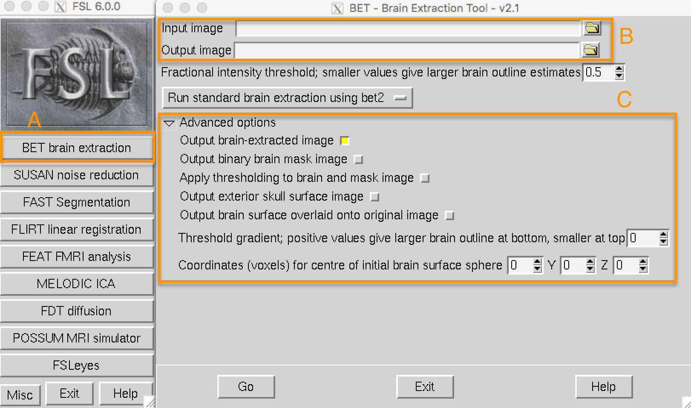
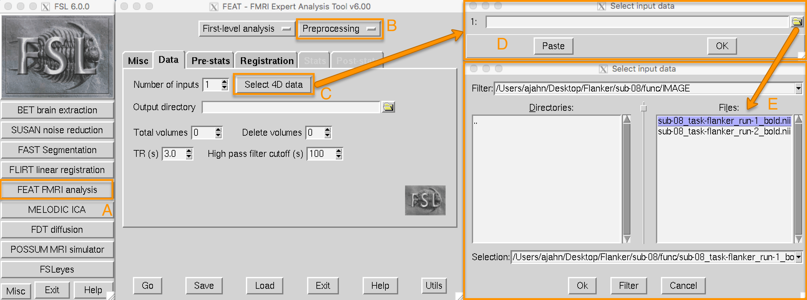
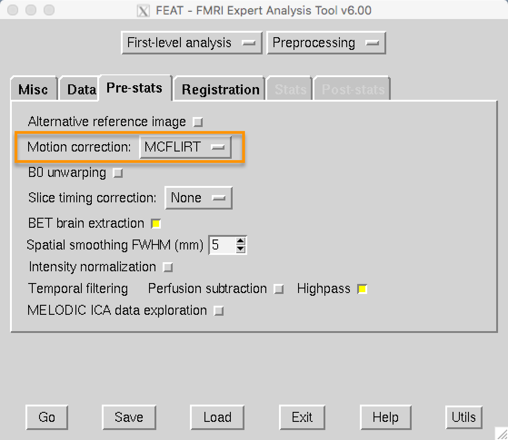
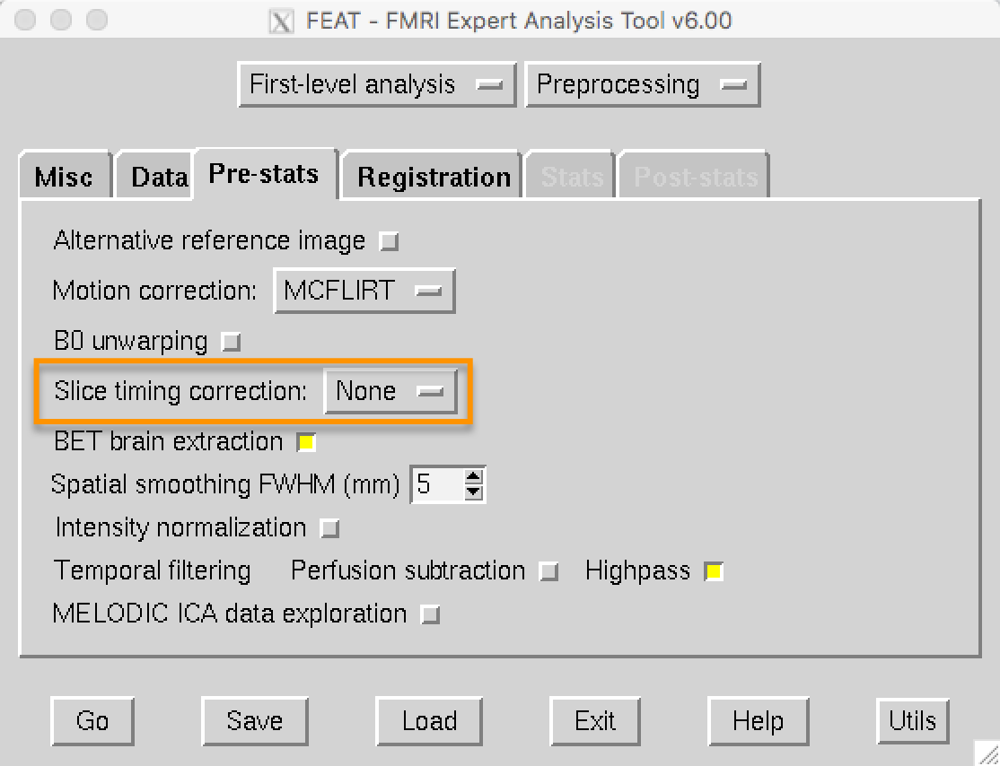
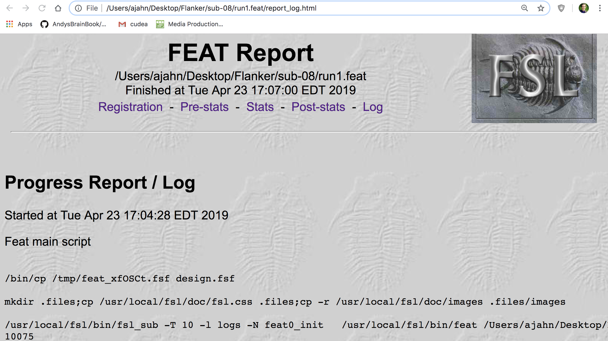
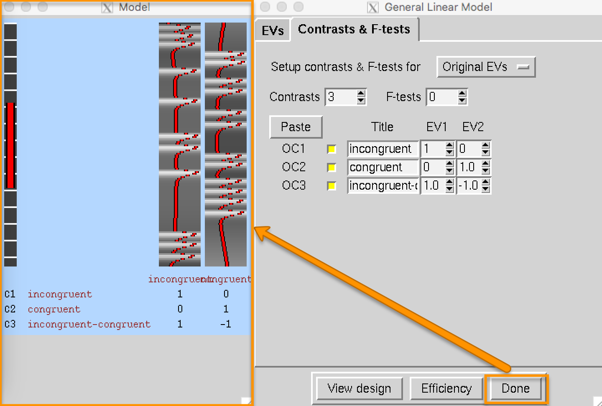

Analisis de Imagenes fMRI
=========================

Descripción general

.. code:: Bash

   mv ~/Downloads/ds000102_0001/ Flanker

Inspección de la imagen anatómica

.. code:: Bash

   fsleyes anat/sub-08_T1w.nii.gz

Inspección de las imágenes funcionales

Tutorial de fMRI n.° 4: Preprocesamiento

Capítulo 1: Extracción cerebral (también conocida como “skullstripping”)

Dado que los estudios de fMRI se centran en el tejido cerebral, el primer paso es eliminar el cráneo y las 
áreas no cerebrales de la imagen. FSL cuenta con una herramienta para esto llamada bet , o Herramienta de 
Extracción Cerebral. Es el primer botón de la interfaz gráfica de usuario de FSL (indicado con una "A" en la 
figura siguiente). Al hacer clic en este botón, se abre otra ventana que permite especificar la imagen de 
entrada que se va a eliminar del cráneo y cómo etiquetar la imagen de salida eliminada (B), así como una 
subventana expandible que permite especificar opciones avanzadas (C).

Capítulo 2: La GUI de FEAT y la carga de datos funcionales

El resto de los pasos de preprocesamiento (corrección de movimiento mediante normalización) se realizarán en 
la interfaz gráfica de FEAT. El botón FEAT se encuentra en el centro del menú de la interfaz gráfica de FSL; 
al hacer clic en él, se abrirá una ventana con varias pestañas.

Al hacer clic en el botón de análisis FEAT FMRI (A), se abre la interfaz gráfica de usuario de FEAT. Por 
ahora, nos centraremos en las pestañas Data, Pre-statsy Registration, que preprocesan los datos. En el menú 
desplegable superior derecho (B), seleccione Preprocessing. Esto desactivará las pestañas Estadísticas y 
Posestadísticas, lo que nos permitirá centrarnos únicamente en el preprocesamiento. Haga clic en el botón (C) 
para cargar los datos de imágenes (en este ejemplo, , que se encuentra en el directorio). Se abrirá una nueva 
ventana (D), con un icono de carpeta que permite seleccionar una ejecución de imágenes funcionales (E).Select 
4D datasub-08_task-flanker_run-1_bold.nii.gzfunc

Capítulo 3: Corrección de movimiento

En la interfaz gráfica de FEAT, la corrección de movimiento se especifica en la Pre-statspestaña. FEAT usa 
por defecto la herramienta MCFLIRT de FSL, que se encuentra en el menú desplegable. Tiene la opción de 
desactivar la corrección de movimiento, pero a menos que tenga una razón para hacerlo, déjela como está.

Capítulo 4: Corrección de la sincronización de segmentos

La configuración predeterminada de FSL es no aplicar corrección temporal de cortes e incluir, en su lugar, 
una derivada temporal. Más adelante, realizará un ejercicio comparando los datos con y sin corrección 
temporal de cortes para observar la magnitud de la diferencia.

Capítulo 5: Suavizado

Capítulo 6: Registro y normalización

Por ahora, configure las opciones de búsqueda en Búsqueda completa y los grados de libertad en 12 grados de 
libertad. Si ya ha cargado sus imágenes funcionales en la pestaña Datos, haga clic en el botón Ir para 
ejecutar todos los pasos de preprocesamiento.

Capítulo 7: Comprobación de los datos preprocesados

Al igual que hicimos con las imágenes sin cráneo, revisaremos nuestros datos antes y después de procesarlos 
con la interfaz gráfica de FEAT. Al hacer clic en el Gobotón, páginas HTML como la que se muestra a 
continuación registrarán el progreso de cada paso.

Tutorial de fMRI n.º 5: Estadística y modelado

Capítulo 1: Las series temporales

Capítulo 2: Historia de la señal BOLD

Capítulo 3: La función de respuesta hemodinámica (HRF)

Capítulo 3: La función de respuesta hemodinámica (HRF)

Capítulo 4: El modelo lineal general

Capítulo 5: Creación de archivos de sincronización

Creando la serie temporal ideal

Analicemos el conjunto de datos Flanker. Dentro del funcdirectorio de cada sujeto se encuentran archivos 
etiquetados como events.tsv. Estos archivos contienen tres datos necesarios para crear nuestros archivos de 
tiempo (también conocidos como archivos de inicio ):

1. El nombre de la condición;

2. Cuándo se produjo cada prueba de la condición, en segundos, en relación con el inicio del escaneo; y

3. La duración de cada prueba.

Estos deben extraerse de los archivos events.tsv y formatearse de forma que el software FSL pueda leerlos. En 
este caso, crearemos un archivo de cronometraje para cada condición y lo dividiremos según la ejecución en la 
que se realizó la condición. En total, crearemos cuatro archivos de cronometraje:

1. Tiempos correspondientes a los ensayos incongruentes que ocurrieron durante la primera ejecución (a la que 
llamaremos incongruent_run1.txt);

2. Tiempos correspondientes a los ensayos incongruentes que ocurrieron durante la segunda ejecución 
(incongruent_run2.txt);

3. Tiempos de los ensayos congruentes que ocurrieron durante la primera ejecución (congruent_run1.txt);

4. Tiempos correspondientes a los ensayos congruentes que ocurrieron durante la segunda ejecución 
(congruent_run2.txt).

Para formatear los archivos de cronometraje, descarga este script . (Puedes descargarlo haciendo clic en el 
Rawbotón, luego haciendo clic derecho en la ventana que se abre y seleccionando "Guardar como"; para la 
versión reciente de Github, simplemente haz clic en el botón). No entraremos en detalles sobre su 
funcionamiento, pero solo necesitas colocarlo en la carpeta experimental que contiene los sujetos. Navega a 
esa carpeta usando tu terminal y escribe para que sea ejecutable, si de otra manera no puedes hacerlo. Luego 
escribe , o, alternativamente, . Esto creará archivos de cronometraje para cada ejecución de cada sujeto. 
Para comprobar el resultado, escribe . Deberías ver números similares a los de la figura anterior.Download 
raw filechmod +x run_1stLevel_Analysis.shbash make_FSL_Timings.sh./run_1stLevel_Analysis.shcat 
sub-08/func/incongruent_run1.txt

Capítulo 6: Ejecución del análisis de primer nivel

La pestaña de estadísticas

Navegue hasta el sub-08directorio y escriba fsldesde la línea de comandos. Abra la interfaz gráfica de FEAT 
y, en el menú desplegable de la esquina superior derecha de la pestaña Datos, cambie "Análisis completo" a 
"Estadísticas". Esto desactivará las pestañas Preestadísticas y Registro. También verá un nuevo botón llamado 
"La entrada es un directorio FEAT". Haga clic en el botón y seleccione el directorio FEAT run1.featque creó 
en el módulo anterior. Haga clic en Aceptar e ignore la advertencia sobre la carga de la información de 
diseño desde el archivo design.fsf; aún no hemos configurado un modelo, por lo que no se sobrescribirá nada.

A continuación, haga clic en la Statspestaña. Hay muchas opciones, pero solo nos centraremos en un par de 
ellas. Haga clic en “Configuración completa del modelo” y cambie el Número de EV originales (o Variables 
explicativas , el término de FSL para los regresores) a 2. Esto creará dos pestañas, una para cada regresor. 
En el campo de nombre de EV para el regresor 1, escriba “incongruente”. Haga clic en el menú desplegable 
junto a Forma básica y seleccione “Personalizado (formato de 3 columnas)”. Esto revela un campo llamado 
“Nombre de archivo”; haga clic en el icono de la carpeta para seleccionar el archivo de sincronización 
incongruent_run1.txt. Desmarque el botón “Agregar derivada temporal”. (Esto es para facilitar la comprensión 
de la matriz de diseño; agregaremos las derivadas más adelante). Haga clic en la pestaña “2” y repita estos 
pasos, esta vez seleccionando el archivo de sincronización “congruent_run1.txt”.

Cuando haya terminado de configurar el modelo, haga clic en la pestaña. Aquí podrá especificar los mapas de 
contraste que desea crear tras estimar los pesos beta para cada condición. En este experimento, nos interesan 
tres contrastes:Contrasts & F-tests

1. El peso beta promedio para la condición Incongruente comparado con el valor inicial;

2. El peso beta promedio para la condición congruente en comparación con la línea base; y

3. La diferencia de los pesos beta promedio entre las condiciones incongruentes y congruentes.

Establezca el número de contrastes en 3 y escriba los siguientes nombres de contraste en cada fila, junto con 
los siguientes pesos de contraste en las columnas EV1 y EV2:

1. incongruente [1 0];

2. congruente [0 1];

3. incongruente-congruente [1 -1].

Haga clic en el Donebotón para abrir la ventana Matriz de Diseño . La columna de la izquierda representa el 
filtro paso alto , que elimina las frecuencias que superan la longitud de la barra roja (es decir, se 
eliminan las frecuencias bajas y se permite el paso de las frecuencias altas). Las dos columnas de la derecha 
representan la serie temporal ideal para ambos regresores y corresponden al orden en que se ingresaron los 
archivos de tiempo; es decir, la primera columna es la serie temporal ideal para la condición incongruente y 
la segunda, la serie temporal ideal para la condición congruente.

Tutorial de fMRI n.° 7: Análisis de segundo nivel

