Analisis de Imagenes fMRI
=========================

Descripción general

**Overview**

.. code:: Bash

   mv ~/Downloads/ds000102_0001/ Flanker

**Inspecting the Anatomical Image**

.. code:: Bash

   fsleyes anat/sub-08_T1w.nii.gz

**Chapter 1: Brain Extraction (also known as “skullstripping”)**

Dado que los estudios de fMRI se centran en el tejido cerebral, el primer paso es eliminar el cráneo y las 
áreas no cerebrales de la imagen. FSL cuenta con una herramienta para esto llamada bet , o Herramienta de 
Extracción Cerebral. Es el primer botón de la interfaz gráfica de usuario de FSL (indicado con una "A" en la 
figura siguiente). Al hacer clic en este botón, se abre otra ventana que permite especificar la imagen de 
entrada que se va a eliminar del cráneo y cómo etiquetar la imagen de salida eliminada (B), así como una 
subventana expandible que permite especificar opciones avanzadas (C).

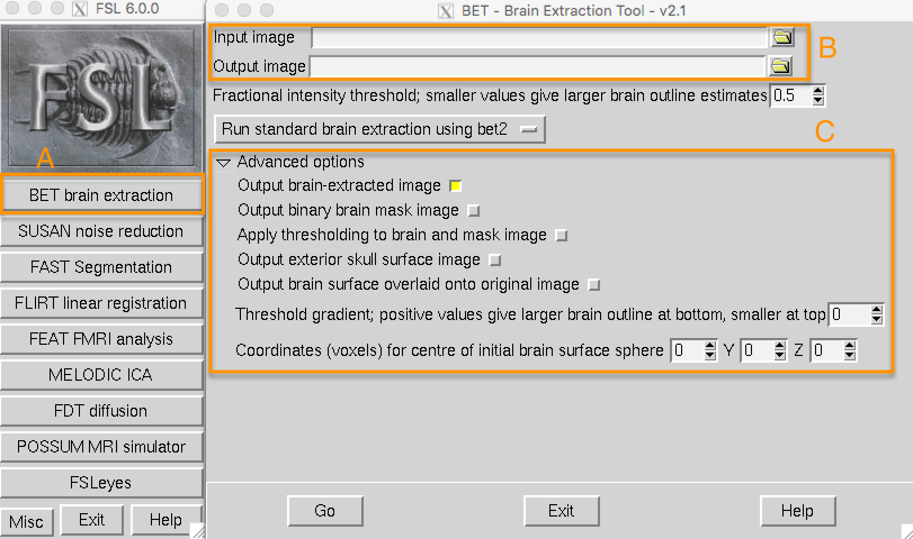

Open the FSL GUI from the sub-08 directory, click on the Folder icon next to the Input image field, and navigate to the anat directory. Select the file sub-08_T1w.nii.gz and click the OK button. Notice that the Output image field is automatically filled in with the word brain appended to your Input image, which is FSL’s default. You can change the name if you like, but for this tutorial we will leave it as is.

Now click the Go button at the bottom of the window. You will see some text written to your Terminal showing which commands are being used to run a command called bet2. Take a moment to see how the GUI corresponds to the Terminal - later on we will take advantage of this by creating a template through the GUI and then modifying it in the Terminal to automatically preprocess all of the subjects in our dataset.

** Chapter 2: The FEAT GUI and loading the functional data**

El resto de los pasos de preprocesamiento (corrección de movimiento mediante normalización) se realizarán en 
la interfaz gráfica de FEAT. El botón FEAT se encuentra en el centro del menú de la interfaz gráfica de FSL; 
al hacer clic en él, se abrirá una ventana con varias pestañas.

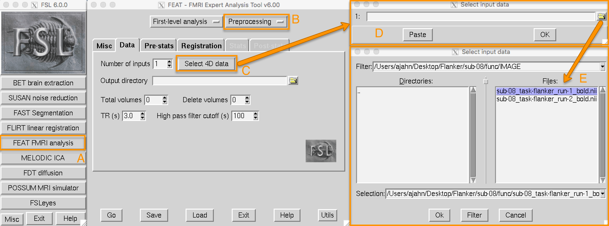

Clicking on the FEAT FMRI analysis button (A) opens up the FEAT GUI. For now we will focus on the Data, Pre-stats, and Registration tabs, which preprocess the data. From the upper-right dropdown menu (B), select Preprocessing. This will grey out the Stats and Post-stats tabs, and allow us to focus only on preprocessing. Click on the Select 4D data button (C) to load your imaging data (in this example, sub-08_task-flanker_run-1_bold.nii.gz, which is in the func directory). This will open up a new window (D), which has a folder icon that allows you to select a functional imaging run (E).

**Chapter 3: Motion Correction**

In the FEAT GUI, motion correction is specified in the Pre-stats tab. FEAT’s default is to use FSL’s MCFLIRT tool, which you can see in the dropdown menu. You have the option to turn off motion correction, but unless you have a reason to do that, leave it as it is.

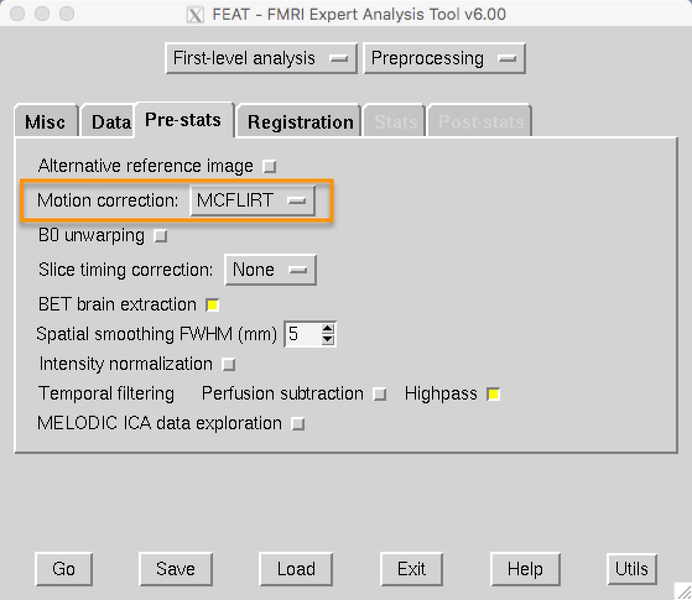

**Chapter 4: Slice-Timing Correction**

La configuración predeterminada de FSL es no aplicar corrección temporal de cortes e incluir, en su lugar, 
una derivada temporal. Más adelante, realizará un ejercicio comparando los datos con y sin corrección 
temporal de cortes para observar la magnitud de la diferencia.

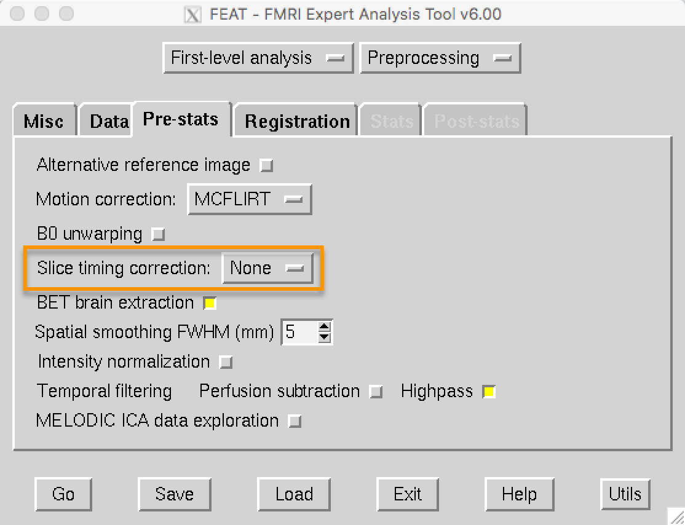

**Chapter 5: Smoothing**

**Chapter 6: Registration and Normalization**

Registration and Normalization, although distinct, are packaged together as a single step in the FEAT GUI’s Registration tab. Once you have selected this tab, click on the button next to Main structural image to expand the input field. Then select the subject’s skull-stripped image - in this case, the one that we created using a fractional intensity threshold of 0.2.

You will notice that there are dropdown menus below both the Main structural image and Standard space fields. The menus under the Main structural image field correspond to options for registering the functional to the anatomical image. The menus under the Standard space field are options for normalizing the anatomical image to the template image. Within these sets of menus, the dropdown menu on the left is the Search window, and the dropdown menu on the right is the Degrees of Freedom window.

In the Search window, there are three options: 1) No search; 2) Normal search; and 3) Full search. This signifies to FSL how much to search for a good initial alignment between the functional and anatomical images (for registration) and between the anatomical and template images (for normalization). The Full search option takes longer, but is more thorough and therefore more likely to produce better registration and normalization.

In the Degrees of Freedom window, you can use 3, 6, or 12 degrees of freedom to transform the images. Registration has an additional option, BBR, which stands for Brain-Boundary Registration. This is a more advanced registration technique that uses the tissue boundaries to fine-tune the alignment between the functional and anatomical images. Similar to the Full search option above, it takes longer, but often gives a better alignment.

For now, set both Search options to Full search and both Degrees of Freedom options to 12 DOF. If you have already loaded your functional images in the Data tab, click on the Go button to run all of the preprocessing steps.

**Chapter 7: Checking your Preprocessed Data**

Al igual que hicimos con las imágenes sin cráneo, revisaremos nuestros datos antes y después de procesarlos 
con la interfaz gráfica de FEAT. Al hacer clic en el Gobotón, páginas HTML como la que se muestra a 
continuación registrarán el progreso de cada paso.

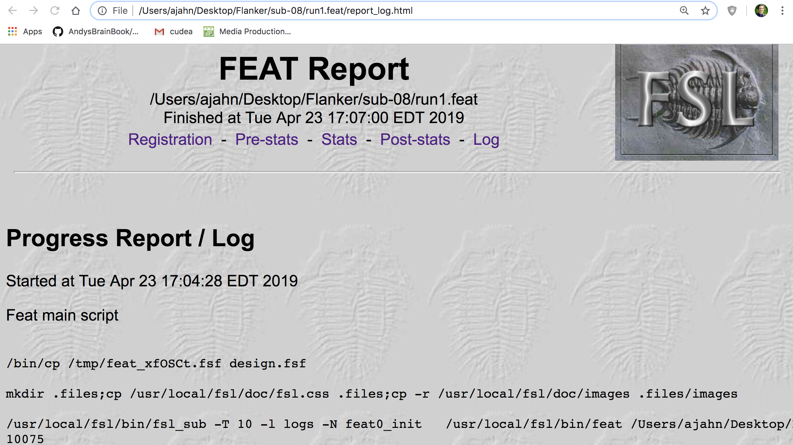

**fMRI Tutorial #5: Statistics and Modeling**

Capítulo 1: Las series temporales

Capítulo 2: Historia de la señal BOLD

Capítulo 3: La función de respuesta hemodinámica (HRF)

Capítulo 4: El modelo lineal general

Capítulo 5: Creación de archivos de sincronización

Chapter 6: Running the First-Level Analysis

Navigate to the sub-08 directory, and type fsl from the command line. Open the FEAT GUI, and from the dropdown menu in the upper right of the Data tab, change “Full Analysis” to “Statistics”. This will grey out the Pre-stats and Registration tabs. You will also see a new button called “Input is a FEAT directory”. Click on the button, and select the FEAT directory run1.feat that you created in the last module. Click OK and ignore the warning about loading design information from the design.fsf file; we haven’t set up a model yet, so nothing will be overwritten.

Next, click on the Stats tab. There are many options, but we will only focus on a couple of them. Click on “Full model setup”, and change the Number of original EVs (or Explanatory Variables, FSL’s term for regressors) to 2. This will create two tabs, one for each regressor. In the EV name field for regressor 1, type “incongruent”. Click on the dropdown menu next to Basic shape, and select “Custom (3 column format)”. This reveals a field called “Filename”; click on the folder icon to select the timing file incongruent_run1.txt. Uncheck the “Add temporal derivative” button. (This is to make it easier to understand the design matrix; we will add the derivatives later.) Click on the “2” tab and repeat these steps, this time selecting the timing file “congruent_run1.txt”.

When you have finished setting up the model, click on the Contrasts & F-tests tab. This is where you specify which contrast maps you would like to create after the beta weights for each condition have been estimated. In this experiment, we are interested in three contrasts:

    1. The average beta weight for the Incongruent condition compared to baseline;

    2. The average beta weight for the Congruent condition compared to baseline; and

    3. The difference of the average beta weights between the Incongruent and Congruent conditions.

Set the number of contrasts to 3, and type the following contrast names in each row, along with the following contrast weights in the EV1 and EV2 columns:

    1. incongruent [1 0];

    2. congruent [0 1];

    3. incongruent-congruent [1 -1].

Click the Done button, which will open a Design Matrix window. The leftmost column represents the high-pass filter, which removes any frequencies that are longer than the length of the red bar (i.e., low frequencies are removed, and higher frequencies are allowed to pass through the filter). The two columns on the right represent the ideal time-series for both regressors, and they correspond to the order in which we entered the timing files; in other words, the first column is the ideal time-series for the Incongruent condition, and the second column is the ideal time-series for the Congruent condition.

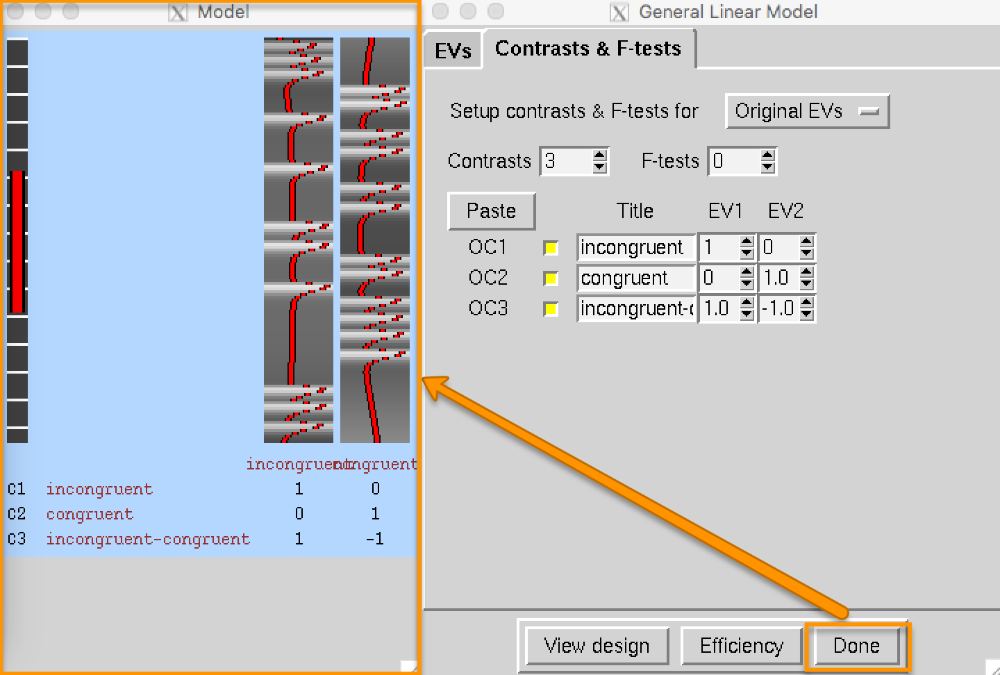

Then, click ``Go`` to run the model.

**fMRI Tutorial #6: Scripting**

**Creating the Template**

When you analyzed the first run of sub-08, a directory called run1.feat was created. Within that directory, there are several files and sub-directories. One of these files, design.fsf, contains all of the code transcribed from the FEAT GUI into a text file. This is the code that FSL runs to do each preprocessing and modeling step. If you open up the design.fsf file in a text editor and the FEAT GUI that you used to create the design.fsf file and you compare them side-by-side, you can see where the data entered into the FEAT GUI is written into the design.fsf file.

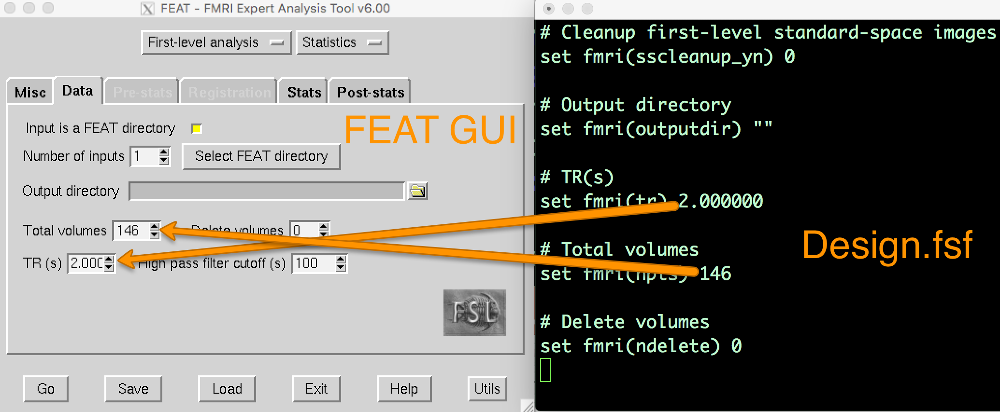

**Running the Script**

Move the design_run1.fsf and design_run2.fsf files to the directory containing your subjects (i.e., mv design*.fsf .., and then cd ..). Then download the script run_1stLevel_Analysis.sh and move it to the Flanker directory. The script is reprinted here:

.. code:: Bash

   #!/bin/bash

   # Generate the subject list to make modifying this script
   # to run just a subset of subjects easier.

   for id in `seq -w 1 26` ; do
       subj="sub-$id"
       echo "===> Starting processing of $subj"
       echo
       cd $subj

        # If the brain mask doesn’t exist, create it
           if [ ! -f anat/${subj}_T1w_brain_f02.nii.gz ]; then
               echo "Skull-stripped brain not found, using bet with a fractional intensity threshold of 0.2"
               # Note: This fractional intensity appears to work well for most of the subjects in the
               # Flanker dataset. You may want to change it if you modify this script for your own study.
               bet2 anat/${subj}_T1w.nii.gz \
                   anat/${subj}_T1w_brain_f02.nii.gz -f 0.2
           fi

           # Copy the design files into the subject directory, and then
           # change “sub-08” to the current subject number
           cp ../design_run1.fsf .
           cp ../design_run2.fsf .

           # Note that we are using the | character to delimit the patterns
           # instead of the usual / character because there are / characters
           # in the pattern.
           sed -i '' "s|sub-08|${subj}|g" \
               design_run1.fsf
           sed -i '' "s|sub-08|${subj}|g" \
                design_run2.fsf

           # Now everything is set up to run feat
           echo "===> Starting feat for run 1"
           feat design_run1.fsf
           echo "===> Starting feat for run 2"
           feat design_run2.fsf
                   echo

       # Go back to the directory containing all of the subjects, and repeat the loop
       cd ..
   done

   echo

**fMRI Tutorial #7: 2nd-Level Analysis**

**Selecting the FEAT Directories**

Since we had 26 subjects with 2 runs each, we have 52 FEAT directories total. Change the Number of inputs to 52, and then click the button Select FEAT directories.

Instead, we will use wildcards to make this quicker and easier. Go back to the Terminal that you launched the FEAT GUI from, navigate to the Flanker directory, and type ctrl+z, and then type bg and press Enter. This will allow you to type commands in the Terminal while keeping the FEAT GUI open. At the command line, type the following:

.. code:: Bash

   ls -d $PWD/sub-??/run*

This will create a list with 52 entries, one corresponding to each run for each subject in the study. Highlight the entire list and copy it by pressing command+c. This will copy the list to your clipboard. Then go back to the Select input data window, and click on the Paste button. Click in the Input data window, and then press ctrl+y and click OK. (For some users, and for some recent versions of FSL, you can paste with cmd+v.) This will paste the list of directories into the corresponding rows in the Select input data window.

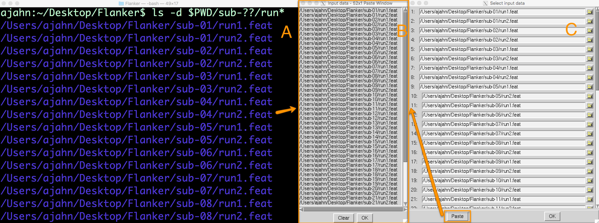

**Creating the GLM**

The Stats tab will look different from when you used it for 1st-level analysis - you can now choose between different types of inference, or how you want the results to generalize to the population. The dropdown menu has the following options:

    1. Fixed Effects: Do not generalize from the sample - just take the average;

    2. Mixed Effects: Simple OLS (Ordinary Least Squares): This will perform a t-test on the average parameter estimates calculated for each subject, without taking into account the variability between the runs for each subject;

    3. Mixed Effects: FLAME 1: Weight each subject’s parameter estimate by the variance of that contrast estimate. In other words, a subject with relatively low variance will be weighted more, and a subject with relatively high variance will be weighted less;

    4. Mixed Effects: FLAME 1+2: A more rigorous version of FLAME 1. It takes much longer, and is only helpful for analyzing small samples (e.g., 10 subjects or fewer);

    5. Randomise: A non-parametric test (discussed in a later chapter).

Since we simply want to take the average of the parameter estimates across the runs within each subject, we will use the Fixed Effects option. Once you have selected that, click on Full Model Setup.

This will display a window with the number of rows representing the number of individual parameter estimates - in our case, 52. For the Number of main EVs, change this to 26, which is the number of subjects in our dataset. Then change the numbers in each column to 1 where you want to take the average for the parameter estimates for that subject. In our case, the first two rows for column 1 would be changed to 1, and next two rows for column 2 would be changed to 1, and so on.

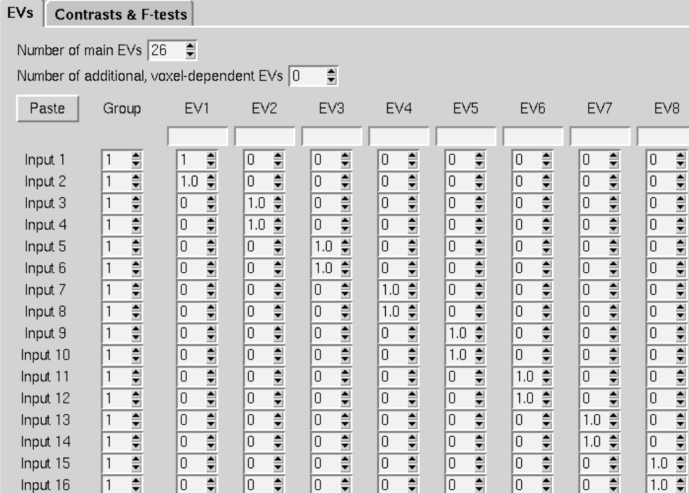

When you have finished, click on the Contrasts & F-tests tab, and change the number of Contrasts to 26. Change all of the numbers on the diagonal to 1; this will create a single contrast estimate for each subject that is the average of that subject’s parameter estimates.

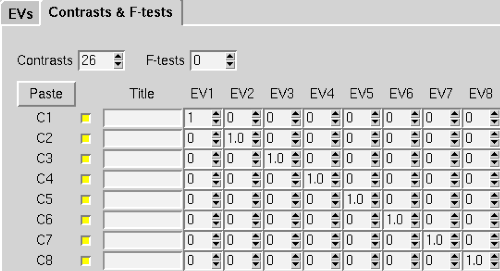

When you have finished setting up the GLM and contrasts and click Done, you should see something like this:

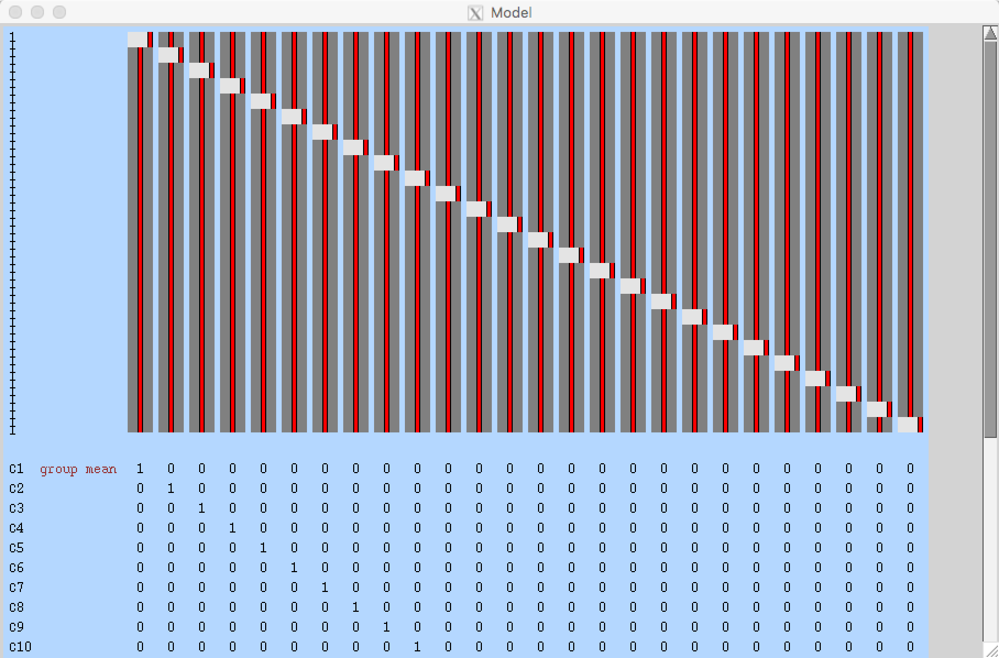

**fMRI Tutorial #8: 3rd-Level Analysis**

**Loading the Data**

From the Flanker directory, open the FEAT GUI. As with the 2nd-level analysis, select Higher-level analysis. Now, instead of selecting FEAT directories, choose Inputs are 3D cope images from FEAT directories, and change the number of inputs to 26. The 2nd-level analysis generated an average contrast of parameter estimate (or cope) for each subject for each contrast that was specified in our model. As with selecting the FEAT directories during the 2nd-level analysis, we can copy and paste a list of the cope images: Click on Select cope images and then click the Paste button. In the Terminal, navigate to the directory Flanker_2ndLevel.gfeat/cope3.feat/stats, and type ls $PWD/cope* | sort -V. This will list all of the cope images in numerical order, even though they are not zero-padded. Copy and paste the list into the Input data window by typing ctrl+y. After clicking OK, label the output directory as Flanker_Level3_inc-con.

**Creating the GLM**

Click on the Stats tab. For a 3rd-level analysis, we will used Mixed Effects. This models the variance so that our results are generalizable to the population our sample was drawn from. FLAME 1 (FSL’s Local Analysis of Mixed Effects) provides accurate parameter estimates by using information about both within-subject and between-subject variability; FLAME1+2 is considered even more accurate, but the additional benefit is usually minimal, and the process takes much longer.

The last option, Randomise, uses a non-parametric approach, which is valid when the assumptions about normality do not hold. Later on, we’ll discuss why this is appropriate in some cases.

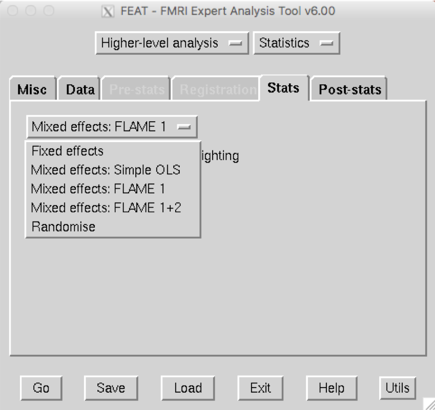

Since we’re using a simple design, we can quickly create a GLM using the Model setup wizard button. We’ve already taken the contrast for each subject, so we can select single group average. When you click Process, you should see a Model representation that looks like this:

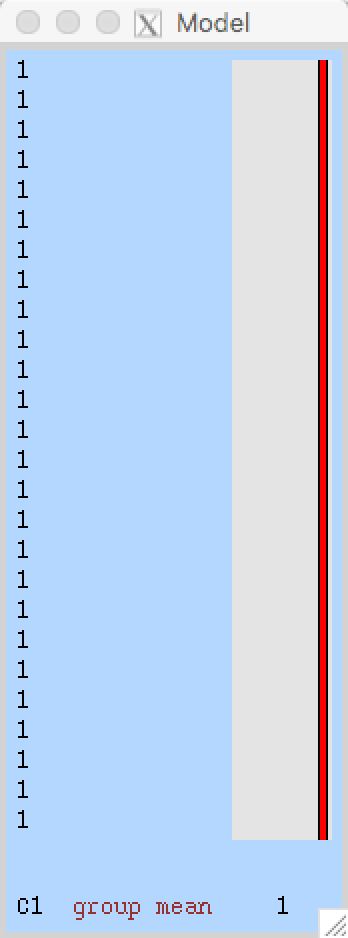

**The Post-Stats Tab**

Now we finally discuss the Post-Stats tab. The only defaults you would probably want to consider changing are the Thresholding options. None won’t do any thresholding (i.e., show the parameter estimate at every voxel, regardless of significance); Uncorrected will allow any individual voxels to pass the threshold specified in Z-threshold (e.g., here we would only show voxels that have a value greater than 3.1); Voxel will perform a type of maximum height thresholding based on Gaussian Random Field theory, which is less conservative than a Bonferroni test; and lastly Cluster, which uses a cluster-defining threshold (CDT) to determine whether a cluster of voxels is significant. The logic behind this approach is that neighboring voxels are not independent of one another, and this reduced degrees of freedom is taken into account when estimating significance.

For example, if we leave our Z-threshold at 3.1 and our Cluster p-threshold at 0.05, we will look for clusters composed of voxels that each individually pass a z-threshold of 3.1. FSL runs simulations to see how often we would get clusters of certain sizes with each of their constituent voxels passing that z-threshold, and creates a distribution of cluster sizes for that CDT (similar to what happens when we compute a t-distribution based on degrees of freedom). Cluster sizes that occur less than 5% of the time in the simulations for that CDT are then determined to be significant.

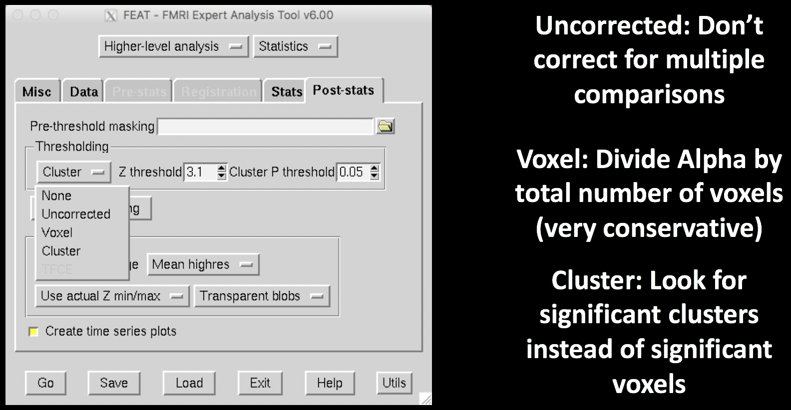

Now click Go. This will take about 5-10 minutes, depending on how powerful your computer is.

**Reviewing the Output**

**fMRI Tutorial #9: ROI Analysis**

