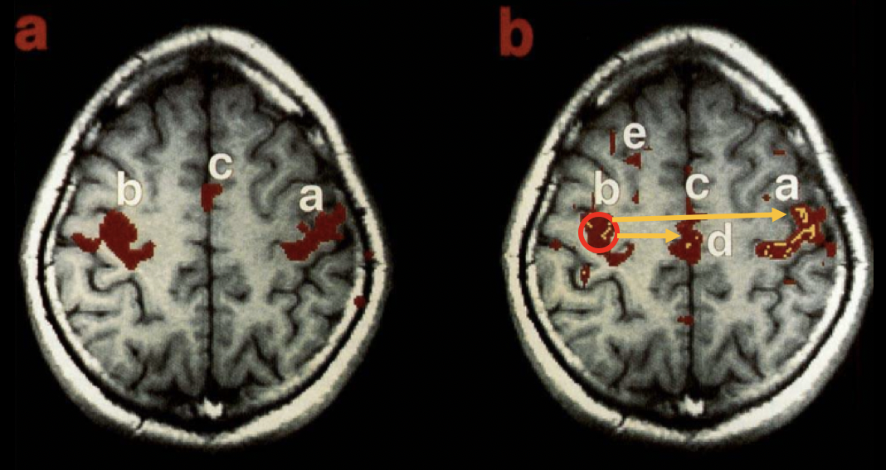
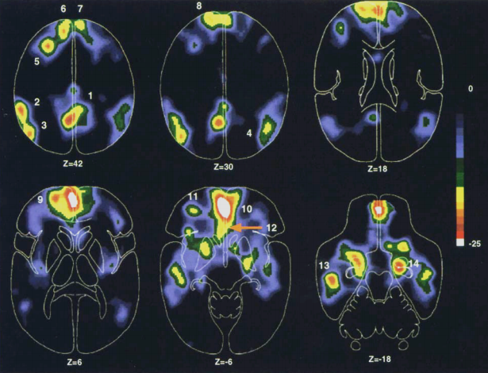
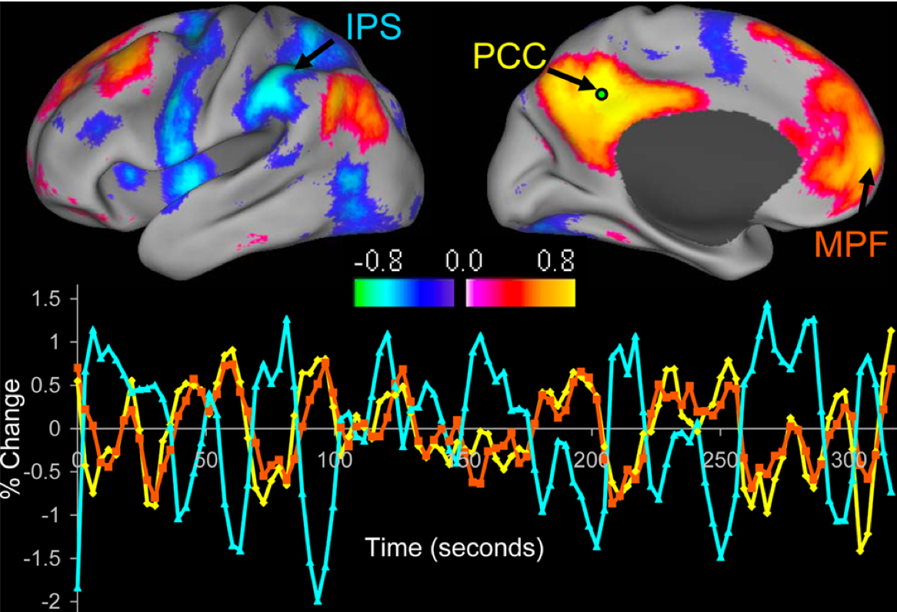
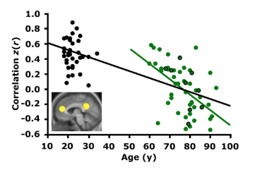
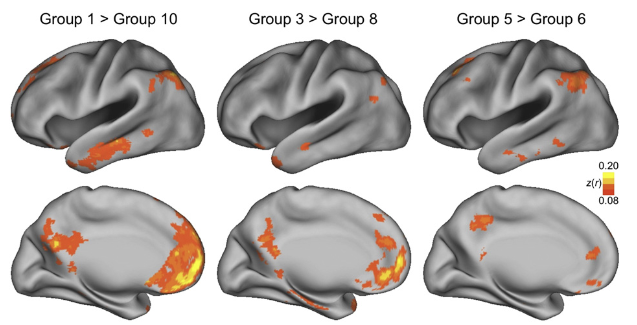
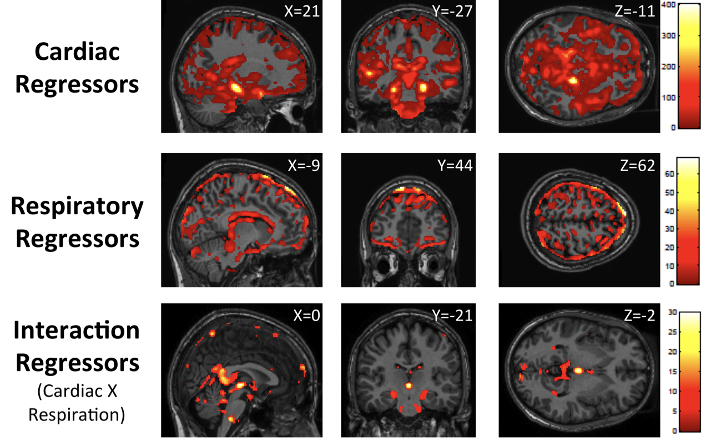

.. _CONN_00_Historial:

==================================
Historia de la conectividad funcional
==================================

--------------

.. nota::

  Esta sección aún está en construcción. ¡Vuelve pronto!

Bharat Biswal y el descubrimiento de las correlaciones en estado de reposo
*************************************************************

A medida que la neuroimagen se generalizó a principios de la década de 1990, los experimentos con fMRI se centraron principalmente en el mapeo de la respuesta BOLD a estímulos sensoriales y motores. La respuesta de la corteza visual a un tablero de ajedrez parpadeante, por ejemplo, se observó tempranamente (Kwong et al., 1992), al igual que las áreas sensoriales primarias a estímulos auditivos, táctiles y presiones digitales. Estos experimentos fueron simples, pero necesarios para demostrar la validez de la fMRI como técnica de imagen no invasiva.

Con estos resultados básicos ya documentados, los investigadores comenzaron a investigar tanto la fuente de la señal BOLD como las fuentes de ruido. Se comprendió que la señal obtenida de la respuesta BOLD era relativamente pequeña en comparación con el ruido que la rodeaba; no solo el ruido generado por el propio escáner (en forma de lo que se conoce como "deriva del escáner"), sino también el de fuentes fisiológicas como la respiración y la pulsación sanguínea cerebral. Para examinar más de cerca estas fuentes fisiológicas de ruido, en 1995, Bharat Biswal escaneó a sujetos tanto cuando realizaban una tarea —en este caso, pulsaban botones a un ritmo determinado— como cuando no hacían nada.

Para su sorpresa, incluso después de eliminar las fuentes fisiológicas de ruido de los datos en reposo, no se explicó toda la varianza en la respuesta BOLD. Al observar lo que parecían ser correlaciones temporales entre diferentes regiones de vóxeles, Biswal extrajo la serie temporal de la corteza motora izquierda y correlacionó esa señal con la serie temporal de los demás vóxeles. En lugar de las correlaciones aleatorias que cabría esperar si no hubiera fluctuaciones sistemáticas de BOLD en reposo, se observó una fuerte correlación con la serie temporal de la corteza motora del hemisferio opuesto, lo que sugiere que estas dos regiones funcionalmente similares, aunque físicamente distantes entre sí, generaron patrones de actividad similares incluso en reposo.

.. nota::

  En este ejemplo, Biswal utilizó la corteza motora izquierda como **región semilla**, que posteriormente se correlacionó con todos los demás vóxeles del cerebro, lo que también se denomina análisis de **cerebro completo**. Este tipo de análisis de correlación es común, aunque algunos investigadores pueden optar por restringir su análisis entre la región semilla y una región de interés. Para obtener más información sobre las regiones de interés y cómo extraer datos de ellas, consulte el :ref:`AFNI`, :ref:`FSL 
    `, o :ref:`SPM 
     " tutoriales.

  Resultado del artículo original de Biswal et al. de 1995. El panel (a) muestra la actividad relacionada con la tarea en las cortezas motoras, mientras que el panel (b) muestra la conectividad funcional durante un escaneo en reposo, utilizando la corteza motora izquierda como región semilla. Obsérvese el alto grado de solapamiento entre las imágenes de la tarea y las del reposo.

Unos años después del descubrimiento de Biswal, varios investigadores examinaron si estos patrones en estado de reposo podían observarse en otras regiones del cerebro. Dado que las cortezas motoras parecían estar altamente correlacionadas, se asumió que otras estructuras bilaterales también mostrarían altas correlaciones, como la corteza visual y la auditiva. Y si estas regiones funcionalmente similares estaban correlacionadas, se argumentó, entonces incluso otras regiones funcionalmente similares también deberían estar conectadas funcionalmente, no solo las estructuras bilaterales. Por ejemplo, si la corteza cingulada anterior dorsal y la ínsula anterior están activas durante una tarea cognitivamente exigente, entonces quizás también deberían estar correlacionadas durante el reposo.

Las redes de modo predeterminado y de tarea positiva
**************************

El trabajo de Biswal allanó el camino para que los neuroimagenólogos probaran una amplia gama de nuevas hipótesis: ¿Cómo cambiarían estos patrones en estado de reposo según la región de la semilla utilizada? ¿Cómo diferirían estos patrones en estado de reposo entre grupos, especialmente en poblaciones clínicas? ¿Qué implicaciones tenía esto para el tratamiento de trastornos mentales comunes? ¿Cómo variaban estas correlaciones con el tiempo y la edad?

Antes de poder responder a estas preguntas, se buscó un patrón fiable del estado de reposo que pudiera vincularse con el rendimiento de los sujetos durante las tareas. Por ejemplo, se habían establecido diferencias de comportamiento en estudios psicométricos básicos entre esquizofrénicos y controles; pero ¿se debía esto, por ejemplo, a déficits en el procesamiento visual o a una diferencia en la cognición de nivel superior?

Un par de años después del artículo de Biswal et al. de 1995, Gordon Shulman y un equipo de investigadores de la Universidad de Washington observaron que, a medida que algunas regiones se volvían más activas durante tareas cognitivamente exigentes, se producía una disminución simultánea del flujo sanguíneo a otras regiones. Esto llevó a Shulman a especular que podría haber dos redes de regiones cerebrales que muestran patrones inversos en su flujo sanguíneo, dependiendo de si se está realizando una tarea en ese momento o no: la corteza cingulada anterior dorsal y el surco intraparietal mostraron una actividad constante durante las tareas, ya fueran verbales o no verbales; mientras que la corteza prefrontal ventromedial y la corteza cingulada posterior mostraron niveles de flujo sanguíneo consistentemente más bajos durante las tareas, independientemente del tipo de tarea.

No fue hasta casi una década después, en 2005, que Michael Fox y sus colegas demostraron que estas regiones presentaban una anticorrelación entre sí: un aumento de la actividad en las regiones activadas por la tarea, por ejemplo, se asociaba con una disminución de la actividad en las regiones relacionadas con el descanso. Los tres nodos principales de estas regiones activadas por la tarea se identificaron como el surco intraparietal, los campos oculares frontales y la corteza temporal media, mientras que los tres nodos principales de las regiones activadas por el descanso fueron la corteza prefrontal medial, la corteza cingulada posterior y la corteza parietal lateral. Estos conjuntos opuestos de nodos se denominaron redes **positivas para la tarea** y **negativas para la tarea**, respectivamente.

Una implicación de este estudio fue que, para realizar una tarea eficazmente, debía existir coordinación entre cada uno de los nodos positivos para la tarea, según lo indicaba el grado de correlación entre ellos, y, de igual importancia, debía haber una disminución coordinada de la actividad en los nodos negativos para la tarea. Las alteraciones en esta coordinación podrían entonces vincularse con diferentes trastornos mentales, como la esquizofrenia y el trastorno bipolar.

Artefactos en estado de reposo y el debate sobre la regresión de la señal global
********************************************************************

Artefactos de movimiento
^^^^^^^^^^^^^^^^

A medida que los estudios en estado de reposo se generalizaron a mediados de la década de 2000, se intensificó el escrutinio sobre los métodos adecuados para realizarlos. Si bien Biswal había demostrado que las fluctuaciones de la señal BOLD subyacentes a las señales en estado de reposo no eran artefactos, se hizo cada vez más evidente que los datos en estado de reposo eran altamente susceptibles a ciertos tipos de artefactos, en particular, al movimiento.

Aunque desde el principio el movimiento se había identificado como un artefacto y un posible factor de confusión en los estudios relacionados con tareas, los investigadores demostraron posteriormente que podía dar lugar a correlaciones falsas entre diferentes partes del cerebro. Muchos estudios en reposo de poblaciones de edad avanzada, por ejemplo, hallaron que las correlaciones entre nodos espacialmente distantes, como las regiones posterior y anterior de la corteza cingulada, eran menores en comparación con los adultos más jóvenes. Se creía que estas diferencias reflejaban un deterioro del cerebro de los sujetos mayores, similar al desgaste de los tornillos y pasadores de una máquina con el tiempo.

Aunque estos estudios controlaron el movimiento como covariable o solo incluyeron sujetos con bajos niveles de movimiento, Van Dijk y sus colegas (2011) demostraron que incluso niveles minúsculos de movimiento podían generar diferencias significativas entre los grupos. Al agrupar a los sujetos según su grado de movimiento, se observaron diferencias incluso entre grupos con movimientos medios de 0,044 y 0,048. Al promediar entre grupos grandes de sujetos, las diferencias muy sutiles en el movimiento pueden convertirse en la principal fuente de varianza.

  Figura 4 del artículo de Van Dijk et al. (2011). Los dos grupos de la derecha difieren en tan solo unas pocas milésimas de milímetro de movimiento promedio; una diferencia extremadamente pequeña, pero que aun así puede generar diferencias significativas entre los grupos.

Ruido fisiológico
^^^^^^^^^^^^^^^^^^^

A menudo se cree que los artefactos de movimiento son causados por movimientos deliberados del sujeto: por ejemplo, ajustar la cabeza o rascarse. Si bien estos tipos de movimiento son los más evidentes, otros movimientos involuntarios pueden tener un efecto igual de significativo y, a menudo, son más insidiosos. La respiración y la frecuencia cardíaca son las dos principales causas de pequeños movimientos involuntarios que pueden influir en las diferencias intergrupales. Medir estas señales fisiológicas y analizarlas mediante regresión puede explicar correlaciones falsas que ocurren cerca de las arterias o en los bordes del cerebro, donde estos artefactos son más prominentes.

Regresión de señal global
^^^^^^^^^^^^^^^^^^^^^^^^

Aunque los artefactos de movimiento siempre se han considerado una fuente de ruido que debe tenerse en cuenta, un método de análisis de datos ha generado controversia desde su introducción: la **Regresión Global de Señales**, o GSR. Uno de los primeros usos de la GSR fue realizado por Fox et al. (2005, mencionado anteriormente), quienes examinaron las anticorrelaciones entre las redes en estado de reposo y las redes positivas para la tarea. Sin embargo, posteriormente Murphy et al. (2007) demostraron que la GSR causa correlaciones negativas falsas en los vóxeles.

La razón para incluir GSR es que captura varias fuentes de ruido no relacionadas con la actividad neuronal: respiración, movimiento de la cabeza, deriva del escáner, etc.

     
    
   

