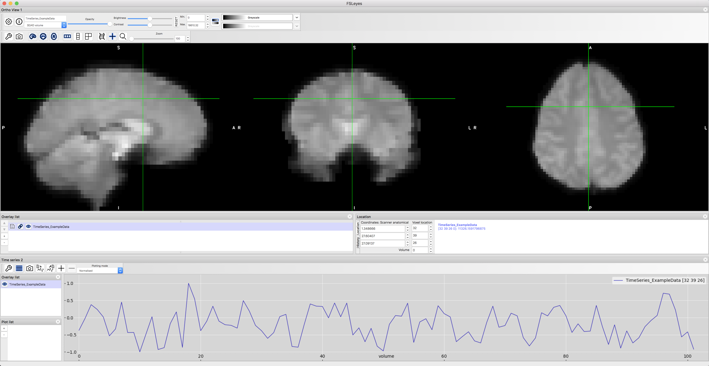
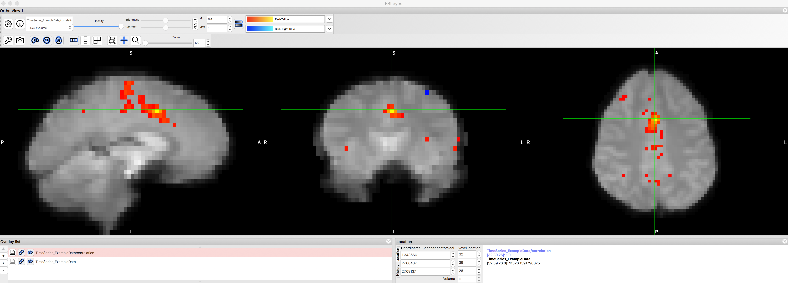
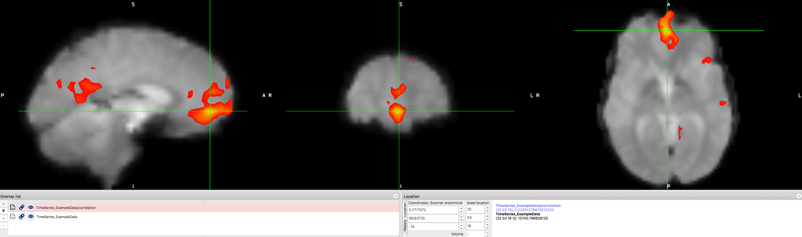

.. _CONN_01_FSL_Demo:

=================================================
Capítulo n.° 1: Demostración de conectividad funcional
=================================================

------------------

Descripción general
********

Antes de empezar a usar la caja de herramientas CONN, una breve demostración de conectividad funcional con un método más sencillo y fácil de entender puede ayudarle a prepararse para usar un paquete más sofisticado. Prefiero usar el paquete de análisis fMRI FSL para este tipo de demostración, aunque tanto AFNI como SPM también pueden realizar análisis de conectividad funcional. Antes de continuar, le recomiendo que revise los tutoriales de FSL.Para familiarizarse con el funcionamiento de FSL, qué es una serie temporal y cómo extraer datos de las regiones de interés (ROI). Si ya sabe cómo realizar un análisis de conectividad funcional en FSL y simplemente desea comenzar a usar las herramientas CONN, haga clic en el botón "Siguiente" a continuación.

.. nota::

  Este tutorial utilizará un conjunto de datos de muestra que puedes descargar aquí
    `__. El tamaño del archivo es de aproximadamente 20 MB.

Análisis de conectividad funcional con FSL
*****************************************

Como se vio en el tutorial de FSL, cada vóxel de un conjunto de datos de fMRI contiene una **serie temporal**, o secuencia de mediciones de activación de BOLD concatenadas. La frecuencia de muestreo de la serie temporal es el **tiempo hasta la repetición (TR)**, que para la mayoría de los estudios de fMRI es de aproximadamente 2 a 3 segundos. Por lo tanto, para cada vóxel, la activación de BOLD se mide en cada TR, y esto continúa durante un período especificado por el usuario. Este período, durante el cual el escáner mide la señal BOLD, se denomina **sesión** (o **sesión**, en SPM), y un experimento típico se compone de varias sesiones.

Para examinar la serie temporal del conjunto de datos de muestra, navegue hasta donde descargó el archivo ``TimeSeries_ExampleData.nii.gz`` y escriba:

::

  fsleyes TimeSeries_ExampleData.nii.gz
  
Esto abrirá el archivo en el visor fsleyes. En el menú superior de la ventana, haga clic en "Ver -> Series temporales". Se abrirá un panel de series temporales en la parte inferior del visor fsleyes. Para facilitar la comprensión de los números y poder comparar series temporales de vóxeles distantes, haga clic en el menú desplegable "Modo de trazado" y seleccione "Normalizado". Esto escalará la serie temporal con respecto a una media de 0.

  Una serie temporal de muestra de un vóxel en la corteza cingulada anterior dorsal.
  
Ahora, haga clic en un vóxel aleatorio y, en el menú superior de la pantalla, seleccione "Herramientas -> Correlación de semilla (Pearson)". El vóxel seleccionado será un **vóxel de semilla**; su serie temporal se usará como referencia. Esto generará un mapa de conectividad entre el vóxel de semilla y todos los demás vóxeles del cerebro. Los colores más cálidos (es decir, tonos más intensos de rojo y amarillo) representan una mayor correlación. Por el contrario, los colores más fríos (es decir, tonos de azul) representan una correlación negativa.

También notará que esto ha creado un nuevo archivo en la lista de superposición, "TimeSeries_ExampleData/correlation". Si selecciona esta imagen haciendo clic en ella, puede configurar los umbrales "Mín." y "Máx." para mostrar solo los vóxeles que se correlacionan con la región de semilla en un nivel determinado o superior. Configure el campo "Mín." en "0.4" y observe qué vóxeles quedan después de este umbral.

  Mapa de conectividad funcional tras el umbralizado en r > 0,4. Cabe destacar que el vóxel que utilizamos como región semilla tendrá una correlación perfecta consigo mismo (r = 1,0), y que los vóxeles vecinos también presentan una alta correlación con él. Hay un par de grupos más pequeños, más alejados del dACC, que se correlacionan con la región semilla, pero son relativamente débiles.
  
.. nota::

  Si ha leído el apéndice de corrección de clústeres
     Recordarás que una de las justificaciones para la corrección de agrupamiento es que un vóxel dado no es completamente independiente de sus vecinos. ¿Cómo ves que se refleja este principio en este mapa de correlación?
  
Ahora veamos si podemos replicar una de las redes de conectividad funcional más conocidas, la llamada **Red de Modo Predeterminado**. Esta red es un patrón de regiones correlacionadas, principalmente la corteza prefrontal ventromedial y la corteza cingulada posterior. Utilice los campos "Ubicación del vóxel" para introducir los valores X=32, Y=53 y Z=16, y utilice este vóxel como semilla para otro análisis de conectividad funcional. ¿Qué observa en el mapa de correlación resultante?

  La Red de Modo Predeterminado (RMD) muestra una alta correlación entre los nodos de la corteza prefrontal ventromedial y la corteza cingulada posterior. Este mapa se puede guardar como una imagen propia haciendo clic en el icono del disco junto al mapa de correlación generado. Posteriormente, se puede convertir a una puntuación z mediante la transformación de Fisher de r a z y utilizar las imágenes transformadas como entrada para un análisis a nivel de grupo. Las razones de esta transformación, que se realiza automáticamente en la caja de herramientas CONN, se explicarán en un capítulo posterior sobre el análisis de primer nivel.
      `.
  
  
Análisis de conectividad funcional con Neurosynth
*************************************************

Otra herramienta útil para comprender la conectividad funcional es `Neurosynth
       `__. Neurosynth es principalmente una herramienta de metaanálisis, pero también permite generar rápidamente mapas de conectividad funcional para regiones semilla en un cerebro modelo. Al hacer clic en la pestaña "Ubicaciones", se abre una nueva ventana con el nombre "Mapas de conectividad funcional y coactivación". Haga clic en cualquier coordenada del cerebro y luego en "¿Qué hay aquí?". Tras unos instantes, se generará un mapa de correlación.

Por ejemplo, supongamos que queremos generar un mapa de conectividad funcional para la red neuronal por defecto (descrita anteriormente). Si hace clic en las coordenadas [0, 44, -14] y luego en el botón "¿Qué hay aquí?", debería ver grupos significativos tanto en la región seleccionada como en la corteza cingulada posterior. Estos mapas se generaron a partir de una muestra de mil sujetos recopilada por Yeo et al. (2011).
        `__, y contienen las redes típicas que verías en cualquier muestra.

Como ejercicio, intente establecer las coordenadas en uno de los nodos de la red de prominencia, por ejemplo, [0 26 32], que se encuentra aproximadamente dentro de la corteza cingulada anterior, y observe si se correlaciona con la ínsula bilateral. Intente establecer la semilla en otras regiones, como la corteza motora o la corteza auditiva. ¿Qué otras regiones esperaría que se correlacionaran con esas regiones semilla? ¿Por qué?

.. figure:: 01_Neurosynth_FuncConn_Demo.gif

  Demostración de cómo generar mapas de conectividad funcional con Neurosynth. Tenga en cuenta que puede establecer un umbral en la imagen para mostrar solo las correlaciones superiores a un valor determinado, y también puede descargar el mapa de correlación para usarlo como máscara.
  
  
Video
*****

Haga clic aquí
        
         `__ para una breve descripción general de la historia de la conectividad funcional y cómo realizar un análisis sencillo de conectividad funcional en FSL. Próximos pasos ********** Ahora que comprende qué es la conectividad funcional y cómo generamos mapas de correlación, está listo para comenzar a aprender sobre la caja de herramientas CONN. Haga clic en "Siguiente" para saber cómo descargar primero los datos que analizaremos con CONN.
        
       
      
     
    
   

