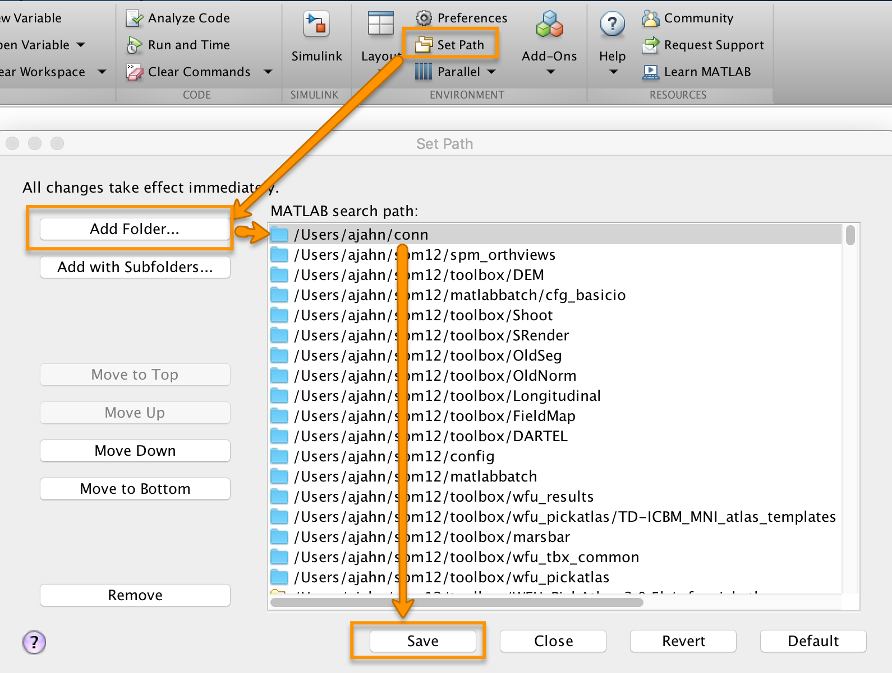
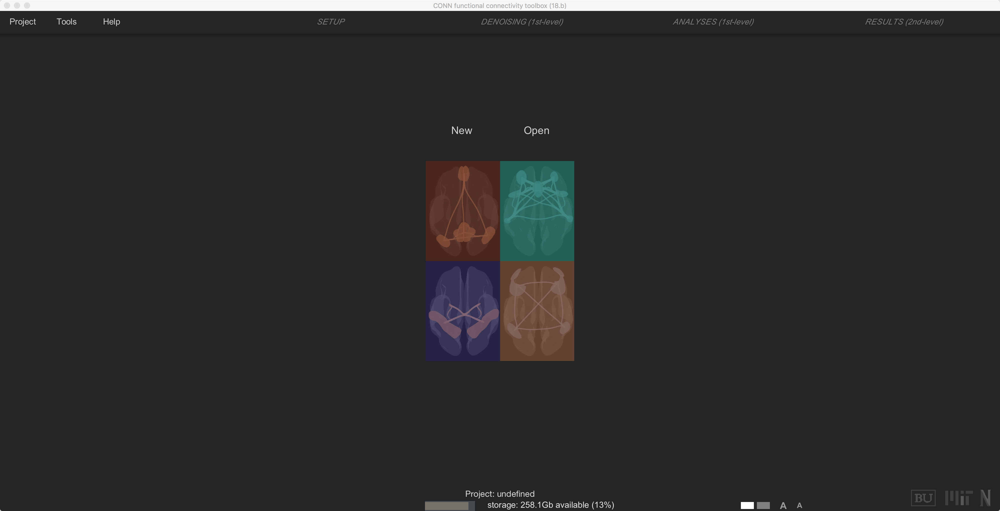

.. _CONN_03_MirandoDatos:

========================================
Capítulo n.° 3: Descarga de la caja de herramientas CONN
========================================

------------------

Descripción general
********

El paquete de software CONN es lo que se conoce como una **caja de herramientas**, un conjunto de comandos diseñado para usarse como complemento de SPM. (Puede encontrar una descripción general de algunas cajas de herramientas comunes que se usan con SPM aquí).`.) La página de descarga de CONN se puede encontrar `aquí 
    `__ en el sitio web de NITRC; simplemente haga clic en el botón de descarga para comenzar a descargar la versión 22.a.

Cuando termine de descargarse, descomprímalo. Se creará una carpeta llamada "conn". Abra una nueva terminal de Matlab y escriba:

::

  movefile('~/Descargas/conn', '~')
  
Esto moverá la carpeta ``conn`` a su directorio de inicio.

El siguiente paso es establecer una **ruta** al directorio para poder acceder a la caja de herramientas CONN desde cualquier directorio. Haga clic en la pestaña "Inicio" en la parte superior de la ventana de Matlab y luego en el botón "Establecer ruta". Haga clic en "Agregar carpeta", seleccione la carpeta "conn" en su directorio de inicio y haga clic en "Guardar".

Luego salga de la ventana, regrese a la terminal de Matlab y escriba:

::

  conexión
  
Si la ruta se ha configurado correctamente, CONN debería cargarse. Tras unos instantes, verá la pantalla predeterminada de CONN:

  

Si ve la pantalla de inicio de CONN, significa que ha instalado CONN y SPM correctamente. Ahora estamos listos para comenzar nuestro recorrido por la interfaz gráfica de CONN y explorar algunas de las opciones con más detalle.

Video
*****

Para ver un video tutorial sobre cómo instalar la caja de herramientas CONN, haga clic aquí
    `__.

    
   

