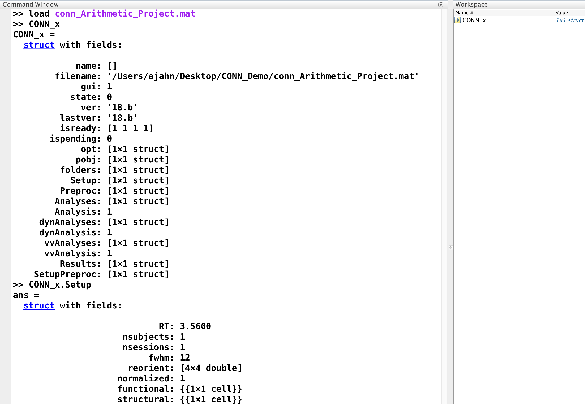
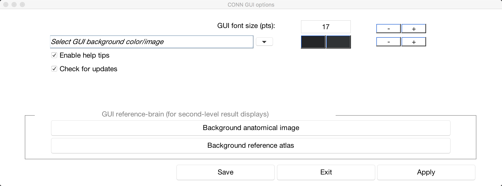
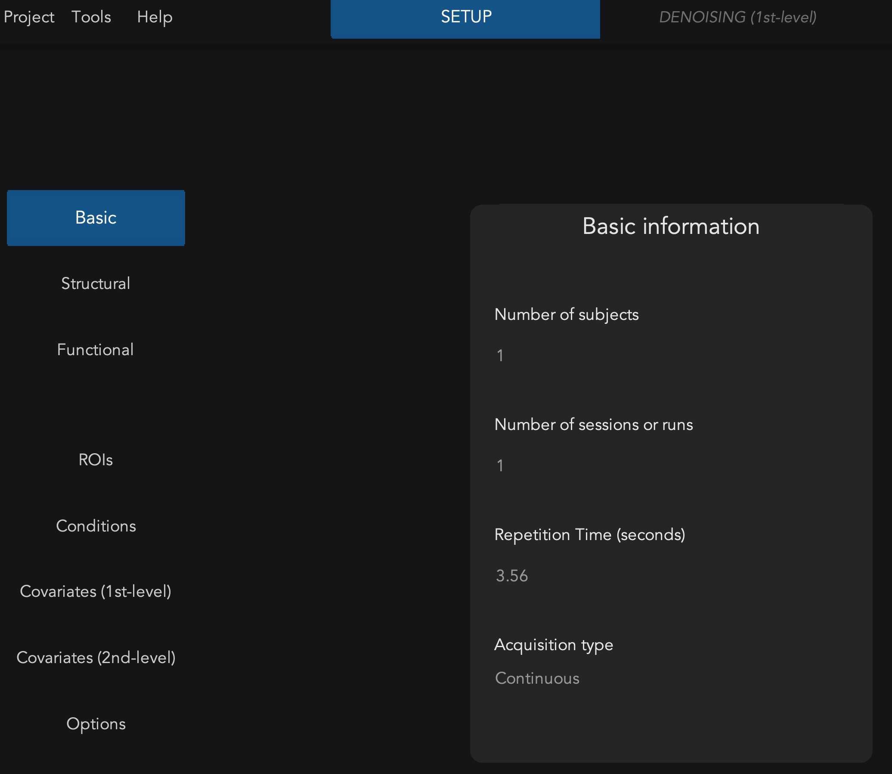
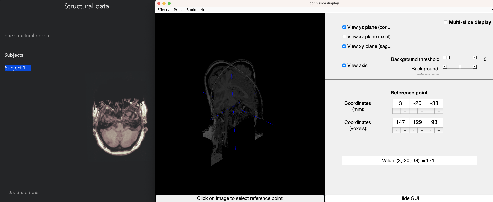

.. _CONN_04_GUI_Descripción general:

========================
Capítulo n.° 4: La interfaz gráfica de usuario de CONN
========================

------------------

Descripción general
********

Una de las principales ventajas de CONN es su interfaz gráfica de usuario (GUI). Prácticamente todo lo que necesita hacer se puede hacer desde la GUI, y su diseño es sencillo y claro.

Sin embargo, al igual que con un paquete de fMRI como SPM, la dependencia de la interfaz gráfica de usuario se reduce a la flexibilidad. En un módulo posterior sobre scriptingVeremos cómo escribir código en Matlab que permite procesar ciertos análisis por lotes y acceder a datos no disponibles en la interfaz. En cualquier caso, la interfaz CONN funciona muy bien para la mayoría de los propósitos y será fácil de aprender para los principiantes.

Creando un nuevo proyecto
**********************

El primer paso de cualquier análisis CONN es crear un nuevo **proyecto**. Esto genera una estructura de Matlab que contiene campos que reflejan todos los aspectos del experimento modificados desde la interfaz gráfica de usuario, como las opciones, los nombres de los archivos y los datos cargados. Por ejemplo, supongamos que hacemos clic en el botón "Nuevo" y nombramos nuestro proyecto "conn_Arithmetic_Project". Lo guardamos en la carpeta "CONN_Demo" y volvemos a la terminal de Matlab. Accedemos a esa carpeta y observamos que ahora contiene un archivo .mat llamado "conn_Arithmetic_Project.mat". Para cargar este archivo en la terminal de Matlab, escriba:

::

  cargar conn_Proyecto_Aritmético
  
Ahora hay una nueva variable en tu espacio de trabajo llamada ``CONN_x``. Este es un **archivo de estructura** que contiene todos los campos de tu experimento, similar a cómo un archivo de trabajo en SPM contiene información sobre todos los cambios realizados en la interfaz gráfica de usuario. En la figura a continuación, ya he completado algunos campos de la interfaz gráfica de usuario, como el tiempo de reacción (RT), el número de sujetos y el tiempo de respuesta (FWHM).

.. nota::

  A quienes tengan experiencia en el uso de SPM les puede resultar útil revisar el capítulo sobre scripts en SPM.
    `. Los conceptos son similares y al recién llegado a CONN le puede resultar más fácil entender lo que hace el archivo .mat una vez que revise cómo se lleva a cabo la misma idea en SPM.
  
Al realizar cambios en el proyecto durante el preprocesamiento y ciertos análisis, puede sobrescribir el archivo del proyecto en cualquier momento colocando el cursor sobre el menú "Proyecto" y seleccionando "Guardar como". Puede cerrar la interfaz gráfica de usuario de CONN si lo necesita, volver a abrirla más tarde y cargar el proyecto haciendo clic en el botón "Abrir" y seleccionando el archivo de proyecto que creó.

El menú de ayuda
^^^^^^^^^^^^^

A medida que utilice más la caja de herramientas CONN, encontrará errores específicos de su análisis. El menú "Ayuda" contiene enlaces al Manual de CONN (que también se puede encontrar aquí).
     `__) y otros recursos web para ayudarle a solucionar el problema.

Uno de estos recursos es la opción "Buscar ayuda", que abre un menú de búsqueda para filtrar las publicaciones del foro por tema. Por ejemplo, si desea ver todas las publicaciones que mencionan GSR (Regresión de Señal Global), simplemente introdúzcalas en el campo de filtro:

.. figure:: 04_Búsqueda_en_Foro.png

Puede llevar algún tiempo familiarizarse con la caja de herramientas CONN y la conectividad funcional para comprender algunas de las publicaciones. Sin embargo, leer los foros es una buena manera de familiarizarse con la terminología de la caja de herramientas CONN, y muchas de las respuestas de Alfonso Nieto-Castañón (el desarrollador principal de la caja de herramientas CONN) están bien escritas y son claras. Incluso si al principio no entiende lo que se dice en los foros, la práctica constante con la caja de herramientas y la lectura tanto de la documentación como de las publicaciones reforzarán la comprensión mutua.

Otras opciones
^^^^^^^^^^^^^

La apariencia predeterminada de la caja de herramientas CONN es un fondo negro con texto blanco, y la mayoría de los botones tienen tonos más oscuros. Si prefiere otro diseño, puede cambiar la apariencia de la interfaz gráfica de usuario para facilitar su lectura. Pase el ratón sobre el menú "Herramientas" y seleccione "Opciones de la interfaz gráfica de usuario". Se abrirá una ventana que le permite, por ejemplo, aumentar el tamaño de la fuente o cambiar la paleta de colores. Otras opciones comunes son:

1. "Habilitar sugerencias de ayuda", que le permite elegir si desea que CONN muestre automáticamente el texto de ayuda al pasar el cursor sobre ciertas opciones. Esto es útil para mostrar todas las opciones asociadas a un paso en particular, pero si la burbuja de ayuda le distrae, puede ocultarla.

2. Las opciones "Imagen anatómica de fondo" y "Atlas de referencia de fondo" le permiten especificar la plantilla que se utilizará para proyectar sus resultados. Verá cómo se muestran los resultados una vez que cubramos el análisis de primer nivel, y si no le gusta el volumen de referencia predeterminado, puede elegir uno diferente.

Hay muchas otras opciones además de estas, y te animamos a probar otras que se adapten a tus gustos. Estas no afectarán tus resultados, pero pueden hacer que el análisis sea más fácil y agradable; después de todo, ¿para qué complicarse la vida más de lo necesario?
  
La pestaña Configuración
************

La interfaz gráfica de usuario de CONN está enmarcada por una franja de pestañas en la parte superior de la ventana y una columna de botones a la izquierda. Estas pestañas y botones controlan el contenido del espacio de trabajo de la interfaz gráfica de usuario y el procesamiento de los datos en dicho espacio.

Las pestañas en la parte superior de la ventana, de izquierda a derecha, representan cada uno de los pasos que se deben realizar para analizar un conjunto de datos en estado de reposo:

1. Configuración
2. Eliminación de ruido
3. Análisis (1er nivel)
4. Resultados (2.º nivel)

Para comenzar nuestro recorrido por la interfaz gráfica de usuario de CONN, nos centraremos en la pestaña **Configuración**, donde se introducirán los parámetros de escaneo para el estudio, como el número de ejecuciones y el TR. También hay botones para cargar las imágenes estructurales y funcionales. Una vez cargadas estas imágenes, podemos comenzar a **preprocesar** los datos, lo cual analizaremos en el siguiente capítulo.

En este experimento, se realizó una exploración en reposo y una exploración anatómica por sujeto. Dado que comenzamos analizando solo un sujeto, ingresamos "1" en el campo "Número de sujetos" y "1" en el campo "Número de sesiones o ejecuciones". En el archivo "sub-01_task-rest_bold.json" de la página de descarga de datos de Openneuro, el tiempo de repetición (TR) fue de 3,56 segundos; ingrese este número en el campo "Tiempo de repetición (segundos)".

El campo "Tipo de adquisición" ofrece dos opciones: "Continua" y "Dispersa". La mayoría de los experimentos utilizan la adquisición continua; la adquisición dispersa se utiliza para diseños relacionados con eventos y omite la convolución de la HRF al inicio de cada ensayo. Por ahora, deje el valor predeterminado "Continua".

La pestaña estructural
^^^^^^^^^^^^^^^^^^

Ahora, nos desplazamos hacia la izquierda de la interfaz gráfica de usuario hasta la pestaña "Estructural". Haga clic en ella y, a continuación, utilice el menú de la derecha para seleccionar el archivo ``sub-01_anat_sub-01_T1w.nii``. Una ventana emergente indicará que se ha asignado un archivo a un sujeto. Haga clic en Aceptar y la imagen estructural se cargará en la ventana central.

Al cargar datos en la caja de herramientas CONN y generar un archivo de salida tras procesarlos, es recomendable revisarlos. Esto implica verificar que no presenten artefactos ni irregularidades, como orientaciones invertidas o artefactos de anillo de Gibbs. Una vez cargados los datos, puede usar el control deslizante a la derecha de la imagen para ver los diferentes cortes. El botón "o" en la parte superior del control deslizante cambiará el montaje de visualización entre cortes axiales, coronales y sagitales. Al hacer clic izquierdo en los cortes, se abrirá otra ventana que permite visualizarlos en múltiples planos marcando varias casillas de verificación, por ejemplo, en las dimensiones x e y, o x, y, z.

  Al hacer clic en los cortes estructurales en la interfaz gráfica de usuario de CONN, se abrirá otra ventana que permite visualizar los cortes en tres dimensiones. Al marcar varias casillas, se crearán secciones transversales desde múltiples ángulos; por ejemplo, al marcar las casillas junto a "Ver plano yz" y "Ver plano xy", se crearán cortes coronales y sagitales combinados.
  

La pestaña Funcional
^^^^^^^^^^^^^^^^^^

La pestaña Funcional es similar a la pestaña Estructural: seleccione el archivo ``sub-01_func_sub-01_task-rest_bold.nii`` y cargará los cortes de la imagen en la ventana central. El primer volumen de la serie temporal se muestra a la izquierda y el último a la derecha. Si hubiera algún movimiento o artefacto importante entre el inicio y el final de la serie temporal, se mostraría en esta comparación. Por otro lado, si hubiera poco o ningún movimiento o artefacto, las dos imágenes deberían verse prácticamente idénticas.

Al igual que con la pestaña Estructural, puede cambiar entre planos de visualización y alternar entre diferentes cortes de los datos funcionales; por ejemplo, haga clic en el ícono ``+`` en la esquina superior izquierda de las imágenes funcionales para mostrar cortes sagitales. Sin embargo, existe una diferencia entre el visor funcional y el visor anatómico: en lugar de abrir una nueva ventana de visualización, al hacer clic directamente en los cortes se abrirá un gráfico de series temporales, extraído del vóxel en el que hizo clic. Dado que estos datos aún no se han preprocesado, es posible que observe tendencias en la dirección de las series temporales, ya sea ascendentes o descendentes; estas representan artefactos de **deriva del escáner** que se corrigen filtrando las tendencias lineales y de orden superior de los datos.

.. figure:: 04_Pantalla_Funcional.png

Una comprobación de calidad útil en esta etapa es hacer clic en el menú "Herramientas funcionales", en la esquina inferior izquierda de la ventana de datos funcionales, y seleccionar "Visor de cortes con superposición anatómica (QA_REG)". Esto muestra los datos funcionales y la imagen anatómica simultáneamente, y traza las curvas de los principales surcos y circunvoluciones en amarillo. Verifique esto para asegurarse de que los límites de los giros y surcos de los datos funcionales coincidan aproximadamente con los de la imagen anatómica. Seleccionar los planos coronal y axial es una buena manera de asegurar la alineación de los ventrículos y otras estructuras internas.

.. figure:: 04_Registro_Anatómico_Funcional.png

Si lo desea, puede realizar la misma comprobación de calidad con la función SPM Check Reg. Para ello, haga clic en el menú "Herramientas funcionales" y seleccione "Mostrar corregistro funcional/anatómico (SPM)". Esto abrirá la ventana Check Reg, similar a la que utilizó en el tutorial de SPM.
      `.
  

Ceremonias
*********

Como se mencionó anteriormente, un nuevo proyecto CONN generará un archivo ``.mat`` asociado que contiene todas las configuraciones especificadas en la interfaz gráfica de usuario. Cierre la interfaz gráfica de usuario de CONN si aún no lo ha hecho y guarde el proyecto si es necesario. Luego, desde la línea de comandos de Matlab, cargue el archivo ``.mat`` escribiendo:

::

  cargar conn_ArithmeticProject.mat
  
Observe el valor al escribir ``CONN_x.Setup.RT``. Cámbielo a 3 escribiendo ``CONN_x.Setup.RT = 3`` y sobrescriba el archivo anterior escribiendo ``save('conn_ArithmeticProject.mat', 'CONN_x')``. Ahora, vuelva a abrir el proyecto en la interfaz gráfica de CONN y observe cómo ha cambiado el campo Tiempo de repetición.

En la misma ventana Básica, en la pestaña Configuración, observe que existen dos tipos de adquisición: Continua y Dispersa. Continua es la primera opción del menú desplegable y la predeterminada. Cierre la interfaz gráfica de CONN, vuelva a cargar el archivo ``.mat`` del proyecto e intente encontrar el tipo de adquisición en el campo `.Setup` de la estructura CONN_x. Demuestre cómo lo modificaría, presentando el código que usaría para hacerlo (tanto para cambiar el valor como para sobrescribir el archivo del proyecto). Pegue una captura de pantalla de la interfaz gráfica de configuración básica una vez realizados los cambios. Por último, muestre el código que usaría para restablecer estos valores a los predeterminados (RT de 3.56, tipo de adquisición continua). Asegúrese de restablecerlos a esos valores en la interfaz gráfica de CONN antes de continuar con este tutorial.

2. Hay otras opciones en el menú "- herramientas funcionales"; obsérvalas y adivine qué hacen. ¿Por qué no sería conveniente revisar el corregistro con los límites de MNI en este momento? (Supongamos que aún no ha realizado ningún preprocesamiento).

3. El tamaño de fuente y la paleta de colores de la interfaz gráfica de CONN se pueden cambiar seleccionando "Herramientas -> Opciones de la interfaz gráfica". Revise cada opción y decida cuáles desea cambiar, si corresponde. Por ejemplo, podría preferir una fuente más pequeña o más grande, o texto oscuro sobre un fondo claro. Experimente con las diferentes opciones e intente encontrar la combinación que mejor se adapte a sus necesidades.
  
Video
*****

Para ver una descripción general en video de la GUI de CONN, haga clic aquí
       `__.
  
  
Próximos pasos
*********

Hay otras opciones en la interfaz gráfica de usuario, como ROI, Condiciones y Covariables. Las dejaremos por ahora y las revisaremos después de preprocesar los datos, tema que abordaremos en el siguiente capítulo.
  
  

       
      
     
    
   

