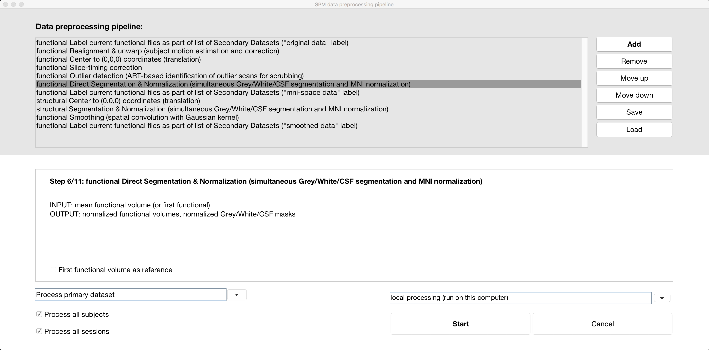

.. _CONN_05_Preprocesamiento:

=========================
Capítulo #5: Preprocesamiento
=========================

------------------

Descripción general
********

El preprocesamiento de un conjunto de datos en estado de reposo es similar al de un conjunto de datos relacionado con una tarea: se realizan los mismos pasos de realineación, segmentación, normalización, etc. La principal diferencia radica en el umbral de movimiento. Los conjuntos de datos en estado de reposo son notoriamente susceptibles a artefactos relacionados con el movimiento; incluso pequeños movimientos pueden introducir correlaciones falsas. Estos artefactos son particularmente problemáticos para los laboratorios que estudian trastornos como la esquizofrenia o para investigadores que escanean a personas muy mayores o muy jóvenes. Un exceso de movimiento arruinará el estudio.

No hay una forma sencilla de abordar este problema, aparte de entrenar a los sujetos para que se muevan lo menos posible. Dicho esto, la caja de herramientas CONN cuenta con varios métodos para mitigar los artefactos de movimiento, incluyendo ART (Herramientas de Detección de Artefactos).`__) y el filtrado de componentes principales de señales de tejidos que podrían no interesarle, como la sustancia blanca y el líquido cefalorraquídeo, un método conocido como «Comp Cor», abreviatura de «Corrección de Componentes». En los siguientes capítulos, analizaremos cómo la inclusión u omisión de estos pasos afectará nuestros resultados.

El botón de preprocesamiento
************************

Nuestro primer paso es **preprocesar** los datos para mejorar la calidad de las imágenes y reducir el ruido, similar a lo que hicimos con el :ref:`preprocesamiento de datos fMRI
    `. Para realizar todos los pasos de preprocesamiento clásico, así como la eliminación de artefactos de movimiento, haga clic en el botón ``Preprocesamiento`` en la parte inferior izquierda de la pantalla.

.. figure:: 05_Preprocesamiento_Menú.png

Esto abrirá un menú que muestra prácticamente todos los pasos de preprocesamiento disponibles. La negrita indica una secuencia de comandos o una serie de pasos de preprocesamiento ya organizados en un orden específico. La primera opción resaltada, "secuencia de preprocesamiento predeterminada", realizará un análisis tradicional que normaliza los datos volumétricos al espacio MNI. Si tiene más experiencia, puede explorar otras opciones, como usar FreeSurfer.
     Para analizar los datos del sujeto en su entorno nativo. Por ahora, seleccione la canalización de preprocesamiento predeterminada y haga clic en "Aceptar".

Esto añadirá todos los pasos de preprocesamiento a la ventana de la parte superior de la pantalla. Al resaltar un paso, se mostrará una breve descripción de su función, junto con la entrada y la salida. Algunos pasos, como "Segmentación y normalización directa funcional", permiten especificar opciones adicionales, como si se desea utilizar el "Primer volumen funcional como referencia". (Estas opciones probablemente no afecten mucho a los resultados, o en absoluto, pero están a su disposición). También puede mover ciertos pasos hacia arriba o hacia abajo en el proceso, o añadirlos o eliminarlos, utilizando el botón a la derecha del menú. Por ahora, haga clic en el botón "Iniciar" para comenzar el preprocesamiento del sujeto individual que hemos cargado.

.. nota::

  En el Laboratorio fMRI de la Universidad de Michigan, las imágenes que se cargan al servidor ya tienen corregido el tiempo de corte y el movimiento; por lo tanto, puede omitir esos pasos del proceso de preprocesamiento resaltándolos y haciendo clic en el botón "Eliminar".

Antes de comenzar el preprocesamiento, se le solicitará que introduzca algunas opciones adicionales. Por ejemplo, debe especificar el orden de los cortes, que debería figurar en su registro de escaneo; si no lo encuentra, consulte a su técnico de escaneo para averiguar qué orden se utilizó. En este tutorial, utilizaremos el orden intercalado (Siemens). También se le pedirá que especifique el umbral con el que ART identifica un valor atípico. La configuración intermedia (percentil 97) debería funcionar correctamente en la mayoría de los casos, aunque puede que desee establecer un umbral mayor o menor según la población que esté estudiando. Además, en lugar de basar el umbral en una muestra normativa (es decir, en la configuración ya seleccionada), puede editar la configuración directamente seleccionando "Editar configuración" y configurando manualmente el umbral de movimiento del sujeto en mm.

.. figure:: 05_Establecer_Umbral_de_Movimiento.png

Para nuestro tutorial actual, lo dejaremos en la configuración intermedia.

A continuación, se le pedirá que seleccione la resolución de muestreo de la salida anatómica y funcional. Los valores predeterminados de (1x1x1) mm^3 para la imagen anatómica y (2x2x2) mm^3 para las imágenes funcionales deberían ser adecuados. Si desea ocupar menos espacio en el disco duro, puede reducir la resolución (es decir, aumentar los números en los campos), a costa de una menor resolución espacial.

Finalmente, se le pedirá que especifique un kernel de suavizado. Como verá más adelante, los datos suavizados se omiten por defecto en el análisis de conectividad funcional; se incluyen aquí por si desea utilizarlos. Haga clic en "Aceptar" y comenzará el preprocesamiento, utilizando las herramientas de SPM según sea necesario. Para este tema, tardará unos 5 minutos en total.

.. nota::

  Para obtener más detalles sobre lo que hace cada paso, consulte el módulo de preprocesamiento SPM
      `.
  
.. nota::

  Si observa un error de corregistro con ciertas ejecuciones y no con otras, podría deberse a un problema con el flujo de preprocesamiento. Negin Nadvar, de la Universidad de Michigan, escribe:
  
  **Al preprocesar varias ejecuciones de fMRI con canales de preprocesamiento de conexión (como el canal de preprocesamiento para la normalización indirecta al espacio MNI), si eliminé los pasos de corrección de movimiento del canal, observé algunos problemas de registro con la ejecución 2 y posteriores. Tras una exhaustiva resolución de problemas, observé que, al omitir el paso de corrección de movimiento de este canal, la caja de herramientas CONN parece asumir que todas las ejecuciones ya están corregistradas con la ejecución 1, lo que resulta en un corregistro/normalización inexacto para la ejecución 2 y posteriores. Para solucionar este problema, en la ventana de preprocesamiento, desactivé la opción "Procesar todas las sesiones" y, en el menú desplegable, seleccioné una sesión y apliqué el preprocesamiento a todos los sujetos. A continuación, seleccioné otra sesión y apliqué el preprocesamiento a cada una de ellas individualmente. Esto evitó el problema y mejoró drásticamente el corregistro/normalización.**
  
  
Ceremonias
*********

1. Vuelva a hacer clic en el botón "Preprocesamiento" y observe que ya se han cargado todos los pasos de preprocesamiento anteriores. Seleccione "Agregar" y observe todas las opciones que se presentan para procesar los datos funcionales y estructurales. Busque el paso de preprocesamiento para eliminar los escaneos iniciales y, a continuación, haga clic en el botón "Subir" para mover este paso al principio de la lista de preprocesamiento. Haga clic en "Iniciar". Cuando se le solicite el número de escaneos que desea eliminar, introduzca "2". Mantenga el resto de las configuraciones predeterminadas, excepto el Suavizado, que puede cambiar a 4 mm. Haga clic en "Aceptar". Cuando finalice el preprocesamiento de este sujeto, haga clic en "Funcional" y tome una captura de pantalla de la imagen resultante. De forma similar al suavizado de imágenes funcionales para datos basados en tareas, los volúmenes deberían verse diferentes. ¿Cuándo querría utilizar un kernel de suavizado más pequeño en lugar de uno más grande?
  
Video
*****

Para ver una descripción general en video sobre cómo preprocesar datos en la caja de herramientas CONN, haga clic aquí
       `__.

Próximos pasos
*********

Si todo se ha ejecutado sin errores, debería aparecer una ventana emergente indicando que todo ha finalizado sin problemas. Una vez finalizado el preprocesamiento, inspeccionaremos las imágenes para detectar artefactos u otros problemas; en otras palabras, realizaremos **verificaciones de control de calidad (QA)**. Para obtener más información sobre cómo realizarlas, haga clic en el botón "Siguiente".

       
      
     
    
   

