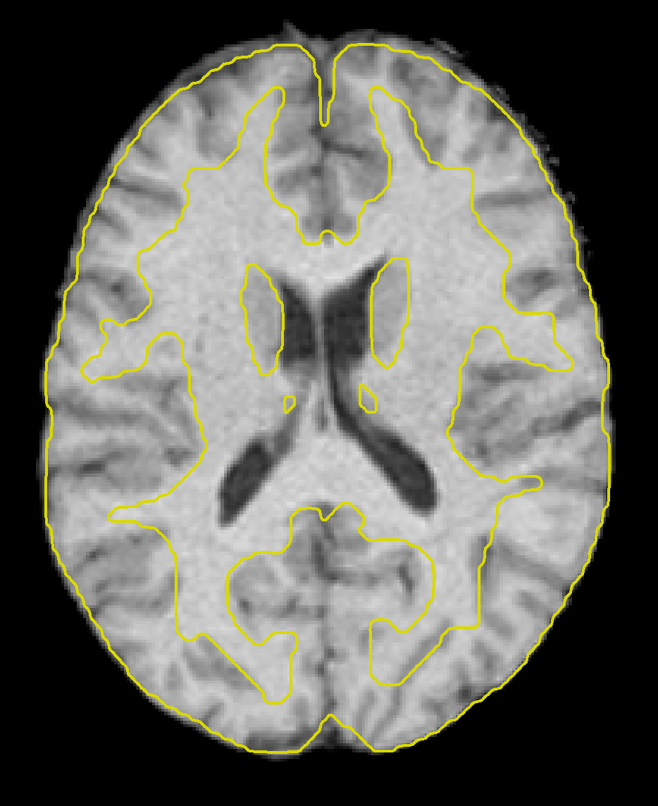
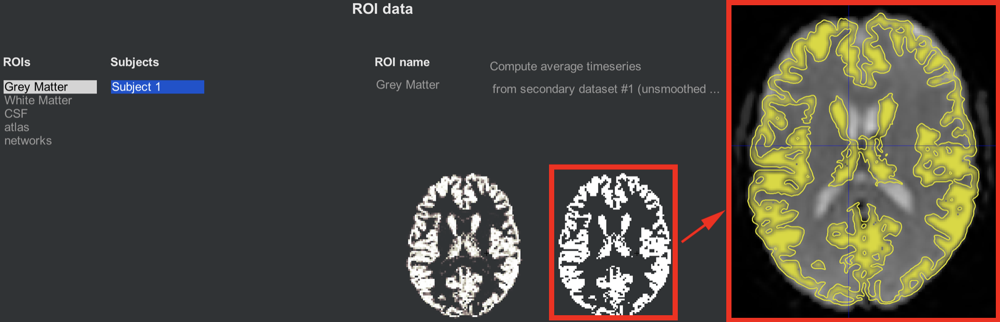
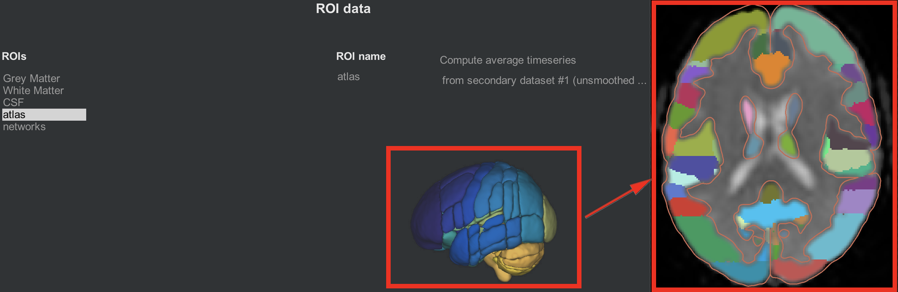
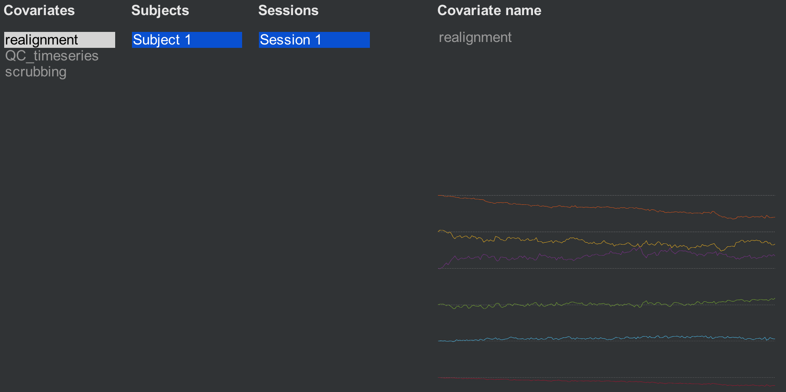
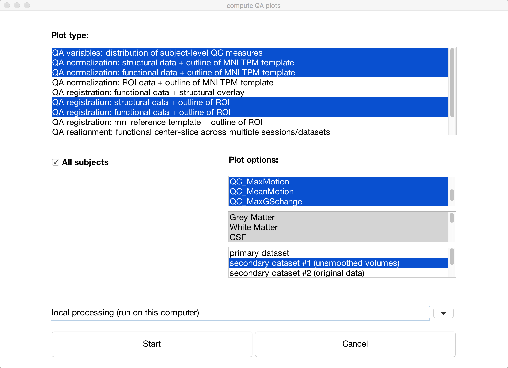
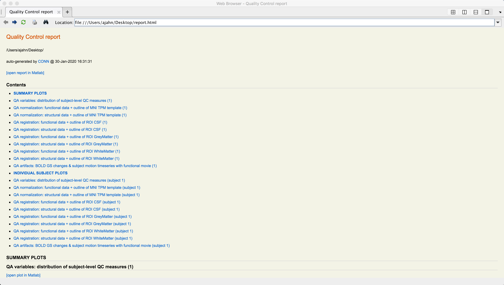

.. _CONN_06_Controles_de_QA:

====================================
Capítulo n.° 6: Controles de garantía de calidad
====================================

------------------

Descripción general
********

Al preprocesar los datos, es recomendable examinar las imágenes antes y después de cada paso para determinar si todo se ejecutó correctamente o si es necesario volver a verificar o rehacer algo. Primero, usaremos los botones del lado izquierdo de la interfaz gráfica de CONN para examinar el resultado de algunos pasos de preprocesamiento y, a continuación, usaremos el botón "Gráficos de control de calidad" en la esquina inferior izquierda de la interfaz gráfica de CONN para crear un informe de control de calidad completo.

Revisando las pestañas Estructural y Funcional
**********************************************

Una vez finalizado el preprocesamiento, vuelva a hacer clic en la pestaña Estructural. Observará que la imagen anatómica se ve diferente; de hecho, se ha despojado del cráneo, se ha remuestreado a una resolución de 1 mm³ y se ha normalizado para que coincida con la plantilla MNI. Desplácese por las diferentes vistas para asegurarse de que el cerebro se vea correctamente normalizado. Puede que le lleve un tiempo familiarizarse con el aspecto de un cerebro correctamente normalizado, pero en general, el cerebro debería tener ahora un tamaño y una forma normales; cualquier irregularidad, como un cerebro anormalmente largo o pequeño, debería corregirse.

Podemos examinar la imagen con más profundidad utilizando algunas de las opciones del visor. Si hace clic en el menú "-herramientas estructurales:" y selecciona "Visor de cortes con límites MNI (QA_NORM)", verá los contornos de la plantilla MNI trazados en amarillo sobre la imagen anatómica. Observe cómo las líneas amarillas delimitan aproximadamente el límite entre la sustancia blanca y la sustancia gris de la imagen anatómica. La normalización no será perfecta, pero los contornos generales deberían coincidir.

Al hacer clic en la pestaña "Funcional", se observa un cambio similar: los datos funcionales se han preprocesado completamente, incluyendo la normalización y el suavizado. Al hacer clic en el menú "Herramientas funcionales" y seleccionar "Visor de cortes con límites MNI (QA_NORM)", al igual que con la imagen anatómica, se mostrará una línea amarilla que divide la sustancia blanca de la gris. El contorno general de la plantilla MNI también debe abarcar la imagen funcional. Si los datos anatómicos y funcionales coinciden con la plantilla MNI, el preprocesamiento se realizó correctamente.

.. figure:: 06_Funcional_MNI.png

La pestaña ROI
************

Ahora llegamos a la pestaña Regiones de Interés (ROI), que enumera las diferentes regiones que se utilizarán en el análisis de conectividad. Dado que nos interesa principalmente la señal en estado de reposo de la materia gris, **parcelaremos** la corteza en diferentes regiones, también llamadas **nodos** o **regiones de interés**, y extraeremos la serie temporal promedio de cada una de ellas. Los grupos de nodos pueden combinarse en **redes** que muestran una correlación consistente en su señal en estado de reposo. Aprenderemos a examinar cada una de ellas con más detalle.

Materia gris, materia blanca y LCR
^^^^^^^^^^^^^^^^^^^^^^^^^^^^^^^^^^

Al hacer clic en la pestaña ROI, se muestran cinco conjuntos de ROI generados: materia gris, materia blanca, LCR, atlas y redes. Comencemos con los tres primeros, que corresponden a los tipos de tejido que componen el cerebro. Uno de los pasos de preprocesamiento, la **Segmentación**, clasificó cada vóxel de la imagen anatómica como perteneciente a uno de estos tres tipos de tejido (para más detalles sobre cómo se realiza, consulte el tutorial de SPM sobre :ref:`Segmentación <04_SPM_Segmentation>`). La imagen anatómica se utilizó para la segmentación porque tiene mayor resolución espacial que la imagen funcional; sin embargo, dado que en última instancia nos interesan los datos de la imagen funcional, debemos remuestrear estos mapas de tejido en los datos funcionales.

Los dos cortes axiales, uno junto al otro, ilustran el aspecto de la máscara de materia gris antes y después de su binarización (es decir, con valores de 1 donde la máscara representa materia gris y 0 en el resto), y su posterior erosión. Esta erosión hace que la máscara sea ligeramente más conservadora en lo que determina como materia gris, ya que se excluyen los vóxeles cercanos al límite entre la materia gris y la blanca. Al hacer clic en cualquiera de los cortes, se abrirá una ventana de montaje que permite examinar con más detalle la superposición entre la máscara de materia gris y la materia gris de la imagen funcional.

  Ilustración de la máscara ROI de materia gris antes (izquierda) y después (derecha) del umbral. El recuadro muestra la máscara de materia gris superpuesta a los datos funcionales, que se pueden abrir haciendo clic en cualquiera de los cortes axiales. Se muestran imágenes similares para las pestañas de materia blanca y LCR.
  
.. nota::

  Junto al campo "Nombre de ROI", verá un par de opciones: la primera, "Calcular series temporales promedio", indica que la serie temporal se promediará en los vóxeles dentro de esa máscara, lo que normalmente se realiza dentro de la máscara de materia gris. Para los demás mapas de tejido, materia blanca y LCR, la opción cambia a "Calcular descomposición de PCA", que realiza un PCA para generar varias series temporales representativas de ese tipo de tejido. Dado que asumimos que la señal en estado de reposo debería ser fundamentalmente diferente según el tipo de tejido del que extraigamos los datos, introduciremos este PCA como un regresor de interferencia al eliminar el ruido de los datos, nuestro siguiente paso después de este capítulo.
  
  Tanto para calcular la serie temporal promedio como para realizar el ACP, puede optar por una versión ponderada de cualquiera de las dos. En este caso, se asignará mayor peso a los vóxeles determinados por el paso de Segmentación, con mayor probabilidad de pertenecer a un tipo de tejido que a los demás.
  
  Tenga en cuenta también que hay otro indicador, denominado "del conjunto de datos secundario n.° 1 (sin suavizar)", que extraerá la serie temporal de los datos sin suavizar. En otras palabras, el suavizado se realiza si desea obtener esas imágenes, pero por defecto, los datos extraídos no están suavizados; la idea es que haya menos mezcla de señales entre los diferentes tipos de tejido en los datos sin suavizar.

Atlas y redes
^^^^^^^^^^^^^^^^^^^^

La caja de herramientas CONN incluye atlas, o métodos para parcelar la materia gris en diferentes nodos. Por defecto, la materia gris se divide según el Atlas Cortical de Harvard-Oxford.`, y el cerebelo está dividido según el atlas AAL. Para ver estos atlas con más detalle, al hacer clic en el cerebro 3D parcelado, se abrirá una ventana que ilustra cómo se ha remuestreado el atlas con los datos funcionales. Por ejemplo, la parcelación en naranja indica la corteza cingulada anterior. Al pasar el ratón por los diferentes colores, se mostrará una cadena que indica la región de interés (ROI) a la que se está apuntando. Más adelante, utilizaremos estas ROI en nuestro análisis de primer nivel para generar mapas de conectividad entre ellas y todos los demás vóxeles del cerebro.

La misma idea se ilustra en la pestaña "Redes", que asigna grupos de nodos a una sola red. La Red en Modo Predeterminado, por ejemplo, es una combinación de un nodo en la corteza cingulada posterior y un nodo en la corteza prefrontal ventromedial. Al igual que con las regiones de interés corticales, se puede abrir una ventana de visualización de cortes haciendo clic en la parcelación de la red 3D.

Covariables (1er nivel)
**********************

Otro resultado del preprocesamiento es la creación de **regresores molestos**, o covariables que representan señales que no nos interesan o que estamos tratando de desenredar de la señal que nos interesa. El movimiento es un ejemplo clásico de un regresor molesto: normalmente no nos interesa la señal generada por el sujeto que se mueve y queremos eliminar cualquier efecto de confusión del movimiento en la señal que nos interesa, como la señal en estado de reposo.

Al hacer clic en la pestaña "Covariables (1.er nivel)", se muestran tres covariables generadas por defecto: Realineación, QC_timeseries y depuración. La covariable de realineación es un conjunto de seis parámetros de movimiento que representan el movimiento en las tres direcciones de traslación y rotación. (Para más detalles sobre el funcionamiento de la corrección de movimiento, consulte este capítulo).
    `.) Al pasar el mouse sobre los parámetros de movimiento, se mostrará un vector de seis números que representan el movimiento promedio en las seis direcciones en ese momento.

The second covariate, QC_timeseries, computes an additional measure of motion called **Framewise Displacement** (FD). This is a type of composite measure of all of the movement parameters, and the formula varies slightly between different research groups. The default in CONN is the FD computed by the ART toolbox; if you want to use another FD formula, click on the ``-covariate tools:`` menu and select ``compute new/derived first-level covariates``. This will open up another window with other options to choose from.

The last covariate, ``scrubbing``, will display any volumes that have been modeled out of the data, or **scrubbed**. This subject was very still during the scanning, so no volumes have been removed.

Generating QA Plots
*******************

You can summarize all of the QA checks we did above by clicking the ``QA plots`` button in the bottom-left corner of the CONN GUI. In the window that opens up, click ``Create new report``, and label it whatever you want. Then click ``Create new plot``, and select any of the QA checks that you are interested in. The default ones that are highlighted will display checks such as the functional and structural data on the MNI template and the motion parameters. When you have chosen the QA plots that you want, click ``Start``.

A series of figures will be generated, one for each QA check that you selected. You can then click on the ``Export`` button to generate an HTML file containing all of the QA checks.

Exercises
*********

1. One helpful QA check is to view a movie of the functional volumes juxtaposed with movement covariates; that way, you can see how the volume changes as a result of motion. Click on ``Covariates (1st-level)``, make sure that ``realignment`` is selected, and then click ``covariate tools -> display covariate & single slice functional (movie)``. Select ``primary dataset`` for viewing. This will open a new window that displays a single axial slice of the functional data, and displays each of the movement parameters underneath it. If there are any large motions, it should be reflected in the functional volume as well. Now, try the same approach, this time highlighting the ``scrubbing`` covariate for a subject that has at least one volume that was scrubbed. Does the movie suggest that this volume ought to have been removed? Why or why not?

2. En la sección "Covariables (1.er nivel)", también puede generar muchas otras covariables nuevas. Por ejemplo, puede usar un método diferente para calcular los umbrales que se deben usar para eliminar ciertos volúmenes. Haga clic en "Herramientas de covariable -> Calcular covariables de primer nivel nuevas/derivadas". Imagine que ha leído el artículo de Power et al. de 2012 y desea usarlo para calcular el Desplazamiento por Marco (DF), una especie de medida compuesta del movimiento para cada volumen. Seleccione esa opción y mantenga los valores predeterminados. (Si desea tomar una decisión más informada sobre cómo cambiar estos parámetros, consulte el artículo original de Power et al. de 2012). Haga clic en "Aceptar". Ahora, haga lo mismo para crear una nueva covariable para "FD_conn". Observe las diferencias entre ambas y piense cuál preferiría usar y por qué.

3. Las covariables multidimensionales, como los parámetros de realineación, se pueden dividir en sus componentes individuales. Por ejemplo, supongamos que solo desea incluir los parámetros de traducción. Primero, seleccione la covariable "realineación" y, a continuación, haga clic de nuevo en "herramientas de covariables", seleccionando esta vez "Dividir covariable multidimensional en varias covariables individuales". (Nota: Es posible que tenga que hacer clic en otro botón de Configuración y volver a seleccionar "Covariables (1.er nivel)" para que los cambios surtan efecto).

4. Cree un nuevo informe de control de calidad con los siguientes gráficos: 1) Normalización de control de calidad: datos estructurales + esquema de la plantilla MNI TPM; 2) Normalización de control de calidad: datos funcionales + esquema de la plantilla MNI TPM; y 3) Artefactos de control de calidad: cambios en BOLD GS y series temporales de movimiento del sujeto con vídeo funcional. Tome capturas de pantalla de los gráficos de normalización de control de calidad que generó. (Sugerencia: Después de crear el informe, puede acceder a ellos haciendo clic en el menú desplegable "Gráficos").

5. Crea tu propio informe de control de calidad, incluyendo un gráfico para cada uno de los resultados de normalización, registro, artefactos y eliminación de ruido. Muestra capturas de pantalla de cada uno que generaste. ¿Por qué seleccionaste estos en particular? ¿Cuáles crees que serían los más útiles para los informes de control de calidad de tu experimento y por qué?

Video
*****

Para ver una demostración en video de cómo realizar controles de calidad en la caja de herramientas CONN, haga clic aquí
     `__.

Próximos pasos
*********

Si está satisfecho con sus comprobaciones de calidad, ya puede comenzar a eliminar el ruido de los datos. Esto los limpiará aún más mediante el procesamiento específico para datos en estado de reposo y los preparará para el análisis estadístico.

     
    
   

