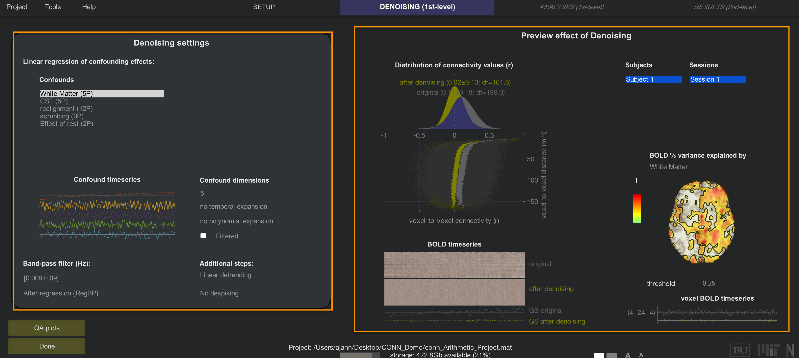
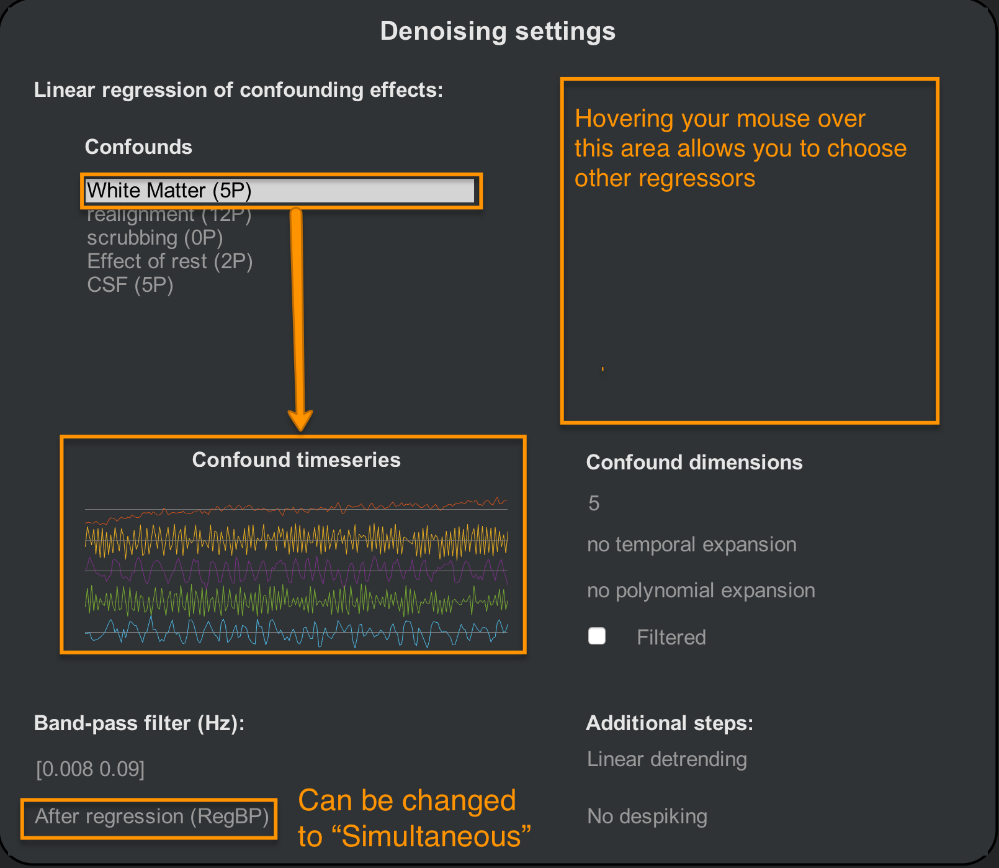
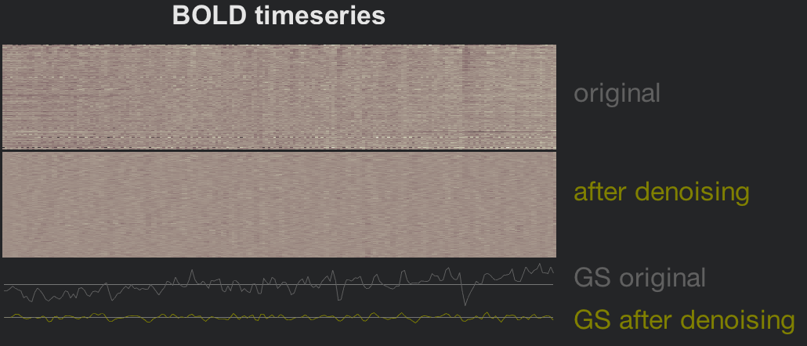

.. _CONN_07_Eliminación de ruido:

=====================
Capítulo 7: Eliminación de ruido
=====================

------------------

Descripción general
********

Uno de los pasos más importantes para limpiar los datos en estado de reposo es la **eliminación de ruido**. Por supuesto, la eliminación de ruido es necesaria para cualquier análisis de imágenes; sin embargo, como se mencionó anteriormente, los datos en estado de reposo son particularmente susceptibles a artefactos como desviaciones lineales y efectos de movimiento.

Para comenzar a eliminar el ruido de los datos, haga clic en "Listo" en la pestaña Configuración. Aparecerá un nuevo menú que le solicitará que seleccione los análisis en estado de reposo que desea realizar: cualquier combinación de ROI a ROI, Semilla a vóxel y Vóxel a vóxel. Los tres análisis están seleccionados por defecto; a menos que solo desee centrarse en un subconjunto de estos análisis, déjelos como están por ahora. Haga clic en "Iniciar" para comenzar el paso de eliminación de ruido.

.. nota::

  Puede cambiar los análisis predeterminados haciendo clic en el botón "Opciones" en la parte inferior del menú Configuración y marcando o desmarcando diferentes análisis. También puede controlar otras opciones, como la resolución de los datos de salida, el tipo de máscara que se utilizará y si se usarán métodos paramétricos o no paramétricos para determinar la significancia estadística de los resultados. También puede generar archivos de salida adicionales, como mapas r de semilla a vóxel de primer nivel. Estos pueden ser útiles si desea utilizar los mapas de conectividad para análisis fuera de la caja de herramientas CONN, como `The Brain Connectivity Toolbox`.`__.
  
  
La pestaña de eliminación de ruido
*****************

Después de unos minutos, tendrá acceso a la pestaña "Denoising". La ventana de la esquina superior izquierda muestra los regresores de confusión utilizados para representar las diferentes fuentes de ruido, mientras que la ventana de la derecha muestra la cantidad de señal explicada por cada regresor. Llamaremos a estas dos áreas generales **Configuración de Denoising** y **Vista previa**.

  El área de la izquierda muestra una lista de regresores de confusión que puede ingresar en su modelo, mientras que el panel de la derecha muestra el efecto de incluir esos regresores.

Configuración de eliminación de ruido
^^^^^^^^^^^^^^^^^^

Por defecto, CONN incluirá regresores derivados de los tipos de tejido generados en la sección ROI de la pestaña Configuración, así como las covariables de primer nivel de dicha pestaña. CONN extrae cinco componentes principales de las ROI de materia blanca y LCR para representar mejor el perfil de señal en esas regiones. Si hace clic en la cadena "Materia blanca (5P)", verá a continuación una ilustración de la serie temporal de cada componente. En el panel "Dimensiones de confusión" puede cambiar el número de componentes; por ejemplo, introduzca un valor de 10 y observe cómo cambia el panel de series temporales.

.. nota::
 
  Aunque incluir más componentes puede filtrar más señales representativas de la sustancia blanca y el líquido cefalorraquídeo, se llega rápidamente a un punto de rendimiento decreciente. Más regresores también implican más grados de libertad, lo que puede reducir la potencia estadística del modelo. Para la mayoría de los experimentos, el valor predeterminado de 5 componentes será suficiente.

En este panel, también puede optar por agregar derivadas temporales de orden superior. Si se hace, generalmente se agrega a los regresores de movimiento; las derivadas de primer y segundo orden pueden capturar movimientos más sutiles que no se explican por las traslaciones y rotaciones tradicionales. La expansión polinómica es un concepto similar, que agrega un exponente cuadrático o cúbico al regresor, aunque esto no se hace comúnmente.

La casilla de verificación "Filtrado" especifica si se debe aplicar un filtro de paso de banda al regresor *antes* de introducirlo en el modelo. Puede hacerlo para regresores individuales resaltando el regresor Confundir y marcando la casilla, o cambiando la opción "Después de la regresión (RegBP)" a "Simultáneo". En el panel "Pasos adicionales", también puede optar por añadir una eliminación de tendencia de orden superior (por ejemplo, si tiene una sesión de escaneo muy larga y cree que podría necesitar modelar una deriva de escáner más compleja) y Despiking. Despiking reducirá artificialmente la señal de los vóxeles que sean anormalmente altos y que no se contabilicen por un alto movimiento. Para la mayoría de los datos, elegir Despike o no Despike dará resultados similares; sin embargo, para datos inusualmente ruidosos, Despiking puede ser útil para eliminar la señal artificialmente alta.

.. advertencia::

  Se ha demostrado que el filtrado de paso de banda de los datos de series temporales y luego la realización de una regresión de molestias reintroducen frecuencias y componentes de ruido; consulte `Hallquist et al. (2014)Consulta el documento `__ para más detalles. La caja de herramientas CONN no parece tener una opción que te permita hacer esto, pero es bueno tenerlo en cuenta en cualquier caso.
  
  
.. nota::

  Si desea eliminar cualquier límite del filtro paso banda, introduzca ``Inf`` para ese límite. Por ejemplo, si desea eliminar todas las frecuencias bajas por debajo de 0,008, pero permitir todas las frecuencias altas, deberá introducir el vector ``[0,008 Inf]``.

Vista previa de eliminación de ruido
^^^^^^^^^^^^^^^^^

El área derecha de la pestaña "Denoising" actualizará automáticamente una figura que muestra cómo se cargan los regresores en los datos en reposo. Las distribuciones en la esquina superior izquierda muestran el efecto de los regresores y parámetros de denoising antes y después de su aplicación. En general, los datos en reposo están sesgados para generar correlaciones positivas, principalmente como resultado de los regresores de confusión, como el movimiento. Observe cómo la distribución de los valores de conectividad se centra más cerca de cero después de aplicar el denoising. El diagrama de dispersión debajo de las distribuciones muestra otra vista del mismo principio: los datos denoising muestran una distribución más uniforme de los valores de conectividad a medida que se prueban las correlaciones en vóxeles más alejados del vóxel inicial.

.. figure:: 07_DistribuciónConectividad.png
  
La figura en la esquina inferior izquierda es un **gráfico de alfombra** que descompone cada volumen de un cubo tridimensional de vóxeles en un gráfico bidimensional de cuadrados. Cada columna representa un volumen individual, y cada fila, un vóxel individual dentro de dicho volumen. La eliminación de ruido suaviza las transiciones más bruscas entre vóxeles, probablemente causadas por el movimiento, la deriva del escáner y el ruido fisiológico; el gráfico de series temporales de la señal global también refleja este suavizado.

Finalmente, la vista previa cerebral a la derecha muestra el porcentaje de varianza en la señal BOLD explicada por el regresor de confusión resaltado. La carga de la varianza explicada debe corresponder al regresor resaltado. Por ejemplo, ¿puedes adivinar qué regresor de confusión representa este gráfico? ¿Qué pistas ves? Intenta adivinar cómo se vería la figura si se seleccionara uno de los otros regresores de confusión.

Video
*****

Para ver una descripción general en video sobre la eliminación de ruido, haga clic aquí`__.

Próximos pasos
*********

Para la mayoría de los conjuntos de datos, las figuras anteriores deberían ser similares: la distribución de los valores de conectividad se centrará cerca de cero y las series temporales BOLD se suavizarán. Si los datos superan estas comprobaciones, estará listo para comenzar a estimar un modelo lineal general utilizando dichos regresores. Para ver cómo hacerlo, haga clic en el botón "Siguiente".

Ceremonias
*********

1. Introduzca un regresor de paso de banda de ``[0.008 Inf]``. Describa con sus propias palabras la función de este filtro. ¿Es, en general, mejor o peor que un filtro paso bajo? ¿Por qué?

2. Experimente resaltando diferentes regresores en la ventana "Confusiones" y marcando la casilla "Filtrado", y observe lo que sucede en la ventana "Vista previa". ¿Este filtrado (equivalente a la opción "Simultáneo" del menú desplegable "Después de la regresión") parece empeorar o mejorar la regresión problemática? ¿Cómo lo juzgaría?

3. En la ventana "Configuración de eliminación de ruido", agregue "Materia gris (1P)" a la lista de Confusión. ¿Se consideraría esto una Regresión de señal global? ¿Por qué sí o por qué no? De no ser así, ¿qué debería hacer para que se considere una verdadera Regresión de señal global y por qué? (Para más información, consulte esta publicación).
    `__.)

    
   

