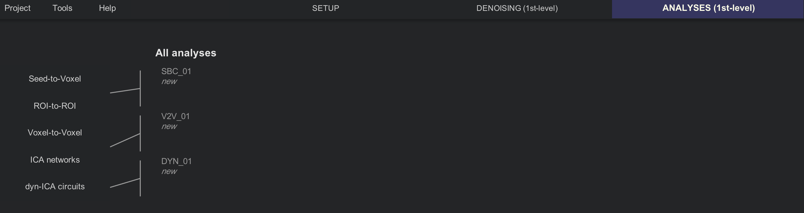

.. _CONN_08_Análisis_de_1er_Nivel:

==============================
Capítulo n.° 8: Análisis de primer nivel
==============================

------------------

Descripción general
********

El siguiente paso de nuestro análisis es un **modelo de primer nivel**. Los regresores especificados durante el paso de eliminación de ruido, junto con los regresores de condición definidos en la pestaña Configuración, se utilizan para construir un modelo que se ajuste mejor a los datos observados en cada vóxel. A continuación, se calcula un análisis de correlación, promediando la señal en cada región de interés (ROI) y correlacionándola con otras ROI del cerebro, además de generar mapas de correlación utilizando cada vóxel como semilla.

Para ejecutar el modelo de primer nivel, haga clic en "Listo" en la pestaña "Denoising". Aparecerá un nuevo menú, similar al que vio antes de la denoising: tiene opciones para el tipo de análisis de estado de reposo que desea realizar. Deje todas las casillas marcadas por ahora y haga clic en el botón "Iniciar".

CONN tardará un par de minutos en eliminar el ruido de los datos y generar cada uno de los mapas de correlación especificados. Una vez finalizado, tendrá acceso a la pestaña «Análisis (1.er nivel)». Haga clic en ella para revisar cada análisis.

  Pestaña de primer nivel. Los análisis de semilla a vóxel y de ROI a ROI se almacenarán en una carpeta llamada SBC (Correlación basada en semilla), los análisis de vóxel a vóxel se almacenarán en la carpeta V2V (Vóxel a vóxel) y los circuitos dyn-ICA se generarán en la carpeta DYN_01 (Conectividad dinámica).
  

Correlación basada en semillas
**********************

Si recuerdan, en la pestaña Configuración se generaron varias ROI diferentes: materia gris, materia blanca y LCR (estas dos últimas principalmente para la eliminación de ruido mediante AnatCompCor), así como atlas y redes. Las ROI de atlas y redes dividen el cerebro en diferentes regiones, también conocidas como **semillas**. En cada semilla, se promedia la serie temporal de la materia gris en todos los vóxeles, y se generan mapas de correlación tanto para la correlación de esa semilla con todas las demás, como para la de cada semilla con todos los demás vóxeles del cerebro.

Al hacer clic en los botones "Semilla a vóxel" o "ROI a ROI" (que están enlazados), se mostrarán dos áreas distintas, similares a la configuración de la pestaña "Denoising". El área izquierda, "Análisis de conectividad basados en semillas", muestra diferentes tipos de análisis y opciones entre las que puede elegir. El área derecha, "Vista previa de los resultados del análisis de primer nivel", muestra cómo la serie temporal promedio de la semilla seleccionada se correlaciona con otros vóxeles del cerebro.

Dado que solo analizamos datos en estado de reposo, la opción más adecuada es la «conectividad funcional (GLM ponderado)». Más adelante, veremos cómo realizar un análisis de interacción psicofisiológica generalizada (gPPI).`, que se puede utilizar con conjuntos de datos relacionados con tareas.

En el panel Semillas/Fuentes, resalte diferentes semillas para observar cómo cambia el mapa de conectividad en el área "Vista previa de los resultados del análisis de primer nivel". ¿Qué observa en los mapas al seleccionar diferentes semillas? ¿Coinciden con lo que predijo?

.. figure:: 08_1stLevelPreview.png

Si está satisfecho con la vista previa de los mapas de correlación, haga clic en el botón "Listo". Esto generará mapas de correlación que se almacenarán en la carpeta de su proyecto, en el directorio "results/firstlevel". Una vez realizado esto para todos los sujetos de nuestro conjunto de datos, podemos ejecutar un análisis de grupo, que ahora abordaremos.

Video
*****

Para ver cómo hacer un análisis de primer nivel en su computadora, haga clic aquí
    `__.

    
   

