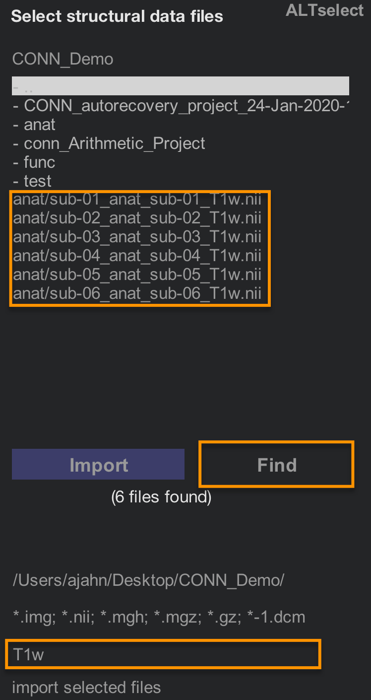
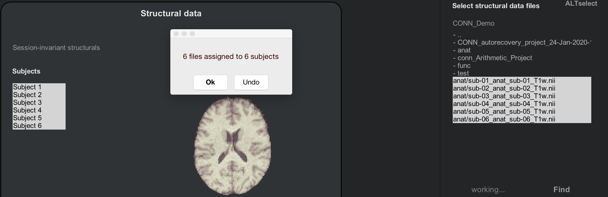
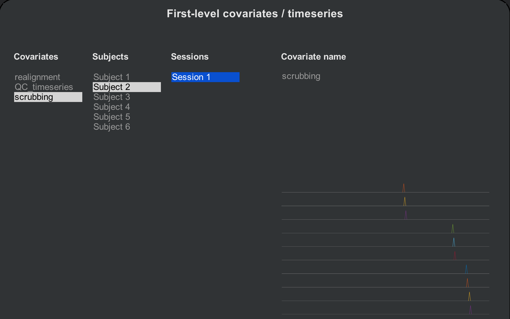
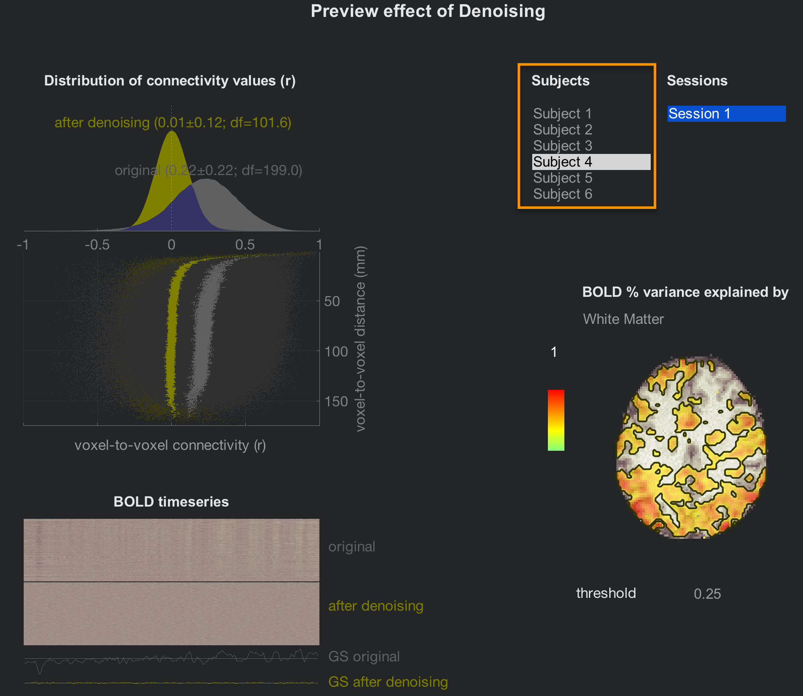
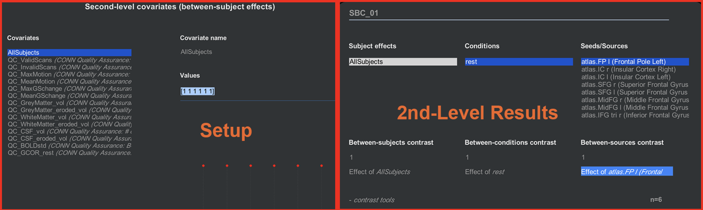

.. _CONN_09_Análisis de 2do Nivel:

================================
Capítulo n.° 9: Análisis a nivel de grupo
================================

--------------------

Descripción general
********

Nuestro objetivo al analizar este conjunto de datos es generalizar los resultados a la población de la que se extrajo la muestra. En otras palabras, si observamos cambios en la conectividad funcional en nuestra muestra, ¿podemos afirmar que estos cambios probablemente también se observarían en la población?

Para probar esto, ejecutaremos un **análisis a nivel de grupo (o de segundo nivel)**: calculamos el error estándar y la media para una estimación de correlación y luego probamos si la estimación promedio es estadísticamente significativa.

Configuración del análisis a nivel de grupo
***********************************

En el capítulo anterior, analizamos una sola ejecución para un solo sujeto; en otras palabras, realizamos un análisis de primer nivel. Esto es adecuado para determinar si existen correlaciones significativas dentro de un solo sujeto, pero no podemos realizar ninguna inferencia de grupo. Para cargar más sujetos, primero tendremos que descargar más sujetos. Regrese al «Estudio aritmético».`__ y descargue los datos funcionales y anatómicos de los sujetos 2 a 6.

.. nota::

  Si su carpeta de Descargas es la predeterminada, puede mover todas las imágenes descargadas a sus respectivas carpetas utilizando el siguiente código, escrito desde el directorio CONN_Demo:
  
  ::
  
    sujetos = [02 03 04 05 06];
    
    para sujeto=sujetos
    
      sujeto=num2str(sujeto, '%02d');
      mkdir(['sub-' num2str(asunto) '/anat'])
      mkdir(['sub-' num2str(asunto) '/func'])
      movefile(['~/Descargas/sub-' num2str(asunto) '_anat_sub-' num2str(asunto) '_T1w.nii'], ['sub-' num2str(asunto) '/anat'])
      movefile(['~/Descargas/sub-' num2str(asunto) '_func_sub-' num2str(asunto) '_task-rest_bold.nii.gz'], ['sub-' num2str(asunto) '/func'])
      
    fin
      
 

Desde la interfaz gráfica de usuario de CONN, haga clic en la pestaña Configuración y seleccione "Básico". Cambie el número de sujetos de 1 a 6 y observe cómo el número de sesiones y el tiempo de repetición se amplían para reflejar el número total de participantes. Cada número corresponde a cada sujeto; por ejemplo, el tercer número en el campo "Número de sesiones o ejecuciones" corresponde al tercer sujeto que cargaremos. Si los parámetros son diferentes para alguno de los sujetos, asegúrese de que las modificaciones coincidan con el sujeto.

.. figure:: 09_Grupo_Básico.png

A continuación, cargaremos los datos anatómicos y funcionales de cada sujeto. La forma más sencilla de hacerlo es usar el filtro "Buscar" en el lado derecho de la interfaz CONN. En el campo debajo de las extensiones de imagen (p. ej., *.img, *.nii, etc.), escriba "T1w" y haga clic en "Buscar". Se buscarán las imágenes que contengan esa cadena en el directorio actual y sus subdirectorios.

Mantenga presionada la tecla Mayús y haga clic para seleccionar todos los temas en el campo "Temas". A continuación, mantenga presionada la tecla Mayús y haga clic para seleccionar todas las imágenes "T1w.nii" en la ventana de selección de imágenes. A continuación, haga clic en el botón "Importar". Debería ver algo similar a lo siguiente:

.. nota::

  Como antes, desplácese por los cortes de sus imágenes anatómicas para asegurarse de que no haya artefactos y de que las imágenes estén orientadas correctamente.
  
Ahora, realice el mismo procedimiento para las imágenes funcionales. Haga clic en la pestaña "Funcional" y use el filtro "Buscar" para buscar imágenes en sus directorios que contengan la cadena "negrita". Use la tecla Mayús y haga clic para resaltar los sujetos y las imágenes en estado de reposo, y luego haga clic en "Importar". Después de unos instantes, debería aparecer una ventana emergente que indica que "6 archivos se han asignado a 6 sujetos".

.. nota::

  Al examinar las imágenes funcionales de estos seis sujetos, ¿observa alguna anomalía? (Pista: Hay una en el sujeto 2). ¿Cree que esto será un problema? De ser así, ¿a qué paso del preprocesamiento debería prestar especial atención?

Si ya ha analizado el sujeto 1, puede observar que los datos en las pestañas «ROI» y «Covariables» son los mismos, independientemente del sujeto seleccionado. A medida que preprocesamos los sujetos, estos campos se completarán con las ROI y las covariables de cada uno.
  
Preprocesamiento de los sujetos
^^^^^^^^^^^^^^^^^^^^^^^^^^

Haga clic en el botón ``Preprocesamiento`` para comenzar a preprocesar todos los sujetos en un solo lote. Esto tomará alrededor de 5-6 minutos por sujeto, o alrededor de 30-40 minutos en total. Cuando haya terminado, revise las pestañas ``ROI`` y ``Covariables (1er nivel)``, esta vez desplazándose por cada sujeto. Observe las diferencias entre los sujetos: ¿Qué máscaras (es decir, tipos de tejido) se ven diferentes? ¿Cómo se ven las covariables? El sujeto 2, por ejemplo, ahora tiene 10 volúmenes que se han marcado como valores atípicos. Cada uno de estos volúmenes marcados se insertará como un regresor en la matriz de diseño de primer nivel, que elimina su varianza del resto de la serie temporal.

.. advertencia::

  En el conjunto de herramientas CONN, este procedimiento de eliminar un volumen mediante regresión se denomina **depuración**. Existe cierto debate sobre a qué se refiere realmente el término, ya que en otros contextos puede significar simplemente eliminar el volumen de la serie temporal (p. ej., Caballero-Gaudes y Reynolds, 2017). Siempre que se utilice el término, revise el contexto para ver a qué método se refiere.
  
Eliminación de ruido y análisis de primer nivel
^^^^^^^^^^^^^^^^^^^^^^^^^^^^^^^^

El resto de los pasos se realizarán de la misma manera que al procesar cada sujeto. Haga clic en "Listo" para comenzar la eliminación de ruido. Para ahorrar tiempo, desactive la opción "Análisis de vóxel a vóxel" y haga clic en "Iniciar". Esto tardará unos minutos por sujeto.

Una vez finalizada la eliminación de ruido, haga clic en la pestaña "Eliminación de ruido (1.er nivel)" para revisar el efecto de considerar diferentes regresores de confusión. El diseño es el mismo; la única diferencia es que ahora puede navegar por todos los temas. Revíselos con los mismos criterios que en el capítulo sobre eliminación de ruido y, a continuación, haga clic en el botón "Listo" para continuar con el modelado de 1.er nivel.

Esto sólo tomará unos minutos, pero para ahorrar tiempo, desmarque la casilla junto a Conectividad "Voxel a Voxel".

La ventana de vista previa de la pestaña «Análisis (1.er nivel)» será la misma que la del análisis individual de cada sujeto, pero ahora con todos los sujetos listados. Haga clic en todos ellos para revisar sus mapas de conectividad después de la eliminación de ruido.

.. figure:: 09_1erNivel_Grupo.png

Si está satisfecho con el control de calidad, haga clic en "Listo" para comenzar el análisis de segundo nivel. Asegúrese de que las opciones "Todos los sujetos" y "Todas las condiciones" estén marcadas y, a continuación, haga clic en "Iniciar". Esto solo tardará unos minutos.

Análisis a nivel de grupo
********************

Al finalizar el análisis grupal, accederá a la última pestaña, "Resultados (2.º nivel)". Esta mostrará un mapa cerebral completo de la correlación para los contrastes especificados en la pestaña "Configuración".

Quizás se pregunte qué contrastes especificamos. La condición predeterminada que ya se ha creado es "rest", que representa el mapa de correlación generado para cada sujeto en cada ROI. Estos se promedian entre todos los sujetos mediante un **vector de contraste** en la pestaña "Covariables (2.º nivel)" de la pantalla "Configuración". Si hace clic en el botón "Covariables de 2.º nivel", verá una lista de todas las covariables que se ingresarán en el segundo nivel; la covariable "AllSubjects" tiene un vector de contraste de "[1 1 1 1 1 1]", que representa un promedio de todos los sujetos. (Las demás covariables con el prefijo "QA" son regresores molestos y no se pueden seleccionar a nivel de grupo). Alterne entre las pestañas "Configuración" y "Resultados (2.º nivel)" para ver la correspondencia entre la configuración del experimento y los resultados generados.

¿Qué sucede si queremos crear otro contraste, por ejemplo, comparar los tres primeros y los tres últimos sujetos como si fueran grupos diferentes? Primero, necesitamos crear dos vectores de contraste separados: uno para los tres primeros sujetos y otro para los tres últimos. En la pestaña "Configuración", haga clic en "Covariables (2.º nivel)" y pase el cursor sobre la esquina inferior izquierda del menú "Covariables". Haga clic en el signo "+" y etiquete la covariable como "Grupo A". En el campo "Valores", introduzca el siguiente vector:

::

  [1 1 1 0 0 0]
  
Y haga lo mismo para otra covariable, etiquétela "Grupo B" e ingrese este vector:

::

  [0 0 0 1 1 1]
  
Observe cómo cambian los puntos rojos según el vector de contraste que haya seleccionado; los puntos serán positivos para los primeros tres sujetos del Grupo A y positivos para los últimos tres sujetos del Grupo B.

.. figure:: 09_GrupoA_ContrasteVector.png

Ahora, cuando haga clic en la pestaña "Resultados (2.º nivel)", aparecerán dos nuevos "Efectos de sujeto": Grupo A y Grupo B. Al resaltar cada grupo por separado, se mostrarán los resultados solo para ese grupo; por otro lado, para obtener un contraste entre los dos, mantendremos presionada la tecla Mayús y haremos clic para resaltar ambos grupos e ingresar un contraste entre sujetos de [1 -1]:

.. figure:: 09_GrupoA-GrupoB_Contraste.png

.. nota::

  Otra forma de generar el mismo contraste es seleccionar ambos grupos con el ratón y hacer clic en la cadena "Efectos (prueba F)". Verá opciones para ver el promedio de cada grupo por separado, un contraste Grupo A-Grupo B o un contraste Grupo B-Grupo A.
  
  
Adición de covariables molestas
^^^^^^^^^^^^^^^^^^^^^^^^^^

Si desea tener en cuenta otras fuentes de varianza, como la edad o el sexo, también puede introducirlas en la pestaña "Covariables (2.º nivel)". Cree un nuevo contraste (p. ej., "Edad") e introduzca los valores de cada sujeto, asegurándose de que coincidan. Por ejemplo, la primera covariable de edad que introduzca debe ser la edad del primer sujeto. La siguiente figura muestra una covariable de edad creada para estos sujetos:

.. figure:: 09_Covariable_Edad.png

Si desea centrar la media de cualquiera de sus covariables, haga clic en el menú ``-herramientas de covariable:``, seleccione ``Ortogonalizar covariable(s) seleccionada(s)`` y resalte la covariable "Todos los sujetos":

.. figure:: 09_Covariable_de_edad_centrada_en_la_media.png

Video
*****

Puede encontrar una demostración en video del análisis a nivel de grupo en la caja de herramientas CONN aquí
    `__.

Ceremonias
*********

1. Cree dos grupos nuevos, Grupo C y Grupo D, compuestos por los siguientes vectores: Grupo C [1 0 1 0 1 0]; Grupo D [0 1 0 1 0 1]. En la pestaña Resultados (2.º nivel), cree un contraste Grupo C > Grupo D, utilizando "atlas.FP r (Polo frontal derecho)" como semilla. Muestre los resultados y, a continuación, cambie la configuración de comparaciones múltiples a "Personalizar (configuración avanzada de control de error por familia). Cambie el "umbral de vóxel" a "p < 0,05" y cambie la prueba direccional de "bilateral" a "contraste positivo (unilateral)". Haga una captura de pantalla de los resultados. (Sugerencia: Debe haber dos clústeres que superen este umbral de corrección).

2. Ejecute el mismo análisis que en el Ejercicio n.° 1, pero incluya la edad como covariable de interferencia. Calcule el mismo contraste, muestre los resultados y modifique la corrección de comparaciones múltiples como en el Ejercicio n.° 1. Tome una captura de pantalla de los resultados. ¿Cómo han cambiado?

Próximos pasos
*********

Ahora que hemos creado nuestros contrastes de segundo nivel, procederemos a interpretar los resultados, lo cual requiere otro capítulo. Haga clic en el botón "Siguiente" para obtener más información sobre cómo analizar las cifras y determinar su significado.

    
   

