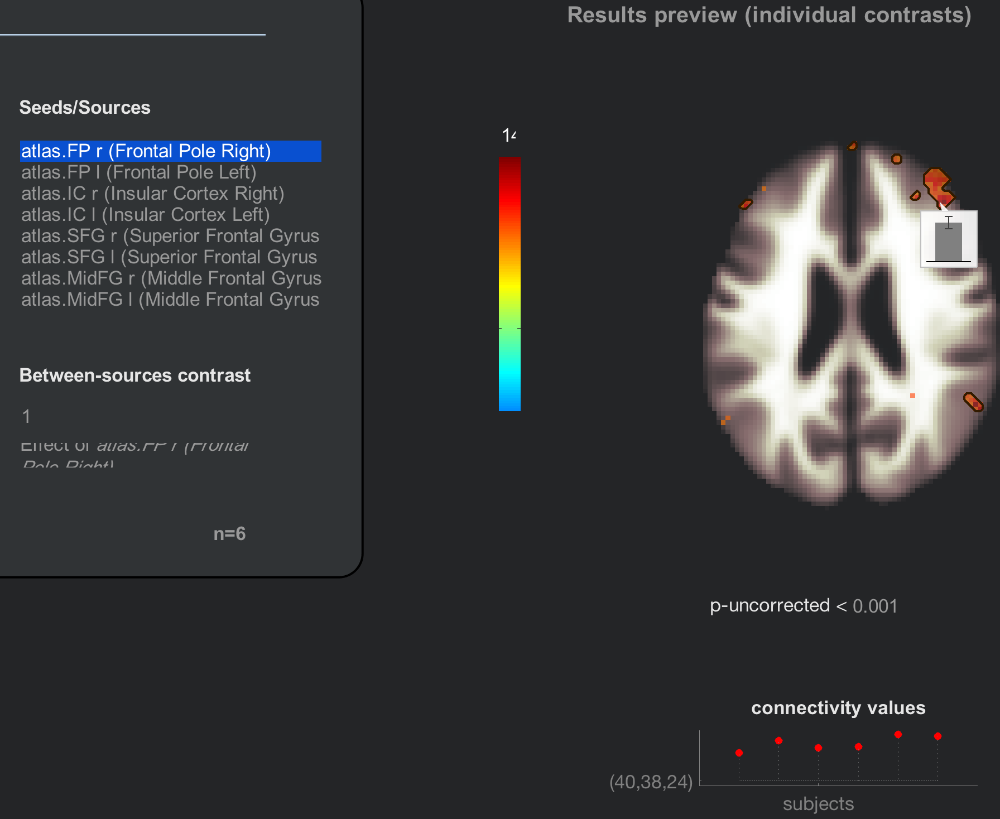
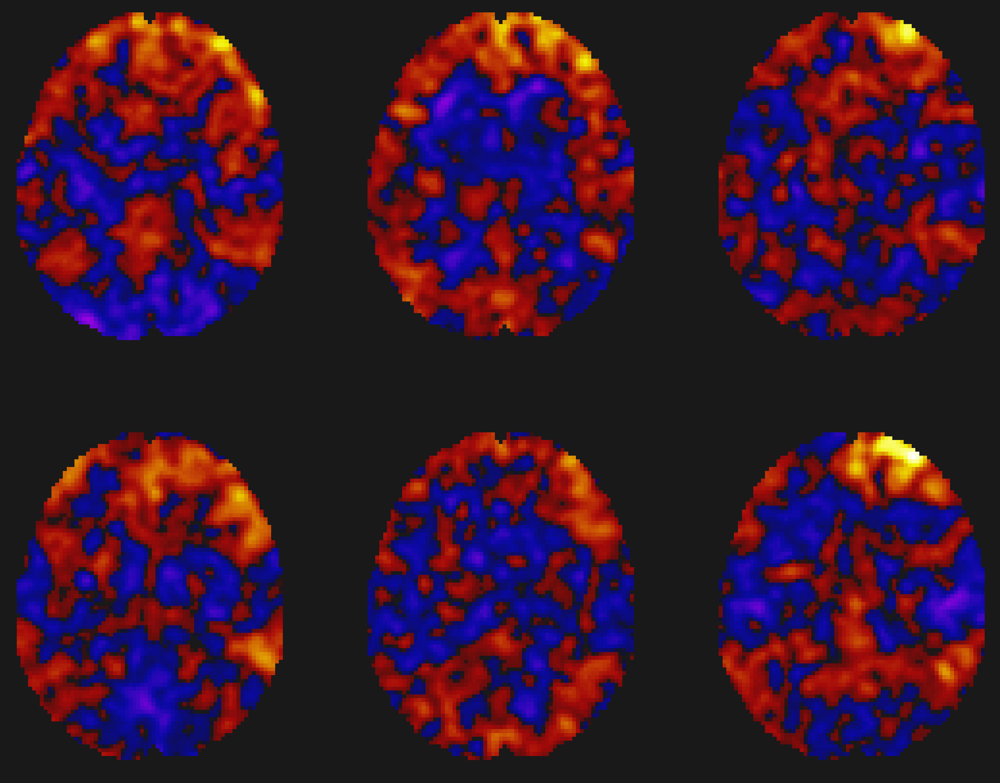
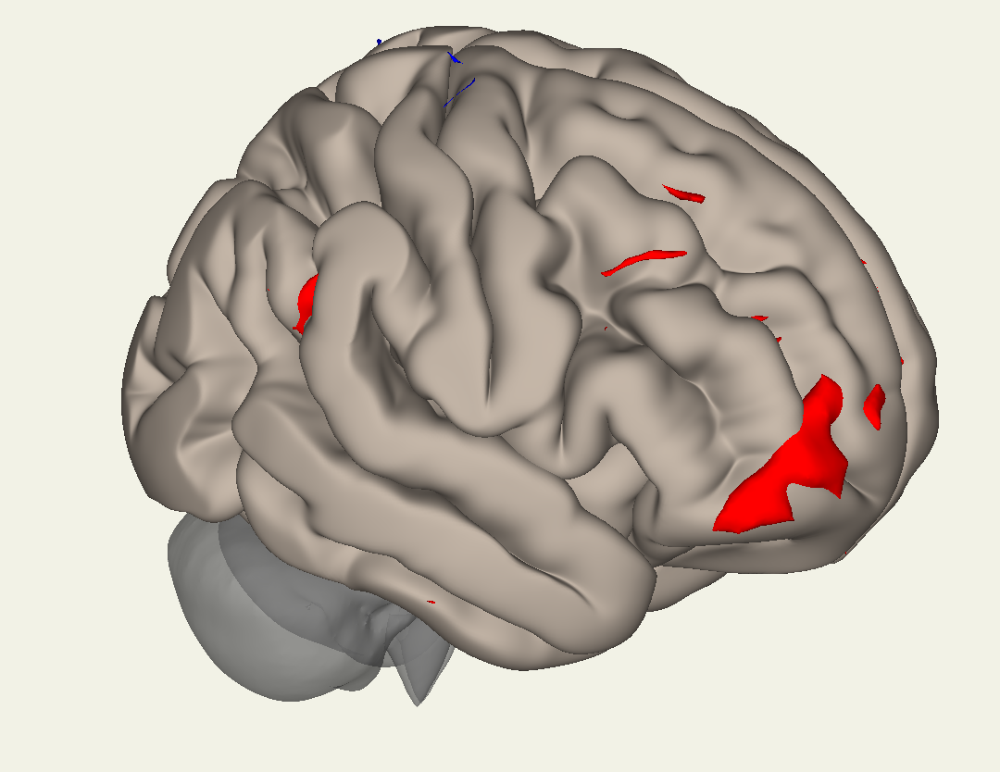
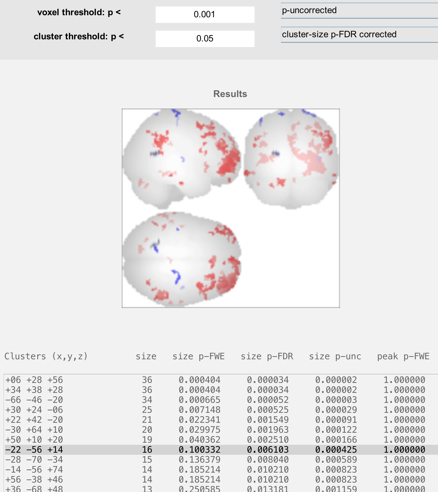
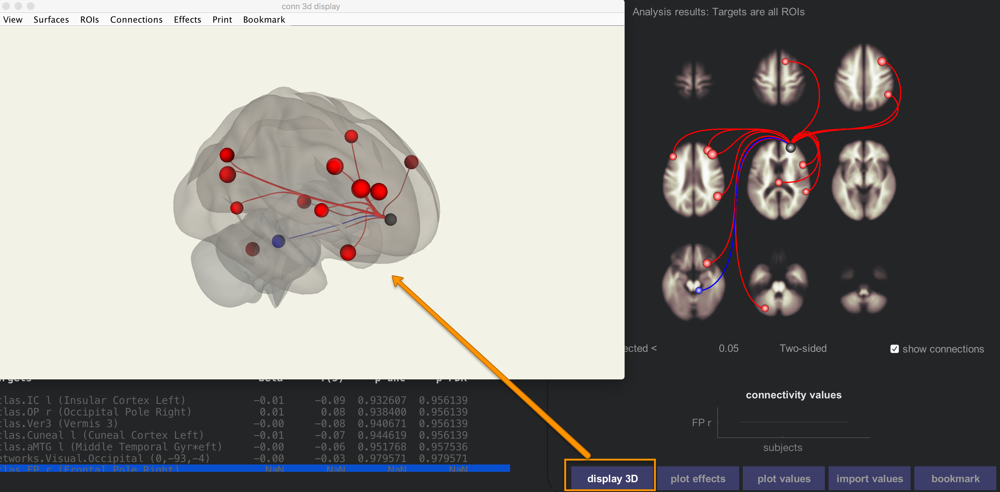
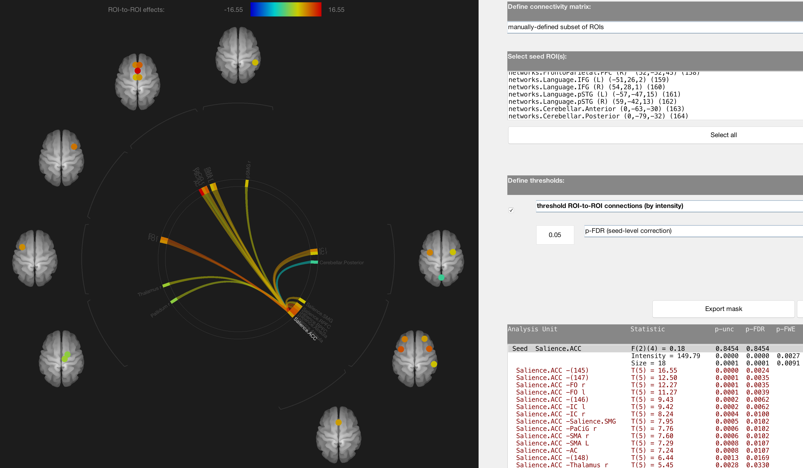
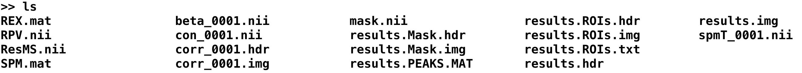
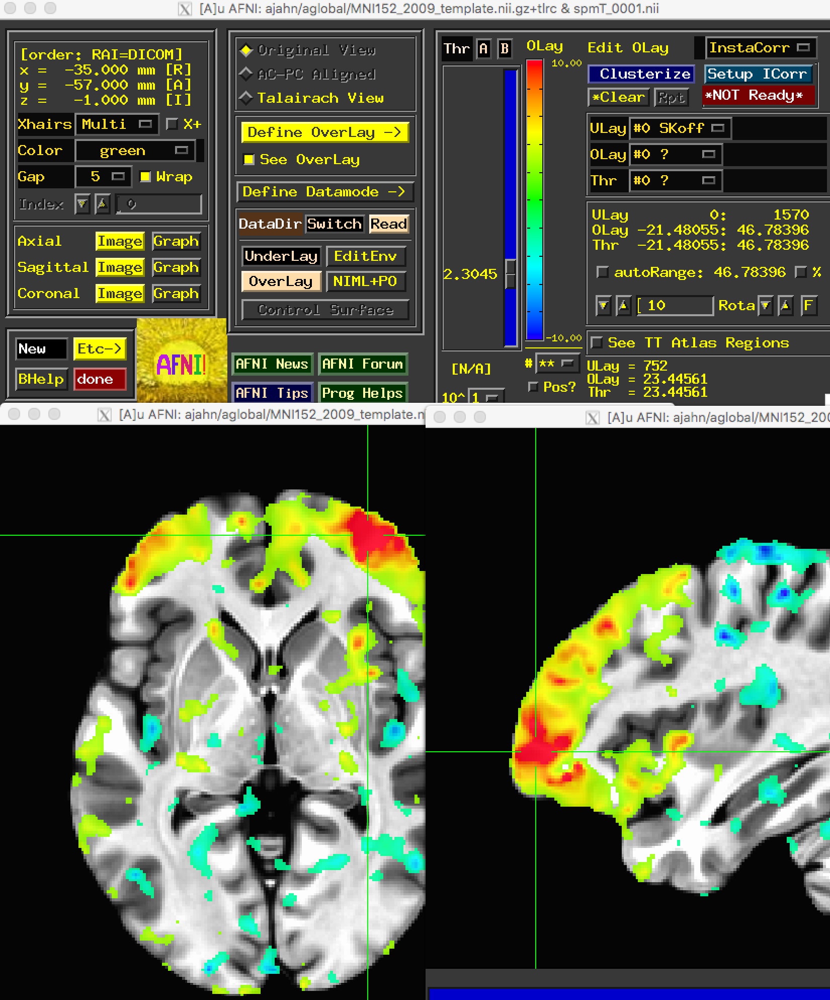

.. _CONN_10_Visualización_de_Resultados:

================================
Capítulo 10: Visualización de los resultados
================================

------------------

Descripción general
********

La caja de herramientas CONN generará automáticamente varios gráficos diferentes, uno para cada ROI especificado en la pestaña "Configuración". Estos mapas de conectividad representan la correlación entre cada ROI y el resto del cerebro (mapas "Semilla a Vóxel"), así como la correlación entre cada ROI y todas las demás ROI del cerebro (mapas "ROI a ROI").

Para cada uno de los efectos y condiciones del sujeto especificados, se mostrará el mapa de segundo nivel correspondiente a la derecha de la ventana CONN. Los resultados se muestran por defecto en cortes axiales con un valor p sin corregir de 0,001, y la barra de colores a la izquierda representa la intensidad del estadístico t. Al pasar el ratón sobre los vóxeles, se muestran el estadístico t y el valor p del contraste resaltado en la ventana Efectos del sujeto. Al hacer clic en un vóxel, se genera un gráfico de barras que muestra la intensidad de la estimación del contraste. Si resalta el efecto "Todos los sujetos", por ejemplo, la vista previa de los resultados mostrará la intensidad de la conectividad de la región semilla seleccionada; en este caso, el polo frontal derecho.

El panel de vista previa de resultados incluye más opciones para visualizar los resultados (aunque deberá pasar el ratón sobre el panel para verlos). Al hacer clic en el botón "Mapear sujetos", por ejemplo, podrá mostrar los resultados de cada sujeto individual en un montaje. Observe cómo el resultado a nivel de grupo representa la intensidad de la superposición entre los mapas de sujetos individuales:

.. nota::

  Prueba también los botones "Efectos de gráfico" y "Valores de gráfico". ¿Cómo interpretarías los resultados generados? ¿Qué ocurre si haces clic en un vóxel diferente?
  
  
El explorador de resultados
********************

Quizás se haya preguntado por qué el panel derecho de la ventana muestra "Vista previa de resultados" cuando parece que hemos generado los resultados a nivel de grupo. El mapa aún no se ha escrito en el disco; lo haremos haciendo clic en el botón "Explorador de resultados". Después de unos instantes, se abrirá otra ventana con más opciones para ver los resultados en diferentes orientaciones, por ejemplo, renderizados sobre una superficie.

Al abrirse la ventana del explorador de resultados, verá un cerebro de cristal con los resultados de la semilla seleccionada. La ventana se divide en tres partes:

1. El **Panel de Umbral**;
2. El **Panel de visualización**; y
3. El **Panel de coordenadas**.

.. figure:: 10_Paneles.png

El panel de umbral
^^^^^^^^^^^^^^^^^^^

El panel Umbral permite establecer un **umbral**, o valor que determina los resultados que se muestran. Por ejemplo, el campo «umbral de vóxel» especifica el **umbral de formación de clústeres**, o la importancia que debe tener un vóxel para que se considere parte del clúster. El campo inferior, «umbral de clúster», establece el umbral de los clústeres que se mostrarán. (Para más detalles sobre el funcionamiento de los umbrales de formación de clústeres, consulte este capítulo).`.)

Los menús junto a los campos de umbral de vóxel y umbral de clúster especifican el tipo de mecanismo de corrección a utilizar. Por ejemplo, cambiar de "p sin corregir" a "F/T/X stat" permite especificar un umbral de estadística t en lugar de un umbral p. Asimismo, el umbral de clúster puede cambiarse de un umbral FDR a FWE o sin corregir.

El último par de menús especifica si las pruebas son unilaterales o bilaterales, y si se utilizan métodos paramétricos o no paramétricos para la corrección. A menos que su hipótesis se centre únicamente en una dirección del resultado, deje el valor predeterminado "bilateral"; si desea utilizar un método de corrección que no dependa de supuestos paramétricos como la normalidad, cambie "estadísticas paramétricas" a "estadísticas no paramétricas". Al seleccionar "estadísticas no paramétricas", se le solicitará que seleccione el número de simulaciones; normalmente se recomiendan unas 5000 simulaciones, aunque esto puede resultar complicado para muestras grandes.

Por ahora, ejecute una simulación no paramétrica con 1000 simulaciones y observe cómo cambian los resultados. (Siempre puede volver a usar estadísticas paramétricas para ver los resultados originales). ¿Aparecen nuevos clústeres? ¿Desaparecen clústeres? ¿A qué cree que se debe?

El panel de visualización
^^^^^^^^^^^^^^^^^

El Panel de Visualización muestra los resultados, por defecto, en un cerebro de cristal. Los botones a la derecha del panel permiten visualizar los resultados de diferentes maneras. Por ejemplo, el botón en la parte superior izquierda del panel mostrará los resultados en un cerebro inflado:

.. figure:: 10_Resultados_Inflados.png

Mientras que el botón de abajo mostrará los resultados en una superficie cortical típica:

.. nota::

  Pregunta: ¿Por qué uno podría querer utilizar la pantalla inflada en lugar de la cortical?
  
.. advertencia::

  Estos resultados se han **renderizado** o remuestreado para que se ajusten a la superficie cortical. Pueden ser ligeramente engañosos si se intenta localizar los resultados en áreas muy pequeñas; en ese caso, sería mejor realizar todo el análisis con datos volumétricos previamente convertidos a una superficie mediante FreeSurfer.
    " No cubriremos el análisis basado en superficies con CONN en este tutorial, pero tenga en cuenta que primero deberá reconstruir la superficie antes de usar la caja de herramientas CONN.

The other buttons are relatively straightforward to use, such as displaying the results on individual slices. The last button we will discuss here is the button that says "SPM"; this will load the results into the SPM contrast manager, which can then be thresholded and viewed using the SPM interface. For more details on how to use the contrast manager, see :ref:`this tutorial 
     `.

The Coordinates Panel
^^^^^^^^^^^^^^^^^^^^^

The bottom panel shows coordinates for each cluster that passes the thresholds specified above. Clicking on each set of coordinates will highlight a cluster by slightly darkening it. These coordinates can then be reported in a table as significant results, given your thresholds.

Before leaving this section, highlight a cluster that is significant in the column labeled "size p-FDR", but not "size p-FWE". What do you think would happen to that cluster if you switched your threshold from "cluster-size p-FDR corrected" to "cluster-size p-FWE corrected"?

ROI-to-ROI Results
******************

Close the Results explorer window, and then click on the ``ROI-to-ROI`` tab. This also displays functional connectivity results, but at a different resolution: instead of a whole-brain connectivity map, we only see ROIs that are significantly correlated with other ROIs. 

The options for selecting different contrasts are the same as for the seed-to-voxel results; highlighting any combination of regressors allows you to test for main effects, contrasts, or interactions. The red lines indicate which ROIs are significantly correlated with the selected seed, and blue lines indicate significantly negative correlations. More or fewer axial slices can be displayed by clicking on the up or down arrows next to the results display window.

Clicking on each of the nodes in the results pane will display a bar chart showing the size of the effect for that ROI-to-ROI correlation, and clicking on the ``display 3D`` button will show a transparent brain with the nodes overlaid on it.

The ROI-to-ROI results allows you to see in more detail how nodes of certain networks are correlated with other nodes in the brain. Scroll down the ``Seeds/Sources`` menu, and select the seed "networks.Salience.ACC". This uses a node within the anterior cingulate cortex as a seed, and correlates it with all of the other ROIs in the brain.

Click on the ``Results explorer`` button to open a new results window. This will display the significant connections between the nodes as a **connectome ring**. The Salience.ACC node in the lower-right corner is connected through curved lines to other nodes, grouped together as networks. For example, the cluster of nodes right next to the Salience.ACC node all belong to the Salience network; it is therefore unsurprising that there is a high concentration of positively connected nodes within that group.

The coordinates table in the lower right displays all of the significant correlations between the seed node and other ROIs. If you want, you can restrict the number of nodes you are testing by going to the menu "Define connectivity matrix" and selecting "manually-defined subset of ROIs". You can then select only those ROIs that you are interested in testing.

Regardless of how many ROIs you test, you will need to correct for the number of tests performed. "Seed-level correction" will correct for the number of seeds that you use; "analysis-level correction" will correct for the total number of connections that are tested.

Using the Results Outside of the CONN Toolbox
*********************************************

Each time you pressed the ``Results explorer`` button, results were generated and output in the directory structure that CONN automatically created as part of your project. From the Matlab terminal, navigate to ``conn_Arithmetic_Project/results/secondlevel/SBC_01/AllSubjects/rest/FP_r`` and type ``ls``. You should see the following:

The results that CONN displays in its GUI are also written out here. The file ``spmT_0001.nii``, for example, shows the correlation-to-t-statistic map that was created for the node that you selected. You can open it up in any other viewer, such as AFNI:

You may also want to use the ROI-to-ROI matrix to test for an ROI-by-ROI interaction. If so, use the following steps:

1. After you've run your first and second-level analysis, you will have a directory called results/firstlevel. This contains several *.mat files, one per subject, which in turn contain a connectivity matrix for each ROI-to-ROI z-score (transformed from the pearson's r correlation). You can load this by typing in Matlab, e.g., "load resultsROI_Subject001_Condition001.mat" to load the connectivity matrix for the first subject. (Alternatively, you could just load "resultsROI_Condition001.mat", which contains all of the subjects' individual *.mat files concatenated together.)

2. After doing that, you will have a variable "Z" containing the Z connectivity matrix. You can find out which column corresponds to which ROI by typing "names" and pressing enter.

3. Extract the values that you are interested in (e.g., the z-scores for Amygdala -> dMPFC and Amygdala -> ACC)

4. Enter these values into a statistical software program such as SPSS or R, note which subject belongs to which group, and carry out an interaction analysis.

Video
*****

A video about how to do each of these steps can be found `here 
      `__.

Exercises
*********

1. Try running through each of the steps above for both seed-to-voxel and ROI-to-ROI analyses, but using a different seed. Use the terminal to locate the output from the new seed that you used.

2. Vaya a la pestaña Análisis (1.er nivel) y cree un nuevo análisis de semilla a vóxel. Seleccione las regiones de interés (ROI) "atlas.AG r (Giro angular derecho)", "atlas.AC (Giro cingulado, división anterior)" y "atlas.Amígdala l". Haga clic en "Listo" y vuelva a ejecutar los análisis de 2.º nivel. Visualice los resultados de cada uno de estos análisis y tome una captura de pantalla de la ventana de resultados.

      
     
    
   

