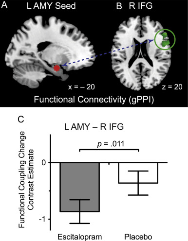
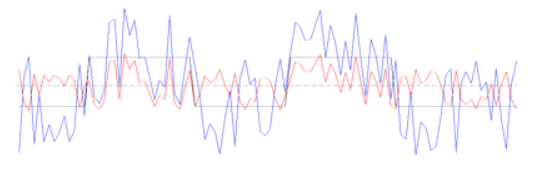
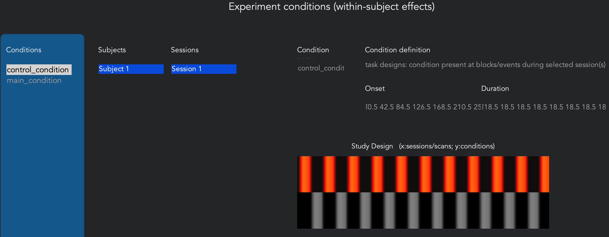
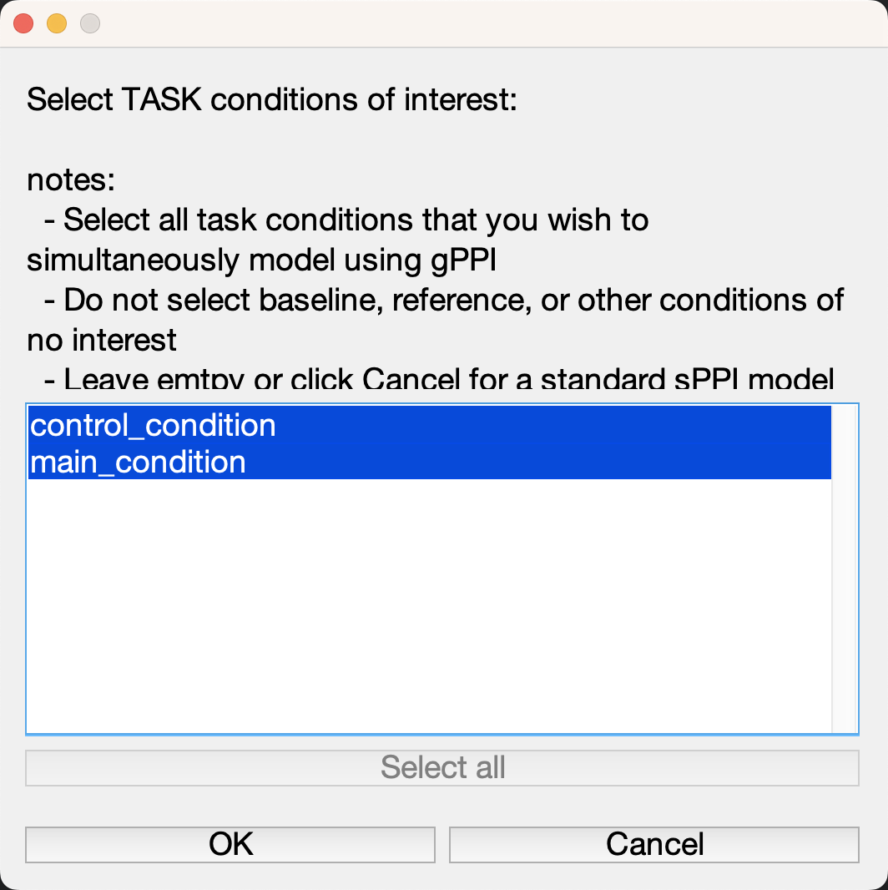
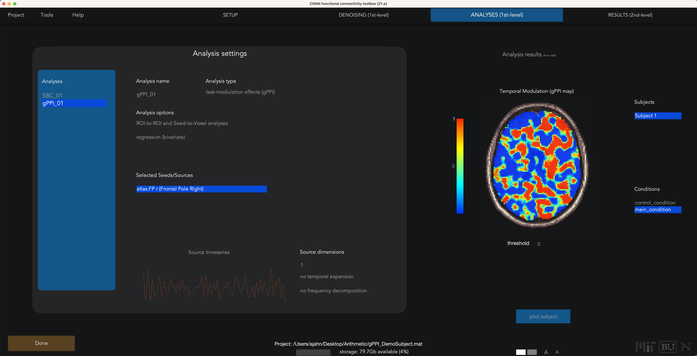
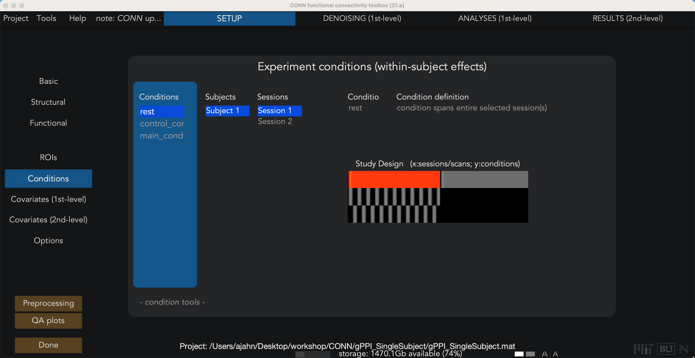
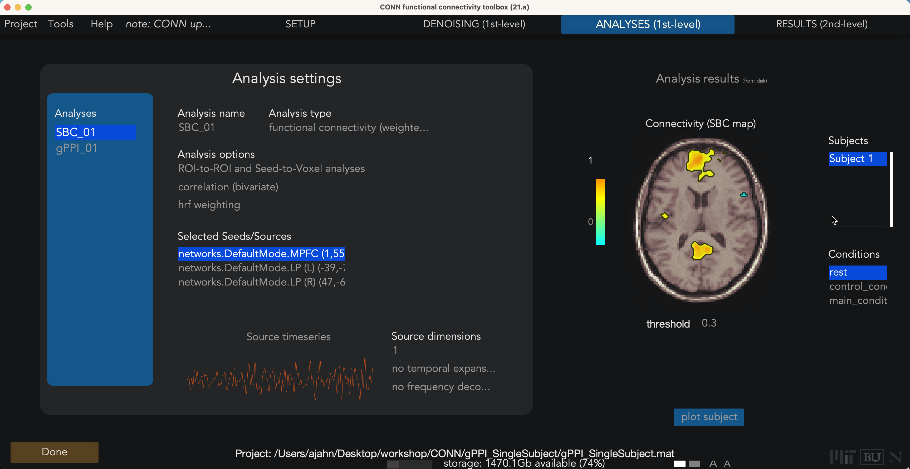

.. _CONN_11_Tarea_gPPI:

===============================================
Capítulo n.° 11: Conectividad relacionada con tareas y gPPI
===============================================

------------------

Descripción general
********

Hasta ahora, hemos analizado datos en **estado de reposo**, en los que el sujeto no hace nada más que permanecer quieto y despierto. Sin embargo, también es común que los estudios recopilen datos relacionados con tareas, en las que el sujeto realiza algún tipo de actividad, como la tarea de flanqueo.`, por ejemplo. En este capítulo, veremos cómo analizar datos relacionados con tareas mediante una técnica llamada **Interacciones Psicofisiológicas (PPI)**, que revela si la conectividad funcional entre dos nodos depende de la tarea que esté realizando el sujeto.

  Ejemplo de análisis de PPI, tomado de Outhred et al. (2015). La conectividad funcional entre la región de la semilla de la amígdala izquierda y el IFG derecho varía según la condición del sujeto.

IBP tradicionales
^^^^^^^^^^^^^^^^

Originalmente, una interacción psicofisiológica consistía en modelar tres términos (Friston, 1997):

1. Un regresor de tarea que indica cuál de las dos tareas estaba realizando actualmente el sujeto;

2. Un regresor de series temporales extraído de una región semilla; y

3. Un término de interacción, que consiste en el producto del regresor de la tarea multiplicado por el regresor de la serie temporal.

Se evaluó la significancia del término de interacción. En otras palabras, un vóxel significativo mostraría diferencias en la conectividad funcional en función de la tarea. La figura a continuación muestra cómo se construyen estos regresores:

.. figure:: 11_PPI_Ilustración.png

  Ilustración de los regresores PPI. El panel superior muestra un regresor binario compuesto por 1 y -1, que indica si el sujeto se encuentra en una de dos condiciones. El panel central muestra una serie temporal extraída de una región semilla. El panel inferior muestra el regresor de interacción, creado mediante la multiplicación de los regresores anteriores. Observe cómo los -1, al multiplicarse por la serie temporal semilla, invierten el signo de la serie temporal: si la serie temporal es descendente, en el regresor de interacción será ascendente.

  El regresor de interacción se compara con la serie temporal de cada vóxel del cerebro. Si existe una buena correspondencia entre ambos, la significancia del ajuste es mayor. Ambas cifras proceden del sitio web de FSL.
    `__.

IBP generalizados
^^^^^^^^^^^^^^^^

Una versión más reciente del PPI se conoce como **PPI generalizado (gPPI)** (McLaren et al., 2012). Este método crea un término PPI para cada condición del estudio, además del regresor de la serie temporal inicial y regresores individuales para cada condición. Si el estudio tiene N condiciones, el análisis gPPI contendrá 2N+1 regresores.

A modo de ejemplo, digamos que tenemos tres condiciones en nuestro experimento: A, B y C. El análisis gPPI constaría de los siguientes regresores:

1. Regresor para A
2. Regresor para B
3. Regresor para C
4. Regresor de series temporales para la región semilla
5. IPP para A
6. IPP para B
7. IPP para C

Incluso si una de estas condiciones no es de interés, modelar todo el espacio experimental será más preciso que restringir el PPI a solo un par de regresores.

Configuración de un gPPI en la caja de herramientas CONN
*************************************

Hasta ahora, hemos usado la caja de herramientas CONN para modelar una condición: el estado de reposo, que es simplemente la serie temporal en cada una de nuestras ROI seleccionadas en la pestaña Configuración. Ahora cargaremos un escaneo separado, recopilado mientras el sujeto realizaba una tarea, y que tiene dos condiciones: la tarea principal, en la que el sujeto resolvía un problema aritmético, y una tarea de control, en la que el sujeto no hacía nada. Los tiempos de inicio de cada una de estas condiciones se pueden encontrar en los archivos "events.tsv" de la página web de openneuro para el conjunto de datos Aritméticos.

::

  sujetos = [01 02 03 04 05 06];

  para sujeto=sujetos

    sujeto=num2str(sujeto, '%02d');
    movefile(['~/Descargas/sub-' num2str(asunto) '_func_sub-' num2str(asunto) '_task-arithm_run-01_bold.nii.gz'], ['sub-' num2str(asunto) '/func'])
    movefile(['~/Descargas/sub-' num2str(asunto) '_func_sub-' num2str(asunto) '_task-arithm_run-02_bold.nii.gz'], ['sub-' num2str(asunto) '/func'])
    movefile(['~/Descargas/sub-' num2str(asunto) '_func_sub-' num2str(asunto) '_task-arithm_run-01_events.tsv'], ['sub-' num2str(asunto) '/func'])
    movefile(['~/Descargas/sub-' num2str(asunto) '_func_sub-' num2str(asunto) '_task-arithm_run-02_events.tsv'], ['sub-' num2str(asunto) '/func'])

  fin

.. nota::

  Para revisar los tiempos de inicio y cómo se utilizan para construir un modelo lineal general, consulte :ref:`este módulo
     `.
  
Primero demostraremos esto con un solo sujeto y luego con un análisis grupal. Regrese a la pestaña Configuración y haga clic en "Básico". Establezca el número de sujetos en "1" y la herramienta CONN le preguntará qué sujetos desea eliminar. Mantenga presionada la tecla Mayús y haga clic para seleccionar los sujetos del 2 al 6, de modo que solo quede el sujeto 1. Haga clic en el botón "Funcional" y seleccione el archivo ``sub-01_func_sub-01_task-arithm_run-01_bold.nii.gz``. Esto reemplazará el análisis en estado de reposo con un análisis relacionado con la tarea.

Then, click on the "Conditions" tab. Clicking on the ``New`` sign when you hover over the Conditions column will allow you to specify a new regressor. In the "Condition name" field, type ``control_condition``, and click on the dropdown menu below "Condition definition" to select "task designs: condition present at blocks/events during selected session(s)". This will generate two new fields, "Onset" and "Duration", which you can use to specify when the condition happened, and for how long. Looking at the .tsv file, we see that the onsets were 21.5, 63.5, 105.5, and so on, while the durations were 18.5 for each event. Type the onsets and the durations for each occurrence of the control condition, and then press enter. You can then do the same for the other condition, which we will call ``main_condition``.

Doing this once can be a useful exercise, but you most likely will not want to do this for large numbers of subjects. A better alternative is to load the .tsv files through the CONN GUI automatically, which will fill in all of the fields for you. Highlight the conditions you just created and click the ``x`` sign to remove them, and then click on the ``- condition tools:`` dropdown menu and select ``import condition info from text file(s)``. Since this data is in `BIDS format 
      `__, we can select the option ``BIDS-compatible``. (You can select either option for the single subject; when you have more sessions and more subjects, you will want to select the option "one *_events.tsv file in each subject/session folder.) When the onset files are loaded, you will see the following figure in the Study Design window:

  The study design window. Bars indicate the onset and duration of each trial, with separate conditions on each row. Highlighted bars reflect the condition and session that is currently selected in the left-hand menus.
  
When you are finished importing the timing files, click ``OK``. Just as with the functional connectivity analysis, you will need to then run preprocessing, Setup, and Denoising, using similar QA checks.

Viewing the Results
*******************

After you’ve done preprocessing, Setup, and Denoising, you will have access to the 1st-level tab. The procedure is similar to what we did with the correlation analysis, but we will make the following changes: 

1) Click on the ``new`` button at the bottom of the Analyses panel on the left, and change the analysis type to gPPI (task-based generalized psychophysiological interactions), which will prompt you to select all of your task conditions of interest. Remember that we want to model the entire experimental space; in this case, we will select both and click OK. When it prompts you to "Save these changes to the CONN project?", select ``Now``.

2) The other change is to switch the analysis options from correlation to regression (bivariate). Notice that once you run the 1st-level analysis, the values in the preview window are not correlation coefficients anymore; they are beta weights for the interaction term. For example, if we have the right Frontal Pole region highlighted and we switch to main_condition, the map shows which voxels are significantly more correlated with the right frontal pole during the main_condition.

.. note::

  Before going on, think about this: With the functional connectivity analyses, one of our QA checks was whether the currently highlighted seed region was most significantly correlated with itself, which made sense. Here, if we set the threshold to only show the highest beta weights, there doesn’t seem to be much of anything in that seed region. Given what you just learned about gPPI, why do you think that is?

For the next step, click on the Done button. This will run a gPPI using all of the seed regions that are in the lefthand menu. If you have an hypothesis about one or two regions, you would only select those, and remove everything else. In this case, let’s just leave in the left and right frontal pole, and then click Done. This will take about a minute to run.

The second-level tab will be the same as what we saw in the video about viewing results. This study wasn’t designed for a gPPI analysis, and PPI effects are notoriously difficult to find in any case; so it isn’t surprising that we don’t see anything here. Nevertheless, if you did find an effect, you would need to follow the same steps of correcting for type 1 errors.

Generalized Functional Connectivity
***********************************

Including task regressors also creates the possibility of doing **Generalized Functional Connectivity**, a method of generating resting-state functional connectivity maps from task-based datasets. This method, developed by `Elliott et al. (2019) 
      `__, regresses out any effects of task and other nuisance covariates (for example, the usual ones of motion and physiological regressors), and creates functional connectivity maps of the remaining variance. According to Elliott et al., connectivity maps generated this way can lead to test-retest reliability that is comparable to functional data that was collected solely for resting-state, without any task conditions.

Furthermore, this method can theoretically increase your power by allowing you to combine both resting-state runs and data from task-based runs. Taking one resting-state and one task-based dataset from our current example, you should first preprocess them both separately (using the "Session" selector in the Preprocessing window if needed). After preprocessing, click on the ``Conditions`` button, and load any task regressors for the task-based run. Both runs should contain a regressor called "rest", as seen below:

Realice la eliminación de ruido como de costumbre y luego, cuando llegue a la pestaña de primer nivel y analice los ROI que le interesan, debería ver algo como esto, que parece ser un promedio del regresor "rest" en ambas sesiones:

El único problema que puede surgir es si los TR para los datos en estado de reposo y basados en tareas son diferentes; en ese caso, consulte este hilo
       `__ para encontrar posibles formas de abordar ese problema.

Próximos pasos
*********

En este tutorial, explicamos brevemente cómo automatizar la carga de datos de inicio puede ahorrarle tiempo. En el siguiente y último tutorial, aprenderemos a automatizar todo nuestro análisis mediante scripts. Para saber cómo hacerlo, haga clic en el botón "Siguiente".

Video
*****

Puede encontrar una descripción general en video sobre cómo realizar gPPI, incluidos los tiempos de inicio de carga, aquí
        
         `__.
        
       
      
     
    
   

