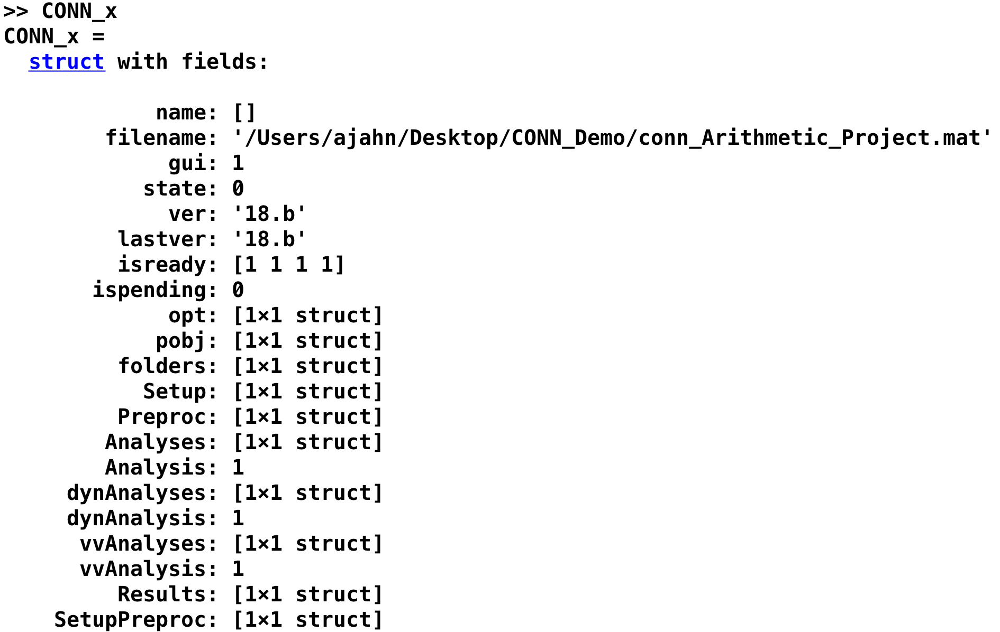
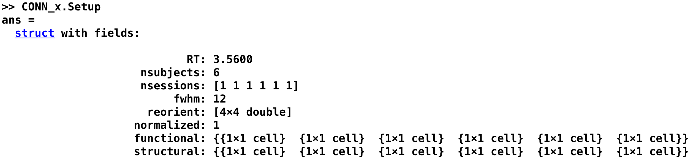

.. _CONN_12_Scripting:

======================
Capítulo 12: Scripting
======================

------------------

.. nota::

  El Centro de Investigación del Dolor Crónico y la Fatiga proporcionó un script de plantilla para este tutorial.`__ de la Universidad de Michigan. En particular, gracias a Chelsea Kaplan y Tony Larkin.

Descripción general
********

Después de preprocesar y configurar un modelo para una sola ejecución con un solo sujeto, deberá realizar los mismos pasos para todas las ejecuciones de todos los sujetos de su conjunto de datos. Esto puede parecer tedioso, pero es factible: solo tenemos veintiséis sujetos y dos ejecuciones por sujeto. Quizás piense que puede completarse en aproximadamente una semana; y siempre puede asignar la tarea a un par de asistentes de investigación.

Esta actitud es admirable, y si adoptas este enfoque, eventualmente podrás analizar todos los datos. Pero en algún momento te encontrarás con dos problemas:

1. Descubrirá que analizar manualmente cada ejecución no solo es tedioso sino también propenso a errores, y la probabilidad de cometer un error aumenta significativamente a medida que aumenta el número de ejecuciones a analizar también; y

2. Para conjuntos de datos más grandes (por ejemplo, ochenta sujetos con cinco ejecuciones cada uno), este enfoque rápidamente se vuelve impráctico.

Una alternativa es **guionizar** tu análisis. Así como un actor tiene un guion que le dice qué decir, dónde pararse y dónde moverse, tú también puedes escribir un guion que le indique a tu computadora cómo analizar tus conjuntos de datos. Esto tiene la doble ventaja de automatizar tus análisis y permitir analizar conjuntos de datos de cualquier tamaño: el código para analizar dos o doscientos sujetos es prácticamente idéntico.

Scripting en la caja de herramientas CONN
*****************************

Estructuras, campos y variables
^^^^^^^^^^^^^^^^^^^^^^^^^^^^^^^^^

La caja de herramientas CONN incluye un comando llamado ``conn_batch``, que toma una **estructura** como argumento. Una estructura es un tipo de dato de Matlab que organiza varias variables en contenedores llamados **campos**. Los campos de estructura que espera el comando ``conn_batch`` son los siguientes (tomados de la ayuda de conn_batch, que también se puede encontrar en la página de scripts de ``CONN``).
    `__):

::

   nombre de archivo: archivo de proyecto conn_*.mat (predeterminado: proyecto abierto actualmente)
   sujetos: subconjunto de sujetos para ejecutar pasos de procesamiento o definir parámetros (predeterminado: todos los sujetos)
   paralelo: Opciones de paralelización (predeterminado: procesamiento local/sin paralelización)
   Configuración: Información/procesos relacionados con la configuración y el preprocesamiento del experimento
   Eliminación de ruido: información/procesos relacionados con el paso de eliminación de ruido
   Análisis: Información/procesos relativos a los análisis de primer nivel
   Resultados: Información/procesos relativos a análisis/resultados de segundo nivel
   QA: Información/procesos relacionados con las parcelas de garantía de calidad
   
En otras palabras, la variable que pasaremos como argumento al comando ``conn_batch`` (variable que llamaremos **batch** de ahora en adelante) requiere los campos mencionados anteriormente. Si recuerdan de los capítulos anteriores, la interfaz gráfica de usuario de CONN tenía pestañas denominadas Configuración, Eliminación de ruido, Análisis y Resultados. Estos campos también contienen subcampos que especifican los valores introducidos en la interfaz gráfica de usuario. Por ejemplo, el campo:

::

  lote.Configuración.RT=3.56
  
especifica que el RT para este experimento es de 3,56 segundos.

La estructura CONN_x
^^^^^^^^^^^^^^^^^^^^

Los demás campos y subcampos se pueden encontrar en la página de scripts de CONN, junto con explicaciones sobre el significado de cada valor y opción. Sin embargo, la forma más sencilla de crear y modificar una estructura es generándola a través de la interfaz gráfica de usuario.

De hecho, ya has creado dicha estructura, aunque no lo supieras. Cada vez que guardas tu proyecto, se crea un archivo .mat. Este archivo .mat se puede **cargar** en la terminal de Matlab con el comando ``load``. Por ejemplo, si has seguido los tutoriales hasta este punto, habrás creado un archivo .mat llamado ``conn_Arithmetic_Project.mat``. Puedes cargarlo escribiendo:

::

  cargar conn_Arithmetic_Project.mat
  
Esto devuelve una estructura en su espacio de trabajo llamada ``CONN_x``. Al escribir ``CONN_x``, verá el siguiente texto:

Cada uno de estos campos contiene los valores introducidos en cada pestaña. Por ejemplo, podemos mostrar los valores introducidos en la pestaña "Configuración" escribiendo "CONN_x.Setup", lo que devuelve varios campos (solo se muestran los primeros en la figura a continuación):

Observe la correspondencia entre los valores introducidos en estos campos y los valores que se introducen al cargar el archivo ``conn_Arithmetic_Project.mat``. Si lo desea, puede editar los valores dentro de la estructura CONN_x desde la terminal de Matlab, guardarlos como un archivo .mat y luego cargarlos en la caja de herramientas CONN. Las modificaciones realizadas en la terminal de Matlab deberían reflejarse en la interfaz gráfica de usuario.

Pruebe esto escribiendo la siguiente línea de código en la terminal de Matlab:

::

  CONN_x.Setup.RT = 1
  
Esto reemplaza el valor original de 3,56 con un valor de 1. Luego podemos guardar la estructura CONN_x actualizada en nuestro archivo .mat escribiendo:

::

  guardar('conn_Arithmetic_Sample.mat', 'CONN_x')
  
Esto utiliza el comando ``save`` de Matlab, que requiere dos argumentos: el archivo .mat que se va a escribir y los valores o estructuras que se guardarán en él. En este caso, guardamos la estructura CONN_x en el archivo .mat. Si ahora la carga desde la interfaz gráfica de CONN (haciendo clic en ``Proyecto -> Abrir`` y seleccionando el archivo), la pestaña Información básica debería actualizarse con el nuevo Tiempo de Repetición especificado en la terminal de Matlab.

La estructura CONN_x también especifica las opciones del menú. Por ejemplo, la sección Batch.Setup de la página de ayuda de CONN indica lo siguiente sobre el campo «acquisitiontype»:

::

  acquisitiontype : 1/0: Adquisición continua de volúmenes funcionales [1]
  
Esta es una variable binaria, donde 1 indica una adquisición continua de volúmenes funcionales (que es el valor predeterminado, como se indica entre corchetes). Si la establecemos en 0, se utilizará la otra opción disponible: el muestreo disperso. Como ejercicio, establezca el campo ``CONN_x.Setup.acquisitiontype`` en 0, guarde la estructura CONN_x en el archivo .mat y vuelva a cargarlo. ¿Qué ha cambiado?

Creación de la variable de lote conn
********************************

Tras ver cómo CONN crea una estructura de Matlab desde la interfaz gráfica de usuario, crearemos nuestra propia estructura usando código de Matlab. La estructura se llamará **batch** y contendrá campos que indican qué archivos cargar y qué opciones ejecutar.

.. nota::

  El siguiente código está adaptado del archivo ``conn_batch_workshop_nyudataset.m``, que puedes descargar desde el sitio web `NITRC` de Alfonso Nieto-Castañón.
     `__. El sitio web de CONN también contiene ejemplos de cómo modificar su script por lotes. El sitio web enumera cada uno de los campos que se pueden ingresar en la estructura del lote y sus valores predeterminados. Si no escribe alguno de los campos en su script, se establecerá con el valor predeterminado que aparece en la página web.
  Por ejemplo, el campo Analysis.type indica: ``tipo de análisis, 1 = 'ROI a ROI', 2 = 'Semilla a vóxel', 3 = 'todos'; [3]``. Si no lo incluimos en nuestro script, el campo se establecerá automáticamente en 3, lo que significa que se ejecutarán análisis ROI a ROI y Semilla a vóxel.

Cargando los archivos
^^^^^^^^^^^^^^^^^

El primer bloque de código del script cargará los archivos anatómicos y funcionales. Utiliza una **búsqueda recursiva** para buscar en cada directorio inferior al actual los archivos que coincidan con el especificado. Esto se realiza mediante el comando **conn_dir**, que toma una cadena como argumento; si desea cargar varios sujetos, puede usar una expresión regular como un asterisco (consulte la sección "comodines" de este tutorial).
      ` para más detalles).

Independientemente del método que elija, asegúrese de que la variable ``NSUBJECTS`` coincida con el número total de sujetos que se seleccionarán. Por ejemplo, si hay seis sujetos en el directorio actual y utiliza un comodín para seleccionar los datos en estado de reposo, establecería ``NSUBJECTS`` en 6:

::

  NSUJETOS=6;
  cwd=pwd;
  ARCHIVO_FUNCIONAL=cellstr(conn_dir('sub-*_func_sub-*_task-rest_bold.nii.gz'));
  ARCHIVO_ESTRUCTURAL=cellstr(conn_dir('sub-*_anat_sub-*_T1w.nii'));
  si rem(length(FUNCTIONAL_FILE),NSUBJECTS),error('número de archivos funcionales no coincidente %n', length(FUNCTIONAL_FILE));fin
  si rem(length(ARCHIVO_ESTRUCTURAL),NSUBJECTS),error('número de archivos anatómicos no coincidentes %n', length(ARCHIVO_FUNCIONAL));fin
  nsessions=longitud(ARCHIVO_FUNCIONAL)/NSUBJECTS;
  ARCHIVO_FUNCIONAL=reshape(ARCHIVO_FUNCIONAL,[NSUJECTS,nsesiones]);
  ARCHIVO_ESTRUCTURAL={ARCHIVO_ESTRUCTURAL{1:NSUJECTS}};
  disp([num2str(size(FUNCTIONAL_FILE,1)),' subjects']);
  disp([num2str(size(FUNCTIONAL_FILE,2)),' sessions']);
  TR=3.56; % Repetition time
  
Executing this block of code will return both the number of subjects and the number of sessions per subject, and the wildcard ``*`` will return any files that contain the string ``sub-``, ``_func_sub-``, and ``task-rest_bold.nii.gz``, in that order. For your own experiment, remember to change this filter so that it is specific to how your data is labeled. Remember to change the TR as well, if needed.

The Setup Field
^^^^^^^^^^^^^^^

Each field after the ``batch`` structure will be one of the tabs listed in the CONN GUI: Setup, Denoising, and Analysis.

The first block of code will populate the ``Setup`` field of the ``batch`` structure. If the files above were correctly loaded, this block of code should be usable for any experiment. You may want to change the batch name to something more descriptive of your study, and change the processing pipeline and slice order if needed.

::

  %% CONN-SPECIFIC SECTION: RUNS PREPROCESSING/SETUP/DENOISING/ANALYSIS STEPS
  %% Prepares batch structure
  clear batch;
  batch.filename=fullfile(cwd,'Arithmetic_Scripted.mat');            % New conn_*.mat experiment name

  %% SETUP & PREPROCESSING step (using default values for most parameters, see help conn_batch to define non-default values)
  % CONN Setup                                            % Default options (uses all ROIs in conn/rois/ directory); see conn_batch for additional options 
  % CONN Setup.preprocessing                               (realignment/coregistration/segmentation/normalization/smoothing)
  batch.Setup.isnew=1;
  batch.Setup.nsubjects=NSUBJECTS;
  batch.Setup.RT=TR;                                        % TR (seconds)
  batch.Setup.functionals=repmat({{}},[NSUBJECTS,1]);       % Point to functional volumes for each subject/session
  for nsub=1:NSUBJECTS,for nses=1:nsessions,batch.Setup.functionals{nsub}{nses}{1}=FUNCTIONAL_FILE{nsub,nses}; end; end %note: each subject's data is defined by three sessions and one single (4d) file per session
  batch.Setup.structurals=STRUCTURAL_FILE;                  % Point to anatomical volumes for each subject
  nconditions=nsessions;                                  % treats each session as a different condition (comment the following three lines and lines 84-86 below if you do not wish to analyze between-session differences)
  if nconditions==1
      batch.Setup.conditions.names={'rest'};
      for ncond=1,for nsub=1:NSUBJECTS,for nses=1:nsessions,              batch.Setup.conditions.onsets{ncond}{nsub}{nses}=0; batch.Setup.conditions.durations{ncond}{nsub}{nses}=inf;end;end;end     % rest condition (all sessions)
  else
      batch.Setup.conditions.names=[{'rest'}, arrayfun(@(n)sprintf('Session%d',n),1:nconditions,'uni',0)];
      for ncond=1,for nsub=1:NSUBJECTS,for nses=1:nsessions,              batch.Setup.conditions.onsets{ncond}{nsub}{nses}=0; batch.Setup.conditions.durations{ncond}{nsub}{nses}=inf;end;end;end     % rest condition (all sessions)
      for ncond=1:nconditions,for nsub=1:NSUBJECTS,for nses=1:nsessions,  batch.Setup.conditions.onsets{1+ncond}{nsub}{nses}=[];batch.Setup.conditions.durations{1+ncond}{nsub}{nses}=[]; end;end;end
      for ncond=1:nconditions,for nsub=1:NSUBJECTS,for nses=ncond,        batch.Setup.conditions.onsets{1+ncond}{nsub}{nses}=0; batch.Setup.conditions.durations{1+ncond}{nsub}{nses}=inf;end;end;end % session-specific conditions
  end
  batch.Setup.preprocessing.steps='default_mni';
  batch.Setup.preprocessing.sliceorder='interleaved (Siemens)';
  batch.Setup.done=1;
  batch.Setup.overwrite='Yes';
  
  
If you want, you can also load your custom atlas, discussed more in :ref:`Appendix C 
       `. For example, if I have a folder called ``ROIs`` which contains the atlas ``AndyROIs.nii`` and the header text file ``AndyROIs.txt``, I could add the following code:

::

  batch.Setup.rois.files{1}='ROIs/AndyROIs.nii';
  batch.Setup.rois.multiplelabels = 1;
  
The ``multiplelabels`` field, set to ``1``, indicates that there is a text file in the folder where the ROIs are located. This file provides a label for each ROI in the atlas. Note that this will overwrite the default of files ``atlas.nii`` and ``networks.nii``; if you want to include them in addition to your custom ROIs, you will need to add them in the script; e.g.,

::

  batch.Setup.rois.files{2}='~/conn/rois/atlas.nii';
  batch.Setup.rois.files{3}='~/conn/rois/networks.nii';
  
  
The Denoising Field
^^^^^^^^^^^^^^^^^^^

This block of code controls all of the options that are specified in the Denoising tab of the GUI. Here, the code demonstrates how to change the filter to a customized range, such as 0.01 to 0.1 The other parameters, ``done`` and ``overwrite``, will execute the code (``done=1`` means run the Denoising step) and overwrite any previous results (``overwrite='Yes'``). You can set ``overwrite`` to "No" if you want the program to throw an error before it overwrites any previous data.

::

  %% DENOISING step
  % CONN Denoising                                    % Default options (uses White Matter+CSF+realignment+scrubbing+conditions as confound regressors); see conn_batch for additional options 
  batch.Denoising.filter=[0.01, 0.1];                 % frequency filter (band-pass values, in Hz)
  batch.Denoising.done=1;
  batch.Denoising.overwrite='Yes';

The Analysis Field
^^^^^^^^^^^^^^^^^^

Similar to the Denoising block of code above, this section will run both the 1st and 2nd-level analyses. If you want to run only one of the analysis types, such as ROI-to-ROI, you can set it with a new field ``Analysis.type``. See the CONN batch webpage for more details.

::

  %% FIRST-LEVEL ANALYSIS step
  % CONN Analysis                                     % Default options (uses all ROIs in conn/rois/ as connectivity sources); see conn_batch for additional options 
  batch.Analysis.done=1;
  batch.Analysis.overwrite='Yes';

Running the Batch
*****************

Puede ejecutar el lote desde la Terminal usando el comando ``conn_batch``:

::

  conn_batch(lote);
  
Se ejecutarán todos los pasos especificados anteriormente. Las siguientes tres líneas abrirán la interfaz gráfica de usuario CONN y cargarán automáticamente los resultados de segundo nivel. Si todo se ejecutó sin errores, debería ver los mismos resultados generados con el método de apuntar y hacer clic de la interfaz gráfica:

::

  conexión
  conn('cargar',archivocompleto(cwd,'Arithmetic_Scripted.mat'));
  resultados de la interfaz gráfica de conexión
  
  
Ceremonias
*********

1. Dentro del campo ``CONN_x.Preproc``, establezca el subcampo ``despiking`` en 1. Antes de hacerlo, compruebe si puede encontrar en qué parte de la interfaz gráfica se aplicará este cambio. Guarde la estructura en un nuevo archivo .mat, cárguelo y observe si el cambio se produce donde cree que debería.

2. Usando el script ``conn_batch_Template.m``, cambie el valor de ``NSUBJECTS`` a 1. ¿Qué ocurre si intenta ejecutar el script? ¿Por qué? ¿Cómo lo solucionaría? (Sugerencia: Tendría que mover todos los sujetos menos uno a una carpeta que no sea detectada por el comando ``conn_dir``, ejecutado desde el directorio actual).

3. Edite el campo ``batch.Setup.preprocessing.steps``, reemplazando "default_mni" con una matriz de celdas que realice los siguientes pasos: functional_label, functional_realign, functional_center, functional_slicetime, functional_segment&normalize_direct, structurel_center, structurel_segment&normalize, functional_label. Consulte la página web de `CONN batch`.
        
         `__ para obtener detalles sobre cómo etiquetar cada paso. Vídeo ***** Para ver una demostración en vídeo de la creación de scripts, haga clic `aquí
         
          `__. ¡Felicitaciones! **************** Ahora tiene todo lo necesario para crear un análisis en CONN, sin importar el tamaño del conjunto de datos. Los siguientes capítulos son un conjunto de apéndices que cubren otras situaciones que puede encontrar en las herramientas de CONN, como la teoría de grafos, los diseños pre-post y cómo crear sus propios ROI personalizados.
         
        
       
      
     
    
   

