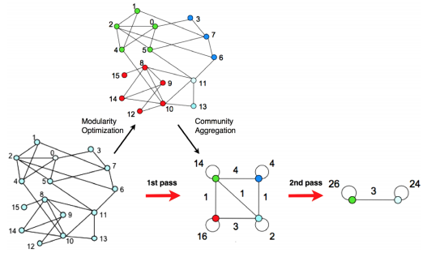
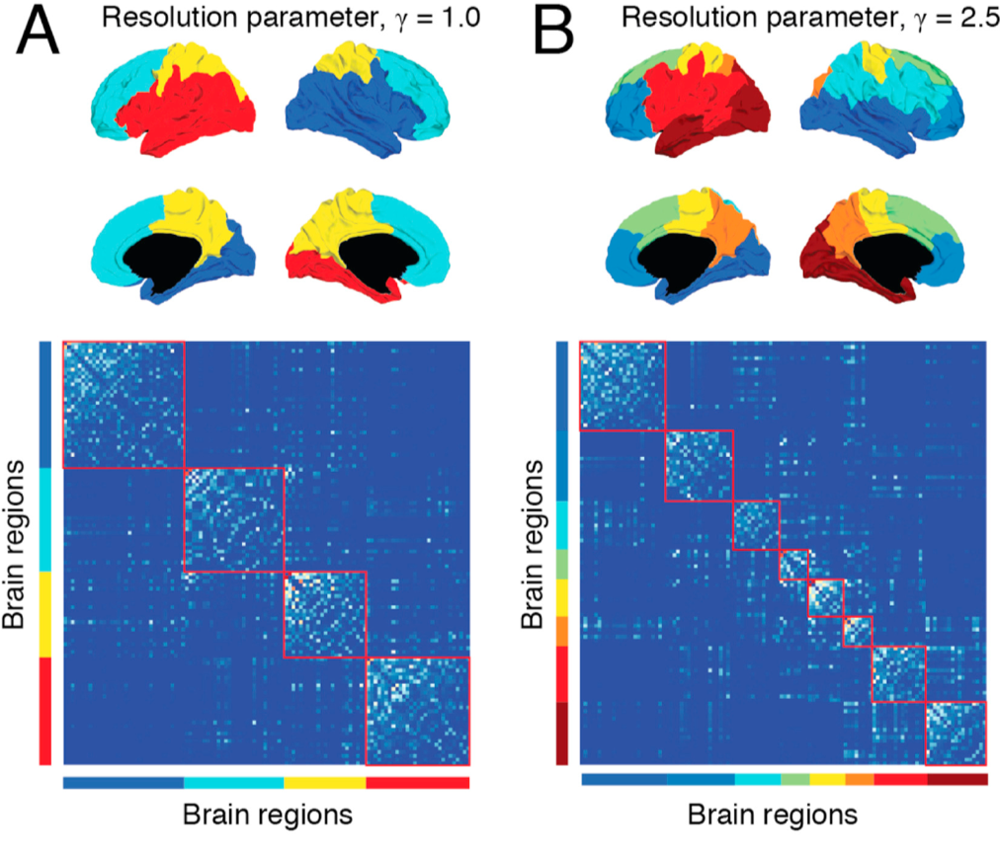
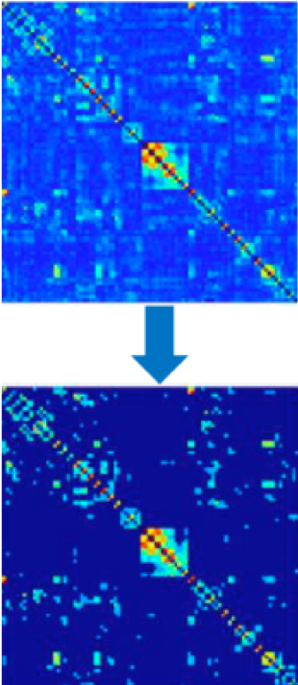

.. _CONN_Apéndice A_Teoría de grafos:

========================
Apéndice A: Teoría de grafos
========================

------------------

Descripción general
********

Este capítulo ofrece una breve descripción general de la **teoría de grafos**, un método para describir las relaciones por pares entre dos o más objetos. En matemáticas, la teoría de grafos puede modelar cualquier par de objetos: neuronas, personas, ciudades, etc. Para nuestros propósitos, nos centraremos en la teoría de grafos aplicada a datos de neuroimagen, en particular a datos en estado de reposo. En este caso, los **vóxeles** individuales o grupos de vóxeles son los pares de objetos que nos interesa modelar. La teoría de grafos puede ofrecer una perspectiva diferente sobre cómo se conectan estos vóxeles y, a su vez, nos informa sobre la organización cerebral.

Fundamentos de la teoría de grafos
*******************

Nodos y aristas
^^^^^^^^^^^^^^^

Tomemos como ejemplo un conjunto de ferrocarriles. Un tren puede ir directamente de una ciudad a otra, como de Kalamazoo a Port Huron, Michigan. Sin embargo, no puede ir *directamente* de Kalamazoo a Port Huron; primero debe pasar por Battle Creek. En cambio, alguien que tome un tren desde Battle Creek puede ir a Port Huron, Detroit o Kalamazoo, sin tener que parar en ninguna otra ciudad. También se puede viajar directamente de Port Huron a Detroit y viceversa, e ir de cualquiera de esas ciudades a Battle Creek.

.. figure:: ApéndiceA_EjemploDeTren.png

En lugar de ver estas paradas de tren en un mapa, asignemos un número a cada una. De esta forma, podemos comparar estas redes, independientemente de si son paradas de tren o conexiones neuronales. Por ejemplo, asignemos lo siguiente:

::

  Battle Creek = 0
  Detroit = 1
  Puerto Hurón = 2
  Kalamazoo = 3
  
Podemos comprimir el mapa de trenes en una figura más compacta utilizando los números como indicadores para cada ciudad:

.. figure:: ApéndiceA_GraphTheoryDemo.png

En esta figura, representamos cada ciudad como un **nodo** (también llamado **vértice**). Cada nodo tiene conexiones con diferentes nodos; en teoría de grafos, estas conexiones se denominan **aristas**. En el lado derecho de la figura, podemos representar la misma red de otra manera, como una **matriz de adyacencia**. Las conexiones entre nodos se marcan con un 1, mientras que los nodos que no están conectados se marcan con un 0. Por ejemplo, Kalamazoo (3) está directamente conectado con Battle Creek (0), pero no con Detroit (1) ni con Port Huron (2). El hecho de que Battle Creek tenga tantas conexiones directas dentro de esta red lo convierte en un **centro**, o nodo con más aristas que el promedio. Volveremos a este concepto más adelante.

.. nota::

  Las matrices de adyacencia son **simétricas**, lo que significa que la diagonal superior (es decir, todos los números por encima de la diagonal de ceros que biseca el grafo) son redundantes con la diagonal inferior (es decir, todos los números por debajo de la diagonal del grafo). Esto solo es cierto para grafos no dirigidos, pero en este tutorial asumiremos que se cumple la simetría.
  
En resumen, esta **red** se representa como un conjunto de nodos conectados por aristas. Algunas conexiones son directas, por ejemplo, entre Detroit y Port Huron, mientras que otras son indirectas, como la conexión entre Port Huron y Kalamazoo. Las redes más complejas tendrán diferentes niveles de conectividad según la distancia entre cada nodo y los demás, pero todas las redes en la teoría de grafos se basan en estos componentes.

Modularidad
^^^^^^^^^^

Si nos alejamos de Michigan y observamos el sistema ferroviario de todo Estados Unidos, notaremos algo más: ciertas regiones del país tienen una alta densidad de conexiones ferroviarias de alto tráfico dentro de sí mismas (como Boston, New Haven y la ciudad de Nueva York en la costa este), pero solo unas pocas conexiones con menor tráfico para viajar a otras ciudades en otras regiones del país (como Seattle, Houston y San Diego).

.. figure:: ApéndiceA_TrainNetworkUSA.png

Esta agrupación de nodos y aristas en compartimentos discretos se conoce como **modularidad**. Técnicamente, se trata de un umbral que se establece para determinar cuándo la densidad de conexiones intramodulares (como la red ferroviaria de la Costa Este) es mayor que la de las conexiones intermodulares (como las conexiones entre Nueva York y Los Ángeles). Existen muchos algoritmos para crear este umbral, pero la idea general es la misma. La idea básica de la modularidad se resume en: ¿cuándo la densidad de conexiones intramodulares es mayor que la de las conexiones intermodulares?

El algoritmo más simple es maximizar el valor de lo que se llama el **índice de modularidad**, representado por la letra **Q**:

.. figure:: ApéndiceA_ModularidadÍndice.png

  El índice de modularidad, tal como lo define Newman (2005)`__.
  
El número total de aristas en la red se representa mediante **m**, y la fracción **1/4m** es un parámetro de normalización que parece funcionar bien en la mayoría de los estudios. **s** es un vector columna que, para dos grupos, contiene un 1 (si el nodo pertenece al grupo A) o un -1 (si el nodo pertenece al grupo B). El último término, **B**, es lo que se denomina una **matriz de modularidad**; esta matriz contiene el **grado** (es decir, el número de aristas) entre dos nodos si se colocaran aleatoriamente. (Para más detalles sobre las matemáticas que sustentan cada uno de estos términos, véase el artículo de Newman (2005)).
    `__.) Conceptualmente, la ecuación representa el número de aristas que caen dentro de un grupo, en comparación con el número esperado de aristas que se colocan al azar dentro de una red de tamaño similar.

.. nota::

  Una explicación diferente de la modularidad se puede encontrar en esta revisión de `Sporns & Betzel, 2016
     `__.

El algoritmo de Lovaina
&&&&&&&&&&&&&&&&&&&&&

Uno de los algoritmos más populares para maximizar este índice es el **Algoritmo de Lovaina** (`Blondel et al., (2008)
      `__). The algorithm first assigns a node to a module at random and calculates the resulting modularity index. If the index increases, then the node joins the new module; if the modularity decreases, then the node remains in its original module.

This procedure, also called **community detection**, organizes the nodes into modules, or communities, on each pass. A number of passes can be specified by the user to make as fine-grained partitions as is wanted.

  An illustration of the Louvain algorithm (figure taken from Blondel et al, 2008). Nodes are assigned to a module based on the density of edges connecting nearby nodes - if the modularity index increases, then the node is assigned to that module. This procedure can proceed through several passes until a desired number of modules is reached.
  
Let's use the brain as an example to illustrate this algorithm. If we calculated all of the correlation coefficients between every voxel in the brain and decided to categorize them into four modules, one possibility is that we would end up dividing the brain into the four lobes (frontal, temporal, occipital, and parietal): regions that are anatomically and functionally distinct from each other. If we decided to do another pass, it is likely that we would end up with a network representation of the two hemispheres of the brain.
  
A related parameter is called **resolution**, which determines how fine-grained the resulting networks are. This is similar conceptually to the idea of multiple passes using the Louvain algorithm, but this method places a limit on how large the resulting modules can be. Using a certain resolution parameter with the brain example above may reproduce the canonical four lobes, while a higher resolution parameter can further divide these lobes into smaller sub-regions.

  Example of tuning the resolution parameter, as shown in `Betzel & Basset (2017) 
       `__. The resolution parameter reflects the topological scale of interest: increasing it leads to finer scaled modules, but at some point it may start to model noise rather than biologically plausible modules. This parameter can't be set using the CONN toolbox, but it can be set in other toolboxes (such as the Brain Connectivity Toolbox).

  
**Thresholding** can also be used to remove edge values below a certain value. For example, a graph analysis of resting-state data may threshold the resulting connectivity maps to only show correlation values above 0.2, and remove everything else. This can increase signal to noise-ratio, and it can either be absolute (in the example just given) or proportional (e.g., keeping 20% strongest connections) - which in CONN is called **fixed network cost**.

  Example of thresholding, taken from Taya et al. (2016).
  
Graph Theory in the CONN Toolbox
********************************

As you saw in a previous chapter on :ref:`viewing the results 
        
         `, one of the options to display the group-analysis is called "Graph Theory". Using the correlation maps as input, either ROIs are used as nodes, and the correlation values between the nodes represent the edges. As with any network dataset, the correlation values can be thresholded to only display those values that are the strongest and most robust. .. figure:: AppendixA_CONN_Graph.png Within the CONN Results window, nodes are depicted as red circles, with the strength of the currently selected graph theory metric represented by the size of the circle. Edges between the nodes are depicted as black lines. Here is a brief summary of what some of the measures mean. A fuller treatment of all of the graph theory metrics can be found on the `CONN website 
         
          `__. 1. **Degree**: Simply the number nodes that the current node is connected to, i.e. its number of edges. 2. **Cost**: Proportion of edges for the current node. 3. **Clustering Coefficient**: Proportion of connected nodes across all neighboring nodes. 4. **Global Efficiency**: Inverse of the average distance matrix. 5. **Average path length**: Average shortest-path distance between the node and all other nodes. Which one you use is up to you. Let's take a look at two of the most popular graph metrics, clusting coefficient and global efficiency, and see how they would apply to our data. Clustering Coefficient &&&&&&&&&&&&&&&&&&&&&& One measurement of local connectivity is a node's **clustering coefficient**, or the proportion of connected nodes across all neighboring nodes. If a node's neighbors are highly connected, then the clustering coefficient is high as well; if there is a low proportion of connections between its neighbors relative to all possible connections among the neighbors, the clustering coefficient is low. To illustrate this, let's represent as a network friendship among individuals. In the figure below, each of the edges represents a friendship between two individuals, represented by nodes. (In this case, friendship is binary: Either you are friends with someone, or you are not.) Jenny is friends with three people in this graph: Amily, Tom, and Dan. There could be three possible friendships among her neighbors: Dan with Amily, Amily with Tom, and Tom with Dan. However, only one of those pairs are friends - Tom and Dan. Since there is only one friendship out of a possible three friendships total, the clustering coefficient for Jenny is 1/3, or 0.33. .. figure:: AppendixA_Friends_ClusteringCoefficient.png Figure from docs.TigerGraph.com Tom, on the other hand, is friends with two people: Jenny and Dan. Consequently, there is only one possible friendship among his neighbors, and they do indeed happen to be friends. Tom's clustering coefficient is therefore 1/1, or 1. Lastly, let's focus on Dan. He is friends with four other people: Jenny, Tom, Kevin, and Nancy. There are six possible friendships among his friends, but only one pair are friends (Tom and Jenny). His clustering coefficient is 1/6, or 0.1667. We can apply this to our current dataset by going to the 2nd-level tab for our group-level analysis, and highlighting ``AllSubjects`` under ``Subject Effects``. Select ``SBC_01 (ROI-to_ROI)`` from the drop-down menu (click on ``SBC_01 (Seed-to-Voxel)`` to show the options), and then click on ``graph-theory results`` in the right window pane. You should see something like this: .. figure:: AppendixA_NetworkTheory_Results.png The defaults will be to use all of the ROIs you selected in the 1st-level tab, and to use a cost threshold of 0.15 to initially threshold the edges between the nodes. The second row of options specify the graph theory metric, and will compute the significance relative to a randomly generated graph with an equal number of nodes. Let's make our graph slightly different by changing the initial threshold from cost to correlation coefficient, and change the analysis measure from Global Efficiency to Clustering Coefficient: .. figure:: AppendixA_NetworkTheory_ClusteringCoefficient.png If we look at individual ROIs, each node's clustering coefficient is located under the ``beta`` column in the results window. For example, if we highlight the ROI ``DefaultMode.LP r``, the clustering coefficient is 0.94, meaning that 94% of this node's neighbors have connections with each other. The beta next to the ``network`` ROI is the average clustering coefficient for all of the ROIs; you can see this yourself by adding up all of the betas for the individual ROIs, and then dividing them by 11. Global Efficiency &&&&&&&&&&&&&&&&& Another popular graph metric is Global Efficiency, technically defined as the inverse of the average distance matrix. If we assume that each edge is binary (i.e., either it passes a given correlation coefficient threshold or it does not), then the distance between two nodes can be measured by the number of edges you need to get from one node to the other. Using our example above with the friend graph, Tom would need to "go through" Dan and Nancy in order to get to Jack; therefore, the distance between them is 3. Turning to our connectivity data, we can change the Analysis measure back to Global Efficiency. In this example, the beta next to the network ROI is the global efficiency for the entire set of nodes; the average inverse of the distance matrix for this entire set of nodes, is 0.63, indicating that it is relatively quick to get from one node to the other in this graph. As with some other graph theory metrics, this is a measurement that needs to be seen in context relative to global efficiencies calculated from other studies. .. figure:: AppendixA_NetworkTheory_GlobalEfficiency.png Global efficiency is calculated for the individual nodes as well; the interpretation of individual global efficiencies is more complicated, but it is explained clearly by Alfonso in `this thread 
          
           `__, que también he reimpreso a continuación: .. nota:: La prueba estadística que compara la eficiencia global de toda la red en los dos grupos de sujetos se informa en la lista superior derecha (en la fila etiquetada como 'red'); además, la eficiencia global de toda la red se puede representar como el promedio de la eficiencia global de cada nodo de la red (la eficiencia global de un nodo en un grafo se define como la distancia promedio inversa de la ruta más corta desde este nodo a todos los demás nodos en el grafo). Entonces sí, además de comparar entre grupos la eficiencia global de la red de 'cerebro completo', también puede comparar entre grupos la eficiencia global de nodos individuales (ROI) dentro de esta red (esto a veces se considera como una medida de centralidad o importancia relativa de un nodo dado dentro de un grafo); el resto de las filas de resultados que se muestran en la lista superior derecha corresponden a la prueba estadística sobre la medida de eficiencia global para cada uno de los nodos/ROI (solo se muestran aquellos nodos que sobreviven al umbral de falsos positivos elegido; las etiquetas de estos nodos se muestran en la lista inferior derecha). En su ejemplo adjunto, parecería que el aumento de la eficiencia global (de toda la red cerebral) en el grupo A (del valor beta positivo y el valor p significativo en la fila "red") podría atribuirse quizás a una mayor eficiencia/centralidad dentro de la red de las ROI particulares que se muestran en la visualización de resultados (de sus valores beta positivos y valores p corregidos por FDR significativos en las filas correspondientes para cada ROI). Conclusión ********** Hemos examinado solo un par de métricas diferentes, pero le animo a estudiar las demás con más detalle. Los fundamentos tratados aquí deberían darle los medios para calcular y visualizar cualquier métrica que desee y para hacer una interpretación educada.
          
         
        
       
      
     
    
   

