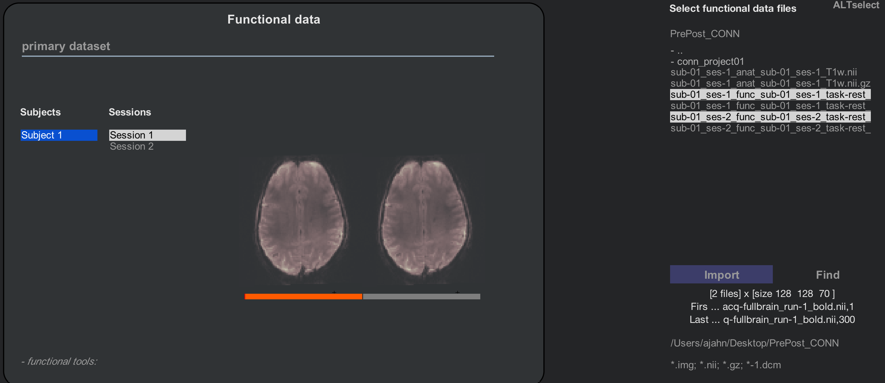

.. _CONN_ApéndiceB_Otros diseños de segundo nivel:

=======================================
Apéndice B: Otros análisis de segundo nivel
=======================================

------------------

Descripción general
********

Ahora que ha realizado un análisis a nivel de grupo, quizá se pregunte cómo configurar análisis más avanzados; por ejemplo, evaluar las diferencias de conectividad antes y después de algún tipo de intervención (también conocido como diseño **pre-post**) o evaluar las diferencias de conectividad entre grupos. También podría usar una parcelación de nodos de conectividad diferente a la predeterminada que ofrece la caja de herramientas CONN.

Configuración de un diseño pre-post
****************************

Un análisis de conectividad funcional común es el diseño pre-post. En este escenario, se escanea al sujeto una vez para medir su perfil de conectividad al inicio o antes de una intervención. Posteriormente, la intervención se lleva a cabo, ya sea dentro o fuera del escáner, como por ejemplo, al iniciar una nueva terapia conductual. Tras esta intervención, se vuelve a escanear al sujeto y se puede calcular la diferencia en la conectividad. Si, por ejemplo, se realiza una intervención conductual para el manejo de la ira, se puede predecir un aumento de la conectividad entre las regiones implicadas en la regulación de las emociones, como la corteza prefrontal, y las regiones asociadas con la detección de estímulos emocionales relevantes, como la amígdala y otras partes del sistema límbico.

Este diseño requiere al menos dos escaneos: uno antes y otro después. Haga clic en este enlace.`__, que muestra un conjunto de datos con escaneos en estado de reposo en dos momentos distintos. Descargue los datos en estado de reposo del sujeto uno, tanto para la sesión 1 como para la sesión 2 (``fullbrain_run-1``), junto con la imagen anatómica de la sesión 1 (``T1w.nii``).

En la interfaz gráfica de CONN, abra un nuevo proyecto y llámelo "PrePost_CONN". En la pestaña Básica, introduzca un tiempo de respuesta (TR) de 3 segundos y configure el número de sesiones en 2. Para el archivo estructural, cargue la imagen T1w.nii; dado que solo se obtuvo una imagen anatómica, la configuraremos como estructural invariante a la sesión. Es posible que encuentre experimentos que adquieran un escaneo anatómico independiente para cada sesión, en cuyo caso puede especificar estructuras específicas de la sesión.

La pestaña "Funcional" mostrará un menú con un sujeto y dos sesiones para él. Mantenga presionada la tecla Mayús y haga clic para seleccionar ambas sesiones, navegue a la carpeta que contiene los datos funcionales y mantenga presionada la tecla Control y haga clic para seleccionar los datos de la sesión 1 y la sesión 2. Haga clic en "Importar" y CONN cargará cada ejecución funcional en su sesión correspondiente. Observe que ahora hay una barra debajo de las imágenes funcionales que se muestran en la ventana central: si la Sesión 1 está resaltada, la parte izquierda de la barra se resalta en naranja y la parte derecha en gris; si la Sesión 2 está resaltada, el código de colores se invierte. El resaltado en naranja indica que hay dos sesiones y que cada una tiene asignado su volumen correspondiente.

Ahora haremos clic en la pestaña "Condiciones". Al analizar una sesión de un sujeto, la condición predeterminada era generar una condición llamada "descanso" que representaba la serie temporal de toda la sesión. Ahora que tenemos dos sesiones, será más útil etiquetarlas como Pre y Post. Cambie el nombre de "descanso" a "Pre", asegurándose de que la Sesión 1 del Sujeto 1 esté resaltada. A continuación, haga clic en el signo "+" en la parte inferior del menú "Condiciones" para agregar una nueva condición, renómbrela como "Post", resalte la Sesión 2 del sujeto 1 y utilice el menú "Intervalo de condición" para especificar que la condición "abarca toda la sesión". Esto resaltará la segunda sesión en naranja.

.. figure:: B_Condiciones_prepost.png

.. nota::

  Si accidentalmente agrega una condición que ya no desea, haga clic en el signo “-” en la parte inferior del menú Condiciones.
  

   

