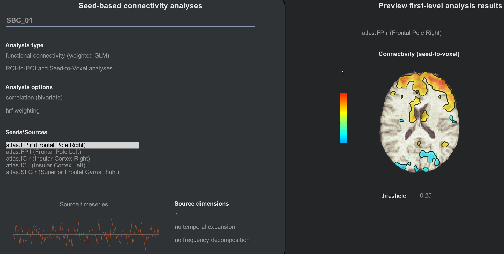
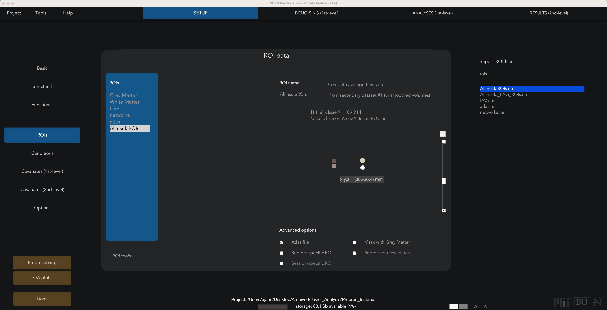
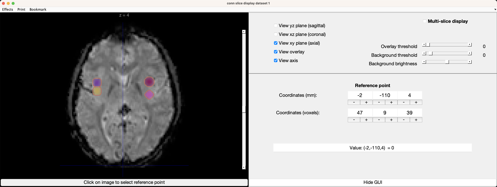
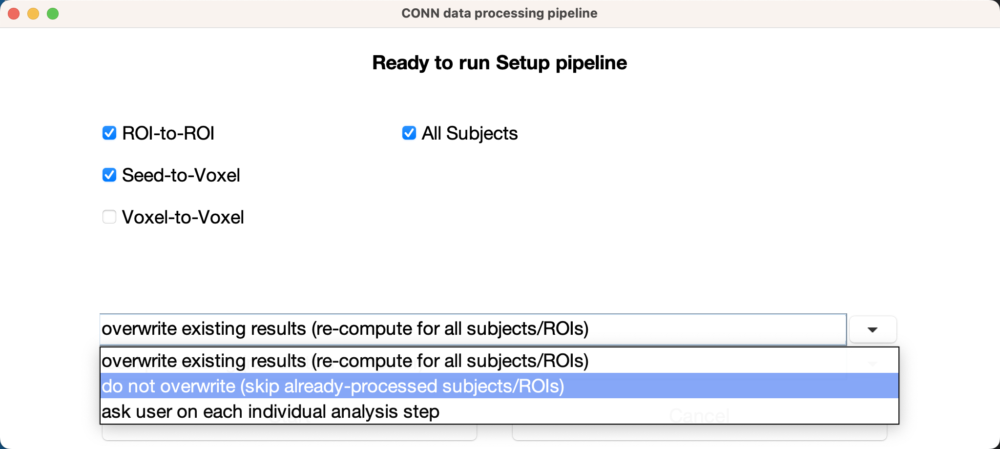
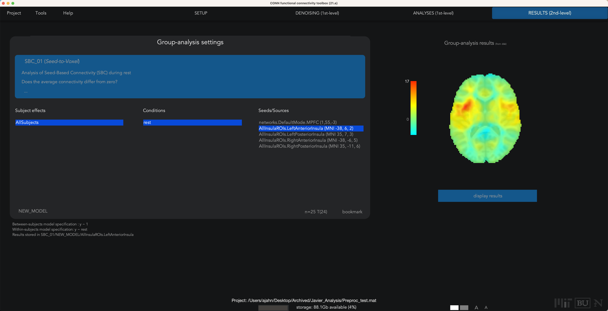

.. _CONN_ApéndiceC_ImportaciónROI:

==========================
Apéndice C: Importación de ROI
==========================

---------------

Descripción general
********

Los atlas predeterminados que vienen con la caja de herramientas CONN se encuentran en la carpeta ``conn/rois``. El archivo ``atlas.nii`` contiene parcelaciones derivadas del atlas cortical de Harvard-Oxford, así como parcelaciones del cerebelo. De igual forma, el archivo ``networks.nii`` contiene 32 redes que se encuentran comúnmente en la literatura sobre el estado de reposo.

Cada uno de estos archivos tiene un archivo .txt complementario que indica qué etiqueta corresponde a cada parcelación. Si abre el archivo ``atlas.txt``, por ejemplo, verá estas primeras líneas:

::

  FP r (Polo frontal derecho)
  FP l (Polo frontal izquierdo)
  IC r (Corteza insular derecha)
  IC l (Corteza insular izquierda)
  SFG r (Giro frontal superior derecho)
  SFG l (Giro frontal superior izquierdo)
  MidFG r (Giro frontal medio derecho)
  MidFG l (Giro frontal medio izquierdo)
  
  
Estas corresponden a las semillas que se ven durante los análisis de primer y segundo nivel:

Añadiendo ROI
***********

¿Qué sucede si desea usar sus propias imágenes, ya sea una sola ROI o un atlas completo? En ese caso, necesitaría crear una serie de ROI combinadas en una sola imagen, donde cada ROI esté indexada con un número diferente. Si usa el modo de Edición con FSLeyes, por ejemplo, puede asignar un número diferente a cada ROI que dibuje en el cerebro. Para simplificar, aumente los índices de ROI en incrementos de 1. Las imágenes que contienen varias ROI que dividen el cerebro en diferentes regiones se denominan **atlas**.

Una vez creado el atlas, guárdelo en una carpeta (como ``conn/rois``) y utilice un editor de texto para crear un archivo de texto con el mismo nombre raíz que el atlas. Por ejemplo, si mi atlas se llama ``AllInsulaROIs.nii``, crearía un archivo de texto llamado ``AllInsulaROIs.txt``. Supongamos que he creado un atlas con cuatro ROI: una en la ínsula anterior izquierda, otra en la ínsula posterior izquierda, otra en la ínsula anterior derecha y otra en la ínsula posterior derecha. Estas se pueden crear utilizando Marsbar para colocar una esfera de un radio determinado alrededor de las coordenadas del pico de otro estudio, por ejemplo, o utilizando un atlas para crear una máscara. (Para ver ejemplos de cómo hacer ambas cosas mediante SPM, consulte este capítulo).`.)

Como se mencionó anteriormente, cada ROI debe tener un solo número que llene sus vóxeles constituyentes, y los números de cada ROI deben aumentar consecutivamente. Por ejemplo, la IA izquierda podría etiquetarse con 1, la PI izquierda con 2, la IA derecha con 3 y la PI derecha con 4. Puede hacerlo manualmente usando una calculadora de imágenes para multiplicar cada ROI por un número dado y luego sumarlos, o puede usar la función "Exportar" de Marsbar para hacerlo automáticamente, seleccionando "Definición de ROI -> Exportar -> Imagen de ROI etiquetada con número". Este último enfoque asume que creó ROI esféricas con Marsbar; si lo hizo, este método puede ahorrarle tiempo.

En cualquier caso, una vez hayas creado tus ROI, podrías introducir el siguiente texto en el archivo, siguiendo nuestro ejemplo actual:

::

  Ínsula Anterior Izquierda (MNI -38, 6, 2)
  Ínsula Posterior Izquierda (MNI 35, 7, 3)
  Ínsula AnteriorDerecha (MNI -38, -6, 5)
  Ínsula Posterior Derecha (MNI 35, -11, 6)

Esto generará una etiqueta en la caja de herramientas CONN al procesar estas ROI, y también servirá como recordatorio de su ubicación exacta. En este ejemplo, creé ROI con una esfera de 6 mm alrededor de las coordenadas MNI indicadas a la derecha de cada ROI.

Para importar estas ROI, en la pestaña Configuración, haga clic en "ROIs" en el menú de la izquierda. Haga clic en el botón "Nuevo" en la parte inferior al pasar el cursor sobre la columna ROI y llámela como desee; en este caso, la llamaremos "AllInsulaROIs". Marque la casilla junto a "Archivo Atlas". Luego, en el panel "Importar archivos ROI" de la derecha, navegue hasta la ubicación donde guardó su ROI y selecciónela haciendo doble clic sobre ella.

Una vez importada, puede usar las flechas arriba y abajo junto a la imagen para navegar por los cortes y ver su ubicación. Si hace clic en el panel de imágenes, se abrirá una nueva ventana que muestra la ubicación de las ROI en uno de los volúmenes funcionales del sujeto:

Si las ROI están ubicadas donde cree que deberían estar, puede volver a ejecutar los análisis con sus ROI personalizadas. Deberá volver a ejecutar la configuración (pero no el preprocesamiento) haciendo clic en el botón "Listo". Si ya ha ejecutado análisis y los está volviendo a ejecutar con ROI adicionales, puede ahorrar tiempo seleccionando la opción "no sobrescribir (omitir sujetos/ROI ya procesados)".

Harás lo mismo para la pestaña Denoising y la pestaña de análisis de primer nivel; luego podrás ejecutar cualquier análisis de segundo nivel como de costumbre:

.. .. figure:: C_Manual_ROIs.png

Ceremonias
*********

1. Cree cuatro nuevas ROI, utilizando la caja de herramientas WFU Pickatlas o esferas generadas con la caja de herramientas Marsbar (consulte este capítulo).
    ` para obtener más información sobre cómo usar ambas herramientas). Asegúrese de que la imagen resultante contenga valores consecutivos ascendentes para cada ROI. Luego, cree un archivo .txt asociado y guarde la imagen y el archivo en su directorio ``conn/rois``. Procese los datos con estas nuevas ROI y guarde una captura de pantalla del resultado de primer nivel para un solo sujeto, buscando un segmento que muestre la semilla que utilizó.

    
   

