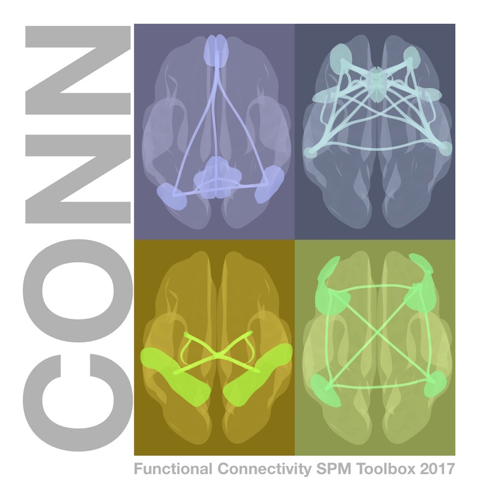

.. _CONN_Descripción general:

============================================
Conectividad funcional y la caja de herramientas CONN
============================================

---------------

Descripción general
********

Este módulo le presentará la conectividad funcional, la correlación en la señal :ref:`BOLD` entre dos regiones distintas del cerebro. Esta correlación puede analizarse cuando el sujeto realiza una tarea (es decir, **conectividad basada en la tarea**), o cuando está en reposo, relajado y alerta, pero sin realizar ninguna tarea en particular (es decir, **conectividad en estado de reposo**).

En los siguientes tutoriales, aprenderá a realizar análisis de conectividad en estado de reposo en un conjunto de datos de muestra. Utilizaremos la caja de herramientas CONN.
    `__ para ejecutar los análisis, lo que incluye tanto la creación de mapas de correlación para cada vóxel del cerebro como la generación de **conectomas** que visualizan la fuerza de la conectividad entre diferentes regiones.

  La caja de herramientas CONN es uno de los paquetes de análisis de estado de reposo más utilizados disponibles.

Tutoriales recomendados
*********************

Antes de continuar, es posible que desees revisar los tutoriales de SPM.
     `. Estos tutoriales te presentarán Matlab y SPM, necesarios para ejecutar la caja de herramientas CONN. Este curso también explicará qué son las cajas de herramientas y cómo instalar algunas de las más utilizadas, como Marsbar y las cajas de herramientas PickAtlas de WFU. Al terminar los tutoriales de SPM, regresa a esta página para ver la guía de CONN.

Tenga en cuenta que SPM es un requisito previo para la caja de herramientas CONN, lo que significa que deberá descargar e instalar SPM.
      ` antes de poder usar CONN. El resto de los tutoriales del módulo SPM no son necesarios, aunque una mejor comprensión de cómo SPM preprocesa los datos de fMRI le preparará para usar las herramientas CONN.

.. árbol de toc::
   :profundidad máxima: 1
   :caption: Análisis de principio a fin con CONN

   CONN_00_History
   CONN_01_FSL_Demo
   CONN_02_DataDownload
   CONN_03_LookingAtData
   CONN_04_GUI_Overview
   CONN_05_Preprocessing
   CONN_06_QA_Checks
   CONN_07_Denoising
   CONN_08_1stLevel_Analysis
   CONN_09_2ndLevel_Analysis
   CONN_10_Viewing_Results
   CONN_11_Task_gPPI
   CONN_12_Scripting
   CONN_AppendixA_GraphTheory
   CONN_AppendixB_OtherSecondLevelDesigns
   CONN_AppendixC_ImportingROIs
   CONN_AppendixD_SurfaceBasedConnectivity
   CONN_AppendixE_DynamicConnectivity
   CONN_AppendixF_OpenScienceConnToolbox

      
     
    
   

