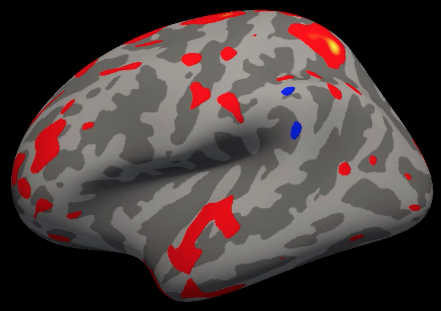

Curso corto de FreeSurfer
=======================

https://andysbrainbook-readthedocs-io.translate.goog/en/latest/FreeSurfer/FreeSurfer_Introduction.html?_x_tr_sl=en&_x_tr_tl=es&_x_tr_hl=es&_x_tr_pto=tc

.. _FreeSurfer_Introducción:

Descripción general
--------

FreeSurfer es un paquete de software que permite analizar imágenes de **resonancia magnética estructural**; en otras palabras, permite cuantificar la cantidad de materia gris y blanca en regiones específicas del cerebro. También permite calcular mediciones como el grosor, la curvatura y el volumen de los diferentes tipos de tejido y correlacionarlas con covariables; o bien, contrastar estas mediciones estructurales entre grupos.

  Ejemplo de un mapa típico a nivel de grupo creado por FreeSurfer. Este mapa se basa en un contraste a nivel de grupo entre dos grupos, donde los colores rojo y azul indican las diferencias en el grosor cortical entre los grupos. Normalmente, estos resultados se representan en cerebros inflados; el gris más oscuro representa los surcos y el gris más claro las circunvoluciones.
  

Este curso te mostrará cómo descargar e instalar FreeSurfer y cómo analizar un conjunto de datos de principio a fin. Aprenderás el vocabulario básico de FreeSurfer y cómo realizar preprocesamiento, edición de volumen y análisis de regiones de interés.

.. toctree::
   :maxdepth: 1
   :caption: Análisis de principio a fin con FreeSurfer

   tuto-1
   tuto-2
   tuto-3
   tuto-4
   tuto-5
   tuto-6
   tuto-7
   tuto-8
   tuto-9
   tuto-10
   tuto-11
   tuto-12
   tuto-13
   tuto-14
   apea
   apeb
   apec
   aped

.. nota::

  Lo siguiente está en construcción; ¡vuelva pronto!

.. árbol de toc::
   :profundidad máxima: 1
   :caption: Análisis de principio a fin con TRACULA

   TRACULA_Curso Corto/TRACULA_01_Introducción

