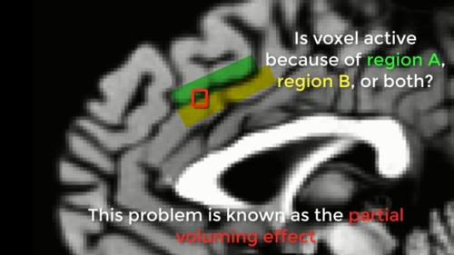
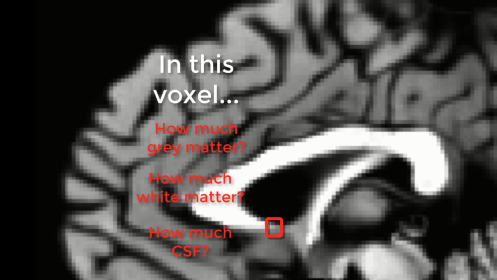
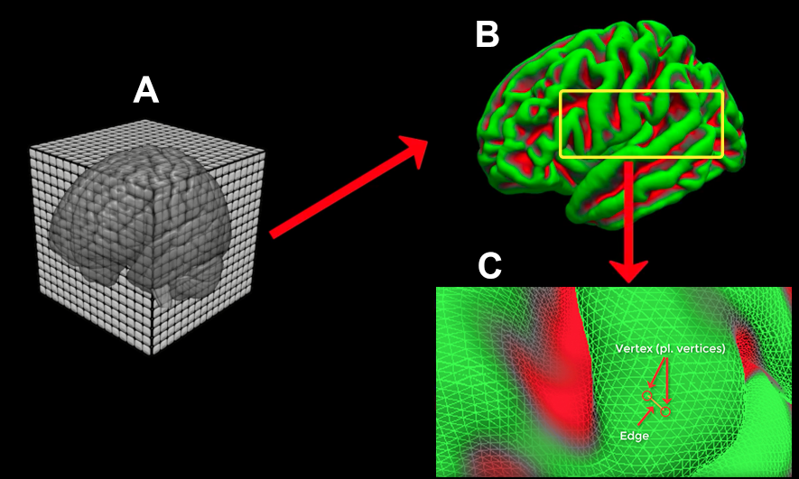
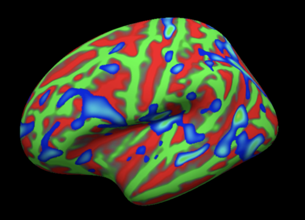

Tutorial de FreeSurfer n.° 1: Términos básicos
===================================

-------------

Descripción general
********

Prácticamente todos los estudios de neuroimagen adquieren una **exploración anatómica** ponderada en T1: una imagen de alta resolución con alto contraste entre la sustancia blanca y la sustancia gris. En estas imágenes, la sustancia blanca es más clara, la sustancia gris es más oscura y el líquido cefalorraquídeo es negro. Estas son las imágenes que FreeSurfer utilizará para dividir la superficie cortical y las estructuras subcorticales en áreas distintas.

Sin embargo, en lugar de analizar el cerebro como un volumen 3D, FreeSurfer transforma la corteza en una superficie 2D. ¿Por qué una superficie 2D? Imagine un vóxel que abarca ambos bordes de un surco. El vóxel contiene una mezcla de señales de ambas regiones, y es imposible determinar qué región contribuyó a la señal; este problema se conoce como el efecto de volumen parcial.

  Ilustración del efecto de volumen parcial. Un vóxel, resaltado en rojo, contiene señal tanto de la región A (verde) como de la región B (amarilla). El efecto de volumen parcial también puede ocurrir cuando la señal contiene materia gris y blanca.
  

Nos encontramos con un problema similar con un vóxel que contiene dos o más tipos de tejido diferentes. Imaginemos un vóxel que contiene materia gris, materia blanca y líquido cefalorraquídeo. En este caso, no podemos determinar la cantidad de cada uno de ellos: es un único número que representa cada uno de los diferentes tipos de tejido dentro del vóxel, pero es imposible determinar la cantidad de cada tipo de tejido dentro del vóxel.

  El efecto de volumen parcial en una exploración estructural. El recuadro resaltado en rojo representa un vóxel que abarca tres tipos de tejido: materia blanca, materia gris y LCR. Si imaginamos que la imagen en escala de grises es un cerebro real, y nuestro recuadro rojo es el elemento de menor resolución de nuestra exploración, este recuadro sería un promedio de los diferentes tipos de tejido que contiene.
  
  
La solución de FreeSurfer
*********************

FreeSurfer soluciona este problema trazando los límites entre los diferentes tejidos del cerebro (materia gris y blanca, materia gris y pial, etc.) y luego inflando esas superficies para formar esferas. La mayoría de los defectos restantes en la superficie inflada se corrigen automáticamente (aunque algunos deben corregirse manualmente). Estas superficies pueden renderizarse como cerebros parcialmente inflados, completamente inflados o esféricos.

Para comprender mejor la función de FreeSurfer, imagine lo siguiente: acaba de extraer el cerebro de alguien y lo coloca sobre la mesa. El cerebro es como un globo flácido, cuyas arrugas representan las circunvoluciones y los surcos de la corteza. Ahora, coloca la boca sobre el tronco encefálico seccionado (después de lavarlo con agua caliente y jabón, por supuesto) y sopla con todas sus fuerzas, inflando el cerebro al máximo. Las arrugas desaparecen y el cerebro se convierte en un globo completamente inflado, como una esfera. Esta es una forma diferente de ver los datos: en lugar de usar vóxeles como bloques de construcción de nuestra imagen, usamos vértices y aristas. Piense en estos vértices y aristas como una valla metálica que rodea la superficie de la corteza; los enlaces son las aristas y las intersecciones de los enlaces son los vértices. El vértice es ahora nuestro elemento de menor resolución, y en cada vértice podemos calcular medidas estructurales como el grosor, el volumen y la superficie.

  Ilustración de muestra del proceso de reconstrucción (recon) de FreeSurfer. (A) El escáner crea el escaneo anatómico ponderado en T1, generalmente con una resolución de aproximadamente 1 mm cúbico. (B) El recon-all de FreeSurfer convierte la imagen anatómica 3D en una malla 2D. Aquí se muestra la superficie pial. (C) Un primer plano de la superficie de la malla, mostrando su composición de vértices (intersecciones de los triángulos que la conforman) y aristas (conexiones entre vértices).

Una vez reconstruida la superficie, puede remuestrear sus mapas estadísticos de fMRI y visualizarlos en una superficie inflada, o desinflarla y ver dónde se encuentra la activación en la corteza original arrugada. Esto le proporciona una mejor visión de cómo se ubican los mapas estadísticos a lo largo de las crestas y valles del cerebro. (Para un ejercicio práctico de análisis de datos de fMRI en las superficies generadas por FreeSurfer, consulte este módulo).`.

FreeSurfer utiliza la superficie reconstruida, junto con el conocimiento previo sobre la topología de un cerebro humano típico, para etiquetar las estructuras corticales y subcorticales. El etiquetado de la corteza se denomina **Parcelación**, y el de las estructuras subcorticales, **Segmentación**. Estos etiquetados se basan en los dos atlas incluidos en FreeSurfer: el atlas de Desikan-Killiany y el atlas de Destrieux. Este último contiene parcelaciones más detalladas. Las mediciones estructurales se promedian dentro de cada parcelación. Estas mediciones pueden compararse entre grupos o correlacionarse con alguna medida de diferencia individual, como la edad, el coeficiente intelectual o el sexo.

  Actividad cerebral mapeada en la superficie. Aquí se muestra la superficie pial inflada. Verde: circunvoluciones; Rojo: surcos. El mapa de activación umbralizada se muestra en azul. Cabe destacar que este tipo de representación ofrece al observador una mejor idea de la ubicación de la actividad dentro de los surcos, que de otro modo quedaría oculta en una vista volumétrica 3D.
  
Próximos pasos
*********

Ahora que ya comprende las funciones de FreeSurfer y la utilidad de las superficies reconstruidas, está listo para descargar e instalar el software. Haga clic en el botón "Siguiente" para acceder a un enlace y un video que muestra cómo instalar FreeSurfer en su computadora.
  
-------------

Video
*****

Para ver una descripción general en video de FreeSurfer y una definición de sus términos básicos, consulte este video
    `__.

    
   

