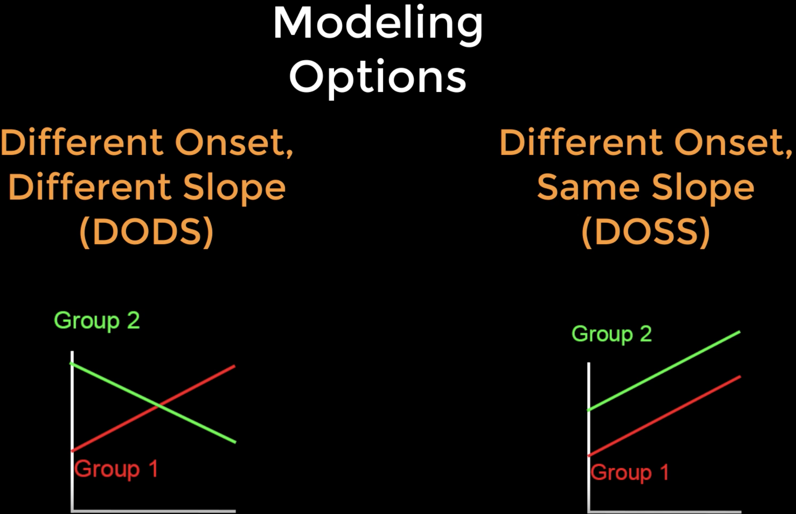

Tutorial de FreeSurfer n.° 10: Análisis de correlación
=============================================

---------------

Descripción general
********

La **correlación** cuantifica la covaría entre dos variables. Por ejemplo, si estoy analizando un experimento que mide el coeficiente intelectual (CI) y el grosor cortical de mis sujetos, puedo representar ambas variables en ejes separados de una gráfica. Para cada sujeto, dibujo un punto en la gráfica en la intersección de sus valores de CI y grosor, y luego trazo la línea que mejor se ajuste a los datos. La magnitud de la covariación entre las variables, también conocida como **coeficiente de correlación**, se puede calcular mediante la fórmula que se encuentra `aquí`.`__. (En esa página también puede hacer clic en el botón "Calculadora" para calcular el coeficiente de correlación de un conjunto de datos de muestra). Una correlación positiva significa que, al aumentar una variable, también aumenta la otra; y una correlación negativa representa lo contrario. La magnitud del coeficiente de correlación puede comprobarse para determinar su significancia estadística, al igual que con las pruebas t.

.. figure:: 10_Ejemplo_de_correlación.png
  :escala: 50%

.. nota::

  Aunque el coeficiente de correlación describe la covariación entre dos variables, no debe interpretarse como que una variable necesariamente *causa* un aumento o disminución en la otra. Si bien encontrar una correlación fuerte puede ser un primer paso útil para construir un modelo de causalidad entre las variables, estos resultados siempre deben interpretarse con cautela; véase, por ejemplo, el caso de la variable latente.`__.
  
Tal como la comparación de grupos en el último tutorial utilizó una prueba t en cada vértice para probar las diferencias entre los grupos, también podemos probar correlaciones significativas en cada vértice entre las mediciones estructurales y las covariables. Puede encontrar una lista de las covariables para el estudio actual en el archivo ``participants.tsv``. Por ejemplo, podríamos querer incluir las covariables ``edad`` y ``línea base total de auditoría`` (los valores en auditoría representan cuántas bebidas por semana toma el sujeto), ya sea para ver cómo se correlacionan con diferentes mediciones estructurales o para hacer una regresión de ellas fuera del modelo. Incluir la edad como covariable, por ejemplo, nos permitiría probar la diferencia entre los grupos mientras controlamos el efecto de la edad; en otras palabras, podríamos decir que las diferencias que observamos en el grosor cortical entre los grupos (por ejemplo) no se deben a la edad, y es más probable que se expliquen por el grupo del sujeto.

.. figure:: 10_Participantes_Ejemplo.png
  

DODS vs. DOSS
************

Antes de modelar estas covariables, debemos familiarizarnos con las opciones de modelado de FreeSurfer: Inicio diferente, pendiente diferente (o **DODS**) y Inicio diferente, misma pendiente (o **DOSS**). DODS estima un inicio (o **intersección**) y una pendiente independientes para cada covariable del modelo, mientras que DOSS limita las pendientes de ambas covariables para que sean iguales.

Las ventajas de DOSS son que se estiman menos parámetros y, por lo tanto, se obtienen más grados de libertad y mayor potencia estadística. Esto probablemente no sea relevante para conjuntos de datos grandes con muchos grados de libertad, pero podría tener un efecto en conjuntos de datos con solo un par de docenas de sujetos y varias covariables. Sin embargo, para la mayoría de los análisis, DODS es la mejor opción: es más flexible y también permite modelar los efectos de interacción. Sea cual sea el modelo que elija, debe utilizar el que considere más adecuado para sus datos.

.. nota::

  DODS es el valor predeterminado para ``mri_glmfit``. Si desea usar DOSS, escriba ``doss`` como segundo argumento después de la opción ``--fsgd`` de mri_glmfit; por ejemplo, ``mri_glmfit --fsgd CannabisStudy.fsgd doss``.

Modificación del archivo FSGD
***********************

En el tutorial sobre la creación del archivo FSGDVimos cómo se formatea el archivo FSGD para incluir dos grupos. Ahora agregaremos covariables y veremos cómo modificar el archivo FSGD según corresponda.

Primero, abra el archivo FSGD anterior (``CannabisStudy.fsgd``). En la fila que contiene ``Clase CB``, inserte otra fila y escriba ``Variables``. En las dos celdas siguientes, escriba ``Edad`` y ``Auditoría``. Esto indica que las columnas a la derecha de la columna Grupo contienen covariables, que son Edad y Auditoría, respectivamente. Las primeras líneas del nuevo archivo FSGD deberían verse así:

::

  Archivo descriptor de grupo 1
  Título CannabisStudy
  Clase HC
  Clase CB
  Auditoría de edad de variables
  Entrada sub-202 HC 25.62 6
  Entrada sub-206 HC 18.55 2
  Entrada sub-207 HC 17.66 3
  
  
Cuando haya terminado de formatear el archivo, guárdelo como ``CannabisStudy_Age_Audit`` y luego ejecute este código para eliminar cualquier retorno de carro problemático:

::

  tr '\r' '\n' < CannabsiStudy_Age_Audit.txt > CannabisStudy_Age_Audit.fsgd
  
Luego estará listo para crear los archivos de contraste para volver a ejecutar el análisis de grupo controlando las covariables o para ejecutar un análisis de correlación en cualquiera de las covariables.

.. nota::

  Otra covariable útil para el análisis intergrupal es el **volumen intracraneal total estimado**, o eTIV. Esto permite controlar el tamaño total de la cabeza, que puede ser un factor de confusión entre grupos con diferentes tamaños de cabeza en promedio (p. ej., hombres y mujeres, ancianos y jóvenes, pacientes y controles; véase este artículo).
    `__ para obtener una descripción general de cuándo es apropiado incluir esta covariable). Si un sujeto se ha procesado con recon-all, la siguiente línea de código usará ``mri_segstats`` para extraer el eTIV (deberá asegurarse de que este comando se ejecute desde el directorio que contiene los sujetos y de que SUBJECTS_DIR apunte a dicho directorio):
  
::

    mri_segstats --subject nombre_del_sujeto --etiv-only | grep atlas_icv | awk '{imprimir $4}
    
  This number, which usually ranges from about 1,000,000 to 1,500,000 in healthy adults, can then be entered into the FSGD file just as we did with the other numbers. Mean-centering the covariates can also change your interpretation of the results; see `this page 
     `__ for examples of when to do it, and how it will change your interpretation.

Creating Contrast Files for Covariate Analyses
**********************************************

The number of covariates and the modeling option that you choose (DODS or DOSS) will affect the formatting of your contrast files. In our previous tutorial which only had two groups, we needed only two numbers: one contrast weight for each group. With additional covariates, we will need to add a corresponding number of columns.

If we decided to use DOSS, for example, there would only be one additional parameter to estimate for each additional covariate. In that case, if we wanted to contrast the groups while controlling for the effects of Age and Audit, our contrast file would look like this:

::

  1 -1 0 0
  
And if we wanted to create a correlation map for Age, it would look like this:

::

  0 0 1 0

.. note::

  Remember that the columns will correspond to the order that they are placed in the FSGD file; in our example, the covariates are in this order: Age, Audit.
  
If we instead wish to use DODS (which is the default for ``mri_glmfit``), a contrast file for contrasting the groups would look like this:

::

1 -1 0 0 0 0

Note that there are two additional zeroes. The way to read this contrast file is in groups of two: The first two numbers indicate the contrast weights for the HC and CB groups, and the next two numbers represent the contrast weights for the Age covariate of the HC and CB groups, respectively. The last two numbers represent the contrast weights for the Audit covariate for the HC and CB groups, and the pattern would go on for as many additional covariates that you include.

For now, let us create two contrast files: One that tests for a difference between groups, and one that tests for the average correlation of the Audit covariate, collapsed across groups. For the second contrast we will use contrast weights of 0.5 each, in order to control for the number of covariates that we are averaging across:

::

  echo "1 -1 0 0 0 0" > HC-CB_Age_Audit.mtx
  echo "0 0 0 0 0.5 0.5" > Audit_Slope.mtx
  
Save this file in your ``Contrasts`` folder, and then open the file ``runGLMs.sh``. Replace the contrast options to the following:

::

  --C Contrasts/HC-CB_Age_Audit.mtx \
  --C Contrasts/Audit_Slope.mtx \
  
  
Running the Analysis
********************

You can rerun these analyses by navigating to your subjects directory and creating a higher-level script called ``runAllGroupScripts.sh``, which contains the following code:

::

  #!/bin/tcsh
  
  setenv study $argv[1]
  
  tcsh runMrisPreproc.sh $study
  tcsh runGLMs.sh $study
  tcsh runClustSims.sh $study
  
Run this higher-level script by typing:

::
  
  tcsh runAllGroupScripts.sh Auditoría de edad del estudio de cannabis
  
  
Y mira los resultados en :ref:`Freeview
     `.

-----------

Video
*****

Para ver una descripción general en video sobre cómo realizar análisis de correlación en FreeSurfer, haga clic aquí
      `__.

      
     
    
   

