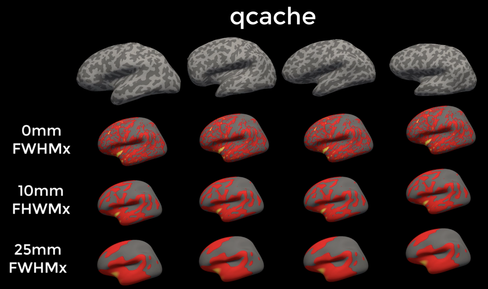
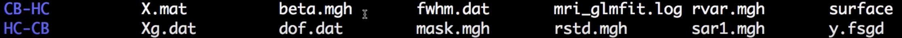
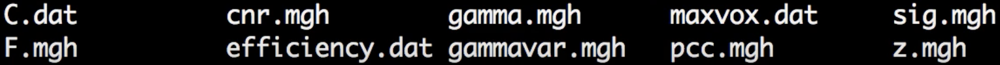
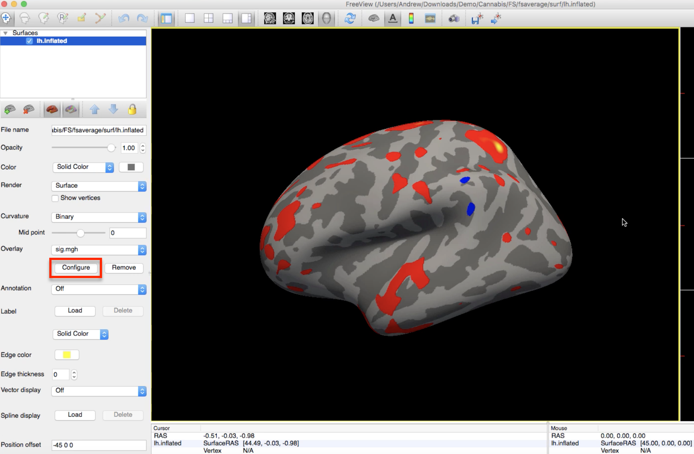

Tutorial de FreeSurfer n.° 8: Análisis de grupo
======================================

---------------

Descripción general
********

Los tutoriales anteriores se han centrado en preparar los datos para un análisis de grupo: primero, los datos se preprocesaron utilizando recon-all, con diferentes medidas estructurales calculadas en cada vértice; y segundo, creamos un archivo FSGD y un archivo de contraste que indica qué grupos queremos comparar entre sí.

Si recuerdas un tutorial anterior, recomendé usar la opción ``qcache`` al ejecutar recon-all. Esto generará mapas de espesor, volumen y curvatura con diferentes tamaños de suavizado, como kernels de 0 mm, 10 mm y 25 mm de ancho completo y mitad del máximo. Una de las ventajas del análisis basado en superficies es que permite usar kernels de suavizado mucho más grandes que en los análisis volumétricos, ya que no hay riesgo de suavizado a lo largo de las circunvoluciones. Al ejecutar el análisis de grupo, se puede elegir entre cualquiera de los siguientes tamaños de suavizado:

  
  Ejemplo de salida de qcache. Observe cómo las estimaciones de grosor en los sujetos se suavizan gracias al uso de kernels de suavizado grandes.

.. advertencia::

  Antes de analizar sus análisis de grupo, decida qué kernel de suavizado utilizará y manténgalo. Esto le evitará tener que comprobar todos los tamaños de suavizado posibles, lo que a su vez le obligará a corregir el número de pruebas que examine con diferentes kernels de suavizado.

Creando un archivo de grupo con mris_preproc
****************************************

Para realizar un análisis de grupo, necesitaremos combinar todos nuestros mapas estructurales individuales en un único conjunto de datos. Esto es similar a combinar volúmenes consecutivos de una resonancia magnética funcional en un único conjunto de datos, como si los volúmenes estuvieran encadenados y dispuestos uno tras otro. (O, dicho de otro modo, las imágenes estructurales se apilan unas sobre otras, como panqueques; o en capas, como nachos. Use la analogía alimentaria que le resulte más útil para recordar este importante punto).

.. figure:: 08_mrispreproc_Concatenación.gif

Los datos también se **remuestrean** a la plantilla fsaverage, que se encuentra en el espacio MNI. Siempre que realizamos cualquier tipo de análisis de grupo (comparación de grupos, análisis de la región de interés, etc.), los datos de cada sujeto deben tener las mismas dimensiones y resolución de vóxel. Olvidar el remuestreo suele provocar errores durante este paso. (Esto también aplica al análisis fMRI).

Realizaremos todos estos pasos con un solo comando: **mris_preproc**. El comando requiere los siguientes argumentos:

1. Un archivo FSGD (indicado por la opción ``--fsgd``);
2. Una plantilla para remuestrear a (``--target``);
3. Una indicación de qué hemisferio se va a remuestrear (``--hemi``);
4. Una etiqueta para el archivo de salida (``--out``).

En este tutorial, también usaremos la opción ``--cache-in`` para especificar las imágenes suavizadas que queremos usar en el análisis. Puede elegir cualquiera de las imágenes suavizadas generadas con la opción ``--qcache`` con recon-all.

Para hacer el comando más compacto y adaptable a cualquier estudio que desee analizar, utilizaremos bucles for anidados:

::

  #!/bin/tcsh
  
  estudio setenv $argv[1]
  
  para cada hemisferio (izq. der.)
    suavizado foreach (10)
      foreach meas (volumen espesor)
        mris_preproc --fsgd FSGD/{$estudio}.fsgd \
          --cache-in {$meas}.fwhm{$smoothing}.fsaverage \
          --objetivo fsaverage \
          --hemi {$hemi} \
          --out {$hemi}.{$medir}.{$estudio}.{$suavizar}.mgh
      fin
    fin
  fin

Copia este código en un script de shell y guárdalo como ``runMrisPreproc.sh``. También puedes descargarlo aquí.`__. Asegúrese de que el script esté en el directorio que contiene todos los directorios del tema (en este caso, ``Cannabis/FS``) y luego ejecútelo escribiendo ``tcsh runMrisPreproc.sh``.

.. nota::

  Si no ha utilizado la opción ``-qcache`` durante la reconstrucción total, aún puede suavizar los datos sin tener que volver a ejecutar todos los pasos de preprocesamiento; por ejemplo,
  
  ::

    recon-all -s
    -qcache
    
  Para suavizar a un nivel específico, puedes agregarlo después de la opción ``-fwhm``, por ejemplo:
  
  ::
  
    recon-all -s
     -qcache -fwhm 10

.. nota::

  Si necesita un repaso sobre Unix, variables y bucles for, consulte este tutorial.
      `.
  
  

Ajuste del modelo lineal general con mri_glmfit
*************************************************
  
Ahora que todos los sujetos están concatenados en un único conjunto de datos, podemos ajustar un modelo lineal general con el comando ``mri_glmfit`` de FreeSurfer. En este ejemplo, utilizaremos las siguientes entradas:

1. El conjunto de datos concatenados que contiene todos los mapas estructurales de los sujetos (``--y``);
2. El archivo FSGD (``--fsgd``);
3. Una lista de contrastes (cada contraste especificado por una línea diferente que contiene ``--C``);
4. El hemisferio de la plantilla a analizar (``--surf``);
5. Una máscara para restringir nuestro análisis sólo a la corteza (``--cortex``);
6. Una etiqueta de salida para el directorio que contiene los resultados (``--glmdir``).

Como se indicó anteriormente, utilizaremos bucles for anidados para analizar los hemisferios, los núcleos de suavizado y las medidas estructurales que elijamos. En este ejemplo, analizaremos los hemisferios izquierdo y derecho con un núcleo de suavizado de 10 mm y analizaremos los mapas estructurales de volumen y espesor:

::

  #!/bin/tcsh
  
  conjunto estudio = $argv[1]
  
  para cada hemisferio (izq. der.)
    suavidad para cada uno (10)
      foreach meas (volumen espesor)
          resonancia magnética_glmfit \
          --y {$hemi}.{$medida}.{$estudio}.{$suavidad}.mgh \
          --fsgd FSGD/{$estudio}.fsgd \
          --C Contrastes/CB-HC.mtx \
          --C Contrastes/HC-CB.mtx \
          --surf fsaverage {$hemi} \
          --corteza \
          --glmdir {$hemi}.{$medición}.{$estudio}.{$suavidad}.glmdir
      fin
    fin
  fin
  

Copia este código en un script de shell y guárdalo como ``runGLMs.sh``. También puedes descargarlo aquí.
       `__. Ejecute el script desde el directorio del tema escribiendo ``tcsh runGLMs.sh``.

Revisando la salida
********************

If the scripts run without any errors, you should see the following directories in your current directory:

::

  lh.thickness.CannabisStudy.10.glmdir
  lh.volume.CannabisStudy.10.glmdir
  rh.thickness.CannabisStudy.10.glmdir
  rh.volume.CannabisStudy.10.glmdir
  
The directory name indicates the hemisphere, structural measurement, name of the study, and the smoothing kernel used in the analysis. Each directory contains the same structure; if we navigate into the ``lh.volume.CannabisStudy.10.glmdir`` directory and type ``ls``, for example, we will see the following:

The directories ``CB-HC`` and ``HC-CB`` contain the contrast data for each contrast specified in ``mri_glmfit``, which we will review in the next section. Among the files in the current directory, ``y.fsgd`` is a copy of the FSGD file used to run the analysis; ``mri_glmfit.log`` contains the code that was run for the current analysis; ``mask.mgh`` is the mask used for the analysis; and ``beta.mgh`` is a concatenated dataset of the individual beta weights created by the analysis. You can read descriptions of the other outputs by typing ``mri_glmfit`` and examining the section under ``Command-Line Arguments``.
  
Within each of the contrast directories you will see the following:

The file ``gamma.mgh`` is a contrast map - the beta dataset in the above directory multiplied by the contrast weights for this particular contrast. In the HC-CB directory, for example, ``gamma.mgh`` would show where the Control Group has greater volume than the Cannabis Group in the left hemisphere. ``z.mgh`` converts this contrast into a z-map, and ``sig.mgh`` converts the contrast into a map of p-values. As above, you can read descriptions of the other outputs in the ``mri_glmfit`` help manual.

.. note::

  FreeSurfer uses -log10(p) notation; in other words, a value of 1 in the ``sig.mgh`` map represents a p-value of 0.1, a value of 2 represents a p-value of 0.01, and so on.

To render the statistical maps on the ``fsaverage`` template, navigate to any of the contrast directories (e.g., HC-CB) and type:

::
  
  freeview -f $SUBJECTS_DIR/fsaverage/surf/lh.inflated:overlay=sig.mgh
  
Which will load the left hemisphere of the fsaverage template, and map the ``sig.mgh`` overlay onto it. The threshold of the p-values can be changed by clicking on the ``Configure`` button and moving the sliders.

Now that we have the results, what do we do with them? Your first impulse might be to put them in a manuscript and try to publish it; but to ensure that our results aren't false positives, we will need to use a form of multiple comparisons correction known as **cluster correction**, described in the next tutorial.

--------------

Video
*****

For a video overview of ``mris_preproc`` and ``mri_glmfit``, as well as how to view the results, see `this video 
        
         `__.
        
       
      
     
    
   

