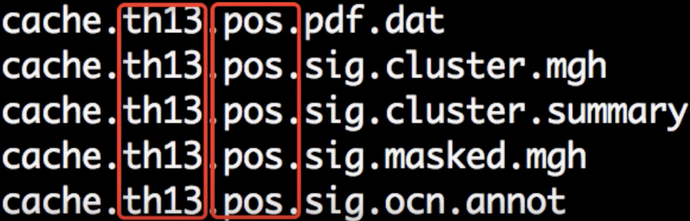

Tutorial de FreeSurfer n.° 9: Corrección de clústeres
==========================================

---------------

Descripción general
********

Después de ejecutar el modelo lineal general y crear mapas de contraste a nivel de grupo, deberá corregir la cantidad de pruebas realizadas. Para obtener una descripción más detallada del funcionamiento de la corrección de grupos, consulte esta página.`. Aunque utiliza datos de fMRI para ilustrar el concepto, la misma idea se aplica a los vértices que analizamos en los datos estructurales.

Corrección de clústeres con mri_glmfit-sim
**************************************

Al igual que en el tutorial anterior, usaremos bucles for anidados para crear mapas con corrección de clústeres para cada contraste. Cada nivel del bucle anidado especifica una combinación diferente de hemisferio, suavidad y medición estructural que analizamos:

::

  #!/bin/tcsh
  
  estudio setenv $argv[1]
  
  foreach meas (volumen de espesor)
    para cada hemisferio (izq. der.)
      suavidad para cada uno (10)
        foreach dir ({$hemi}.{$medidas}.{$estudio}.{$suavidad}.glmdir)
          mri_glmfit-sim \
            --glmdir {$dir} \
            --cache 1.3 pos \
            --cwp 0.05 \
            --2 espacios
        fin
      fin
    fin
  fin
  
  
Las opciones para mri_glmfit_sim especifican lo siguiente:

1. El directorio que se está corrigiendo para comparaciones múltiples (``--glmdir``);
2. El umbral de agrupamiento por vértice (``--cache``);
3. El umbral p por grupo (``--cwp``, siempre establecido en 0,05 a menos que tenga razones para hacer lo contrario);
4. Corrección para analizar ambos hemisferios (``--2espacios``)

Para la mayoría de los análisis, no será necesario modificar las opciones ``--glmdir``, ``--cwp`` y ``--2spaces``. La opción ``--cache``, por otro lado, sí puede modificarse según el análisis, por lo que conviene explicarla con más detalle.

El primer argumento de la opción ``--cache`` es el **umbral por vértice**. Solo los vértices por encima de este umbral se considerarán parte de los clústeres, cuya significancia estadística se comprobará posteriormente. La siguiente tabla muestra qué umbrales por vértice se han **almacenado en caché** o ya están almacenados en memoria. (Estos se generaron usando la opción ``--qcache`` durante :ref:`recon-all
    En otras palabras, FreeSurfer ha precalculado el número de vértices contiguos en cada umbral de vértice para etiquetarlo como un clúster significativo. Los siguientes **umbrales de definición de clúster** están disponibles para su uso con el comando ``mri_glmfit-sim`` como primer argumento después de la opción ``-cache``; puede elegir cualquiera de los valores -log10(P) en la columna izquierda, que corresponden a los valores p en la columna derecha:

=================== ============
-log10(P) valor p-valor
=================== ============
1.3 0.05
2.0 0.01
2.3 0.005
3.0 0.001
3.3 0.0005
4.0 0.0001
=================== ============

The second argument after the ``--cache`` option specifies the **direction** of the test you are analyzing: The positive direction (``pos``), the negative direction (``neg``), or both directions (``abs``). If you have an *a priori* hypothesis about which group should have larger or smaller structural values, use the ``pos`` or ``neg`` arguments; otherwise, use the ``abs`` argument.

.. warning::

  If you are using the ``--cache`` option, it is now recommended to use a value of 3.0 or higher. A recent paper by `Greve & Fischl (2018) 
     `__ demonstrated that using a lower vertex-wise threshold leads to inflated false positives. To maintain a false positive rate of 0.05, either use a vertex-wise threshold of 3.0, or use a permutation test with the ``--perm`` option. See the help output of ``mri_glmfit-sim`` for more details.
  
Now copy the code above into a file called ``runClustSims.sh``, and save it in the directory containing your subjects. (A copy of the above script is available `here 
      `__.) You can run the script by typing ``runClustSims.sh CannabisStudy``.
  

Viewing the Results
*******************

When the script has finished, navigate into one of the directories that it has analyzed, such as ``lh.volume.CannabisStudy.10.glmdir/HC-CB``. There are several new files that have been created:

Each part of the filename is separated by periods. The first part, ``cache`` indicates that the cluster simulation was performed using cached simulations; ``th13`` means that a vertex-wise threshold of 1.3 was used; and ``pos`` indicates the direction of the test.

Although there are many files that have been generated, we will focus on only two of them: The ``cluster.summary`` and ``cluster.mgh`` files. If you open the cluser-summary file and scroll to the bottom, you will see a listing of each cluster that was determined to be statistically significant:

These clusters can then be rendered on the fsaverage template by typing the following from the cluster-corrected directory:

::

  freeview -f $SUBJECTS_DIR/fsaverage/surf/lh.inflated:overlay=cache.th13.pos.sig.cluster.mgh
  
Observe how the clusters that you see in freeview correspond to the clusters listed in the cluster summary file.

----------

Summary
*******

This concludes how to run structural analyses between groups; you can use the above code as templates for analyzing the groups in your study. For many experiments, this will be all the researcher needs.

Even if your main focus is testing for group differences, however, you might want to do other supplementary analyses - such as correlation analyses and region of interest analyses. We will cover those in the next two chapters.

-------------

Video
*****

For a video overview of how to do cluster correction in FreeSurfer, click `here 
       `__.

       
      
     
    
   

