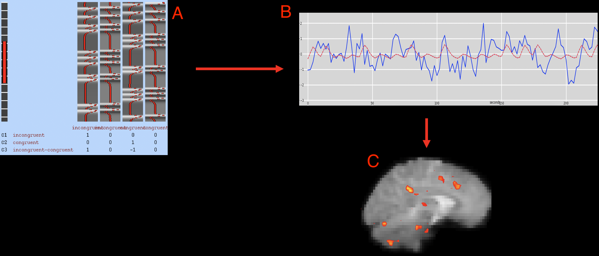

.. _fMRI_05_Análisis de primer nivel:

Tutorial de fMRI n.º 5: Estadística y modelado
===============

-----------

Descripción general
********

Ahora que la primera ejecución funcional ha sido preprocesada, podemos **ajustar un modelo** a los datos. Para comprender cómo funciona el ajuste de modelos, necesitamos repasar algunos fundamentos como el Modelo Lineal General, la respuesta BOLD y qué es una serie temporal. Cada uno de estos temas se aborda en el siguiente índice.

Tras revisar estos conceptos, estará listo para ejecutar un análisis de primer nivel con FEAT. La figura a continuación ilustra cómo ajustaremos un modelo a los datos.

   Tras construir un modelo que indica cómo debería ser la respuesta BOLD (A), dicho modelo se ajusta a la serie temporal en cada vóxel (B). El grado de ajuste del modelo (también conocido como **bondad de ajuste**) se puede representar en el cerebro mediante mapas estadísticos, donde las intensidades más brillantes indican un mejor ajuste. Estos mapas estadísticos se pueden umbralizar para mostrar solo los vóxeles con un ajuste estadísticamente significativo (C).

.. árbol de toc::
   :profundidad máxima: 1
   :caption: Análisis de primer nivel

   Estadísticas/01_Estadísticas_Series_Tiempo
   Estadísticas/02_Estadísticas_Historial_HRF
   Estadísticas/03_Estadísticas_HRF_Resumen
   Estadísticas/04_Estadísticas_General_Modelo_Lineal
   Estadísticas/05_Creación_de_Archivos_de_Cronometraje
   Estadísticas/06_Estadísticas_Ejecución_Análisis_de_1er_Nivel
   Estadísticas/07_Estadísticas_1er_Nivel_Punto_de_Control

.. nota::

   Comprender el ajuste de modelos y el análisis de primer nivel puede ser un desafío. No se desanime si no comprende todo la primera vez que lea los capítulos; persevere y los conceptos se aclararán con el tiempo y la práctica.

