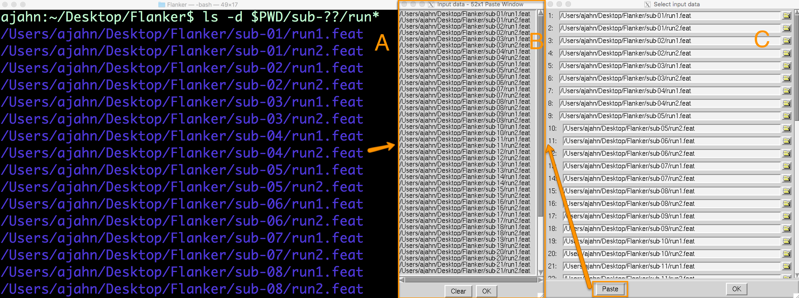
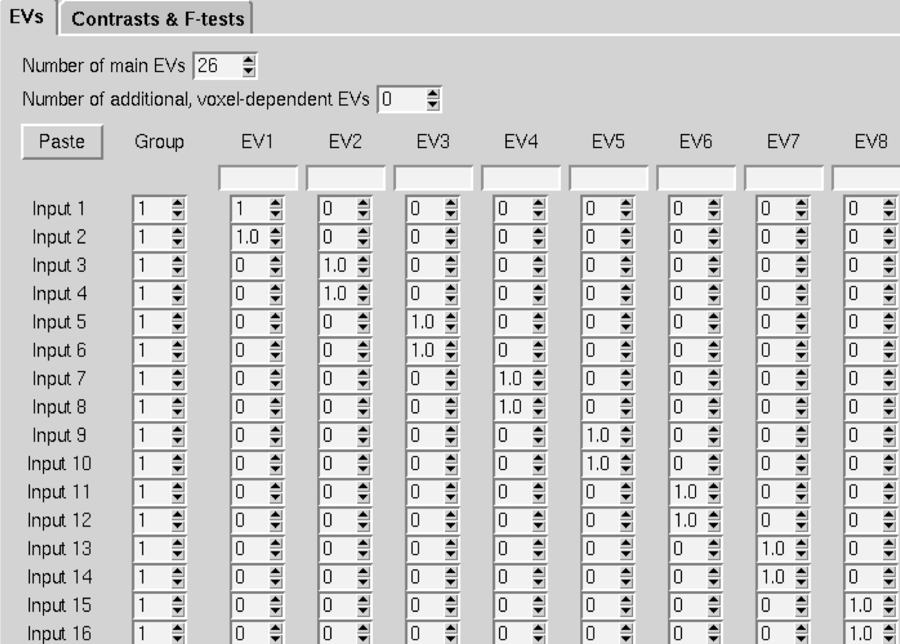
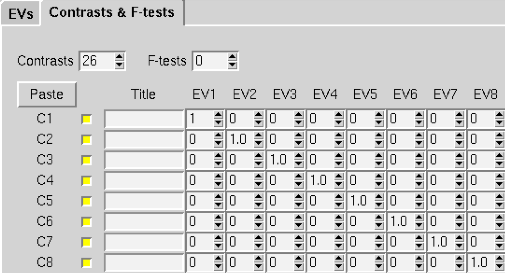
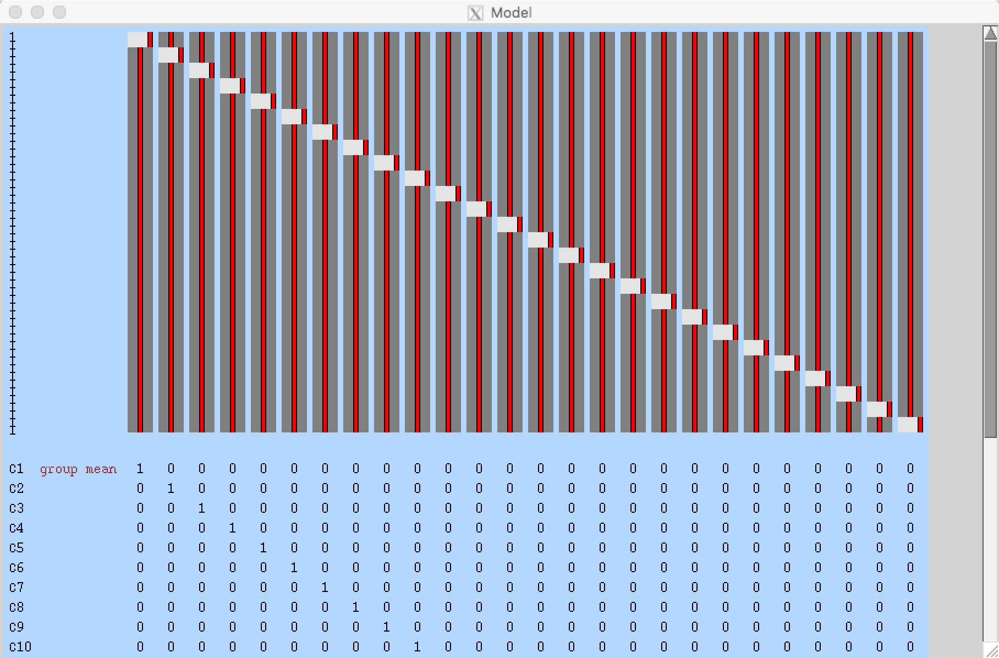

.. _fMRI_07_Análisis de segundo nivel:

Tutorial de fMRI n.° 7: Análisis de segundo nivel
====================================

Descripción general
********

Una vez preprocesadas y analizadas todas las ejecuciones de todos los sujetos del conjunto de datos Flanker, estará listo para ejecutar un **análisis de segundo nivel**. Mientras que AFNI y SPM definen un análisis de segundo nivel como sinónimo de un análisis de grupo, en FSL un análisis de segundo nivel consiste en promediar, dentro de cada sujeto, las estimaciones de parámetros y las estimaciones de contraste de los análisis de primer nivel.

Desde el directorio Flanker, abra la interfaz gráfica de FEAT desde la línea de comandos escribiendo ``Feat_gui``. A continuación, en el menú desplegable, seleccione ``Análisis de alto nivel``. Esto cambia el campo de entrada a ``Seleccionar directorios de FEAT``.

.. nota::

  El menú desplegable de la pestaña Datos permite elegir entre «Las entradas son directorios FEAT de nivel inferior» (opción predeterminada) o «Las entradas son imágenes de corte 3D de directorios FEAT». Seleccionar los directorios FEAT permite seleccionar las imágenes de corte que se analizarán, aunque seleccionarlas directamente ofrece mayor flexibilidad si no se analizaron los datos con el flujo de procesamiento predeterminado de FSL (es decir, si los datos no están organizados en un directorio FEAT).
  
  
Selección de los directorios FEAT
******************************

Dado que teníamos 26 sujetos con 2 ejecuciones cada uno, tenemos un total de 52 directorios FEAT. Cambie el "Número de entradas" a 52 y haga clic en el botón "Seleccionar directorios FEAT".

Se *podría* seleccionar manualmente cada directorio FEAT, haciendo clic en el icono de carpeta y seleccionando cada uno individualmente. Sin embargo, como vimos al programar nuestro análisis, esto no suele ser recomendable: resulta poco práctico para conjuntos de datos grandes y la probabilidad de error aumenta con el número de sujetos.

En su lugar, utilizaremos comodines.`__ para que esto sea más rápido y sencillo. Regresa a la Terminal desde la que iniciaste la interfaz gráfica de FEAT, navega al directorio de Flanker, escribe ``Ctrl+Z``, luego ``bg`` y presiona Enter. Esto te permitirá escribir comandos en la Terminal mientras mantienes abierta la interfaz gráfica de FEAT. En la línea de comandos, escribe lo siguiente:

::

  ls -d $PWD/sub-??/ejecutar*
  
Esto imprimirá una ruta absoluta a cada directorio FEAT. La opción ``-d`` indica solo la lista de directorios, y ``$PWD`` se expande a una ruta absoluta que apunta al directorio de trabajo actual. Dentro del directorio actual, cualquier directorio que comience con ``sub-`` y termine con dos dígitos (representados por los comodines ``?``) se añade a la ruta. Finalmente, dentro de cada directorio principal, cualquier directorio que comience con la cadena ``run`` se añadirá a la ruta (p. ej., run1.feat y run2.feat).

Esto creará una lista con 52 entradas, una correspondiente a cada ejecución de cada sujeto del estudio. Resalte la lista completa y cópiela presionando "Comando+C". Esto copiará la lista al portapapeles. Luego, regrese a la ventana "Seleccionar datos de entrada" y haga clic en el botón "Pegar". Haga clic en la ventana "Datos de entrada", presione "Ctrl+Y" y haga clic en "Aceptar". Esto pegará la lista de directorios en las filas correspondientes de la ventana "Seleccionar datos de entrada".

  Se puede generar una lista de directorios FEAT en la Terminal mediante una combinación de variables y comodines (A). Al hacer clic en el botón "Pegar" (C), se abrirá la ventana "Datos de entrada", donde se puede pegar la lista de directorios (B).
  

En la pestaña Datos, verá que ahora hay tres copias de nivel inferior que puede analizar. Si deja las tres casillas seleccionadas, se ejecutará un análisis de segundo nivel para cada una, que corresponde a:

1. La estimación del contraste para la condición incongruente;
2. La estimación del contraste para la condición congruente;
3. La estimación de contraste para Incongruente menos Congruente (es decir, tomando la diferencia de las estimaciones de los parámetros)

En el campo "Directorio de salida", escriba "Flanker_2ndLevel". Aquí se guardarán los resultados del análisis de segundo nivel.

Creando el GLM
****************

La pestaña "Estadísticas" tendrá un aspecto diferente al del análisis de primer nivel: ahora puede elegir entre diferentes tipos de **inferencia** o cómo desea que los resultados se generalicen a la población. El menú desplegable incluye las siguientes opciones:

1. Efectos fijos: no generalice a partir de la muestra, simplemente tome el promedio;
2. Efectos Mixtos: MCO Simple (Mínimos Cuadrados Ordinarios): Esto realizará una prueba t en las estimaciones de parámetros promedio calculadas para cada sujeto, sin tener en cuenta la variabilidad entre las ejecuciones para cada sujeto;
3. Efectos Mixtos: FLAME 1: Ponderar la estimación del parámetro de cada sujeto según la varianza de esa estimación de contraste. En otras palabras, un sujeto con varianza relativamente baja tendrá mayor ponderación, y uno con varianza relativamente alta tendrá menor ponderación.
4. Efectos mixtos: FLAME 1+2: una versión más rigurosa de FLAME 1. Toma mucho más tiempo y solo es útil para analizar muestras pequeñas (por ejemplo, 10 sujetos o menos);
5. Aleatorizar: una prueba no paramétrica (que se analiza en un capítulo posterior).

Dado que simplemente queremos promediar las estimaciones de los parámetros en las ejecuciones de cada sujeto, usaremos la opción **Efectos fijos**. Una vez seleccionada, haga clic en «Configuración completa del modelo».

Esto mostrará una ventana con el número de filas que representan el número de estimaciones de parámetros individuales; en nuestro caso, 52. Para el "Número de EV principales", cámbielo a 26, que corresponde al número de sujetos en nuestro conjunto de datos. Luego, cambie los números de cada columna a 1 donde desee obtener el promedio de las estimaciones de parámetros para ese sujeto. En nuestro caso, las dos primeras filas de la columna 1 se cambiarían a 1, las dos siguientes de la columna 2 también, y así sucesivamente.

  Captura de pantalla de una parte del GLM. Seguirás este mismo patrón para los 26 sujetos.
  
Cuando haya terminado, haga clic en la pestaña «Contrastes y pruebas F» y cambie el número de «Contrastes» a 26. Cambie todos los números en la diagonal a 1; esto creará una única estimación de contraste para cada sujeto que es el promedio de las estimaciones de parámetros de ese sujeto.

Cuando haya terminado de configurar el GLM y los contrastes y haga clic en "Listo", debería ver algo como esto:

Al igual que con el análisis de primer nivel, ignoraremos la pestaña «Estadísticas posteriores» por ahora, ya que no estamos realizando una inferencia de población.

Ahora haga clic en el botón "Ir" en la parte inferior de la interfaz gráfica de usuario y espere unos minutos a que se ejecute el análisis. Al finalizar, haga clic en el botón "Siguiente" para pasar al análisis de tercer nivel.

---------

Video
*****

Para ver una captura de pantalla sobre cómo crear un análisis de segundo nivel, haga clic aquí
    `__.

    
   

