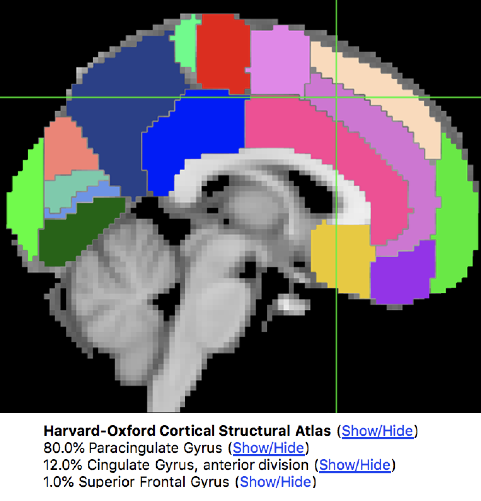
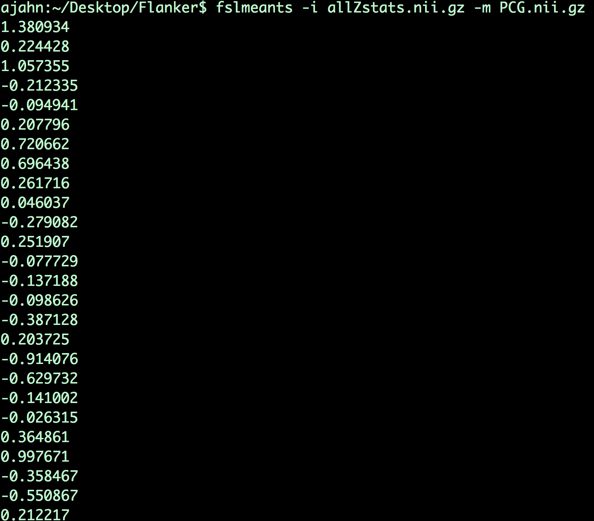

.. _fMRI_09_Análisis de ROI:

Tutorial de fMRI n.° 9: Análisis del ROI
==============================

---------

.. nota::

  Los ejemplos de este capítulo recomiendan extraer las estadísticas Z, pero también he escuchado que podría ser más apropiado extraer los valores COPE de cada sujeto. Estos se encuentran en una sola imagen dentro de cada directorio de análisis de tercer nivel, p. ej.: ``Flanker/Flanker_3rdLevel_Inc-Con.gfeat/cope1.feat/filtered_func_data.nii.gz``. Considere usar esto como entrada, tanto para ``fslmeants`` como para ``randomise``. Nota del 15/09/2024

Descripción general
********

Acaba de completar un análisis a nivel de grupo e identificar qué regiones del cerebro muestran una diferencia significativa entre las condiciones incongruentes y congruentes del experimento. Para algunos investigadores, esto podría ser todo lo que desean hacer.

Este tipo de análisis se denomina análisis **de cerebro completo** o **exploratorio**. Este tipo de análisis es útil cuando el experimentador no tiene una hipótesis sobre dónde podría estar la diferencia; el resultado se utilizará como base para futuras investigaciones.

Sin embargo, cuando se han realizado muchos estudios sobre un tema específico, podemos empezar a formular hipótesis más específicas sobre dónde deberíamos encontrar nuestros resultados en las imágenes cerebrales. Por ejemplo, el control cognitivo se ha estudiado durante muchos años, y se han publicado numerosos estudios de fMRI al respecto utilizando diferentes paradigmas que comparan tareas cognitivamente más exigentes con tareas cognitivamente menos exigentes. A menudo, se observan aumentos significativos en la señal BOLD durante condiciones cognitivamente exigentes en una región del cerebro conocida como **corteza prefrontal medial dorsal**, o dmPFC para abreviar. Para el estudio Flanker, entonces, podríamos restringir nuestro análisis a esta región y solo extraer datos de los vóxeles dentro de ella. Esto se conoce como análisis de **región de interés (ROI)**. Un nombre general para un análisis en el que se elige analizar una región seleccionada antes de ver los resultados de todo el cerebro se llama **análisis confirmatorio**.

Los mapas cerebrales completos pueden ocultar detalles importantes sobre los efectos que estudiamos. Podríamos encontrar un efecto significativo de incongruencia-congruencia, pero la razón podría ser que la incongruencia sea mayor que la congruencia, que la congruencia sea mucho más negativa que la congruencia, o que exista una combinación de ambas. La única manera de determinar la causa del efecto es mediante el análisis del ROI, lo cual es especialmente importante al trabajar con interacciones y diseños más sofisticados.

Uso de atlases
************

Una forma de crear una región para nuestro análisis ROI es utilizar un **atlas**, o un mapa que divide el cerebro en regiones anatómicamente distintas.

FSL ya tiene instalados varios atlas, a los que puede acceder a través del visualizador de FSL. Si hace clic en Configuración -> Orto Vista 1 -> Panel Atlas, se abrirá una nueva ventana llamada "Atlas". Por defecto, se cargarán los atlas corticales y subcorticales Harvard-Oxford. Puede ver cómo el atlas divide el cerebro haciendo clic en el enlace "Mostrar/Ocultar" junto al nombre del atlas. Al vóxel en el centro de la cruz en la ventana de visualización se le asignará una probabilidad de pertenecer a una estructura cerebral.

  El atlas cortical de Harvard-Oxford, mostrado en una plantilla cerebral MNI. La ventana del atlas muestra la probabilidad de que el vóxel se encuentre en una región anatómica específica.
  
Para guardar una de estas regiones como archivo para extraer datos, también conocido como **máscara**, haga clic en el enlace "Mostrar/Ocultar" junto a la región que desea usar como máscara. En nuestro ejemplo, supongamos que queremos usar la circunvolución paracingulada como máscara. Al hacer clic en el enlace, se mostrará esa región superpuesta sobre el cerebro y se cargará como superposición en la ventana Lista de superposiciones. Haga clic en el icono del disco junto a la imagen para guardarla como máscara. Guárdela en el directorio Flanker y llámela "PCG.nii".

.. figure:: Análisis_ROI_Máscara_PCG.png
  :escala: 25%

.. advertencia::

  Los resultados tendrán la misma resolución que la plantilla que se utilizó para la normalización. La plantilla predeterminada en FSL es MNI_152_T1_2mm_brain, con una resolución de 2x2x2 mm. Al crear una máscara, esta tendrá la misma resolución que la plantilla sobre la que se superpone. Al extraer datos de la máscara, tanto los datos como la máscara deben tener la misma resolución. Para evitar errores debido a diferentes resoluciones de imagen, utilice la misma plantilla que utilizó para crear la máscara y normalizar los datos.
  

Extracción de datos de una máscara anatómica
****************************************

Una vez creada la máscara, puede extraer las estimaciones de contraste de cada sujeto. Aunque podría pensar que extraeríamos los resultados del análisis de tercer nivel, en realidad queremos los del análisis de segundo nivel; el análisis de tercer nivel consiste en una sola imagen con un solo número en cada vóxel, mientras que en un análisis de ROI nuestro objetivo es extraer la estimación de contraste de cada sujeto individualmente.

Para la estimación del contraste incongruente-congruente, por ejemplo, puede encontrar los mapas de datos de cada sujeto en el directorio ``Flanker_2ndLevel.gfeat/cope3.feat/stats``. Los mapas de datos se han calculado de diversas maneras, incluyendo mapas de estadísticos t, imágenes de Cope e imágenes de varianza. Prefiero extraer datos de los mapas de estadísticos z, ya que estos datos se han convertido a una forma con distribución normal y, en mi opinión, son más fáciles de representar gráficamente e interpretar.

Para facilitar nuestro análisis del ROI, fusionaremos todos los mapas de estadísticas z en un único conjunto de datos. Para ello, utilizaremos una combinación de comandos FSL y Unix. Acceda al directorio «Flanker_2ndLevel.gfeat/cope3.feat/stats» y escriba lo siguiente:

::

  fslmerge -t allZstats.nii.gz `ls zstat* | sort -V`
  
Esto fusionará todas las imágenes de estadística z en un único conjunto de datos a lo largo de la dimensión temporal (especificada con la opción ``-t``); esto simplemente significa conectar en cadena los volúmenes en un único conjunto de datos más grande. El primer argumento indica el nombre del conjunto de datos de salida (``allZstats.nii.gz``), y el código entre comillas invertidas usa un asterisco comodín para listar cada archivo que empieza por "zstat" y luego los ordena numéricamente de menor a mayor con la opción ``-V``.

Mueva el archivo allZstats.nii.gz tres niveles hacia arriba para que se encuentre en el directorio principal de Flanker (es decir, escriba ``mv allZstats.nii.gz ../../..``). Luego, use el comando fslmeants para extraer los datos de la máscara PCG:

::

  fslmeants -i allZstats.nii.gz -m PCG.nii.gz
  
Esto imprimirá 26 números, uno por sujeto. Cada número representa la estimación del contraste para ese sujeto, promediada en todos los vóxeles de la máscara.

  Cada valor de este comando corresponde a la estimación de contraste utilizada en el análisis. Por ejemplo, el primer valor corresponde a la estimación de contraste promedio para Incongruente-Congruente para sub-01, el segundo valor es la estimación de contraste promedio para sub-02, y así sucesivamente. Estos valores se pueden copiar y pegar en un programa estadístico de su elección (como R) para luego ejecutar una prueba t.
  
Extraer datos de una esfera
******************************

Quizás haya notado que los resultados del análisis de ROI con la máscara anatómica no fueron significativos. Esto podría deberse a que la máscara PCG cubre una región muy extensa; aunque el PCG se etiqueta como una sola región anatómica, es posible que estemos extrayendo datos de varias regiones funcionales distintas. Por lo tanto, este podría no ser el mejor enfoque para el ROI.

Otra técnica se denomina enfoque de ROI esférico. En este caso, una esfera de un diámetro determinado se centra en un triplete de coordenadas x, y y z especificadas. Estas coordenadas suelen basarse en la activación máxima de otro estudio que utiliza el mismo diseño experimental o uno similar al suyo. Esto se considera un análisis **independiente**, ya que el ROI se define con base en un estudio aparte.

La siguiente animación muestra la diferencia entre las ROI anatómicas y esféricas:

.. figure:: Análisis_ROI_Anatómico_Esférico.gif

Para crear este ROI, necesitaremos encontrar las coordenadas pico de otro estudio; escojamos al azar un artículo, como Jahn et al., 2016. En la sección Resultados, encontramos que hay un efecto de Conflicto para una tarea de Stroop (un diseño experimental distinto pero relacionado, también destinado a aprovechar el control cognitivo) con una estadística t máxima en las coordenadas MNI 0, 20, 40.

.. figure:: Análisis_de_ROI_Estudio_de_Jahn.png

Los siguientes pasos son complicados, así que presta mucha atención a cada uno:

1. Abra fsleyes y cargue una plantilla MNI. En los campos bajo la etiqueta "Coordenadas: MNI152" de la ventana "Ubicación", escriba "0 20 44". Justo a la derecha de estos campos, observe el cambio correspondiente en los números en los campos bajo "Ubicación del vóxel". En este caso, son "45 73 58". Anote estos números.

2. En la terminal, navegue hasta el directorio Flanker y escriba lo siguiente:

::

  fslmaths $FSLDIR/datos/estándar/MNI152_T1_2mm.nii.gz -mul 0 -add 1 -roi 45 1 73 1 58 1 0 1 Jahn_ROI_dmPFC_0_20_44.nii.gz -odt float

Este es un comando largo y complejo, pero por ahora, observe dónde insertamos los números 45, 73 y 58. Al crear otra ROI esférica basada en diferentes coordenadas, estos son los únicos números que cambiará. (Al crear una nueva ROI, también debe cambiar la etiqueta del archivo de salida). La salida de este comando es un único vóxel que marca el centro de las coordenadas especificadas anteriormente.

3. A continuación, escriba:

::

  fslmaths Jahn_ROI_dmPFC_0_20_44.nii.gz -kernel esfera 5 -fmean Jahn_Sphere_dmPFC_0_20_44.nii.gz -odt flotante

Esto expande el vóxel en una esfera con un radio de 5 mm y llama a la salida "Jahn_Sphere.nii.gz". Si quisiera cambiar el tamaño de la esfera a 10 mm, por ejemplo, cambiaría esta sección de código a ``-kernel sphere 10``.

4. Ahora, escribe:

::

  fslmaths Jahn_Sphere_dmPFC_0_20_44.nii.gz -bin Jahn_Sphere_bin_dmPFC_0_20_44.nii.gz
  
Esto binarizará la esfera, para que pueda ser leída por los comandos FSL.

.. nota::

  En los pasos que se acaban de mencionar, observe cómo la salida de cada comando se utiliza como entrada para el siguiente. Modificará esto para su propio ROI, si decide crear uno.

5. Por último, extraeremos datos de este ROI escribiendo:

::

  fslmeants -i allZstats.nii.gz -m Jahn_Sphere_bin_dmPFC_0_20_44.nii.gz
  

Los números que obtenga de este análisis deberían ser muy diferentes a los que creó con la máscara anatómica. Copie y pegue estos comandos en el programa estadístico que prefiera y realice una prueba t de una muestra. ¿Son significativos? ¿Cómo los describiría si tuviera que plasmar estos resultados en un manuscrito?

-------

Ceremonias
*********

1. La máscara utilizada con fslmeants está **binarizada**, lo que significa que cualquier vóxel con un valor numérico mayor que cero se convertirá a "1" y, a continuación, se extraerán datos solo de los vóxeles etiquetados con "1". Recordará que la máscara creada con fsleyes es **probabilística**. Si desea ponderar las estimaciones de contraste extraídas por el peso de probabilidad, puede hacerlo usando la opción ``-w`` con fslmeants. Pruebe a escribir:

::

  fslmeants -i allZstats.nii.gz -m PCG.nii.gz -w
  
Observe cómo difieren los números con respecto al método anterior, que usaba una máscara binarizada. ¿Es pequeña la diferencia? ¿Grande? ¿Es la esperada?

2. Utilice el código proporcionado en la sección sobre análisis de ROI esférico para crear una esfera con un radio de 7 mm ubicada en las coordenadas MNI 36, -2, 48.

3. Utilice el atlas subcortical de Harvard-Oxford para crear una máscara anatómica de la amígdala derecha. Etiquétela como desee. Luego, extraiga las estadísticas z de COPE1 (es decir, las estimaciones de contraste para Incongruencia en comparación con la línea base).

--------

Video
*****

Haga clic aquí`__ para una demostración de cómo utilizar máscaras anatómicas y esféricas para un análisis de ROI.

   

