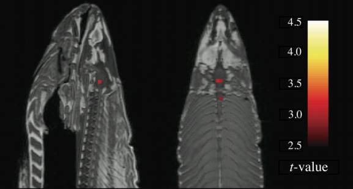
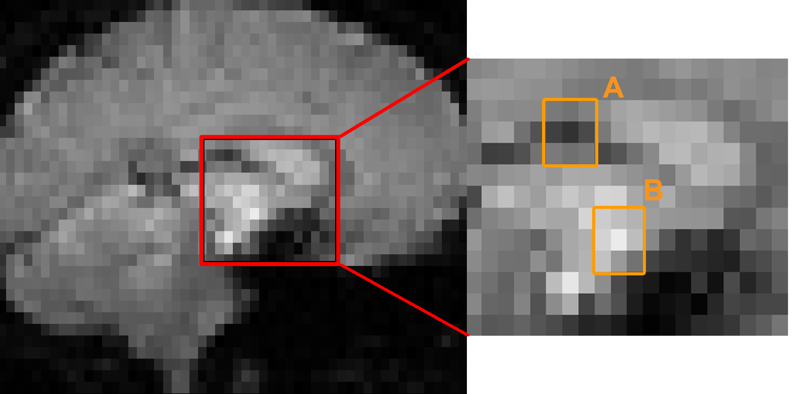
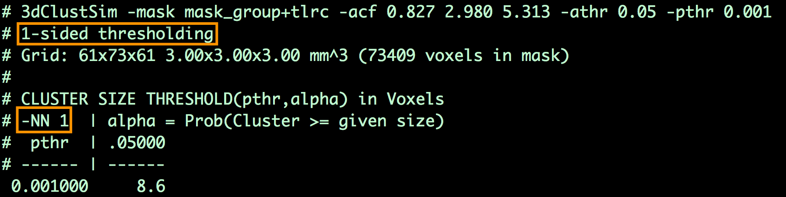
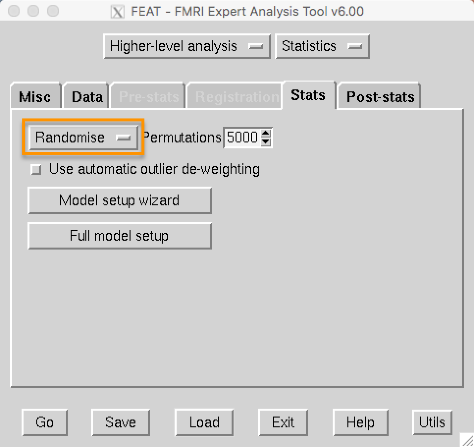
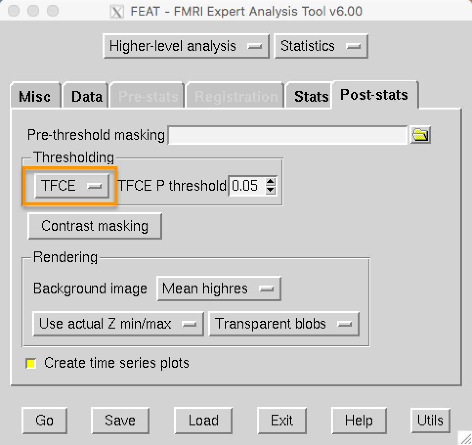
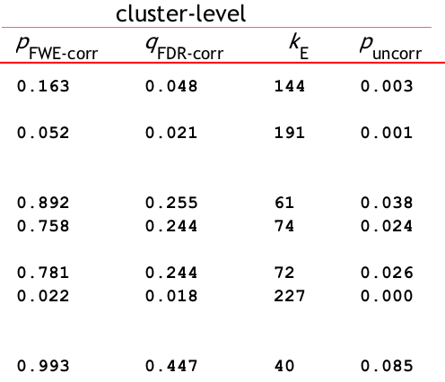
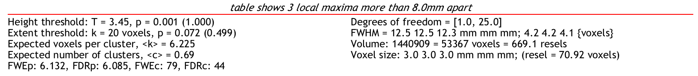

.. _Apéndice_A_Corrección de clúster:

Apéndice A: Corrección de conglomerados
==============================

-------------

El problema de las comparaciones múltiples
***********************************

En el tutorial de fMRI que acaba de completar, aprendió que los mapas de contraste a nivel de grupo se crean mediante un **análisis univariado de masas**: es decir, realizamos tantas pruebas estadísticas como vóxeles haya. Dado que un conjunto de datos típico de fMRI contiene cientos de miles de vóxeles, esto puede generar una gran cantidad de falsos positivos. Por lo tanto, para controlar el número de falsos positivos y mantenerlo en el nivel convencional del 5%, necesitaremos realizar una **corrección por comparaciones múltiples**.

.. nota::

  Para la mayoría de las pruebas estadísticas, fijamos la **tasa de falsos positivos**, también conocida como **nivel alfa**, en 0,05, o 5 %. Esta es la probabilidad de que rechacemos la hipótesis nula si esta es verdadera; en otras palabras, es la probabilidad de que observemos un falso positivo.
  

No corregir las comparaciones múltiples puede generar resultados poco fiables y, en ocasiones, absurdos. Para ilustrar esto, y para recalcar algo que presumiblemente no podría explicarse de otra manera, el investigador Craig Bennett introdujo un salmón muerto en un escáner, le mostró imágenes de humanos hablando, jugando y socializando, y analizó los datos como si se tratara de cualquier otro estudio, solo que sin corregir las comparaciones múltiples. Los vóxeles significativos encontrados en el cerebro del salmón eran claramente artefactos causados por el ruido; el mensaje es que un cierto número de vóxeles superará un umbral de significancia, independientemente de si existe un efecto real o no.

  La famosa imagen del "Salmón muerto" de Bennet et al. (2009).

Corrección de Bonferroni
*********************

Si queremos realizar varias pruebas, como suele hacerse en muchos estudios, ¿qué podemos hacer para evitar confundir falsos positivos con efectos reales? El método más sencillo se denomina **Corrección de Bonferroni**, en honor al matemático italiano Carlo Bonferroni. Simplemente se toma el nivel alfa (tradicionalmente fijado en el 5 %) y se divide entre el número de pruebas.

Esto funciona bastante bien para estudios de comportamiento que consisten en un puñado de pruebas, pero rápidamente se vuelve irrazonable cuando se aplica a datos de imágenes. Por ejemplo, si su mapa de contraste a nivel de grupo contiene 100.000 vóxeles y su nivel alfa es de 0,05, un vóxel individual tendrá que pasar un nivel alfa corregido de 0,05/100.000 = 0,0000005 para ser considerado estadísticamente significativo. O bien el efecto debe ser fenomenalmente fuerte, o bien el estudio tiene una alta potencia, para que un vóxel alcance este umbral; pero los efectos a menudo no son tan fuertes, y los estudios de imágenes no suelen tener una potencia tan alta. Pero si queremos utilizar otro método de corrección, primero tendremos que justificar por qué la corrección de Bonferroni no es apropiada para estudios de imágenes.

Problemas con la corrección de Bonferroni
***********************************

Uno de los supuestos de la corrección de Bonferroni es que cada prueba es independiente. Por ejemplo, nuestro conjunto de datos de fMRI significaría que cada vóxel es completamente independiente de los demás vóxeles del cerebro; conocer el valor de un vóxel no indica nada sobre los demás.

Pero ¿son los vóxeles completamente independientes? Analicemos una imagen típica de fMRI. Observe que un vóxel dado es similar a sus vecinos: los vóxeles brillantes tienden a estar rodeados de vóxeles más brillantes, y los vóxeles más oscuros tienden a estar rodeados de vóxeles más oscuros. Dado que podemos hacer una estimación relativamente precisa de cómo se verá la intensidad de la señal de un vóxel dados sus vecinos, los vóxeles no son completamente independientes. (La misma lógica se aplica también a la evolución temporal en cada vóxel).

  Una imagen típica de fMRI (izquierda) con el recuadro que muestra una imagen ampliada de los vóxeles en el centro (derecha). Observe que el vóxel central de la región A está rodeado principalmente por vóxeles más oscuros, mientras que el vóxel central de la región B está rodeado principalmente por vóxeles más claros.
  
Por lo tanto, la corrección de Bonferroni es demasiado severa. Aunque prácticamente se garantiza que la tasa de falsos positivos se mantendrá por debajo del 5%, es probable que esto resulte en una alta tasa de falsos negativos; es decir, que no se rechace la hipótesis nula cuando realmente existe un efecto. Y aunque continúa el debate sobre qué tipo de resultado falso es peor, en nuestro caso sería preferible prescindir por completo de la corrección de Bonferroni.
  
  
Corrección de clúster
******************

Afortunadamente, existe una alternativa conocida como **corrección de clúster**, que es el método de corrección más popular en el análisis fMRI (`Woo et al., 2014`__). La corrección de grupos aprovecha el hecho de que los vóxeles en un conjunto de datos típico no son completamente independientes: en lugar de probar cada vóxel individualmente, se prueban *grupos* de vóxeles para determinar su significancia.

Para ilustrar esto, tomemos un corte coronal del contraste incongruente-congruente a nivel de grupo que creó en el tutorial de fMRI. Observe cómo los colores más brillantes se agrupan en grupos distintos; si inclinamos este corte en una vista tridimensional, podemos ver cómo los grupos de vóxeles se agrupan formando lo que parecen cordilleras. Visto desde este ángulo, la altura de un vóxel individual está determinada por su valor z: los valores z más altos corresponden a picos más altos. El umbral que aplicamos es una sección transversal de las montañas a una altura determinada (por ejemplo, un valor z de 3,1, que corresponde a un valor p de 0,001) y solo observamos los picos que permanecen después de aplicar este umbral. Esto se conoce como **umbralizar** la imagen o, más específicamente, establecer un **umbral de definición de grupo**, ya que solo los vóxeles que estén en ese umbral o por encima de él permanecerán, y este umbral es el valor que se ve en la pestaña Estadísticas posteriores de la GUI de FEAT.

.. figure:: Zstat_Peak_Demo.gif

You may think that's all we need to do; but a cluster-defining threshold is not the same as an alpha level. It could be that clusters as large as the ones in our group analysis are just as likely to be found in images created from pure noise. What we need to ask ourselves at this point is, How many clusters of a given size would be expect to observe due to chance? Let's say that our cluster in the medial prefrontal cortex is 50 voxels large; how often would we expect a cluster that size to be generated by noise?

To answer this we run simulations - in other words, we create artificial datasets with the same dimensions and smoothness as our task dataset, but which are composed of pure noise. We then write down the size of the largest cluster, and repeat the process with another simulated dataset. If we do this thousands of times, we can create a distribution of maximum cluster sizes - and from this, we can calculate the percentage of the time we would observe a cluster as large as the one we generated from our task dataset.  If that percentage is lower than our alpha level of 5%, we can reject the null hypothesis.

AFNI's 3dFWHMx and 3dClustSim
^^^^^^^^^^^^^^^^^^^^^^^^^^^^^

AFNI's cluster correction method requires the user to estimate the smoothness of the data, and to then use those smoothness estimates to determine a threshold for significant clusters.

To do this, you will first need to run 3dFWHMx on a subject's errts file, which contains the residuals of everything that wasn't modeled - in other words, noise. For example, from sub-01's sub-01.results directory, type:

::

  3dFWHMx -mask mask_group+tlrc -input errts.sub-01_REML+tlrc -acf
  

Which will output numbers like the following:

::

  0.827124 2.9802 5.31313    7.16512
  
The first three numbers are the parameters needed to create the **autocorrelation function**, a model of how correlated a given voxel is with its neighbors; the last number is the estimated smoothness of the data, in millimeters. Note that it will be higher than the smoothing kernel that you use, since the kernel is applied to smoothness that is already in the data.

These numbers can then be used with 3dClustSim, e.g.:

::

  3dClustSim -mask mask_group+tlrc -acf 0.827 2.980 5.313 -athr 0.05 -pthr 0.001
  
In which ``athr`` indicates the overall alpha threshold for the clusters, which we will leave at the conventional level of 0.05, and ``pthr`` indicates the uncorrected cluster-forming p-threshold.

This will generate a table that shows the number of contiguous voxels that are needed for a cluster to be deemed statistically significant. For example, the output may look like this:

Which indicates that, for a cluster-defining threshold of p=0.001, a cluster is significant if it is composed of 8.6 or more voxels. (To be safe, round up to the next highest integer, even if the determined cluster size is 8.1. In this example, we would only include those clusters of 9 or more voxels.)

In addition, the table includes permutations of different "NN" and "N-sided" values. Below is a glossary of what these abbreviations mean:

::

  NN1 - Voxels are contiguous (i.e., part of the same cluster) if the faces touch
  NN2 - Faces OR edges need to touch
  NN3 - Faces OR edges OR corners need to touch

  1-sided - Voxels are contiguous if they have the same sign (e.g., only looking at voxels where A>B)
  2-sided - Voxels are contiguous if they are either positive or negative
  bi-sided - Separate the clusters if the voxels have different signs

FSL's Randomise
^^^^^^^^^^^^^^^

FSL has a command called ``Randomise``, which creates a distribution from the data by randomly permuting the signs of the contrasts that are specified. For example, if you had a between-subjects design with 20 subjects in each group, and you had created the design matrix through the FEAT GUI, you could run something like this:

::

  randomise -i allZs.nii.gz -o allZs -d Unfair-Fair_Rejected-Accepted.mat -con Unfair-Fair_Rejected-Accepted.con -n 1000 -T
  
"allZs.nii.gz" is a file of the combined zstat images from both groups, created using fslmerge. The .mat and .con files are created using the Setup Model Wizard from the FEAT GUI. Usually about 5000 permutations or more should be selected in order to create a robust distribution.

Alternatively, if you are running permutations on a one-sample t-test, you can use shorthand to omit the design and contrast files:

::

  randomise -i allZstats.nii.gz -o allZstats_randomise.nii -1 -T -n 500
  
Randomise can also be run from the 3rd-level analysis. If you navigate to your 3rd-level directory, open FEAT, and load the design.fsf file, click on the ``Stats`` tab and change ``FLAME1`` to ``Randomise``:

On the post-stats tab under ``Thresholding``, ``TFCE`` is now an option that you can choose:

SPM's Cluster Correction
^^^^^^^^^^^^^^^^^^^^^^^^

SPM will automatically calculate whether a given cluster is significant, given the cluster-defining threshold you specify in the "Results" window. 

You can see the threshold at the very bottom of the results screen, next to FWEc. In this case, using a voxel-wise threshold of p=0.001, a cluster of 79 voxels or more is needed to be statistically significant. Here's a breakdown of what the different labels mean:

::

  FWEp: 6.132 -> an individual voxel needs a z-value of 6.132 or greater to pass a Bonferroni-corrected p=0.05 alpha threshold
  FDRp: 6.085 -> un vóxel individual necesita un valor z de 6.085 o mayor para pasar un umbral alfa p=0.05 corregido por FDR
  FWEc: 79 -> Para el umbral de formación de grupos seleccionado actualmente (por ejemplo, p = 0,001), un grupo debe estar compuesto por 79 o más vóxeles contiguos para pasar una corrección FWE de p = 0,05
  FDRc: 44 -> Para el umbral de formación de grupos seleccionado actualmente (por ejemplo, p = 0,001), un grupo debe estar compuesto por 44 o más vóxeles contiguos para pasar una corrección FDR de p = 0,05

Si desea utilizar 3dClustSim de AFNI en los datos SPM preprocesados (por ejemplo, porque "confía más en el umbral de corrección de clúster de AFNI que en el de SPM"),
    `__ - necesitarás `guardar los residuos 
     `__ al ejecutar el análisis de primer nivel.

Cuando haya creado los residuos, utilice el siguiente código para concatenar los residuos en un único conjunto de datos:

::

  3dTcat -prefijo allRes.nii Res*
  
Luego ejecute 3dFWHMx en el conjunto de datos residuales concatenados:

::

  3dFWHMx -mask máscara.nii -acf -input allRes.nii
  
Luego, siga los pasos anteriores para ejecutar 3dClustSim en los valores ACF resultantes.

------------

Video
*****

Para obtener una descripción general de la corrección de clúster y cómo funciona, mire este video
      `__.

      
     
    
   

