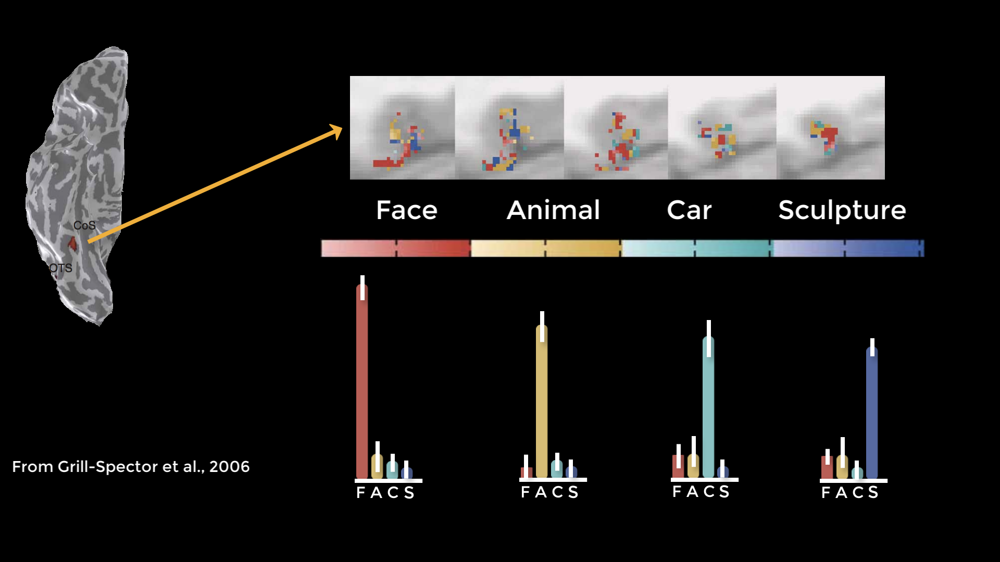
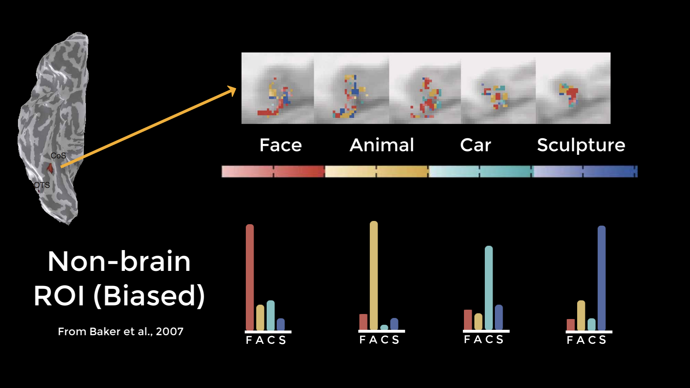
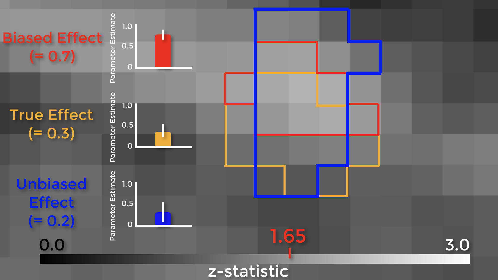

.. _Apéndice_B_Análisis sesgado:

===========================
Apéndice B: Análisis sesgado
===========================

---------------

¿Qué es un análisis sesgado?
**************************

En 2009, se publicó el artículo "Correlaciones sorprendentemente altas en estudios de fMRI", más conocido como "Correlaciones vudú". El artículo afirmaba que algunas correlaciones en estudios de imagen estaban infladas debido a la "no independencia" o "análisis circular".

El análisis circular se produce cuando los datos se seleccionan con base en ciertos criterios y luego se prueba su significancia según esos mismos criterios. Por ejemplo, imaginemos que queremos comprobar si beber Four Loko ayuda a los estudiantes universitarios a obtener mejores resultados en sus exámenes. Supongamos que observamos qué estudiantes mostraron una mejora y luego realizamos nuestro análisis final a nivel de grupo solo con esos estudiantes. Obviamente, este sería un análisis sesgado, ya que solo nos centramos en los sujetos que tienen el efecto buscado; ya no se trata de una muestra verdaderamente aleatoria.

Análisis circulares con datos fMRI
********************************

Los análisis circulares también pueden ocurrir con datos de imágenes, aunque no son tan evidentes cuando ocurren. Esto se señaló por primera vez en un estudio que examinó la actividad en el área fusiforme de la cara en respuesta a diferentes estímulos. Extrajeron datos de los vóxeles significativos de cada condición y descubrieron un patrón de actividad selectiva.

  Figura de Grill-Spector et al., 2006. La superficie cortical de la derecha es una vista ventral del hemisferio derecho; los vóxeles significativos para cada condición (Rostros, Animales, Automóviles y Esculturas) se muestran en cinco cortes axiales contiguos (fila superior). Los histogramas representan el cambio porcentual de la señal para cada condición, lo que en este caso sugiere que el área fusiforme del rostro contiene vóxeles selectivos no solo para rostros, sino también para otros tipos de estímulos.

Sin embargo, se señaló que si se seleccionaba una ROI fuera del cerebro que contenía vóxeles significativos por casualidad y se realizaban las mismas pruebas en esos vóxeles, se obtendría el mismo patrón, lo cual claramente no debería ocurrir. Al repetir el análisis utilizando ROI independientes, se encontró un patrón de ruido, lo cual sería esperable en una ROI no cerebral. Al realizar un análisis de ROI imparcial con los datos originales, se observó que el patrón original desaparecía.

  Resultados de un análisis de Baker et al. (2007) que demuestra que el mismo patrón de actividad puede encontrarse en una región extracerebral. Si bien algunos vóxeles contendrán grandes efectos debido simplemente al azar, estos son los mismos vóxeles que se utilizan en un análisis sesgado, lo que sugiere que los resultados del artículo de Grill-Spector también podrían deberse al azar.
  
  
.. figure:: Baker_2007_Imparcial.png

  Análisis de validación cruzada de los datos originales de Grill-Spector 2006. Este análisis imparcial muestra que el área fusiforme del rostro parece responder a los rostros, pero no selectivamente a ninguna de las otras categorías utilizadas en el experimento.

Análisis sesgados y tamaños de efectos inflados
*****************************************

Veamos cómo las ROI sesgadas conducen a tamaños de efecto inflados. La figura a continuación muestra un mapa de puntuaciones z a nivel de grupo, ampliado en una región de la corteza prefrontal medial. Podemos ver los límites de cada vóxel individual, con un rango de puntuaciones z de 0 a 3. Supongamos que existe un efecto real en el cerebro, resaltado en naranja. Si extrajéramos las estimaciones de los parámetros para cada sujeto de esos vóxeles, el efecto sería de 0,3, con cierta variación en torno a ese valor. Ahora supongamos que establecemos el umbral de nuestra imagen en un nivel sin corregir de p < 0,05, o una puntuación z de 1,65. Los vóxeles resaltados en rojo son los únicos que superan ese umbral.

Aquí está la parte importante: observe que esta región se superpone con algunos de los vóxeles de efecto real, pero que también incluye algunos vóxeles de ruido. Dado que la región, por definición, solo puede incluir vóxeles que superan un umbral determinado, solo contendrá vóxeles de ruido que lo superen, lo que sesga el efecto para que sea mayor que el efecto real. Si usáramos una ROI independiente, por ejemplo, con validación cruzada, crearíamos una región que probablemente contenga algunos vóxeles de efecto real y también algunos vóxeles de ruido; sin embargo, estos vóxeles de ruido no estarán sesgados para ser artificialmente altos o bajos. En este ejemplo, el efecto no sesgado es ligeramente inferior al efecto real, pero en teoría podría ser mayor o menor; simplemente no estará sesgado en ningún sentido.

En 2009, el artículo "Voodoo Correlations" afirmó que muchos estudios utilizaban análisis sesgados que resultaban en correlaciones infladas, y también afirmó que, si se utilizaran análisis imparciales, la distribución de los efectos sería menor. En respuesta, otros investigadores argumentaron que, si se corrigen las comparaciones múltiples, el efecto sí existe. Además, si se realiza un análisis exploratorio para determinar dónde se localiza un efecto, ¿qué hay de malo en examinar los vóxeles significativos para ver qué lo impulsa? ¿No es bueno saber qué está sucediendo?

Estos argumentos presentan dos problemas. Primero, la magnitud del efecto es tan importante como detectar si existe, y los análisis sesgados la sobreestiman sistemáticamente. ¿Por qué? Porque, por definición, los estudios pequeños solo pueden detectar efectos grandes. Segundo, si se publica un análisis sesgado, el lector puede asumir que se trata de un análisis inferencial, incluso si incluye advertencias sobre cómo se realizó. Si insiste en presentarlos en una figura, al menos no incluya barras de error.

Demostración
=============

Utilizando los mismos datos del capítulo FSL sobre análisis de ROI, cree un ROI sesgado alrededor del pico del contraste Inc-Con (que está en las coordenadas de vóxel 47, 71, 59):

::

  fslmaths $FSLDIR/datos/estándar/MNI152_T1_2mm.nii.gz -mul 0 -add 1 -roi 47 1 71 1 59 1 0 1 biasedROI.nii.gz -odt float
  fslmaths biasedROI.nii.gz -kernel sphere 5 -fmean biasedROI_Sphere.nii.gz -odt float
  fslmaths sesgadoROI_Sphere.nii.gz -bin sesgadoROI_Sphere_bin.nii.gz
  
Y luego extrae los datos de este ROI usando fslmeants:

::

  fslmeants -i allZstats.nii.gz -m biasedROI_Sphere_bin.nii.gz

Cómo crear retornos de inversión imparciales
***************************

Las dos formas más populares de crear ROI imparciales son:

1. De un atlas; o
2. Creando una esfera centrada en las coordenadas reportadas por otro estudio.

AFNI y FSL incluyen cada uno su propio conjunto de atlas (para SPM, primero deberá descargar una caja de herramientas aparte). Para obtener más información sobre cómo usar los atlas de cada paquete, siga estos enlaces a los tutoriales de AFNI.`, :ref:`FSL 
    `, y :ref:`SPM 
     `.

Las ROI esféricas se crean anotando las coordenadas del pico de activación reportado por otro estudio. Idealmente, este debería ser un estudio que utilice un experimento idéntico al suyo, o al menos muy similar. En la mayoría de los casos, deberá encontrar un estudio que utilice un experimento que, al menos, aproveche el mismo proceso cognitivo que está estudiando. También puede encontrar métodos para crear ROI esféricas en los mismos enlaces mencionados.

Una tercera forma de crear ROI imparciales es utilizar un mapa de metanálisis, que representa una combinación de mapas estadísticos individuales reportados por cientos o miles de estudios. El generador de metanálisis más accesible es `Neurosynth`.
      `__, que permite generar estos mapas en segundos. Para más detalles sobre cómo crearlos, consulte este tutorial. 
       `.

Por último, puede crear un ROI a partir de un contraste generado en una ejecución específica del experimento, generalmente llamado escaneo **localizador** (que no debe confundirse con un localizador anatómico, que a menudo se utiliza para ayudar a adquirir el escaneo anatómico final).

Otros tipos de análisis sesgados
******************************

Solo hemos mencionado un par de maneras diferentes de realizar análisis sesgados, pero también existen otras, y es necesario estar atento a ellas. Supongamos que se utiliza una ROI de la corteza cingulada anterior para el análisis confirmatorio (es decir, se seleccionó la ROI de antemano, independientemente de los resultados de todo el cerebro), pero los resultados no pasan la corrección. Se observa el mapa de todo el cerebro y se observa esto. Decides entonces utilizar una ROI ubicada más en la pre-AMS. Este también es un análisis sesgado, porque ahora se sabe dónde está el efecto antes de decidir de dónde extraerlo.

Ceremonias
*********

1. Realice un análisis sesgado con el programa que prefiera, extrayendo las estimaciones de contraste de un conglomerado en un mapa estadístico definido por dicho contraste y con un umbral de p < 0,05. Compare esto con un análisis imparcial, por ejemplo, con una máscara independiente.

2. Haga lo mismo que antes, pero con un umbral de mapa de p < 0,01. ¿El efecto aumenta? ¿Se reduce? ¿Por qué?

3. Establezca el umbral de su mapa estadístico hasta que solo quede un vóxel en un área determinada (como el ACC) y luego guarde ese vóxel como máscara. Realice un análisis sesgado con esta máscara y compruebe si el estadístico t resultante coincide con el umbral estadístico que utilizó para crear la máscara inicialmente.

---------

Video
*********

Para ver una descripción general en video del análisis circular, haga clic en este enlace
        
         `__.
        
       
      
     
    
   

