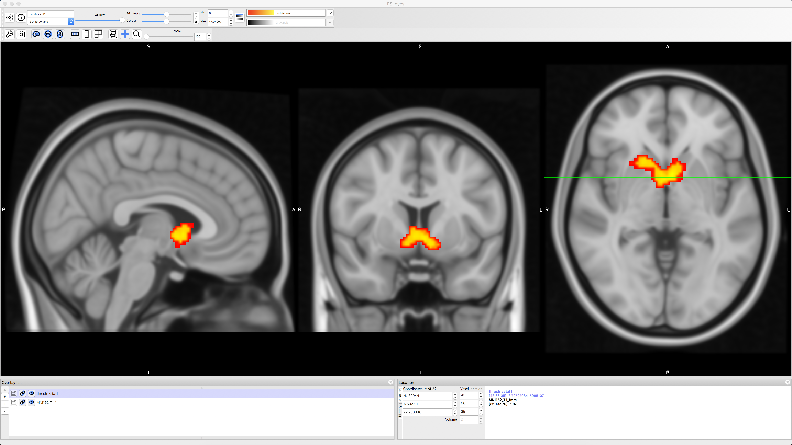

.. _Apéndice_F_Modulación Paramétrica:

=================================
Apéndice F: Modulación paramétrica
=================================

------------

Descripción general
********

Este apéndice muestra cómo configurar un análisis de **modulación paramétrica** en FSL. Puede encontrar una descripción general de la modulación paramétrica aquí.`, junto con el código para descargar los datos. Si ya tiene `Amazon Web Services` 
    `__ instalado, luego puedes abrir una Terminal y escribir lo siguiente:

::

  sincronización de aws s3: sin solicitud de firma s3://openneuro.org/ds000005 ds000005-download/
  mv ~/Descargas/ds000005-download ~/Escritorio/Gambles
  
Esto creará una nueva carpeta en su escritorio llamada “Gambles”, que usaremos para almacenar los datos y los resultados de nuestros análisis.

Preprocesamiento de los datos
**********************

------------------

Para preparar los datos para un análisis de modulación paramétrica, crearemos una secuencia de preprocesamiento similar a la que usamos para el conjunto de datos de ejemplo :ref:`aquí
    Si aún no lo has hecho, consulta el tutorial con el conjunto de datos Flanker; allí encontrarás los detalles de cada paso de preprocesamiento y análisis estadístico, que no analizaremos aquí en profundidad.

Creación de los archivos de sincronización
^^^^^^^^^^^^^^^^^^^^^^^^^

Primero, crearemos archivos de tiempo que contengan los inicios de la apuesta, el valor paramétrico de la ganancia potencial y el valor paramétrico de la pérdida potencial para cada ejecución; en total, crearemos nueve regresores.

Puede descargar un script para convertir los tiempos a un formato que FSL entienda haciendo clic aquí
     `__, haciendo clic en el botón ``Raw``, haciendo clic derecho en cualquier parte de la pantalla y seleccionando ``Guardar como``. Guarda el archivo como un script de shell en el directorio ``Gambles``. Una vez descargado, accede a ese directorio con una terminal y ejecuta el script escribiendo ``bash make_FSL_Timings_Gambles.sh``. Deberías ver nueve archivos de texto en cada directorio ``func``:

.. figure:: Apéndice_F_Onsets.png

Extirpación del cráneo
^^^^^^^^^^^^^^^^^^^^^^^^^

Antes de abrir la interfaz gráfica de FEAT, necesitamos extraer el cerebro con ``bet2``. Desde el directorio Gambles, navega al directorio ``sub-01`` y escribe lo siguiente:

::

  bet2 anat/sub-01_T1w.nii.gz anat/sub-01_T1w_brain.nii.gz

Configuración de la GUI de FEAT
^^^^^^^^^^^^^^^^^^^^^^^

Ahora abra la interfaz gráfica de FEAT escribiendo ``Feat_gui`` desde la Terminal. Al igual que en el tutorial de FSL, crearemos un archivo de diseño de plantilla que podremos usar en un bucle for para analizar todos los sujetos.

En la pestaña "Datos", haga clic en "Seleccionar datos 4D" y navegue a la carpeta "func". Seleccione el archivo "sub-01_task-mixedgamblestask_run-01_bold.nii.gz" y haga clic en "Aceptar". En el campo "Directorio de salida", escriba "run1".

Deje los valores predeterminados en la pestaña "Pre-estadísticas". En la pestaña "Registro", seleccione el archivo "sub-01_T1w_brain.nii.gz" en el directorio anat. El espacio de búsqueda depende de usted, pero para agilizar el análisis, cambie "Búsqueda normal" a "Búsqueda completa" tanto para la imagen estructural principal como para la imagen espacial estándar, y seleccione también "12 grados de libertad" para ambas.

En la pestaña "Estadísticas", haga clic en "Configuración completa del modelo". Escriba el número "3" en el campo "Número de vehículos eléctricos originales" y etiquételos en el siguiente orden:

1. Apuestas
2. Ganancia_PM
3. Pérdida_PM

Para cada uno, seleccione ``Personalizado (formato de 3 columnas)`` para la Forma básica y seleccione el nombre de archivo correspondiente; por ejemplo,

1. Apuestas -> apuestas_ejecutadas1.txt
2. Gain_PM -> apuestas_ganancia_ejecución1.txt
3. Pérdida_PM -> apuestas_pérdida_ejecución1.txt

En la pestaña «Contrastes y pruebas F», cree «4» contrastes y etiquételos de la siguiente manera con los pesos de contraste correspondientes:

1. Apuestas [1 0 0]
2. Ganancia_PM [0 1 0]
3. Pérdida_PM [0 0 1]
4. Ganancia-Pérdida_PM [0 1 -1]

Al terminar, haga clic en el botón "Guardar" en la parte inferior de la interfaz gráfica y llámelo "design_run1.fsf". Guárdelo en el directorio "Gambles". Repita el mismo procedimiento para las otras dos ejecuciones: actualice los archivos de ejecución funcional y de cronometraje, y guarde los archivos de diseño como "design_run2.fsf" y "design_run3.fsf". Guarde también estos archivos en el directorio "Gambles".

A continuación, descargue el archivo `run_1stLevel_Analysis_Gambles.sh
      `__, guardándolo en el directorio ``Gambles`` tal como lo hiciste con el script de conversión de tiempo. Ejecútalo escribiendo:

::

  bash run_Análisis_de_primer_nivel_Apuestas.sh
  
Debería ver un archivo HTML abierto por cada ejecución analizada, lo que generará un total de 48 pestañas. El análisis completo debería tardar entre cuatro y cinco horas, dependiendo de la velocidad de su equipo.

Análisis de alto nivel
*********************

Configuración del análisis de segundo nivel
^^^^^^^^^^^^^^^^^^^^^^^^^^^^^^^^^^^^

Desde el directorio «Gambles», escriba:

::

  ls -d $PWD/sub-??/ejecutar*
  
Esto creará una lista de todos los directorios FEAT de primer nivel. Copie la salida al portapapeles y abra una nueva interfaz gráfica de usuario de FEAT. Seleccione «Análisis de nivel superior» en el menú desplegable y asegúrese de que la opción «Las entradas son directorios FEAT de nivel inferior» esté seleccionada. Cambie el «Número de entradas» a «48» y haga clic en «Seleccionar directorios FEAT». Haga clic en «Pegar» y presione «Ctrl+Y» para pegar la lista de directorios FEAT. Haga clic en «Aceptar» y deje marcada la casilla «Usar copias de nivel inferior». Para el «Directorio de salida», introduzca «Gambles_2ndLevel».

En la pestaña "Estadísticas", cambie los efectos mixtos a "Efectos fijos". Haga clic en "Configuración completa del modelo". Cambie el "Número de EV principales" a "16" y complete la matriz con tres unos para cada sujeto, como se muestra en la siguiente figure:

.. figure:: Apéndice_F_EVs.png

Y actualice la pestaña «Contrastes y pruebas F» para que haya 16 contrastes y un peso de contraste de 1 por sujeto:

.. figure:: Apéndice_F_Contrastes.png

Click OK, and then click the ``Go`` button. This will average the parameter estimate for each regressor across all three runs, and it will take an hour or two.

Setting up the Third-Level Analysis
^^^^^^^^^^^^^^^^^^^^^^^^^^^^^^^^^^^

Open a new FEAT GUI, and select ``Inputs are 3D cope images from FEAT directories`` from the dropdown menu. Change the ``Number of inputs`` to ``16``, and set the ``Output directory`` to ``Gambles_3rdLevel_Gain``. Use a Terminal to navigate to the directory ``Gambles_2ndLevel.gfeat/cope2.feat/stats``, and type:

::

  ls $PWD/cope* | sort -V

This will return a list of all of the cope images for the second contrast we specified, which is the parametric modulation of Gain. Copy this list, click on ``Select cope images``, click ``Paste``, and then type ``ctrl+y`` to paste the list. Click ``OK``. 

In the ``Stats`` tab, you can leave the default of ``Mixed effects: FLAME 1``. Click on ``Model setup wizard``, and select ``single group average``. Click ``Process``, and then click ``Go``. This analysis will take ten to twenty minutes.

Viewing the Results
*******************

To view the results, navigate to the directory ``Gambles_3rdLevel_Gain.gfeat`` and open fsleyes. Select ``File -> Add Standard`` and choose the template ``MNI152_T1_1mm``. Next, click on ``File -> Add from file``, and select ``thresh_zstat1``. Change the colorscale to ``Red-Yellow`` to better see the outline of the cluster, and click on the Gear icon and choose ``Linear interpolation`` to smooth the edges. You should see something like this:

We see that there is significant parametric modulation of Gain within the ventral striatum, as we would expect. However, we also know that FSL's FLAME1 method for cluster correction can be overly conservative; see, for example, Figure 1 of Eklund et al., 2016. We can instead use a non-parametric option such as randomise in conjunction with threshold-free cluster enhancement, in order to balance the width and the height of each cluster. This will strike a balance between false positives and false negatives; our false positive rate will be kept to 5%, but we will also see cluster that we wouldn't otherwise with traditional cluster correction methods.

To do this, navigate to the directory ``Gambles_2ndLevel.gfeat/cope2.feat/stats``, which contains the z-statistic images for the parametric modulation of Gain. Merge the files into a single dataset, and move it to the main ``Gambles`` directory:

::

  fslmerge -t allZs.nii.gz zstat*
  mv allZs.nii.gz ../../..
  cd ../../..
  
Now run ``randomise``, using the ``-1`` flag to indicate that it is a one-sample t-test, and the ``-T`` flag to do threshold-free cluster enhancement (TFCE). We will run 5000 simulations:

::

  randomise -i allZs.nii.gz -o allZs_randomise -1 -T -n 5000
  
Cargue el archivo ``allZs_randomise_tfce_corrp_tstat1`` en fsleyes y cambie el umbral ``Mín.`` a 0,95. Esto mostrará todos los clústeres de TFCE con un umbral alfa de p=0,05. Observe cuántos clústeres adicionales hay y cómo se ocultaron con el método FLAME1.

.. figure:: Apéndice_F_Resultados_TFCE.png

Próximos pasos
*********

Como ejercicio, intente ejecutar el mismo análisis con la modulación paramétrica de pérdida; estos se encuentran en el directorio 2ndLevels como ``cope3``. Quizás deba revisar los resultados sin umbral, ya que, según mi experiencia, los resultados de pérdida no superan el umbral ni en FLAME1 ni en TFCE. Sin embargo, debería observar una asociación de la señal BOLD **negativa** con los moduladores paramétricos de pérdida. Compare sus resultados con los de ``Tom et al., 2007``.
       `__:

.. figure:: Apéndice_F_Tom_Results.png

Video
*****

Se puede encontrar una demostración en video de cómo analizar el conjunto de datos de Tom et al. 2007 aquí
        
         `__.
        
       
      
     
    
   

