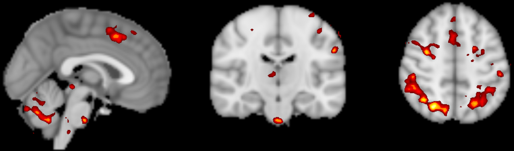

Introducción
============

Este curso le mostrará cómo analizar un conjunto de datos de fMRI de principio a fin. Comenzaremos **descargando un conjunto de datos de muestra** e inspeccionando las imágenes anatómicas y funcionales de cada sujeto. A continuación, **preprocesaremos los datos**, lo que elimina el ruido y mejora la señal en las imágenes. Una vez preprocesadas las imágenes, crearemos un modelo que represente lo que creemos que es la señal :ref:`BOLD`, una medida de la actividad neuronal, debería verse así en nuestras imágenes. Durante el **ajuste del modelo**, comparamos este modelo con la señal en diferentes áreas de la imagen. Este ajuste del modelo mide la intensidad de la señal en diferentes condiciones; por ejemplo, podemos tomar la diferencia de la señal entre las condiciones A y B del experimento para ver qué condición produce una respuesta BOLD mayor.

Una vez creado un modelo para cada sujeto y estimada la respuesta BOLD para cada condición, podemos realizar cualquier tipo de análisis de grupo: pruebas t pareadas, pruebas t intergrupales, interacciones, etc. El objetivo de este curso es calcular un contraste intrasujeto simple entre dos condiciones y comprobar su significancia entre sujetos. También aprenderá a crear figuras que muestren análisis de cerebro completo similares a los publicados en revistas de neuroimagen, y a realizar un análisis de región de interés (ROI).

    Una figura que muestra los resultados a nivel de grupo de los datos utilizados en este curso, representados como un mapa estadístico z. Los colores más brillantes indican puntuaciones z más altas. Comenzará preprocesando los datos sin procesar y terminará creando un mapa estadístico como este.
    

Este curso está diseñado para desarrollar su confianza al trabajar con datos de fMRI, mejorar su dominio de los términos básicos del análisis de fMRI y ayudarle a tomar decisiones informadas en cada paso. Algunos capítulos incluyen ejercicios para practicar lo aprendido y prepararlo para el siguiente capítulo. Una vez que domine los fundamentos de este curso, podrá aplicarlos a otros conjuntos de datos de su elección.

.. nota::
    No profundizaremos en la física de la resonancia magnética. Para una revisión de este tema, recomiendo los capítulos 1 a 5 del libro *Functional Magnetic Resonance Imaging*, de Huettel, Song y McCarthy (3.ª edición). Véase también el excelente libro de Allen Elster, "MRI Questions".
    `__ sitio web para ilustraciones útiles de conceptos de resonancia magnética.

    
   

