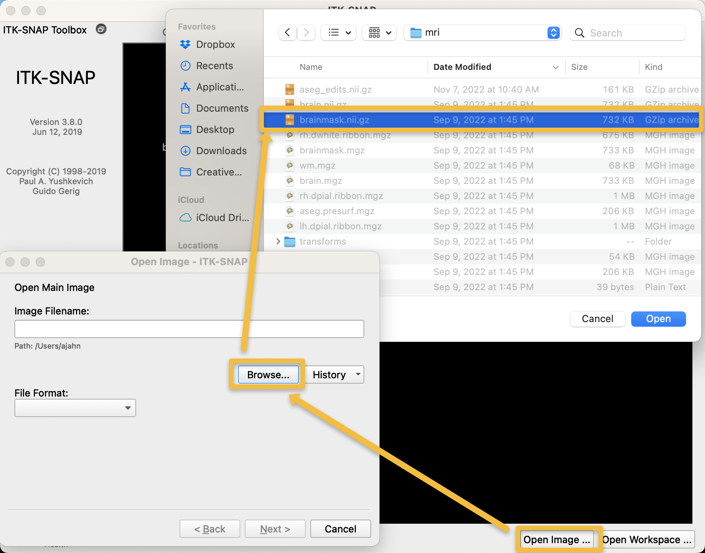
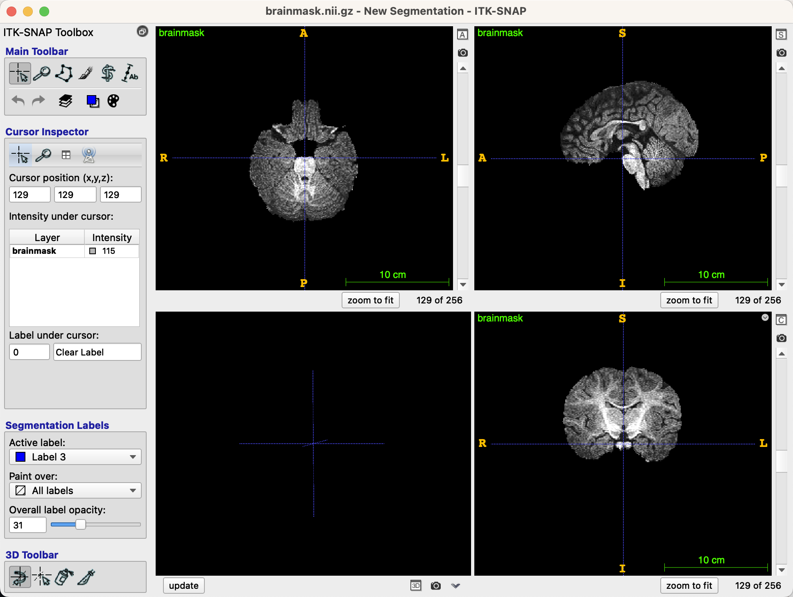
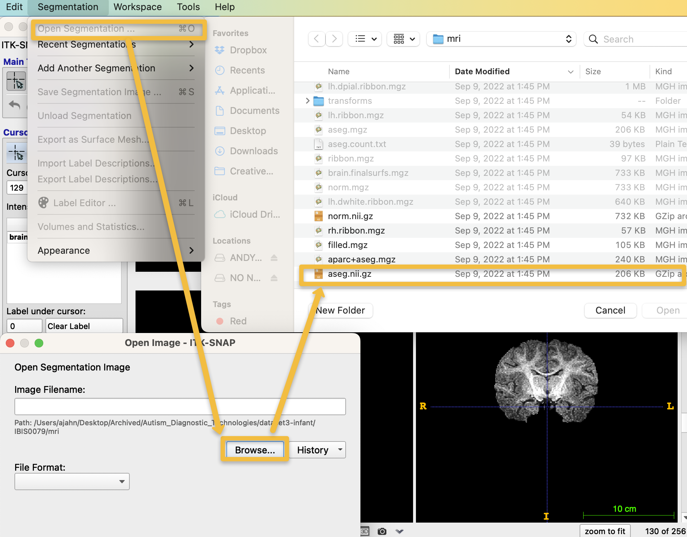
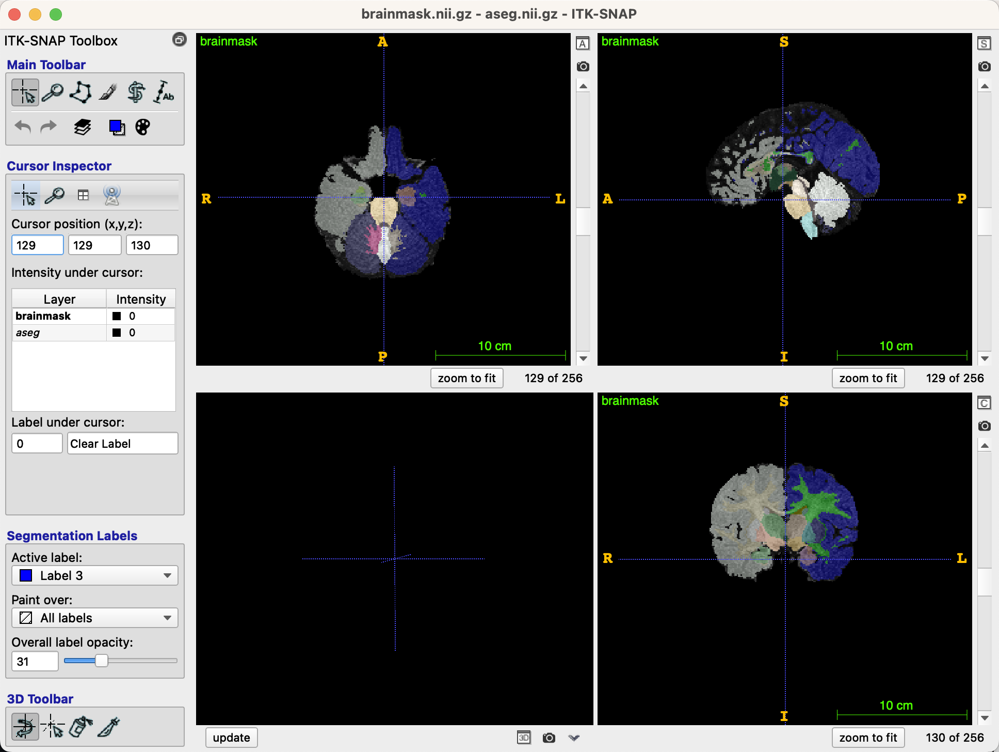
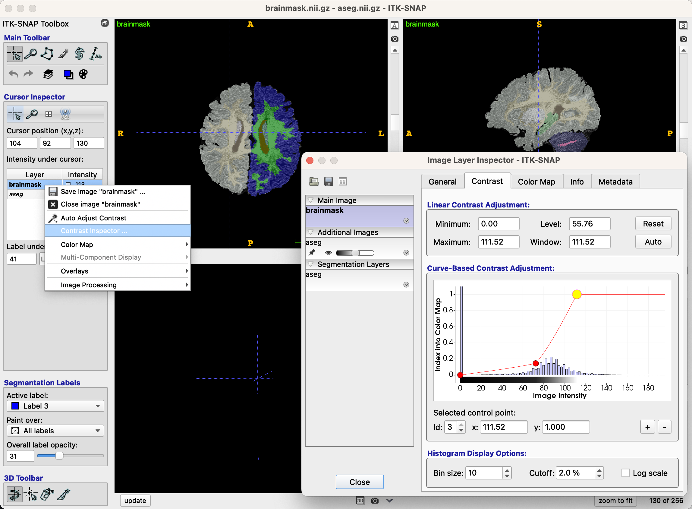
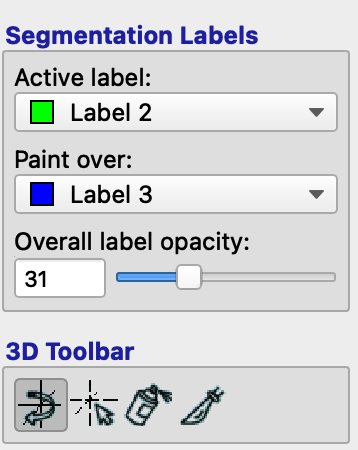

.. _ITK-Snap_02_GUI:

======================================
Tutorial n.º 2 de ITK-Snap: La interfaz gráfica de usuario de ITK-Snap
======================================

---------------

Cargando las imágenes
******************

ITK-Snap se ejecuta principalmente desde la interfaz gráfica de usuario. Una vez cargada una imagen, puede editarla y etiquetar los vóxeles con diferentes valores según sus necesidades.

Continuemos con nuestro ejemplo del conjunto de datos del Estudio de Imágenes Cerebrales Infantiles (IBIS), que contiene imágenes anatómicas de niños desde el nacimiento hasta los 24 meses de edad. Al abrir ITK-Snap, se le solicitará que seleccione una imagen abierta recientemente, si ya ha utilizado el software. Si es la primera vez que usa ITK-Snap, haga clic en «Archivo -> Abrir imagen principal» (o, alternativamente, en el botón «Abrir imagen» en la esquina inferior derecha de la interfaz gráfica de usuario) y seleccione la imagen anatómica ponderada en T1 con el cráneo despojado que analizó con infant recon-all. Utilizando nuestro sujeto de ejemplo, «IBIS0079», seleccione el archivo «brainmask.mgz», ubicado en la carpeta «IBIS0079/mri».

Después de haber cargado la imagen, debería ver tres vistas ortogonales del cerebro, junto con una reconstrucción tridimensional en el panel inferior izquierdo, si corresponde (no existe en nuestro ejemplo actual):

Ahora que hemos cargado la máscara cerebral, superpondremos la segmentación para ver qué tan bien se delinean los tejidos de materia gris y blanca. Haga clic en "Segmentación -> Agregar segmentación" y, en la ventana emergente, haga clic en el botón "Examinar". A continuación, navegue al directorio "IBIS0079/mri", seleccione el archivo "aseg.nii.gz" y haga clic en "Abrir". Haga clic en "Siguiente" y "Finalizar" en las ventanas emergentes.

Esto superpondrá la segmentación sobre la imagen de la máscara cerebral, que ahora debería verse así:

Antes de empezar a editar, puedes cambiar la configuración de contraste del cerebro para que sea más fácil ver a través de la segmentación. Por ejemplo, puedes girarlo presionando la tecla "S" o moviendo el control deslizante en la esquina inferior izquierda de la interfaz gráfica para que la segmentación sea más o menos transparente. Encuentra un nivel con el que te sientas cómodo; yo prefiero un rango de 30 a 40 para el control deslizante de opacidad, para que la segmentación sea visible, así como las estructuras subyacentes de la imagen anatómica.

Otra forma de mejorar la visualización de las imágenes es modificar el contraste entre los tipos de tejido. Sobre la barra de opacidad y las etiquetas de segmentación, haga clic derecho en el cerebro que esté editando (en nuestro caso, "máscara cerebral") y luego haga clic en "Inspector de contraste". Se abrirá una nueva ventana con dos puntos sobre un histograma de valores de intensidad. Haga clic y arrastre los puntos hasta que el contraste de la máscara cerebral subyacente sea de su agrado.

Edición de imágenes
******************

Una vez que tenga un buen contraste entre los diferentes tipos de tejido, podemos editar las imágenes. FreeSurfer asigna ciertos números a diferentes segmentaciones y parcelaciones; por ejemplo, la materia gris del hemisferio izquierdo tiene un valor de 3, mientras que la materia blanca del hemisferio izquierdo tiene un valor de 2. La materia gris y la materia blanca del hemisferio derecho tienen valores de 42 y 41, respectivamente. Puede comprobarlo haciendo clic con el ratón en el tejido de cualquier hemisferio y observando el número en el campo "Etiqueta bajo el cursor", situado a la izquierda de la interfaz gráfica de usuario.

.. nota::

  Los lados izquierdo y derecho de la imagen mostrada se encuentran en la interfaz gráfica de usuario de ITK-SNAP. Observe que el lado izquierdo de las vistas ortogonales (axiales y coronales) tiene una "R", mientras que el lado derecho de las vistas ortogonales tiene una "L".

Haga clic en el ícono Pincel en la parte ``Barra de herramientas principal`` de la GUI, que cambiará el panel izquierdo a ``Inspector de pincel``. (Si alguna vez desea volver al cursor de navegación original, haga clic en el ícono del cursor en la esquina superior izquierda de la ``Barra de herramientas principal``). Ahora, cuando pase el cursor sobre la imagen, verá un pequeño cuadro alrededor de la punta del cursor; si hace clic izquierdo, llenará el cuadro con lo que esté debajo del campo ``Etiqueta activa`` del panel ``Etiquetas de segmentación``. Por ejemplo, la etiqueta en este momento es Etiqueta 3, que es de color azul. El campo ``Pintar sobre`` indica sobre qué etiquetas se puede pintar. Si se selecciona ``Todas las etiquetas``, pintará sobre todo lo que haga clic; sin embargo, si lo cambiamos a Etiqueta 2, que es de color verde, entonces cualquier edición de etiqueta solo afectará a esa etiqueta en particular. En nuestro caso, normalmente editaremos la sustancia blanca, extendiéndola a regiones que FreeSurfer ha etiquetado erróneamente como sustancia blanca. Cambie la «Etiqueta activa» a la Etiqueta 2 y el campo «Pintar encima» a la Etiqueta 3.

  
Puede resultarle más fácil editar solo una de las vistas, ya que enfocará su visión y, además, ocupará todo el panel de visualización con esa vista ortogonal. Normalmente, la vista axial es más útil para realizar ediciones de materia gris y blanca; haga clic en la «A» en la esquina superior derecha junto a la vista axial para ampliarla y ocupar todo el panel de visualización. También puede ampliar la imagen haciendo clic en el icono del cursor en la «Barra de herramientas principal» y manteniendo pulsado el botón derecho del ratón mientras se desplaza hacia arriba o hacia abajo.

Si nos desplazamos hasta el corte 91, por ejemplo, vemos que la sustancia blanca podría extenderse más hacia el polo frontal izquierdo, en partes del cerebro que se han denominado sustancia gris. Regrese al icono del pincel y cambie el "Tamaño del pincel" a 1. Si cree que la misma edición se aplicaría a los cortes superiores e inferiores, puede marcar la casilla junto a "Opciones del pincel: 3D". De lo contrario, deje los valores predeterminados.

Ahora, usa el ratón para hacer clic en los vóxeles que crees que se han clasificado erróneamente como materia gris. Observa las siguientes imágenes para ver el antes y el después de los cortes editados:

.. figure:: 02_Ediciones_Antes.png

.. figure:: 02_Ediciones_Después.png

.. nota::

  Para comparar tus ediciones con la anatomía subyacente, cambia el control deslizante de opacidad o activa o desactiva la superposición presionando la tecla "S". También puedes deshacer una edición anterior presionando "CMD+Z" en sistemas operativos Macintosh o "CTL+Z" en Windows.
  
Continúe haciendo esto con todos los cortes que crea que se han etiquetado erróneamente. Al terminar, guarde la segmentación haciendo clic en «Segmentación -> Guardar aseg.nii.gz como...» y guárdela en la carpeta «mri» como «aseg_edits.nii.gz».

Re-ejecutar la reconstrucción infantil con Segfile
****************************************

Ahora que tenemos nuestro archivo de segmentación editado, podemos usarlo para ayudar a FreeSurfer a generar segmentaciones de materia gris y blanca más precisas. Vuelva a ejecutar infant recon-all escribiendo lo siguiente desde el directorio SUBJECTS_DIR:

::

  infant_recon_all --s IBIS0079 --edad 6 --segfile aseg_edits.nii.gz
  
Una vez finalizada, revise el resultado de la segmentación para comprobar si mejoró los límites de materia gris y blanca. Puede seguir reeditando el archivo de segmentación según sea necesario, siguiendo los mismos pasos descritos anteriormente.

Apéndice: Controles y comandos adicionales
*******************************************

A continuación se muestra una lista de atajos de teclado que pueden resultarle útiles al utilizar ITK-SNAP:

Cualquier modo:

* Abrir una imagen principal: Comando-G
*Abrir una segmentación: Comando-O
* Deshacer: Comando-Z
* Rehacer: Shift-Comando-Z
* Alternar entre opciones en la barra de herramientas principal: teclas numéricas 1-6
* Cambiar la opacidad: “A” mueve la opacidad hacia abajo 5 y “D” mueve la opacidad hacia arriba 5. “S” activa y desactiva la opacidad.
* Cambiar etiquetas: “<” se mueve hacia abajo una etiqueta y ">” se mueve hacia arriba una etiqueta
* Desplazarse por un plano: mantenga presionado el clic central (rueda de desplazamiento) y arrastre
* Desplazarse por las imágenes: Panel superior izquierdo = desplazarse hacia arriba y hacia abajo con la rueda de desplazamiento. Panel superior derecho = teclas de flecha izquierda y derecha. Panel inferior derecho = teclas de flecha arriba y abajo.

Modo de cruceta y zoom (1 y 2):

* Acercar y alejar: mantenga presionado el clic derecho y arrastre hacia arriba o hacia abajo
* Mover el cursor: Mantenga presionado el botón izquierdo y arrastre en modo cursor (1)

Modo pincel (4):

* Agregar vóxeles: mantenga presionado el botón izquierdo y arrastre.
* Eliminar vóxeles: mantenga presionado el botón derecho y arrastre.
* Cambiar el tamaño del pincel: “-” reduce el tamaño del pincel en un vóxel y “+” aumenta el tamaño del pincel en un vóxel.

