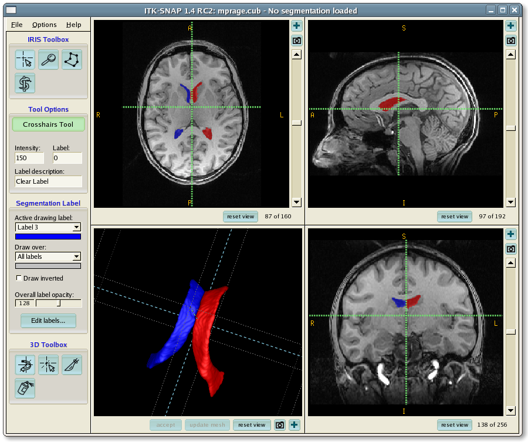

.. _ITK-Snap_Descripción general:

=================
Descripción general de ITK-Snap
=================

---------------

¿Qué es ITK-Snap?
*****************

ITK-Snap es una herramienta para visualizar y segmentar imágenes manualmente. En esta serie de tutoriales, aprenderemos a usar ITK-Snap para corregir los errores de segmentación generados por infant_recon_all (parte del paquete de software FreeSurfer) y a reejecutar el análisis con las imágenes corregidas.

Comenzaremos con una descripción general de infant_recon_all, aprendiendo cómo instalarlo y cómo usarlo para un análisis inicial. Para comenzar con este tutorial, selecciónelo en el índice a continuación o haga clic en el botón "Siguiente".

.. toctree::
   :maxdepth: 1
   :caption: Tutoriales de ITK-Snap

   ITK-Snap_01_InfantFreeSurfer.rst
   ITK-Snap_02_GUI.rst
