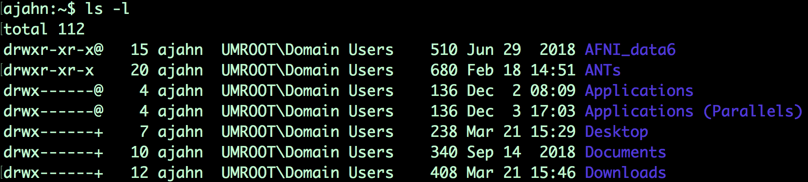
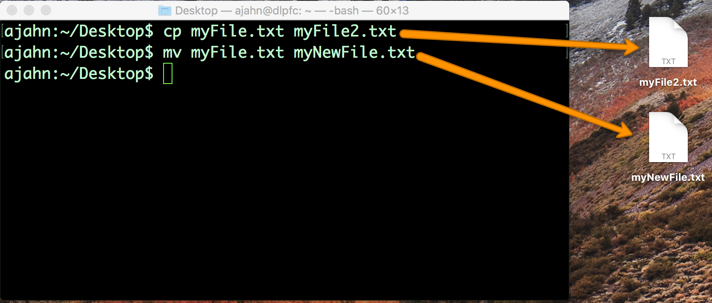

.. _Unix_02_CopiarEliminar:

============================================
Tutorial de Unix n.º 2: Cómo copiar y eliminar archivos
============================================

.. nota::
  Temas tratados: Manipulación de archivos; argumentos; opciones; copiar, eliminar y renombrar archivos.
  
  Comandos utilizados: cp, mv, rm

Ahora que ya tienes experiencia en la gestión de directorios con ``cd`` y ``ls``, ampliemos nuestro repertorio con los comandos ``cp``, ``mv`` y ``rm``. Estos comandos son de **manipulación de archivos**, similares a hacer clic derecho en un archivo y copiarlo y pegarlo, renombrarlo, moverlo a una carpeta o a la papelera. Los comandos cp y mv son más complejos que los del tutorial anterior, ya que requieren dos entradas o **argumentos**. También los usaremos para presentar el concepto de **opciones** o indicadores, que ofrecen mayor flexibilidad a tus comandos.

  Un ejemplo del uso del comando ``ls`` con la opción ``-l``, que lista archivos y directorios en formato "long". Esta opción amplía la capacidad del comando ``ls`` para mostrar no solo el nombre del archivo, sino también detalles sobre cuándo se actualizó por última vez, quién tiene permiso para editarlo y su tamaño.
  

Para ver las similitudes entre usar la interfaz gráfica y la línea de comandos, cree un archivo de texto en un editor de su elección, como TextEdit. Guarde el archivo en el escritorio (en este ejemplo, lo llamaré myFile.txt) y pruebe los siguientes comandos, recordando presionar la tecla Intro después de cada línea:

::

  cp miArchivo.txt miArchivo2.txt
  mv miArchivo.txt miNuevoArchivo.txt
  rm miArchivo2.txt
  
La primera línea crea una copia de myFile.txt y la llama myFile2.txt; la segunda línea renombra myFile.txt a myNewFile.txt; y la última línea elimina myFile2.txt. Al escribir esto en la línea de comandos, debería ver cómo se copian, renombran y eliminan los archivos, tal como lo haría al usar el ratón con la interfaz gráfica de usuario.

  Una ilustración de cómo los comandos escritos en la Terminal tienen el mismo efecto que copiar y renombrar archivos a través de la GUI.

.. advertencia::
  Hay una diferencia importante entre la interfaz gráfica de usuario y la línea de comandos al eliminar archivos y directorios. Un archivo eliminado mediante la interfaz gráfica de usuario se colocará primero en la Papelera y solo se eliminará permanentemente si decide vaciarla. Por otro lado, eliminar un archivo con ``rm`` lo elimina permanentemente de inmediato; no podrá recuperarlo después de eliminarlo con ``rm``.

Video
----------

Haga clic aquí`__ para ver un video tutorial sobre cómo copiar y eliminar archivos. Este video también te mostrará cómo mover, renombrar y eliminar carpetas. Al terminar, prueba estos ejercicios para recordar lo aprendido.

-----------

Ceremonias
-----------

1. Cree un nuevo directorio en su directorio de inicio y cree un par de archivos nuevos en ese directorio o copie archivos a ese directorio desde otro directorio.

2. Ahora copie el directorio al Escritorio, pero añada una barra diagonal al final del directorio que está copiando. Por ejemplo, si el directorio se llama myFileder, escriba cp -R myFolder/ Desktop. ¿Qué sucede?

3. Escriba ``man cp`` y busque la sección sobre la opción -R. Pruebe a usar alguna de las otras opciones con el comando cp y observe qué sucede.

   

