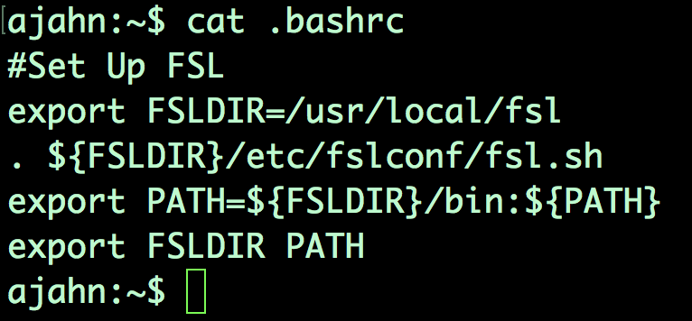
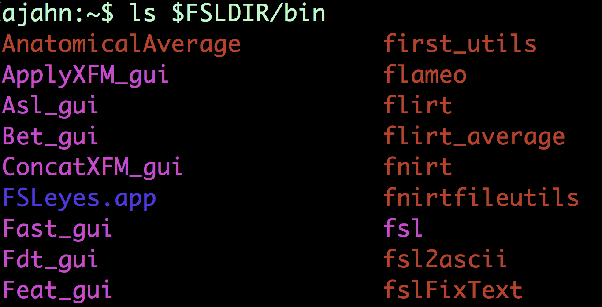

.. _Unix_04_ShellsVariables:

===========================================
Tutorial de Unix n.º 4: Shells y variables de ruta
===========================================

.. nota::
  Temas tratados: rutas, variables, shells, FSL, instalación, sintaxis, redirección
  Comandos cubiertos: set, setenv, export, tcsh, bash
  
  
Ahora que ya te has familiarizado con los comandos de Unix, podemos descargar un paquete fMRI e instalarlo con Unix. Si aún no has descargado FSL, mira este vídeo.`__. Cuando hayas terminado, vuelve a este tutorial.

Al descargar e instalar FSL, puede que hayas visto algunas cosas que no entendías del todo. Por ejemplo, si vas a tu directorio personal y escribes "cat.bashrc", verás este bloque de código.

Para entender esto, necesitarás comprender los shells, las rutas y las variables. Empecemos con los **shells**. Piensa en el shell como un entorno donde puedes escribir comandos Unix. O bien, imagínalo como un intérprete que traduce lo que escribes en las operaciones que realiza el ordenador. Usamos un shell en los tutoriales anteriores, pero puede que no lo sepas. Al abrir la terminal, se usa un shell para interpretar lo que escribes. Además, hay muchos shells diferentes, y cada uno tiene una **sintaxis** diferente, es decir, una forma específica en que las palabras de tu comando deben organizarse para que se entiendan correctamente, al igual que la sintaxis de los lenguajes humanos.

Existen dos shells: el Bourne Shell, con una versión ampliamente utilizada llamada **bash**, o Bourne-again Shell; y los C-shells, de los cuales una variante popular es el t-shell o **tcsh**. Los comandos que hemos usado hasta ahora (cd, ls, pwd, etc.) se denominan **comandos integrados** y se pueden usar de la misma manera en ambos shells. Sin embargo, existen diferencias importantes al realizar operaciones más avanzadas, como configurar una variable.

**Establecer una variable** significa asignar un valor a una cadena. Las variables se utilizan como abreviatura de un valor, que puede ser un número o una cadena. Se llaman variables porque el valor puede variar o actualizarse según sea necesario.

Por ejemplo, asignemos el valor 3 a la variable ``x``. Si está en la shell bash, que es la predeterminada en la mayoría de los ordenadores, puede hacerlo escribiendo ``x=3``. Para comprobar el valor almacenado en la variable, escriba ``echo $x``. El signo de dólar es un **carácter reservado** con un significado especial y no puede utilizarse como variable. Un signo de dólar indica que lo que viene inmediatamente después (en este caso, x) es una variable. El comando devuelve 3, el valor almacenado en la variable x.

Compare esto con una shell diferente: la t-shell. Cambie su terminal a la t-shell escribiendo ``tcsh`` y presionando Enter. Si escribimos el mismo comando que antes, obtendríamos un error que indica "comando no encontrado". Esto se debe a que la sintaxis para asignar una variable es diferente en la t-shell. Para realizar la misma asignación de variable, debemos escribir ``set x=3``; luego escribir ``echo $x`` para asegurarnos de que se estableció el valor correcto. Si se pierde y desea saber en qué shell se encuentra actualmente, escriba ``echo $0``.

.. figure::AsignaciónDeVariable.gif

Ahora mismo estamos en lo que se llama una subshell; inicialmente estábamos en la shell bash y luego cambiamos a una t-shell. Al abrir una nueva terminal, imagínese que esa terminal es el mundo Unix; a este "mundo" lo llamamos **entorno**. Para mantener la variable ``x`` constante sin importar en qué shell estemos, escribiríamos ``export x=3``; en tcsh, escribiríamos ``setenv x 3``. Tenga en cuenta que si establece esta variable global, solo estará disponible para la shell actual y las subshells; si establece una variable global en la subshell actual y luego regresa a una shell anterior, no tendrá acceso a ella. Para salir de la subshell actual y regresar a la shell anterior, escriba ``exit`` y presione Enter.

Ahora que sabemos qué son las variables, podemos ver cómo se usan en la configuración de FSL. El código del archivo .bashrc (que significa "comandos de ejecución de bash" y que se ejecuta cada vez que se crea una nueva shell en bash) actualiza la variable de ruta. Esta variable es una lista de directorios que se buscan cada vez que se ejecuta un comando; puede ver esta lista escribiendo ``echo $PATH``. Observe que hay varias rutas absolutas que apuntan a diferentes directorios, con los dos puntos como separadores. Al escribir un comando y presionar Intro, la shell busca ese comando en cada directorio de la ruta. Si no está, devuelve un error indicando que no se encuentra el comando.

Las rutas permiten usar comandos FSL desde cualquier lugar de la Terminal. FSL, al igual que todos los demás paquetes de software, cuenta con una **biblioteca**, o directorio, que contiene todas las funciones necesarias para ejecutar FSL, como fslinfo, fslmaths, flirt, etc. Para ejecutar estos comandos, necesitamos estar en ese directorio o especificar la ruta absoluta del comando que queremos ejecutar. Para tener la flexibilidad de ejecutar comandos FSL desde cualquier lugar, configuraremos la variable `path` para indicar dónde se encuentra la biblioteca FSL.

  Una vez instalado FSL, escriba ``ls $FSLDIR/bin`` para ver una lista de todos los comandos disponibles (o binarios, de ahí el nombre del directorio) en la biblioteca FSL. Si la ruta está configurada correctamente, puede ejecutar estos comandos desde cualquier lugar de la estructura de directorios.

Tenga en cuenta que el script de instalación de FSL crea automáticamente estas rutas tanto en bash como en tcsh. Otros paquetes, como AFNI y FreeSurfer, no las crean automáticamente, y deberá agregar las líneas que le indican mediante redirección o abriendo los archivos de comandos de ejecución en un editor de texto (por ejemplo, escribiendo "open.bashrc"). Ahora que comprende qué son las rutas y las variables y cómo se crean, podrá crearlas y modificarlas según sea necesario.

-----------

Ceremonias
---------

1. Cambia tu shell predeterminado con ``chsh -s tcsh``. ¿Qué ocurre al abrir una nueva terminal y escribir ``echo $0``? ¿Cómo cambiarías tu shell predeterminado a bash?

2. Observa estas líneas en tu archivo .bashrc: ``export FSLDIR=/usr/local/fsl`` y ``export PATH=${FSLDIR}/bin:${PATH}``. (En estas líneas de código, las llaves no añaden nada; por ejemplo, ${PATH} es lo mismo que $PATH). En tus propias palabras, ¿cómo definirías la función de estas líneas?

3. Desde tu terminal predeterminada (suponiendo que estás en bash), inicia una subshell tcsh. Luego, establece una variable de entorno, x=3. Desde tu shell actual, inicia una subshell bash y escribe ``echo $x``. Luego, escribe ``exit`` y ``exit`` de nuevo para volver a tu shell original. Escribe ``echo $x``. ¿Qué se devuelve? ¿Por qué? Utiliza un diagrama de Venn para ilustrar por qué sucede esto.

Video
-----

Haga clic aquí
    `__ para un tutorial en video que explica qué son los shells y las variables de ruta.

    
   

