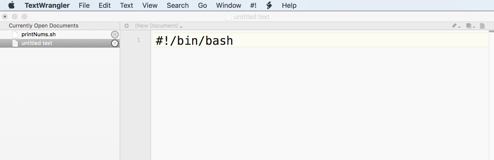
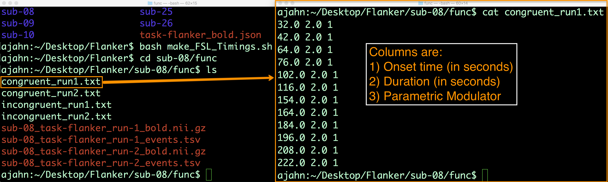

.. _Unix_07_Scripting:

Tutorial de Unix n.º 7: Scripting
================

.. nota::
  
  Temas tratados: comodines, scripting
  
  Comandos cubiertos: awk

---------------

Combinando comandos
***************

Hasta ahora has aprendido a usar bucles for y sentencias condicionales para automatizar y decidir cuándo ejecutar bloques de código. Sin embargo, pronto descubrirás que escribir bloques de código grandes y complejos a mano resulta tedioso cada vez que quieras ejecutarlos. También es difícil depurar una cadena larga de código escrita en la Terminal.

En lugar de eso, podemos incluir todo en un **script**, o archivo que contiene el código. Esto permite que el código sea compacto y fácil de mover entre directorios si es necesario. También facilita enormemente la depuración.

Descargar un editor de texto para codificar
****************

Antes de empezar a crear scripts, debería descargar un editor de código adecuado. Los usuarios de Windows pueden descargar Notepad++ y los de Mac, `TextWrangler`.`__ de la Apple Store. Es importante usar uno de estos en lugar del editor de texto predeterminado; de lo contrario, podría tener problemas con los retornos de carro, como se muestra en un video `aquí`.`__.

Escribiendo tu primer guión
****************

Una vez descargado TextWrangler, ábrelo y escribe este código en la primera línea, también conocido como **shebang**: ``#!/bin/bash``. Esto significa que el siguiente código debe interpretarse con el shell bash y seguir la sintaxis de bash.

 Ejemplo de shebang en un archivo editado en TextWrangler. El shebang siempre se escribe en la primera línea del archivo, comenzando con un signo de almohadilla y un signo de exclamación, seguido de una ruta absoluta al shell que se utiliza para interpretar el código.

A continuación, escribe uno de los bucles for que viste anteriormente, como este:

::

 para i en 1 2 3; hacer
   eco $i;
 hecho
 
Es una buena práctica de programación sangrar el cuerpo de un bucle for o una sentencia condicional, generalmente con una tabulación o unos pocos espacios. Esto permite visualizar rápidamente la estructura del código y determinar la ubicación de ciertos comandos. También es útil incluir comentarios con el símbolo numeral: todo lo que se escriba después del símbolo numeral no será interpretado por el shell, pero es útil para que el lector sepa qué hace el comando. Por ejemplo, antes del bucle, podríamos escribir un comentario sobre cómo el siguiente código imprimirá los números del 1 al 3. Algunos programadores prefieren dejar un espacio entre cada sección principal del código; esta es una decisión estilística que usted decide.

Ahora haz clic en «Archivo -> Guardar como» y llámalo «printNums.sh». La extensión .sh indica que es un script de shell. Guárdalo en el escritorio. En una terminal, ve al escritorio y escribe «bash printNums.sh» para ejecutarlo. También puedes ejecutar el comando escribiendo «./printNums.sh». Esto ejecutará todo el código del script, como si lo hubieras escrito a mano. Este es un ejemplo sencillo, pero puedes ver cómo puedes agregar tantas líneas de código como quieras.

Ejecución de scripts más grandes
***************

Veamos cómo podemos ejecutar un script más grande que contenga muchas líneas de código. Vaya a este enlace.
    `__ y haz clic en ``make_FSL_Timings.sh``. Haz clic en el botón ``Sin formato`` para ver el texto sin formato. Puedes hacer clic derecho en cualquier parte de la página y guardarlo como script, o copiar y pegar el código en TextWrangler. Guárdalo como ``make_FSL_Timings.sh`` y muévelo al directorio de Flanker.

Veamos qué hace este código. Observe que tenemos un shebang que indica que el script está escrito en sintaxis Bash; también hay comentarios después de cada almohadilla que marcan las secciones principales del código. El primer bloque de código es una sentencia condicional que comprueba si existe un archivo llamado ``subjList.txt``; si no existe, lista cada directorio de temas y redirige esa lista de temas a un archivo llamado subjList.txt.

Comodines
^^^^^^^^^^^^^^^

Esto nos lleva a un concepto importante: **Comodines**. Hay dos tipos de comodines que usarás a menudo. El primero es un asterisco, que busca uno o más caracteres. Por ejemplo, navega al directorio de Flanker y escribe ``mkdir sub-100``. Si escribes ``ls -d sub-*`` Devolverá todos los directorios que empiecen por sub-, ya sea sub-01 o sub-100. El comodín asterisco no discrimina si el directorio tiene seis o seiscientos caracteres; los coincidirá y los devolverá todos, siempre que empiecen por ``sub-``. El otro tipo de comodín es el signo de interrogación, que coincide con una sola aparición de cualquier carácter. Si escribes ``ls -d sub-??``, solo devolverá los directorios con dos enteros después del guión; en otras palabras, devolverá desde sub-01 hasta sub-26, pero no sub-100.

Manipulación de texto con Awk
^^^^^^^^^^^^^^^^

El cuerpo del bucle for contiene algo nuevo: un comando llamado **awk**. Awk es un comando de procesamiento de texto que imprime columnas de un archivo de texto. Su funcionamiento se basa en lo siguiente: si accede al directorio "func" de un sujeto y escribe cat ``sub-08_task-flanker_run-1_events.tsv``, devolverá todo el texto de ese archivo. Para nuestro análisis de fMRI, necesitamos las columnas que especifican la hora de inicio y la duración, así como el número 1 como marcador de posición en la última columna. Puede redirigir la salida de este comando a la entrada del comando awk mediante una barra vertical. Posteriormente, puede usar sentencias condicionales en awk para imprimir las horas de inicio para condiciones experimentales específicas y redirigir esa salida al archivo de texto correspondiente. Esto se explica con más detalle en el capítulo del libro que encontrará en el enlace a continuación.

Ahora, regresa al directorio que contiene todos los sujetos, elimina el directorio sub-100 y ejecuta el script. Tardará unos instantes y luego creará archivos de sincronización para todos los sujetos. Puedes inspeccionarlos con el comando cat; todos deberían tener un aspecto similar a este:

Los scripts y comodines ofrecen mayor flexibilidad en el código y pueden ahorrarle incontables horas de trabajo. Imagine escribir cada comando en nuestro script para cada sujeto. Más adelante, usaremos estos scripts para automatizar el análisis de un conjunto de datos completo; para ello, necesitaremos aprender un comando más para manipular texto: el comando sed.

-------------

Ceremonias
************

------------

Video
***********

`Este vídeo
     `__ le mostrará cómo escribir un script usando TextWrangler y cómo ejecutar el script en la Terminal.

     
    
   

