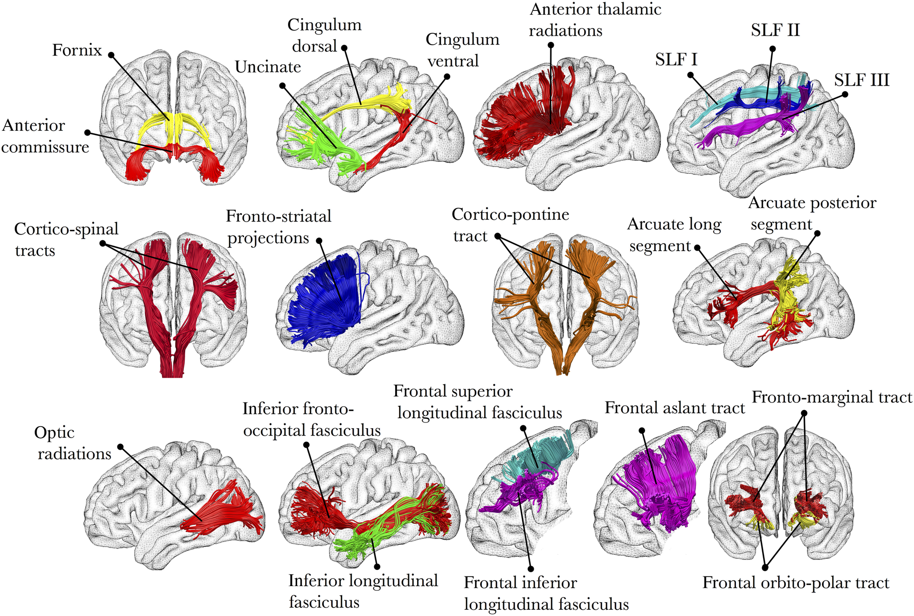
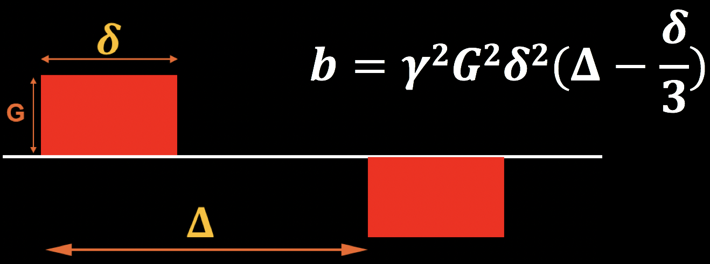
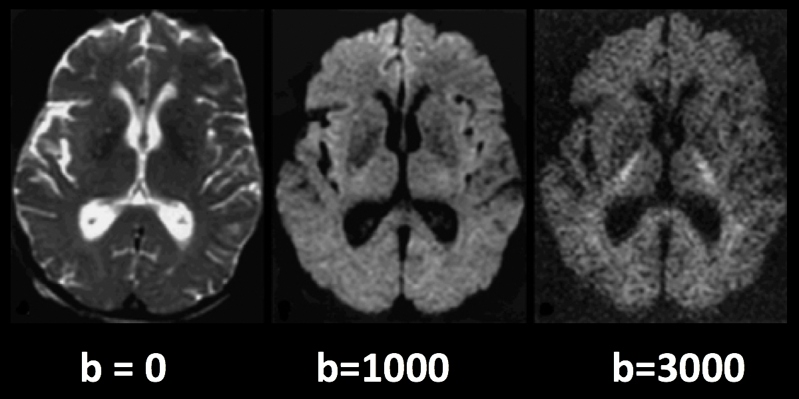
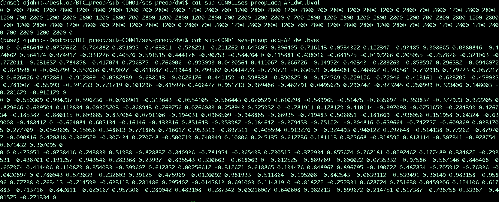
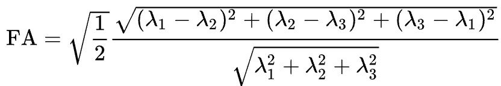
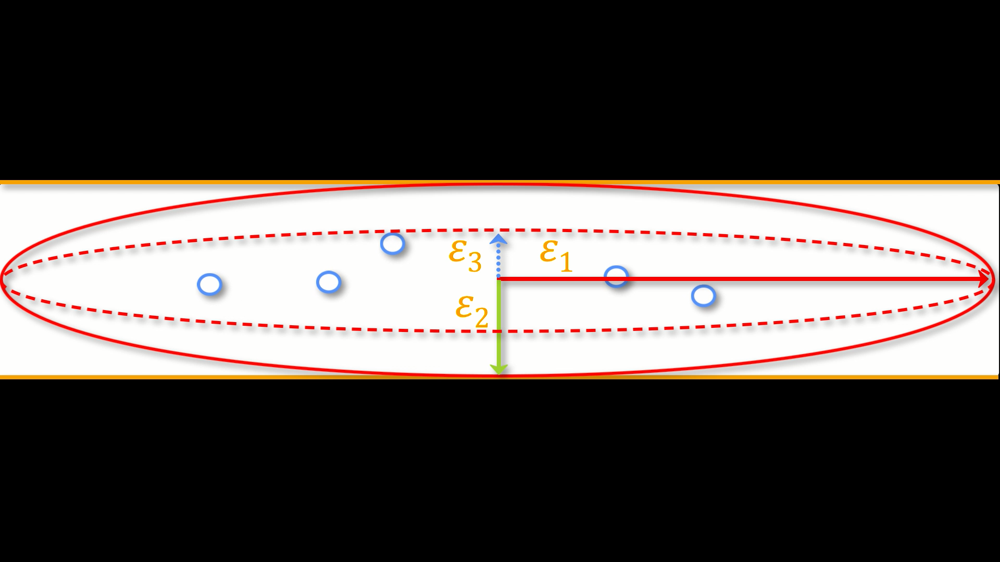
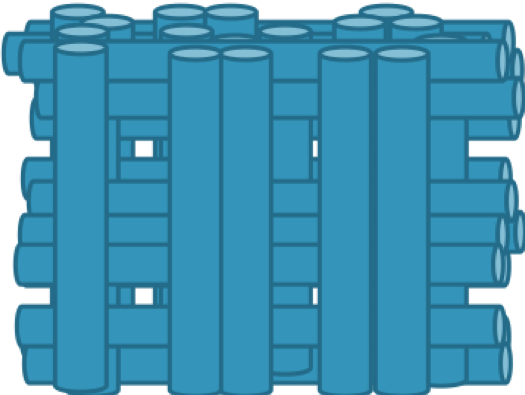
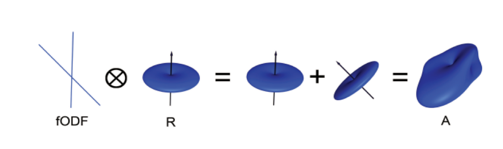
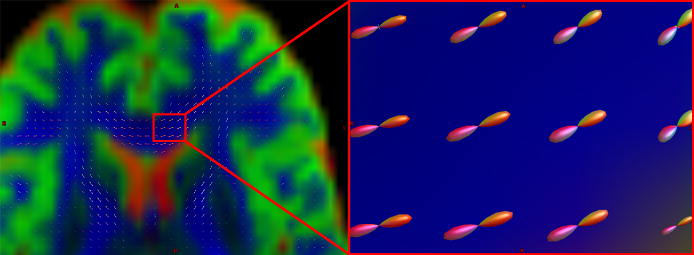
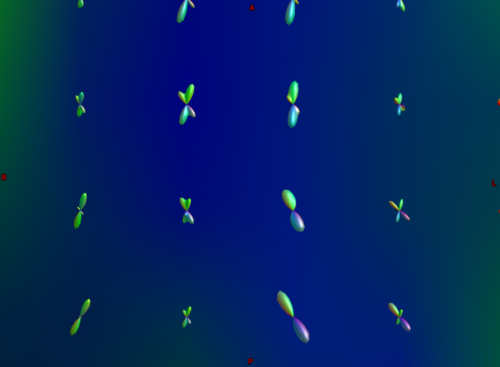

.. _MRtrix_00_Descripción general de la difusión:

==================================================
Introducción a MRtrix: descripción general de las imágenes de difusión
==================================================
  
---------------

Descripción general
********

Hasta ahora, este libro ha abordado la técnica de resonancia magnética más popular: la resonancia magnética funcional o fMRI. Estas imágenes funcionales, que miden la señal generada por los cambios en el flujo sanguíneo, suelen ir acompañadas de imágenes estructurales que se adquieren mediante el mismo método básico: los diferentes tipos de tejido cerebral tienen diferentes **tasas de relajación** T1 y T2, que se utilizan para crear imágenes con contraste entre los tejidos. En las exploraciones anatómicas T1, la sustancia blanca es más clara que la sustancia gris, que a su vez es más clara que el líquido cefalorraquídeo; en las exploraciones funcionales T2, las intensidades relativas se invierten.

.. figure:: 00_T1_T2_Intensidades.png

  Imágenes típicas ponderadas en T1 (anatómicas) y T2 (funcionales). Observe cómo se invierten las intensidades relativas de los tipos de tejido al pasar de la ponderación en T1 a la ponderación en T2.
  
Sin embargo, existen otros tipos de imágenes que pueden adquirirse con un escáner de resonancia magnética. En este módulo, nos centraremos en la resonancia magnética ponderada por difusión (RMD), que mide la difusividad relativa en diferentes partes del cerebro, en particular, en los tractos de sustancia blanca.

La estructura de la sustancia blanca
*********************************

¿Por qué la dMRI se centra en los tractos de sustancia blanca? Imagine desmenuzar un palito de queso y luego desmenuzar el cerebro: al igual que el queso, el cerebro tiene direcciones lacrimales preferidas. Estas direcciones corresponden a los tractos de sustancia blanca subyacentes, que son haces densos de neuronas mielinizadas que conectan partes cercanas y distantes del cerebro. Por ejemplo, el fascículo longitudinal inferior conecta las regiones visual y temporal del cerebro, mientras que el fascículo uncinado conecta las regiones temporal y frontal inferior del cerebro. Estos tractos recorren las tres dimensiones del cerebro y pueden discurrir paralelos o cruzarse.

  Ilustración de varios tractos principales de sustancia blanca. Figura tomada de Thiebaut et al., 2015.

La sustancia blanca del cerebro recibe su nombre de su color; estas neuronas están altamente mielinizadas, lo que significa que poseen una gruesa capa lipídica que las aísla y facilita la transmisión de impulsos eléctricos, como un cable eléctrico aislado. Las neuronas de la sustancia gris, en cambio, son relativamente amielínicas, lo que permite una mayor densidad neuronal en una zona determinada.

Historia de la difusión
********************

Si bien la composición del tejido cerebral se conoce desde hace tiempo, la obtención de imágenes de la difusión de los tractos de sustancia blanca es una técnica nueva. Para comprender cómo se aprovecharon las propiedades de la sustancia blanca con este fin, revisaremos brevemente la historia de la difusión y cómo los científicos aplicaron este concepto a la obtención de imágenes cerebrales.

Movimiento browniano
^^^^^^^^^^^^^^^

La primera descripción formal de la difusión la realizó Robert Brown, botánico escocés, en 1827. Al observar partículas microscópicas a través de un microscopio, observó que estas parecían moverse aleatoriamente, de forma similar a cómo las motas de polvo, al observarlas moverse a través de un haz de luz, parecen moverse siguiendo patrones aleatorios. Browning concluyó que el movimiento se debía a la colisión de partículas más pequeñas con las moléculas más grandes observadas a través del microscopio. Por ejemplo, al verter un tinte en agua, el movimiento aleatorio de las moléculas de agua hace que el tinte se disperse aleatoriamente hasta que el agua del recipiente alcanza un tono uniforme. Un ejemplo más común y cotidiano se puede observar al verter leche en el café: observe cómo la leche se arremolina y se mezcla con su entorno, y tendrá una excelente demostración del movimiento browniano.

Las propiedades del medio determinan la velocidad del movimiento browniano. Por ejemplo, aumentar la temperatura del agua circundante acelerará el movimiento de las moléculas de agua y, en consecuencia, el de las partículas. Si la viscosidad del medio es mayor (por ejemplo, si vertemos colorante alimentario en un recipiente con miel), las moléculas se mueven más lentamente, y las partículas del colorante también. Por otro lado, disminuir la temperatura y la viscosidad tendrá el efecto contrario.

Por último, y de mayor relevancia para nuestros futuros tutoriales sobre imágenes de difusión, el movimiento browniano, tanto de partículas como de moléculas, está determinado por el tamaño y la forma del recipiente. Si se vierte colorante alimentario en un recipiente esférico con agua, este se difundirá aleatoriamente en todas direcciones. Por otro lado, si se vierte colorante alimentario en un vaso cilíndrico, se difundirá rápidamente a lo largo del vaso; las partículas pronto chocarán contra las paredes del recipiente y se verán obligadas a moverse hacia arriba o hacia abajo. A este tipo de recipiente lo llamamos **anisotrópico**, lo que significa que sus dimensiones hacen que las partículas se difundan a lo largo de un eje predominante. (Si tiene experiencia con fMRI, piense en los vóxeles anisotrópicos, que tienen una dimensión más larga que las demás).

.. nota::

  Para ver un vídeo del movimiento browniano, haga clic aquí`__.

Albert Einstein combinó todos estos factores (temperatura, tamaño de partícula y viscosidad) en una única ecuación conocida como **Ecuación de Stokes-Einstein**:

El coeficiente de difusión, **D**, aumenta con el aumento de la temperatura (**T**) y disminuye con una mayor viscosidad (simbolizada por eta) y un mayor radio de partícula (**r**). **k** representa la constante de Boltzmann. Este coeficiente de difusión influirá en la adquisición de **imágenes ponderadas por difusión**, tema que abordaremos a continuación.

Difusión y resonancia magnética
^^^^^^^^^^^^^^^^^

A principios de la década de 1990, una nueva técnica de adquisición de imágenes, denominada imágenes ecoplanares (EPI), permitió a los investigadores obtener imágenes funcionales del cerebro con mucha mayor rapidez. Simultáneamente, científicos como Michael Moseley y Steven Warach comenzaron a explorar otras maneras de aprovechar las propiedades de las moléculas de agua para generar diferentes tipos de mapas de contraste. Descubrieron que, así como las propiedades T1 y T2 de los tejidos cerebrales podían utilizarse para crear diferencias de intensidad en las imágenes adquiridas, la difusión del agua también podía generar diferencias en la magnitud de la señal.

Quizás recuerde de un curso introductorio de física de resonancia magnética que las imágenes ponderadas en T1 se utilizan a menudo para exploraciones anatómicas, y que las imágenes ponderadas en T2 suelen utilizarse para exploraciones funcionales. En las imágenes ponderadas en T2, la presencia o ausencia de hemoglobina oxigenada cercana provoca un aumento o disminución de la señal emitida por los protones de hidrógeno de las moléculas de agua en el cerebro. En este caso, se activa un pulso de radiofrecuencia para inclinar el espín de los átomos de hidrógeno y se desactiva rápidamente; la señal es entonces emitida por los protones de hidrógeno y detectada por un sensor dentro del imán, y el proceso se repite hasta que se genera una serie temporal completa de datos funcionales.

¿Qué pasaría si, en cambio, cambiáramos la intensidad del campo magnético en diferentes ejes del cerebro? Recuerde que, si bien las exploraciones ponderadas en T2 se utilizan principalmente para la obtención de imágenes funcionales, también pueden utilizarse para crear imágenes anatómicas. En este caso, el líquido cefalorraquídeo y la materia gris aparecerían más claros, mientras que la materia blanca aparecería más oscura. Si aplicáramos un **gradiente magnético** al escanear el cerebro, podríamos intensificar el campo magnético en una dirección y debilitarlo en la opuesta. Por ejemplo, supongamos que el campo magnético se debilita ligeramente en el lado izquierdo del cerebro y se intensifica ligeramente en el lado derecho, aumentando gradualmente su intensidad a medida que nos movemos de izquierda a derecha. Dado que la frecuencia de los espines de los átomos de hidrógeno es proporcional a la intensidad del campo magnético, esperaríamos que los espines del lado izquierdo del cerebro fueran ligeramente más lentos que los del lado derecho.

En este punto, los espines estarían **desfasados** entre sí; es decir, se procesarían a diferentes velocidades según la parte del campo magnético en la que se encuentren. Dado que los protones están ahora desfasados, llamamos al gradiente que acabamos de aplicar **Gradiente de Desfase**. Si aplicáramos un **Gradiente de Refase** igual y opuesto (es decir, el campo magnético sería más intenso a la izquierda y más débil a la derecha), los espines de los átomos se realinearían. La siguiente figura resume este proceso de gradientes de desfase y refase:

.. figure:: 00_Desfase_Refase_Gradientes.png

  Figura de Mori, 2007. Los círculos rojo, verde y azul representan átomos de hidrógeno, y las flechas dentro de los círculos representan la dirección de los espines; imagine que todos se mueven en la misma dirección alrededor de la circunferencia del círculo y a la misma velocidad. Un gradiente de desfase (fila central) es ligeramente más débil a la izquierda y ligeramente más fuerte a la derecha; como resultado, al desactivar el gradiente, los átomos giran desfasados entre sí. Un gradiente de refase aplica entonces un gradiente igual y opuesto, y al final los átomos giran en la misma dirección y a la misma velocidad.
  
Aparte: Creación del gradiente de difusión y los valores B
&&&&&&&&&&&&&&&&&&&&&&&&&&&&&&&&&&&&&&&&&&&&&&&&&&&

Los gradientes de difusión mencionados anteriormente se generan mediante los siguientes parámetros:

* La magnitud del gradiente de difusión (G);
* El tiempo entre gradientes (𝚫); y
* T duración del gradiente de difusión (𝜹).

Estos pueden combinarse en una ecuación para el denominado **valor b**, que se muestra en la figura siguiente. Tenga en cuenta que el valor b es proporcional a la magnitud del gradiente, su duración y el tiempo entre gradientes; si alguno de estos parámetros aumenta, el valor b también aumenta. Por ahora, tenga presente esta ecuación; la abordaremos más adelante cuando analicemos cómo los valores b afectan el contraste de las imágenes ponderadas por difusión.

Revisando los gradientes: efectos de la difusión
^^^^^^^^^^^^^^^^^^^^^^^^^^^^^^^^^^^^^^^^^^^^^^

En el ejemplo anterior, asumimos que un gradiente de refase reorganizaría los átomos de hidrógeno. Esta suposición es cierta, pero solo si los átomos de hidrógeno no se mueven entre la activación y desactivación de los gradientes de desfase y refase. Si, por el contrario, se mueven —es decir, si se difunden, según los principios del movimiento browniano que analizamos anteriormente—, el gradiente de refase no provocará una realineación de los átomos de hidrógeno. Más bien, su desalineación será proporcional a su grado de difusión entre los gradientes.

.. figure:: 00_Gradientes_Difusión.png

  Figura de Mori, 2007. El período entre los gradientes, al que nos referiremos como la **fase de mezcla**, permite que los átomos de hidrógeno de diferentes ubicaciones se mezclen. Esto depende de factores como la temperatura ambiente y la constricción del entorno circundante: los átomos de hidrógeno en un espacio relativamente libre (como los ventrículos) se difunden más que aquellos en un espacio más restringido. Al aplicar el gradiente de refase, los átomos giran desfasados entre sí.

El resultado es una imagen de contraste similar a las imágenes funcionales ponderadas en T2 que quizás haya visto antes: existe contraste entre los principales tipos de tejido, como la sustancia blanca y la sustancia gris. Sin embargo, al observarla más de cerca, observamos que la imagen es más oscura en ciertas zonas; esto se debe a la difusión de las moléculas de agua durante la fase de mezcla. Cuando los átomos están desfasados entre sí, la señal se atenúa. (Imagine un grupo de personas empujando un bloque en la misma dirección. La fuerza que ejercen moverá el bloque en la dirección en la que empujan. Si, en cambio, algunas personas empujan lateralmente y otras en la dirección opuesta, el movimiento del bloque se ralentiza o se detiene por completo). En este caso, una mayor *pérdida* de señal implica una mayor difusión, siendo la cantidad de pérdida relativa a una exploración adquirida sin aplicar gradientes de difusión; es decir, relativa a una exploración con un valor b de cero.

.. figure:: 00_Difusión_de_Señal.png

La siguiente figura resume lo que hemos analizado hasta ahora. Una imagen ponderada por difusión con un valor b de cero es prácticamente idéntica a una imagen típica ponderada en T2: el LCR es brillante y la materia gris es oscura. A medida que aumentamos los valores b, observamos una mayor pérdida de señal en zonas específicas del cerebro, principalmente en la sustancia blanca. Esto se debe a que el agua dentro de estos tractos de sustancia blanca se difunde principalmente a lo largo de la dirección del tracto, y la imagen generada muestra una señal correspondientemente menor. (Los valores b más altos también hacen que la imagen sea más susceptible a artefactos de imagen, como el movimiento y las corrientes magnéticas llamadas remolinos; los revisaremos en un capítulo posterior sobre preprocesamiento).

  Los valores b más altos serán más sensibles para detectar la difusión, pero con el riesgo de generar más ruido y mayor susceptibilidad a los artefactos de vibración.

.. nota::

  Las imágenes de difusión adquiridas con más de un valor b se denominan **adquisiciones multicapa**. Esto permite distinguir con mayor precisión la orientación de la difusión, ya que la imagen mostrará diferentes niveles de pérdida de señal en cada valor b, dependiendo de la magnitud de la difusión. Retomaremos este concepto en un capítulo posterior.

Vectores B
*********

Hasta ahora, hemos aprendido cómo se aplican los gradientes de difusión y cómo interpretar la señal resultante en la imagen. Para comprender mejor cómo se crean las imágenes de difusión, también necesitamos conocer la **dirección** de los gradientes aplicados. Estas direcciones se conocen como **vectores b**, o **bvecs** para abreviar. Observará que, una vez descargados los datos de un escaneo ponderado por difusión, tendrá dos archivos de texto: uno suele tener el sufijo **.bval**, que indica los valores b, y otro con el sufijo **.bvec**, que representa los vectores b.

Supongamos que recopiló 40 imágenes ponderadas por difusión. Supongamos también que el primer volumen se adquirió con un valor b de cero y el resto con valores b de 1000. El archivo bvals tendría 40 entradas, y cada bval correspondería a un volumen individual en la imagen ponderada por difusión. El archivo bvecs, por otro lado, tendría 40 *tripletes* de números que indican la dirección del gradiente de difusión para ese volumen en las direcciones x, y y z. Si conocemos tanto la dirección como la magnitud del gradiente, podemos hacer una estimación razonable de la difusión a lo largo de dicho gradiente, en función de los cambios en la señal adquirida de esos vóxeles.

  Ejemplo de contenido de los archivos .bvals y .bvecs. La estructura del archivo bvecs es más clara si se importa a una hoja de cálculo; el archivo está formateado para agrupar los números en tripletes. Cada triplete de bvecs corresponde a un único bval.
  
.. nota::

  Un parámetro que puede controlar es el número de direcciones que desea escanear con los gradientes. Por ejemplo, podría adquirir 64 o 128 imágenes, y cada una de ellas tendrá gradientes de difusión aplicados desde una dirección ligeramente diferente. Un mayor número de direcciones resulta en una mayor **resolución angular**, lo que permite realizar distinciones espaciales más precisas sobre la dirección de la difusión. La desventaja, como con cualquier método que aumente la resolución, es que un mayor número de escaneos requiere más tiempo.
  
Juntándolo todo: modelando el tensor
********************************************

Esta combinación de bvals y bvecs nos permite construir un **tensor** y ajustarlo a cada vóxel de nuestra imagen ponderada por difusión. Para este tutorial, considere un tensor como un modelo de fuerzas que ejercen presión a lo largo de las dimensiones x, y y z. El agua que fluye por una manguera de jardín, por ejemplo, ejerce presión contra los límites del tubo, pero fluye principalmente a lo largo de la manguera. Las direcciones de la energía se denominan **vectores propios** y la magnitud de la energía, **valores propios**.

Aplicados a imágenes ponderadas por difusión, utilizamos estos mismos conceptos para modelar la señal observada en cada vóxel como una combinación de vectores propios y valores propios. Los vectores propios indican la dirección de la difusión y los valores propios representan su magnitud. Retomando el ejemplo de la manguera de jardín, la fuerza del agua tendría un vector propio y un valor propio elevados a lo largo del tubo; de forma similar, podemos modelar la difusión en cada vóxel del cerebro como una combinación de vectores propios y valores propios. Una vez calculada la combinación de valores que mejor representa la señal observada en el vóxel actual, podemos utilizar diversas ecuaciones para calcular las diferentes propiedades de la difusión en ese vóxel. La ecuación más popular para esta **imagen del tensor de difusión** se denomina **Anisotropía Fraccionaria**, o AF. Esta se puede calcular mediante la fórmula:

La anisotropía fraccional es la suma ponderada de los valores propios de cada vóxel. Un valor de FA más alto indica una mayor difusión en una de las direcciones, mientras que un valor de FA más bajo indica que la difusión es muy baja o que esta no está restringida y se extiende aleatoriamente en cada dirección (como, por ejemplo, en los ventrículos cerebrales). Si observamos que la difusión es mayor en una de las dimensiones, podemos codificarla por colores según la dirección. En las imágenes de difusión, la convención es representar la difusión en el eje x en rojo, la difusión en el eje y en verde y la difusión en el eje z en azul. La imagen a continuación resume este esquema de codificación por colores.

Ajustar un tensor en cada vóxel permite generar diferentes tipos de mapas de difusión, como mapas de anisotropía fraccional. Para crear estos mapas se puede utilizar la estadística espacial basada en tractos (TBSS), un popular paquete de análisis de difusión FSL. De forma similar al análisis de datos de fMRI, estos mapas se pueden combinar en un mapa de análisis de grupos y extraer datos de las regiones de interés dentro del mapa.

.. figure:: 00_FA_Map.png

  Tensores generados por TBSS de FSL. Para obtener una descripción general de cómo analizar un sujeto con este paquete, haga clic aquí.
    `__.

Otras medidas de difusión
^^^^^^^^^^^^^^^^^^^^^^^^

Aunque FA es la medida de difusión más popular, hay algunas otras que revisaremos brevemente:

* Difusividad media (MD): El promedio de los valores propios, calculado sumando los valores propios y dividiéndolos por 3. Útil para identificar patologías cerebrales como edemas.
* Difusividad axial (AD): El valor del valor propio más grande.
* Difusividad Radial (DR): El promedio de los dos valores propios más pequeños. Se utiliza a menudo para analizar haces de fibras grandes orientados en la misma dirección, como el cuerpo calloso.

Desventajas de las imágenes por tensor de difusión: el problema de las fibras cruzadas
*******************************************************************

Although diffusion tensor imaging has been one of the most popular analysis methods since the beginning of diffusion-weighted imaging, it has been hindered by the **Crossing-Fibers Problem**. The tensor fitting method described above is useful for analyzing voxels that only contain white matter tracts that travel in a single direction. If, on the other hand, the voxel contains fibers that cross each other, the method can lead to spurious results. To take the most extreme case, imagine that we have acquired a diffusion-weighted image for a single voxel, and that this voxel contains white matter fibers that cross at right angles with respect to each other. Since the tensor is constrained to generate a single solution in order to estimate all of its eigenvectors and eigenvalues, it is unable to estimate the direction and magnitude of the diffusion for each bundle of fibers separately. Instead, it will split the difference and conclude that there is no diffusion along any direction - in other words, the diffusion of the two tracts will cancel each other out.

  An illustration of white matter fibers crossing each other at right angles. Image provided by John Plass.

To address this problem, a technique was developed known as **Spherical Deconvolution**. Instead of trying to find a single solution to a complex signal that is measured at each voxel, spherical deconvolution assumes that the diffusion signal is an average of the signal you would expect from multiple individual fibers crossing each other at different angles. A single fiber is therefore used as a **basis function** to deconvolve the more complex signal.

In order to understand this better, let's revisit how basis functions are used with fMRI data. You may recall from :ref:`another part of the book <03_Stats_HRF_Overview>` that the BOLD signal we acquire from a single voxel can be modeled as an average of several overlapping BOLD responses to events that occur closely together. In order to estimate the amount of BOLD activity for each individual event, we **deconvolve** the more complex signal into its individual parts. The basis function of a single Hemodynamic Response Function (HRF) allows us to estimate what combination of HRFs occurring at different times and with different magnitudes would look like, and we estimate the combination that leads to the observed signal.

De forma similar a los datos ponderados por difusión, adquirimos una señal de difusión en cada vóxel desde diferentes ángulos para obtener una imagen tanto de la dirección de la difusión como de su magnitud. La señal se deconvoluciona posteriormente en un conjunto de fibras individuales orientadas en diferentes direcciones. En lugar de un único número de difusión en cada vóxel, se utiliza la deconvolución esférica para generar una **función de densidad de orientación de la fibra**, o FOD. Esta función se representa como una forma con ejes ovoides; aunque los lóbulos del eje que se carga en la dirección predominante de difusión se alargan y amplían en relación con los demás ejes, se conserva la información sobre la dirección y la intensidad de la difusión a lo largo de estos.

  Se muestra una imagen ponderada por difusión con FOD superpuestos. Si ampliamos una región de la comisura anterior, observamos que los ODF se mueven principalmente de izquierda a derecha (lo que también se representa por su código de color rojo). Observe que los ODF a la derecha del recuadro comienzan a tornarse más verdes, lo que representa el cambio de orientación de un eje principalmente izquierda-derecha a un eje anteroposterior.
  
  

  Otra parte de la sustancia blanca muestra FOD que siguen principalmente una orientación anteroposterior; sin embargo, algunas ODF tienen lóbulos que se extienden tanto en dirección anteroposterior como inferosuperior (la inferosuperior se codifica en azul). De esta manera, los FOD pueden representar la orientación de las fibras en múltiples dimensiones.

Análisis de difusión con MRtrix
******************************

Para este tutorial, utilizaremos el paquete de software `MRtrix
     `__. Utiliza el método de deconvolución esférica descrito anteriormente, además de técnicas avanzadas como la tractografía con restricciones anatómicas. La salida de MRtrix también puede combinarse con las parcelaciones generadas por :ref:`FreeSurfer 
     ` para crear un **conectoma** que represente la cantidad de conectividad de cada parcelación (también conocida como **nodos** en este contexto) con todos los demás nodos del cerebro. Todo esto y más se analizará en los siguientes capítulos.

     
    
   

