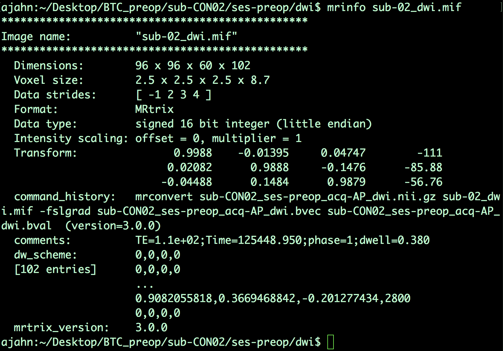
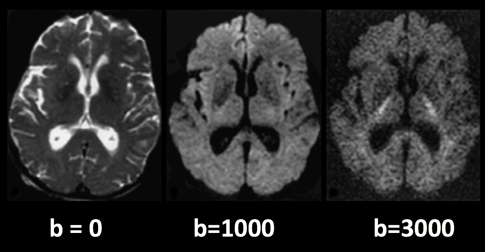
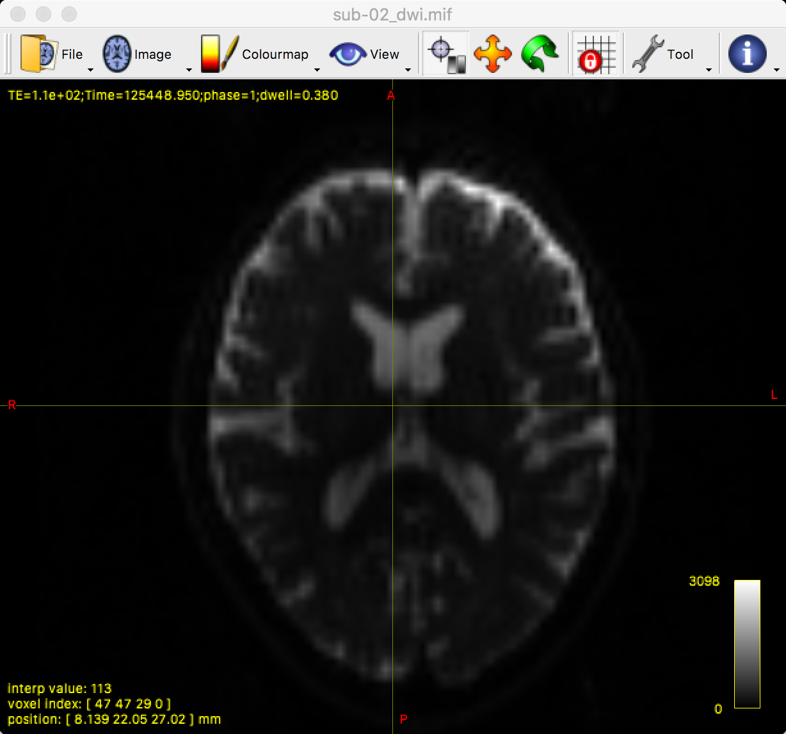
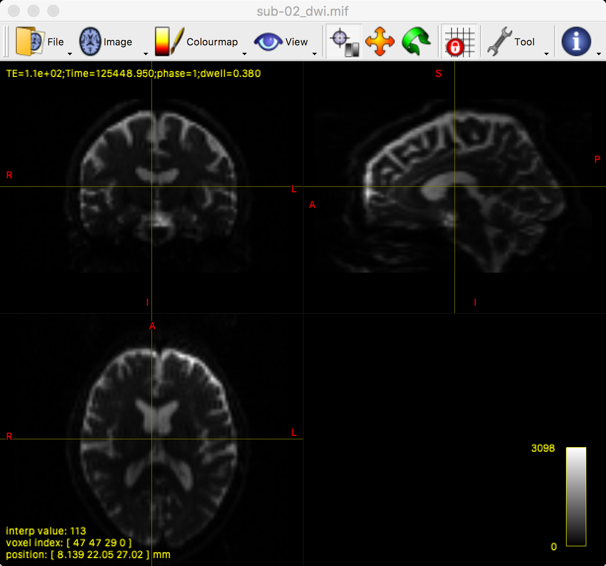
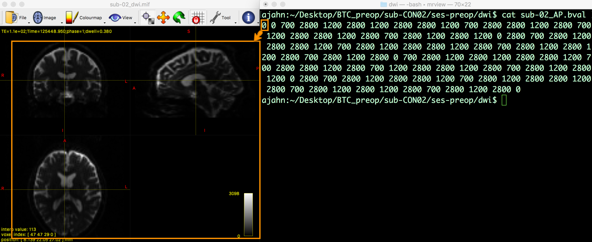
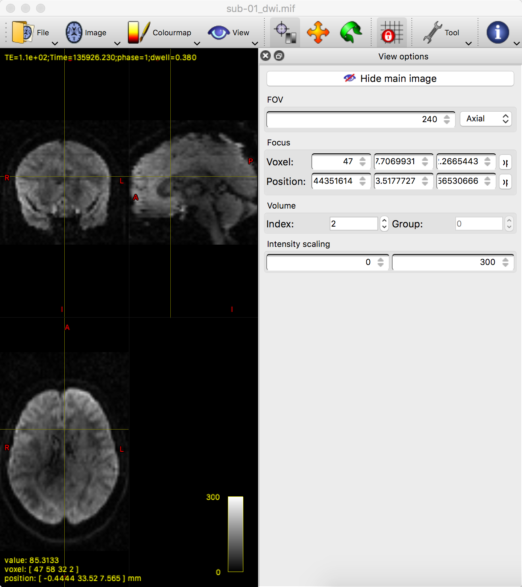

.. _MRtrix_03_Formatos de datos:

=======================================
Tutorial n.º 3 de MRtrix: Análisis de los datos
=======================================

---------------

Descripción general
****************

MRtrix utiliza su propio formato para almacenar y mostrar datos de imágenes. Si ya ha consultado los tutoriales de los principales paquetes de software de fMRI, como SPM, FSL y AFNI, recordará que todos pueden leer y escribir imágenes en formato NIFTI. (AFNI, por defecto, escribirá los archivos en su propio formato BRIK/HEAD, a menos que especifique que la salida tenga la extensión .nii, pero es la única excepción). MRtrix también puede leer datos sin procesar en formato NIFTI, pero generará sus archivos en formato MRtrix, con la extensión .mif.

Para ver cómo funciona esto, diríjase a la carpeta ``sub-CON02/ses-preop/dwi``, que contiene sus datos de difusión. Uno de los primeros pasos para preprocesar sus datos es convertirlos a un formato compatible con MRtrix. Usaremos el comando ``mrconvert`` para combinar los datos de difusión sin procesar con sus archivos ``.bval`` y ``.bvec`` correspondientes, de modo que podamos usar el archivo combinado para futuros pasos de preprocesamiento:

::

  mrconvert sub-CON02_ses-preop_acq-AP_dwi.nii.gz sub-02_dwi.mif -fslgrad sub-CON02_ses-preop_acq-AP_dwi.bvec sub-CON02_ses-preop_acq-AP_dwi.bval
  
Este comando requiere tres argumentos: la entrada, que es el archivo DWI sin procesar en el directorio AP; un archivo de salida, que llamaremos sub-02_dwi.mif para hacerlo más compacto y fácil de leer; y ``-fslgrad``, que requiere los archivos .bvec y .bval correspondientes (en ese orden).

.. nota::

  Para que el resto del tutorial también sea más fácil de leer, utilice el comando ``mv`` para cambiar el nombre de los archivos .bval y .bvec:
  
  ::
  
    mv sub-CON02_ses-preop_acq-AP_dwi.bvec sub-02_AP.bvec
    mv sub-CON02_ses-preop_acq-AP_dwi.bval sub-02_AP.bval
    mv sub-CON02_ses-preop_acq-PA_dwi.bvec sub-02_PA.bvec
    mv sub-CON02_ses-preop_acq-PA_dwi.bval sub-02_PA.bval

La imagen de salida, ``sub-02_dwi.mif``, se puede verificar con el comando ``mrinfo``:

::

  mrinfo sub-02_dwi.mif
  
La salida contiene varios datos, como las dimensiones del conjunto de datos y el tamaño del vóxel, junto con los comandos que se utilizaron para generar el archivo actual:

Tenga en cuenta que, al tratarse de un conjunto de datos de 4 dimensiones, la última dimensión es el **tiempo**; es decir, este archivo contiene 102 volúmenes, cada uno con dimensiones de 96 x 96 x 60 vóxeles. La última dimensión del campo «Tamaño del vóxel», que en este caso tiene un valor de 8,7, indica el tiempo de adquisición de cada volumen. Este tiempo también se denomina tiempo de repetición o TR.

Bvals y Bvecs
***************

Los otros archivos que necesitamos verificar son los archivos **bvals** y **bvecs**. (Para una revisión más completa de lo que significan estos términos, consulte este capítulo)En resumen, los bvals contienen un único número por volumen que indica la magnitud del gradiente de difusión aplicado a los datos; y el archivo bvecs contiene un triplete de números por volumen que muestra la dirección en la que se aplicaron los gradientes. En general, los volúmenes con valores b mayores serán más sensibles a los cambios de difusión, pero las imágenes también serán más susceptibles al movimiento y a artefactos fisiológicos, como se muestra en la figura siguiente.

  Tres volúmenes con diferentes valores b. Un valor b de 0 equivale a una exploración funcional ponderada en T2, mientras que valores b más altos resultan en una menor calidad de imagen (pero mayor sensibilidad a la difusión).
  
La comprobación más importante es asegurar que el número de bvals y bvecs coincida con el número de volúmenes en el conjunto de datos. Por ejemplo, podemos encontrar el número de volúmenes en el conjunto de datos ``sub-02_dwi.mif`` escribiendo:

::

  mrinfo -size sub-02_dwi.mif | awk '{imprimir $4}'
  
Esto devuelve un valor de 102, el número en el cuarto campo del encabezado de dimensiones que corresponde al número de puntos de tiempo, o volúmenes, en el conjunto de datos. Luego, comparamos esto con el número de bvals y bvecs usando awk para contar el número de columnas en cada archivo de texto:

::

  awk '{imprimir NF; salir}' sub-02_AP.bvec
  awk '{imprimir NF; salir}' sub-02_AP.bval
  
Lo cual debería devolver un valor de 102.

.. nota::

  Si la cantidad de volúmenes en su conjunto de datos y la cantidad de bvals y bvecs no coinciden, debe consultar con su técnico de escaneo acerca de la discrepancia; es posible que los archivos no se hayan cargado correctamente al servidor o tal vez la imagen ponderada por difusión no se adquirió correctamente.
  

Mirando los datos con mrview
*******************************
  
MRtrix, al igual que los demás programas de imágenes que hemos tratado en este libro electrónico, cuenta con su propio visor de imágenes, llamado **mrview**. Por ejemplo, puede ver la imagen que creamos arriba escribiendo:

::

  mrview sub-02_dwi.mif
  
Esto abre un único panel de visualización de los cortes axiales:

Puede ver los tres ángulos de visión haciendo clic en "Ver" y luego seleccionando "Vista ortogonal", lo que cambiará la ventana a la siguiente:

Al hacer clic y arrastrar la cruceta, puede examinar el cerebro completo desde los tres puntos de vista. Observe que estamos viendo el primer volumen de una **serie temporal** y que podemos desplazarnos por las imágenes pulsando las flechas derecha e izquierda para avanzar o retroceder. El primer volumen mostrado, cuyo índice de serie temporal es 0 (es decir, 0 indica el primer volumen de la serie temporal, 1 el segundo, y así sucesivamente), parece una imagen funcional típica ponderada en T2. Podemos verificarlo comparándolo con el valor b del primer volumen de la serie temporal:

Ahora pase el ratón sobre la ventana de visualización de mrview y pulse la flecha derecha para cargar el siguiente volumen de la serie temporal. Si observa el archivo bval, ¿esperaría que esta imagen se viera similar o diferente a la que acaba de ver? ¿Por qué? Piense en esto al cargar la tercera y la cuarta imagen de la serie temporal, observando las diferencias de intensidad y su correspondencia con sus respectivos valores b. Si la disminución de la intensidad oscurece la imagen, puede aumentar el brillo haciendo clic en "Herramientas -> Opciones de vista" e introduciendo un valor máximo inferior en el campo "Escala de intensidad".

Video
*****

Puedes seguirlo con este vídeo
    `__ para obtener más información sobre cómo verificar los datos.

Próximos pasos
*********

Una vez que haya practicado la observación de los datos y haya observado la relación entre los valores b y los volúmenes, intente lo mismo con la imagen ponderada por difusión con codificación de fase en la dirección PA (es decir, sub-CON02_ses-preop_dwi_sub-CON02_ses-preop_acq-PA_dwi.nii.gz). ¿Cuántos volúmenes hay en este conjunto de datos? ¿Cuáles son los valores b? ¿Cómo se compara con lo observado en el conjunto de datos ponderado por difusión AP?

Ahora que ha aprendido algunos de los comandos y conceptos básicos de MRtrix, comenzaremos a preprocesar los datos para ajustar las líneas de flujo. Para comenzar, haga clic en el botón "Siguiente".

    
   

