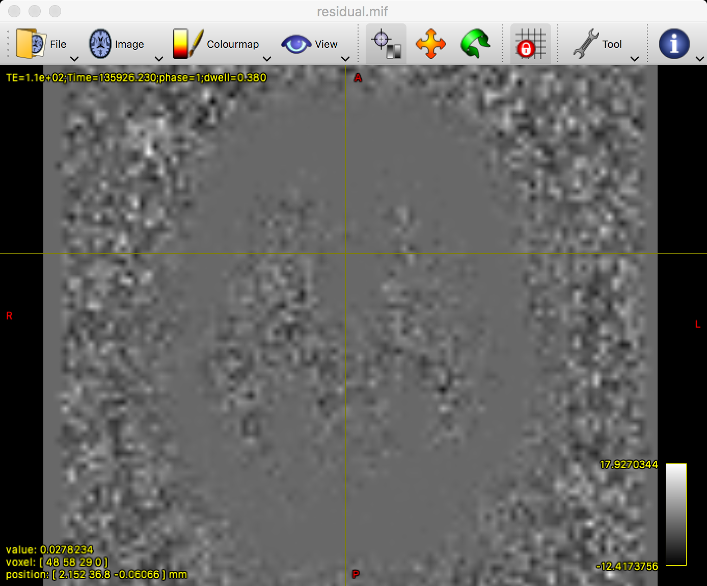
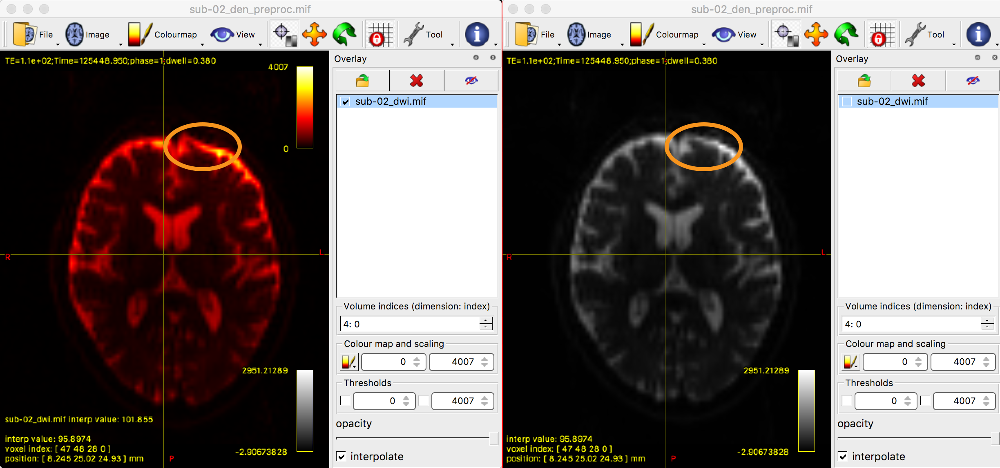
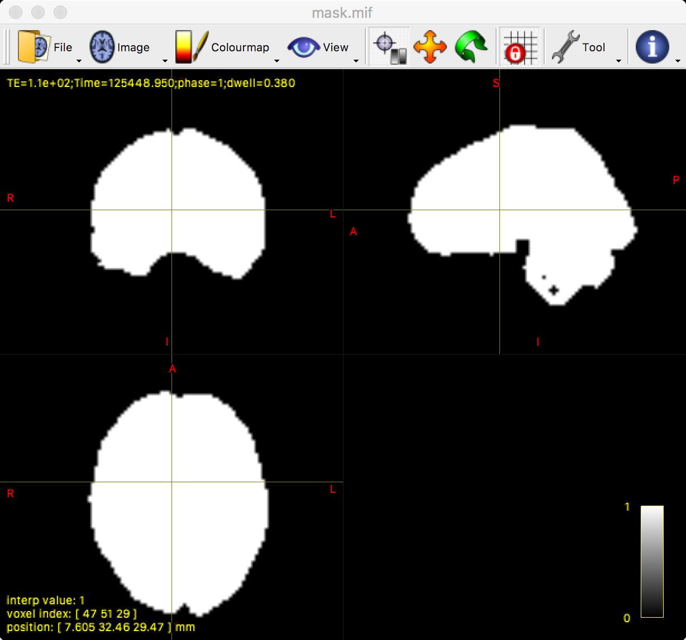

.. _MRtrix_04_Preprocesamiento:

=================================
Tutorial n.° 4 de MRtrix: Preprocesamiento
=================================

---------------

Descripción general
********

Al igual que otros datos de neuroimagen, los datos de difusión deben **preprocesarse** antes de su análisis. El preprocesamiento elimina las fuentes de ruido de la imagen, como artefactos de movimiento y otras distorsiones. Los datos de difusión, en particular, son susceptibles a **artefactos de deformación** debido a la dirección de codificación de fase: en general, la dirección de codificación predominante, como Anterior-Posterior (AP), hará que la parte anterior del cerebro se vea más compacta, como si soplara un fuerte viento en contra desde la dirección anterior. Lo contrario ocurre con la dirección de codificación de fase Posterior-Anterior (PA). A veces, estas distorsiones son muy sutiles, pero otras veces son evidentes.

.. figure:: 04_AP_PA_Comparaciones.png

Los siguientes son pasos comunes de preprocesamiento realizados con MRtrix. Si ha utilizado el paquete de software FSL para analizar datos de difusión, tenga en cuenta que algunos comandos de FSL, como eddy y topup, se utilizan en algunas bibliotecas de MRtrix. Analizaremos esto con más detalle a continuación.

dwi_denoise
***********

El primer paso de preprocesamiento que realizaremos es **eliminar el ruido** de los datos mediante el comando ``dwidenoise`` de MRtrix. Esto requiere un argumento de entrada y uno de salida, y también se puede generar el mapa de ruido con la opción ``-noise``. Por ejemplo:

::

  dwidenoise sub-02_dwi.mif sub-02_den.mif -ruido ruido.mif
  
Este comando debería tardar un par de minutos en ejecutarse.

Una comprobación de calidad consiste en observar si los residuos se acumulan en alguna parte de la anatomía. De ser así, podría indicar que la región cerebral se ve afectada de forma desproporcionada por algún tipo de artefacto o distorsión. Para calcular este residuo, usaremos otro comando de MRtrix llamado ``mrcalc``:

::

  mrcalc sub-02_dwi.mif sub-02_den.mif -subtract residual.mif
  
Luego puedes inspeccionar el mapa residual con mrview:

::

  mrview residual.mif
  

Es común ver un contorno gris del cerebro, como en la figura anterior. Sin embargo, todo dentro de la materia gris y la materia blanca debería ser relativamente uniforme y borroso; si se observan puntos de referencia anatómicos claros, como circunvoluciones o surcos individuales, esto podría indicar que esas partes del cerebro han sido alteradas por el ruido. En tal caso, se puede aumentar la intensidad del filtro de eliminación de ruido del valor predeterminado de 5 a un número mayor, como 7; por ejemplo,

::

  dwidenoise your_data.mif your_data_denoised_7extent.mif -extent 7 -noise noise.mif

resonancia magnética_degibbs
***********

Un paso de preprocesamiento opcional es ejecutar ``mri_degibbs``, que elimina los artefactos de timbre de ``Gibbs``.`__ de los datos. Estos artefactos se asemejan a las ondas de un estanque y son más visibles en las imágenes con un valor b de 0. Analice primero sus datos de difusión con ``mrview`` y determine si existen artefactos de Gibbs. Si los hay, puede ejecutar ``mrdegibbs`` especificando un archivo de entrada y uno de salida, por ejemplo:

::

  mrdegibbs sub-02_den.mif sub-02_den_unr.mif
  
As always, inspect the data both before and after with ``mrview`` to determine whether the preprocessing step made the data better, worse, or had no effect.

If you don't see any Gibbs artifacts in your data, then I would recommend omitting this step; we won't be using it for the rest of the tutorial.

Extracting the Reverse Phase-Encoded Images
*******************************************

Most diffusion datasets are composed of two separate imaging files: One that is acquired with a primary phase-encoding direction, and one that is acquired with a reverse phase-encoding direction. The primary phase-encoding direction is used to acquire the majority of the diffusion images at different b-values. The reverse-phase encoded file, on the other hand, is used to **unwarp** any of the distortions that are present in the primary phase-encoded file.

To understand how this works, imagine that you are using a blow dryer on your hair. Let's say that you have the blow dryer pointed at the back of your head, and it blows your hair forward, onto the front of your face; let's call this the posterior-to-anterior (PA) phase-encoding direction. Right now your hair looks like a mess, and you want to undo the effects of the air blowing from the back of your head to the front of your head. So you point the blow dryer at the front of your face, and it blows your hair back. If you take the average between the two of those blow dryings, your hair should be back in its normal position.

Similarly, we use both phase-encoding directions to create a sort of average between the two. We know that both types of phase-encoding will introduce two separate and opposite distortions into the data, but we can use unwarping to cancel them out.

Our first step is to convert the reverse phase-encoded NIFTI file into .mif format. We will also add its b-values and b-vectors into the header:

::

  mrconvert sub-CON02_ses-preop_acq-PA_dwi.nii.gz PA.mif
  mrconvert PA.mif -fslgrad sub-02_PA.bvec sub-02_PA.bval - | mrmath - mean mean_b0_PA.mif -axis 3

Next, we extract the b-values from the primary phase-encoded image, and then combine the two with ``mrcat``:

::

  dwiextract sub-02_den.mif - -bzero | mrmath - mean mean_b0_AP.mif -axis 3
  mrcat mean_b0_AP.mif mean_b0_PA.mif -axis 3 b0_pair.mif
  
This will create a new image, "b0_pair.mif", which contains both of the average b=0 images for both phase-encoded images.

Putting It All Together: Preprocessing with dwipreproc
******************************************************

We now have everything we need to run the main preprocessing step, which is called by ``dwipreproc``. For the most part, this command is a wrapper that uses FSL commands such as ``topup`` and ``eddy`` to unwarp the data and remove eddy currents. For this tutorial, we will use the following line of code:

::

  dwifslpreproc sub-02_den.mif sub-02_den_preproc.mif -nocleanup -pe_dir AP -rpe_pair -se_epi b0_pair.mif -eddy_options " --slm=linear --data_is_shelled"
  
The first arguments are the input and output; the second option, ``-nocleanup``, will keep the temporary processing folder which contains a few files we will examine later. ``-pe_dir AP`` signalizes that the primary phase-encoding direction is anterior-to-posterior, and ``-rpe_pair`` combined with the ``-se_epi`` options indicates that the following input file (i.e., "b0_pair.mif") is a pair of spin-echo images that were acquired with reverse phase-encoding directions. Lastly, ``-eddy_options`` specifies options that are specific to the FSL command ``eddy``. You can visit the `eddy user guide 
    `__ for more options and details about what they do. For now, we will only use the options ``--slm=linear`` (which can be useful for data that was acquired with less than 60 directions) and ``--data_is_shelled`` (which indicates that the diffusion data was acquired with multiple b-values).

This command can take several hours to run, depending on the speed of your computer. For an iMac with 8 processing cores, it takes roughly 2 hours. When it has finished, examine the output to see how eddy current correction and unwarping have changed the data; ideally, you should see more signal restored in regions such as the orbitofrontal cortex, which is particularly susceptible to signal dropout:

::

  mrview sub-02_den_preproc.mif -overlay.load sub-02_dwi.mif
  
This command will display the newly preprocessed data, with the original diffusion data overlaid on top of it and colored in red. To see how the eddy currents were unwarped, open the Overlays tab and click on the box next to the image ``sub-02_dwi.mif``. You should see a noticeable difference between the two images, especially in the frontal lobes of the brain near the eyes, which are most susceptible to eddy currents.

Checking for Corrupt Slices
^^^^^^^^^^^^^^^^^^^^^^^^^^^

One of the options in the ``dwifslpreproc`` command, "-nocleanup", retained a directory with the string "tmp" in its title. Within this folder is a file called ``dwi_post_eddy.eddy_outlier_map``, which contains strings of 0's and 1's. Each 1 represents a slice that is an outlier, either because of too much motion, eddy currents, or something else.

The following code, run from the ``dwi`` directory, will navigate into the "tmp" folder and calculate the percentage of outlier slices:

::

  cd dwifslpreproc-tmp-*
  totalSlices=`mrinfo dwi.mif | grep Dimensions | awk '{print $6 * $8}'`
  totalOutliers=`awk '{ for(i=1;i<=NF;i++)sum+=$i } END { print sum }' dwi_post_eddy.eddy_outlier_map`
  echo "If the following number is greater than 10, you may have to discard this subject because of too much motion or corrupted slices"
  echo "scale=5; ($totalOutliers / $totalSlices * 100)/1" | bc | tee percentageOutliers.txt
  cd ..
    
The first two lines navigate into the "tmp" directory and calculate the total number of slices by multiplying the number of slices for a single volume by the total number of volumes in the dataset. The total number of 1's in the outlier map is then calculated, and the percentage of outlier slices is generated by dividing the number of outlier slices by the total number of slices. If this number is greater than 10 - i.e., if more than 10 percent of the slices are flagged as outliers - you should consider removing the subject from further analyses.

Generating a Mask
*****************

As with fMRI analysis, it is useful to create a mask to restrict your analysis only to brain voxels; this will speed up the rest of your analyses.

To do that, it can be useful to run a command beforehand called ``dwibiascorrect``. This can remove inhomogeneities detected in the data that can lead to a better mask estimation. However, it can in some cases lead to a worse estimation; as with all of the preprocessing steps, you should check it before and after each step:

::

  dwibiascorrect ants sub-02_den_preproc.mif sub-02_den_preproc_unbiased.mif -bias bias.mif
  
.. note::

  The command above uses the ``-ants`` option, which requires that ANTs be installed on your system. I recommend this program, but in case you are unable to install it, you can replace it with the ``-fsl`` option.
  
You are now ready to create the mask with ``dwi2mask``, which will restrict your analysis to voxels that are located within the brain:

::

  dwi2mask sub-02_den_preproc_unbiased.mif mask.mif
  
Check the output of this command by typing:

::

  mrview mask.mif
  
You should see something like the following:

MRtrix's dwi2mask command works well in most scenarios. However, you can see from the above image that there are a few holes in the mask within the brainstem and the cerebellum. You may be uninterested in these regions, but it is still a good idea to make sure the mask doesn't have any holes anywhere.

To that end, you could use a command such as FSL's ``bet2``. For example, you could use the following code to convert the unbiased diffusion-weighted image to NIFTI format, create a mask with ``bet2``, and then convert the mask to .mif format:

::
  
  mrconvert sub-02_den_preproc_unbiased.mif sub-02_unbiased.nii
  bet2 sub-02_unbiased.nii sub-02_masked -m -f 0.7
  mrconvert sub-02_masked_mask.nii.gz mask.mif
  
You may have to experiment with the fractional intensity threshold (specified by ``-f``) in order to generate a mask that you are satisfied with. In my experience, this can vary between 0.2 and 0.7 for most brains in order to generate an adequate mask.
  
Video
*****

A video overview of preprocessing in MRtrix can be found `here 
     `__.
  
Next Steps
**********

Ahora que tenemos nuestros datos de difusión preprocesados y una máscara, estamos listos para realizar la **deconvolución esférica restringida**, que cubriremos en el próximo capítulo.

     
    
   

