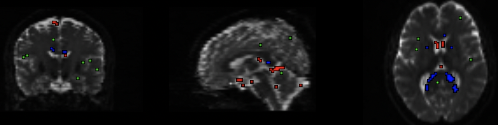
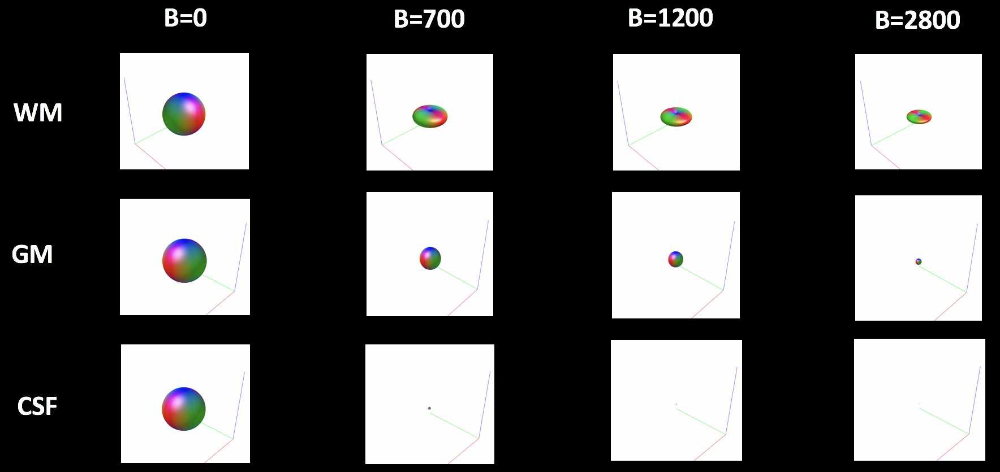
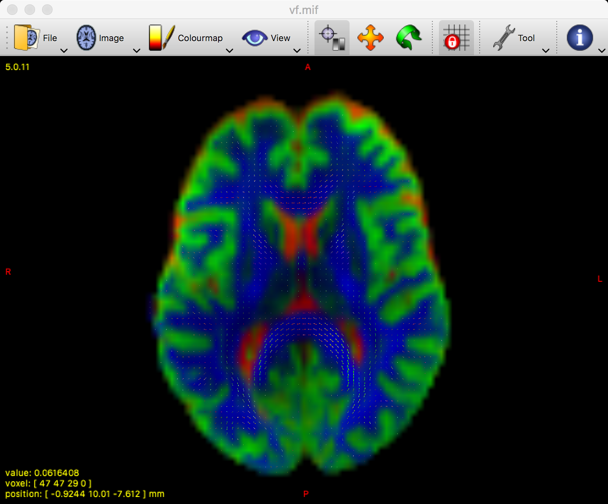
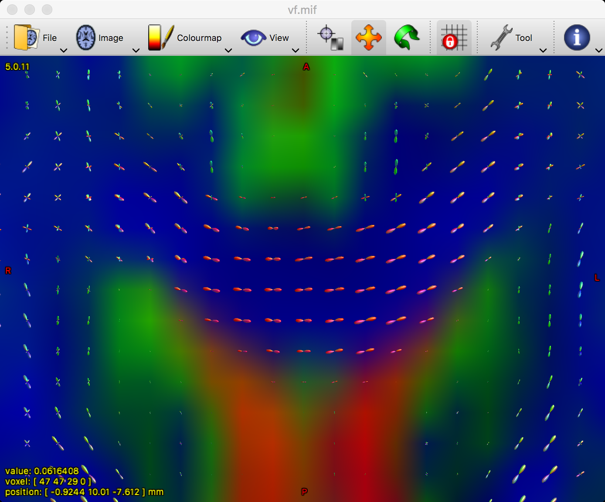

.. _MRtrix_05_Funciones básicas:

=======================================================
Tutorial n.º 5 de MRtrix: Deconvolución esférica restringida
=======================================================

--------------

Descripción general
********

Para determinar la orientación de la difusión dentro de cada vóxel, crearemos una **función base** a partir de los datos del sujeto. Al extraer la señal de difusión de vóxeles representativos de materia gris, materia blanca y líquido cefalorraquídeo, construiremos un modelo para estimar cómo debería verse la señal en diferentes orientaciones y al aplicar diferentes valores b. El concepto es similar al uso de una función de respuesta hemodinámica (HRF) como función base para datos de fMRI: obtenemos una forma canónica de cómo creemos que debería verse la señal fMRI en respuesta a un solo evento y luego la modulamos para ajustarla a los datos observados.

La función de respuesta es similar a la HRF canónica que utilizamos en estudios de fMRI. Sin embargo, en este caso, estimamos la función de respuesta para cada tipo de tejido. Si recopila datos de difusión con múltiples valores b, este enfoque en MRtrix se denomina **multicapa multitejido (MSMT)**.

respuesta dwi2
************

A diferencia de la mayoría de los estudios de fMRI, que utilizan una función base creada previamente, MRtrix derivará una función base a partir de los datos de difusión; usar los datos de un sujeto individual es más preciso y específico para ese sujeto. El comando ``dwi2response`` ofrece varios algoritmos diferentes, pero en este tutorial utilizaremos el algoritmo "dhollander":

::

  dwi2response dhollander sub-02_den_preproc_unbiased.mif wm.txt gm.txt csf.txt -voxels voxels.mif

Analicemos la función de este comando. Primero, utiliza un algoritmo para deconvolucionar las distribuciones de orientación de las fibras (FOD); en otras palabras, intenta descomponer la señal de difusión en un conjunto de orientaciones de fibras individuales más pequeñas. Existen varios algoritmos, pero los más comunes son Tournier y Dhollander. El algoritmo Tournier se utiliza para datos de una sola capa y para un solo tipo de tejido (p. ej., sustancia blanca). El algoritmo Dhollander puede utilizarse para datos de una o varias capas, y para múltiples tipos de tejido. Estimar las FOD para cada tipo de tejido nos ayudará posteriormente a realizar tractografías con restricciones anatómicas.

El siguiente argumento especifica los datos de entrada y las funciones de respuesta resultantes para los diferentes tipos de tejido. El orden es importante; puede nombrar los archivos de salida como desee, pero lo más lógico es etiquetarlos como una variación de las frases "materia blanca", "materia gris" y "líquido cefalorraquídeo" (en este caso, etiquetados como "wm.txt", "gm.txt" y "csf.txt"). La última opción, "-voxels", especifica un conjunto de datos de salida que muestra qué vóxeles de la imagen se utilizaron para construir las funciones base para cada tipo de tejido. Este conjunto de datos se puede ver escribiendo lo siguiente:

::

  mrview sub-02_den_preproc_unbiased.mif -overlay.load voxels.mif
  
Lo que generará algo como esto:

  El resultado del comando ``dwi2response`` muestra los vóxeles utilizados para construir una función base para cada tipo de tejido. Rojo: vóxeles de LCR; Verde: vóxeles de materia gris; Azul: vóxeles de materia blanca. Asegúrese de que estos colores estén ubicados correctamente; por ejemplo, los vóxeles rojos deben estar dentro de los ventrículos.

Luego puede verificar la función de respuesta para cada tipo de tejido escribiendo:

::

  shview wm.txt
  shview gm.txt
  shview csf.txt

Examine cada uno de estos archivos individualmente. La primera imagen que aparece parece una esfera; esto representa el aspecto de la difusión en ese tipo de tejido cuando se aplica un valor b de cero; es decir, cuando no hay gradiente de difusión. Al presionar las teclas de flecha derecha e izquierda, puede ver el aspecto de la función base cuando se aplican diferentes valores b.

La figura a continuación muestra cómo cambia la función base para cada combinación de tipo de tejido y valor b. Observe cómo la magnitud (o tamaño) general de la esfera para cada tipo de tejido se reduce al aplicar valores b más altos; aunque los valores b más altos son más sensibles a los cambios en la difusión, la señal general es menor y más susceptible al ruido. Dentro de la sustancia blanca, la esfera tiende a aplanarse formando una especie de panqueque al aplicar gradientes de difusión, lo que refleja la dirección preferencial de la difusión a lo largo de los tractos de sustancia blanca en estos vóxeles. Por otro lado, para la sustancia gris y el líquido cefalorraquídeo, la función base permanece esférica en todos los valores b.

.. nota::

  Las funciones base de la materia gris y del líquido cefalorraquídeo tienden a disminuir a ritmos diferentes a medida que aumentan los valores b. ¿A qué cree que se debe esto?

Densidad de orientación de la fibra (FOD)
*******************************

Ahora utilizaremos las funciones base generadas anteriormente para crear **Densidades de Orientación de Fibra**, o DFO. Estas son estimaciones de la cantidad de difusión en cada una de las tres direcciones ortogonales. Como se describe en el capítulo introductorio.Estos son análogos a los tensores utilizados en los estudios de difusión tradicionales. Sin embargo, MRtrix permite la estimación de múltiples fibras cruzadas dentro de un solo vóxel y puede resolver la señal de difusión en múltiples direcciones.

Para ello, usaremos el comando ``dwi2fod`` para aplicar las funciones de base a los datos de difusión. La opción "-mask" especifica los vóxeles que utilizaremos; esto simplemente sirve para restringir nuestro análisis a los vóxeles cerebrales y reducir el tiempo de cálculo. Los archivos ".mif" especificados después de cada función de base generarán una imagen FOD para ese tipo de tejido:

::

  dwi2fod msmt_csd sub-02_den_preproc_unbiased.mif -mask máscara.mif wm.txt wmfod.mif gm.txt gmfod.mif csf.txt csffod.mif

Para visualizar estos FOD, los combinaremos en una sola imagen. El comando ``mrconvert`` extraerá la primera imagen del archivo wmfod.mif, que es la imagen con un valor b de 0. La salida de este comando se utiliza como entrada para el comando ``mrcat``, que combina las imágenes FOD de los tres tipos de tejido en una sola imagen que llamaremos "vf.mif".

::

  mrconvert -coord 3 0 wmfod.mif - | mrcat csffod.mif gmfod.mif - vf.mif

Los FOD de materia blanca se pueden superponer en esta imagen, de modo que podamos observar si los FOD de materia blanca efectivamente caen dentro de la materia blanca, y también si están a lo largo de las orientaciones que esperaríamos:

::

  mrview vf.mif -odf.load_sh wmfod.mif
  
El resultado será algo como esto:

  Los FOD de la sustancia blanca se superponen en una imagen con código de colores para cada tipo de tejido. El verde representa la sustancia gris, el líquido cefalorraquídeo se representa en rojo y la sustancia blanca se muestra en azul.
  
Puede ampliar la imagen manteniendo presionada la tecla "Comando" y girando la rueda del ratón. Céntrese en una región como el cuerpo calloso; si los FOD se han estimado correctamente, el color predominante en el cuerpo calloso debería ser el rojo, ya que este indica que la orientación principal es de izquierda a derecha.

Recuerda que el verde significa de posterior a anterior y el azul representa las orientaciones de inferior a superior. Utilizando las tres vistas ortogonales, observa si puedes encontrar tractos como el fascículo longitudinal superior y la corona radiada. ¿Coinciden con los colores esperados?

Normalización
************

Más adelante, aprenderemos a realizar un análisis a nivel de grupo con los datos generados para cada sujeto. Para que las comparaciones entre sujetos sean válidas, necesitaremos **normalizar** los FOD. Esto garantiza que las diferencias observadas no se deban a diferencias de intensidad en la imagen, de forma similar a cómo corregimos el tamaño del cerebro al comparar las diferencias volumétricas entre sujetos.

Para normalizar los datos, utilizaremos el comando ``mtnormalise``. Esto requiere una entrada y una salida para cada tipo de tejido, así como una máscara para restringir el análisis a los vóxeles cerebrales:

::

  mtnormalizar wmfod.mif wmfod_norm.mif gmfod.mif gmfod_norm.mif csffod.mif csffod_norm.mif -máscara máscara.mif

Video
*****

Haga clic aquí
    `__ para una demostración de cómo crear funciones base en MRtrix.

Próximos pasos
*********

Ahora que hemos estimado correctamente los FOD para cada tipo de tejido, estamos listos para sentar las bases de nuestro análisis tractográfico. El siguiente paso será determinar el límite entre la materia gris y la materia blanca, que usaremos como punto de partida para nuestras líneas de corriente.

    
   

