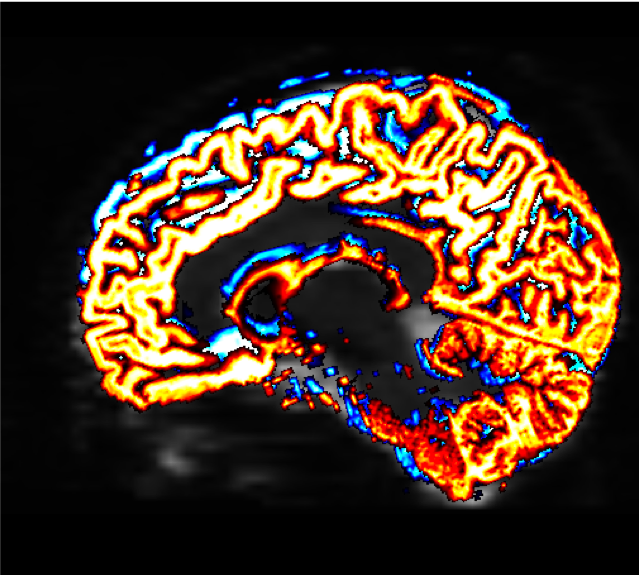
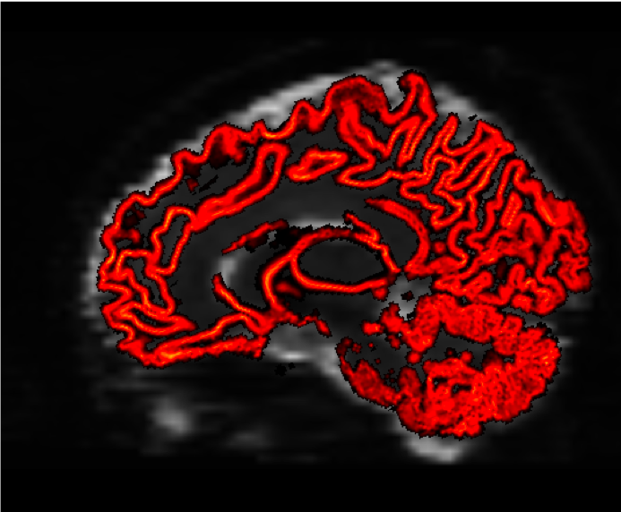

.. _MRtrix_06_Límite de tejido:

==================================================
Tutorial n.° 6 de MRtrix: Creación de los límites del tejido
==================================================

--------------

Estamos casi listos para comenzar nuestro análisis de líneas de corriente, en el que colocaremos **semillas** en ubicaciones aleatorias a lo largo del límite entre la materia gris y la blanca. Una línea de corriente crecerá desde cada semilla y trazará un camino desde esa región hasta terminar en otra. Algunas líneas de corriente terminarán en lugares sin sentido; por ejemplo, una línea de corriente podría terminar en el borde de los ventrículos. Descartaremos estas líneas de corriente "erróneas" y nos quedará la mayoría de las que parecen conectar regiones distantes de materia gris.

Para ello, primero debemos crear un **límite** entre la materia gris y la materia blanca. El comando MRtrix ``5ttgen`` utilizará FAST de FSL, junto con otros comandos, para segmentar la imagen anatómica en cinco tipos de tejido:

1. Materia Gris;
2. Materia gris subcortical (como la amígdala y los ganglios basales);
3. Sustancia Blanca;
4. Líquido cefalorraquídeo; y
5. Tejido patológico.

Una vez que hayamos segmentado el cerebro en esas clases de tejido, podemos usar el límite como una máscara para restringir dónde colocaremos nuestras semillas.

Conversión de la imagen anatómica
*******************************

Primero, es necesario convertir la imagen anatómica al formato MRtrix. Al igual que en un capítulo anterior, usaremos el comando ``mrconvert``. Si se encuentra en el directorio ``dwi``, puede escribir lo siguiente:

::

  mrconvert ../anat/sub-CON02_ses-preop_T1w.nii.gz T1.mif
  
Esto crea un nuevo archivo, ``T1.mif``, que puedes ver en mrview.

Ahora usaremos el comando ``5ttgen`` para segmentar la imagen anatómica en los tipos de tejido enumerados anteriormente:

::

  5ttgen fsl T1.mif 5tt_nocoreg.mif

Este comando tardará entre 10 y 15 minutos. Si la segmentación se ha completado correctamente, debería ver las siguientes imágenes al escribir ``mrview 5tt_nocoreg.mif`` (al presionar las flechas izquierda y derecha se desplaza por los diferentes tipos de tejido):

.. figure:: 06_TiposDeTejido.png

  El resultado de ``5ttgen fsl anat.mif 5tt_nocoreg.mif`` será un único conjunto de datos con cinco volúmenes, uno por tipo de tejido. Observe esta imagen con mrview, usando las flechas derecha e izquierda para alternar entre los tipos de tejido. Los tipos de tejido son: GM, WM, LCR, GM subcortical y tejido patológico. Si no se detecta tejido patológico, el volumen estará en blanco.

.. nota::

  Si el paso de segmentación falla, puede deberse a un contraste insuficiente entre los tipos de tejido; por ejemplo, algunas imágenes anatómicas son muy oscuras tanto en la sustancia gris como en la blanca, o muy claras en ambos tipos de tejido. Podemos facilitar el proceso de segmentación aumentando el contraste de intensidad (también conocido como **normalización de intensidad**) entre los tejidos con un comando como 3dUnifize de AFNI, por ejemplo:
  
  ::
   
    3dUnifize -input anat.nii -prefix anat_unifize.nii
    
  La diferencia entre la imagen antes y después puede ser sutil, pero puede evitar que se produzca un error de segmentación.

Registro conjunto de imágenes de difusión y anatómicas
*************************************************

Si la segmentación ha finalizado sin errores, el siguiente paso es corregistrar las imágenes anatómicas y ponderadas por difusión. Esto garantiza que los límites de los tipos de tejido coincidan con los de las imágenes ponderadas por difusión; incluso pequeñas diferencias en la ubicación de las dos exploraciones pueden distorsionar los resultados de la tractografía.

Primero usaremos los comandos ``dwiextract`` y ``mrmath`` para promediar las imágenes B0 de los datos de difusión. Estas son las imágenes que más se asemejan a las exploraciones funcionales ponderadas en T2, ya que no se aplicó un gradiente de difusión durante su adquisición; es decir, se adquirieron con un valor b de cero. Para ver cómo funciona esto, regrese al directorio ``dwi`` y escriba el siguiente comando:

::

  dwiextract sub-02_den_preproc_unbiased.mif - -bzero | mrmath - media media_b0.mif - eje 3
  
Este comando consta de dos partes, separadas por una barra vertical ("``|``"). La mitad izquierda, ``dwiextract``, toma la imagen preprocesada ponderada por difusión como entrada, y la opción ``-bzero`` extrae las imágenes B0; el argumento ``-`` indica que la salida debe usarse como entrada para la segunda parte del comando, a la derecha de la barra vertical. ``mrmath`` toma estas imágenes B0 de salida y calcula la media a lo largo del tercer eje, o la dimensión temporal. En otras palabras, si comenzamos con un índice de 0, el número 3 indica la cuarta dimensión, lo que significa promediar todos los volúmenes.

Para realizar el corregistro entre las imágenes de difusión y anatómicas, necesitaremos explorar brevemente otras opciones fuera de MRtrix. El paquete de software no incluye un comando de corregistro en su biblioteca, por lo que necesitaremos usar los comandos de otro paquete. Aunque puede elegir el que prefiera, aquí nos centraremos en el comando «flirt» de FSL.

El primer paso es convertir tanto la imagen anatómica segmentada como las imágenes B0 que acabamos de extraer:

::

  mv ../anat/5tt_nocoreg.mif .
  mrconvert media_b0.mif media_b0.nii.gz
  mrconvert 5tt_nocoreg.mif 5tt_nocoreg.nii.gz
  
Dado que ``flirt`` solo puede funcionar con una única imagen 3D (no con conjuntos de datos 4D), usaremos ``fslroi`` para extraer el primer volumen del conjunto de datos segmentado, que corresponde a la segmentación de materia gris:

::

  fslroi 5tt_nocoreg.nii.gz 5tt_vol0.nii.gz 0 1
  
Luego usamos el comando ``flirt`` para registrar conjuntamente los dos conjuntos de datos:

::

  coquetear -in mean_b0.nii.gz -ref 5tt_vol0.nii.gz -interp vecino más cercano -dof 6 -omat diff2struct_fsl.mat
  
Este comando utiliza la segmentación de materia gris (es decir, "5tt_vol0.nii.gz") como imagen de referencia, lo que significa que permanece estacionaria. Las imágenes B0 promediadas se desplazan para encontrar la que mejor se ajuste a la segmentación de materia gris. La salida de este comando, "diff2struct_fsl.mat", contiene la **matriz de transformación** utilizada para superponer la imagen de difusión sobre la segmentación de materia gris.

Ahora que hemos generado nuestra matriz de transformación, debemos convertirla a un formato legible para MRtrix. Es decir, estamos listos para volver a MRtrix tras salir brevemente de él. El comando ``transformconvert`` hace lo siguiente:

::

  transformarconvertir diff2struct_fsl.mat media_b0.nii.gz 5tt_nocoreg.nii.gz coquetear_importar diff2struct_mrtrix.txt
  
Tenga en cuenta que los pasos anteriores utilizaron la segmentación anatómica como imagen de referencia. Esto se debe a que, por lo general, el corregistro es más preciso si la imagen de referencia tiene mayor resolución espacial y una distinción más nítida entre los tipos de tejido. Sin embargo, también queremos minimizar las ediciones e interpolaciones en los datos funcionales durante el preprocesamiento. Por lo tanto, dado que ya contamos con los pasos para transformar la imagen de difusión en la imagen anatómica, podemos usar la matriz inversa de transformación para hacer lo contrario, es decir, corregistrar la imagen anatómica en la imagen de difusión.

::

  mrtransform 5tt_nocoreg.mif -lineal diff2struct_mrtrix.txt -inverso 5tt_coreg.mif
  
El archivo resultante, "5tt_coreg.mif", se puede cargar en ``mrview`` para examinar la calidad del corregistro:

::

  mrview sub-02_den_preproc_unbiased.mif -overlay.load 5tt_nocoreg.mif -overlay.colourmap 2 -overlay.load 5tt_coreg.mif -overlay.colourmap 1
  
Las opciones "overlay.colourmap" especifican diferentes códigos de color para cada imagen cargada. En este caso, los límites antes del corregistro se mostrarán en azul y los límites después del corregistro, en rojo.

  El cambio en los límites antes y después del registro conjunto puede ser muy leve, pero tendrá un gran impacto en el resto de los pasos. Asegúrese de verificar los límites en las tres vistas; también puede usar el menú "Herramientas -> Superposición" para mostrar u ocultar las diferentes superposiciones.

El último paso para crear el límite de "semilla" - el límite que separa la materia gris de la materia blanca, que usaremos para crear las semillas para nuestras líneas de corriente - se crea con el comando ``5tt2gmwmi`` (que significa "Interfaz de 5 tipos de tejido (segmentación) a materia gris/materia blanca")

::
  
  5tt2gmwmi 5tt_coreg.mif gmwmSeed_coreg.mif

Nuevamente, verificaremos el resultado con ``mrview`` para asegurarnos de que la interfaz esté donde creemos que debería estar:

::

  mrview sub-02_den_preproc_unbiased.mif -overlay.load gmwmSeed_coreg.mif
  
  
Deberías ver algo como esto al final:

Video
*****

Puede encontrar un video tutorial sobre la creación de los límites del tejido aquí`__.

Próximos pasos
*********

Ahora que hemos determinado dónde está el límite entre la materia gris y la blanca, estamos listos para empezar a generar **líneas de corriente** para reconstruir las principales vías de la materia blanca del cerebro. Veremos cómo hacerlo en el próximo capítulo.

   

