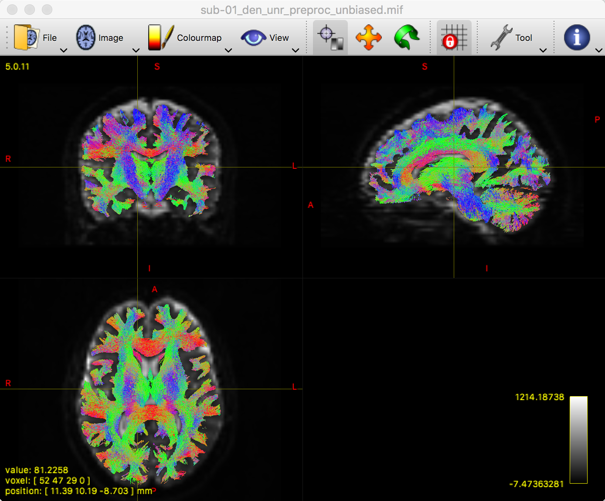

.. _MRtrix_07_Agiliza:

===============================
Tutorial n.° 7 de MRtrix: Líneas de corriente
===============================

--------------

Descripción general
********

Tras crear la interfaz entre la materia blanca y la materia gris, estamos listos para generar **líneas de corriente**: hilos que conectan regiones anatómicamente distintas de la materia gris. Estas son estimaciones de los tractos de materia blanca subyacentes, y MRtrix utiliza un enfoque **probabilístico** para ello: se genera un gran número de líneas de corriente para cada vóxel del límite entre la materia gris y la materia blanca, y luego se seleccionan según diferentes criterios que especificamos. A continuación, analizaremos algunas de las opciones más populares.

Tractografía anatómicamente restringida
*************************************

Una de las características de MRtrix es la Tractografía Anatómicamente Restringida (ACT). Este método solo determina la validez de una línea de corriente si es biológicamente plausible. Por ejemplo, una línea de corriente que termina en el líquido cefalorraquídeo se descarta, ya que los tractos de sustancia blanca tienden a originarse y terminar en la sustancia gris. En otras palabras, las líneas de corriente se restringirán a la sustancia blanca. El efecto de incluir u omitir este paso se puede observar en la siguiente figure:

.. figure:: 07_ACT_Con_Sin.png

  Análisis sin tractografía anatómicamente restringida (izquierda) y con tractografía anatómicamente restringida (derecha). Observe cómo, sin TCA, las líneas de corriente tienden a concentrarse en la sustancia blanca; sin embargo, una gran cantidad de ellas se encuentra en la sustancia gris y el líquido cefalorraquídeo. El uso de TCA (derecha) restringe las líneas de corriente a los tractos de sustancia blanca que se analizarán.
  
La tractografía anatómicamente restringida no es un paso de preprocesamiento separado, sino una opción que puede incluirse con el comando ``tckgen``, que genera las líneas de corriente reales.

Generando líneas de corriente con tckgen
**********************************

MRtrix permite realizar tractografías **deterministas** y **probabilísticas**. En la tractografía determinista, la dirección de la línea de corriente en cada vóxel se determina en función de la orientación predominante de la fibra; es decir, la línea de corriente se determina mediante un único parámetro. MRtrix incluye múltiples opciones para realizar este tipo de tractografía determinista, como ``FACT`` o ``tensor_det``.

El otro método, la tractografía probabilística, es el predeterminado en MRtrix. En este enfoque, se generan múltiples líneas de corriente a partir de regiones semilla a lo largo del límite entre la materia gris y la materia blanca. La dirección de la línea de corriente probablemente seguirá la densidad de orientación de fibra predominante, pero no siempre; debido al gran número de muestras, algunas líneas de corriente seguirán otras direcciones. Esto es menos probable si el FOD es extremadamente intenso en una dirección; por ejemplo, los FOD dentro de una estructura como el cuerpo calloso tenderán a estar alineados de izquierda a derecha. Sin embargo, el muestreo se diversifica en regiones sin una orientación de fibra predominante.

El método predeterminado es usar un algoritmo conocido como iFOD2, que utiliza un enfoque probabilístico de línea de flujo. Se pueden encontrar otros algoritmos en este sitio.`__, aunque durante el resto del tutorial utilizaremos el valor predeterminado de iFOD2.

¿Cuántas líneas de corriente?
^^^^^^^^^^^^^^^^^^^^^

Existe un equilibrio entre la cantidad de líneas de corriente generadas y el tiempo que requiere. Un mayor número de líneas de corriente resulta en una reconstrucción más precisa de los tractos de sustancia blanca subyacentes, pero estimar un gran número de ellas puede llevar un tiempo prohibitivo.

El número "correcto" de líneas de corriente a utilizar aún se debate, pero al menos unos 10 millones deberían ser un buen punto de partida:

::

  tckgen -act 5tt_coreg.mif -backtrack -seed_gmwmi gmwmSeed_coreg.mif -nthreads 8 -maxlength 250 -cutoff 0.06 -select 10000000 wmfod_norm.mif tracks_10M.tck
  
En este comando, la opción "-act" especifica que se utilizará la imagen segmentada anatómicamente para limitar el análisis a la sustancia blanca. "-backtrack" indica que la línea de corriente actual debe retroceder y repetirse si termina en un punto desconocido (p. ej., el líquido cefalorraquídeo); "-maxlength" establece la longitud máxima permitida del tracto, en vóxeles; y "-cutoff" especifica la amplitud del FOD para la terminación de un tracto (por ejemplo, un valor de 0,06 no permitiría que una línea de corriente siga un FOD inferior a ese número). "-seed_gmwmi" toma como entrada el límite entre materia gris y materia blanca generado con el comando ``5tt2gmwmi``.

"-nthreads" especifica el número de núcleos de procesamiento que desea utilizar para acelerar el análisis. Finalmente, "-select" indica cuántas líneas de flujo totales generar. Tenga en cuenta que puede usar una abreviatura si lo desea; en lugar de, por ejemplo, 10000000, puede reescribirlo como 10000k (que significa "diez mil millardos", lo que equivale a "diez millones"). Los dos últimos argumentos especifican tanto la entrada (``wmfod_norm.mif``) como una etiqueta para la salida (``tracks_10M.tck``).

Si desea visualizar la salida, recomiendo extraer un subconjunto de la salida utilizando ``tckedit``:

::

  tckedit tracks_10M.tck -número 200k pistas_200k.tck más pequeñas

Esto luego se puede cargar en ``mrview`` usando la opción "-tractography.load", que superpondrá automáticamente el archivo lowestTracks_200k.tck sobre la imagen ponderada por difusión preprocesada:

::

  mrview sub-02_den_preproc_unbiased.mif -tractography.load pistas_más pequeñas_200k.tck
  
Esto generará una figura como la siguiente:

Recuerde inspeccionar esta imagen para asegurarse de que las líneas de corriente terminen donde cree que deberían; es decir, que estén limitadas a la sustancia blanca y que su color sea el adecuado. Por ejemplo, el cuerpo calloso debe ser mayoritariamente rojo y la corona radiada, mayoritariamente azul.

Aunque hemos creado una imagen de difusión con líneas de corriente razonables, también conocida como **tractograma**, aún tenemos un problema con algunos tractos de sustancia blanca sobreajustados y otros infraajustados. Esto se puede solucionar con el comando ``tcksift2``.

Refinando las líneas de corriente con tcksift2
^^^^^^^^^^^^^^^^^^^^^^^^^^^^^^^^^^^^^

Podría preguntarse por qué es necesario modificar aún más las líneas de corriente una vez creado el tractograma. La razón es que algunos tractos se entrelazarán con más líneas de corriente que otros, ya que las densidades de orientación de las fibras son candidatas mucho más claras y atractivas para el algoritmo de muestreo probabilístico mencionado anteriormente. En otras palabras, ciertos tractos pueden estar sobrerrepresentados por la cantidad de líneas de corriente que los atraviesan, no necesariamente porque contengan más fibras, sino porque estas tienden a estar todas orientadas en la misma dirección.

Para contrarrestar este sobreajuste, el comando ``tcksift2`` creará un archivo de texto que contiene pesos para cada vóxel en el cerebro:

::

  tcksift2 -act 5tt_coreg.mif -out_mu sift_mu.txt -out_coeffs sift_coeffs.txt -nthreads 8 pistas_10M.tck wmfod_norm.mif sift_1M.txt

La salida del comando "sift_1M.txt" se puede usar con el comando ``tck2connectome`` para crear una matriz que muestre el grado de conexión de cada ROI con las demás ROI del cerebro (un conectoma), que ponderará cada ROI. Para ver cómo hacerlo, haga clic en el botón "Siguiente".

Video
*****

Para ver una descripción general en video de las líneas de corriente y cómo adaptarlas con tckgen, haga clic aquí
    `__.

    
   

