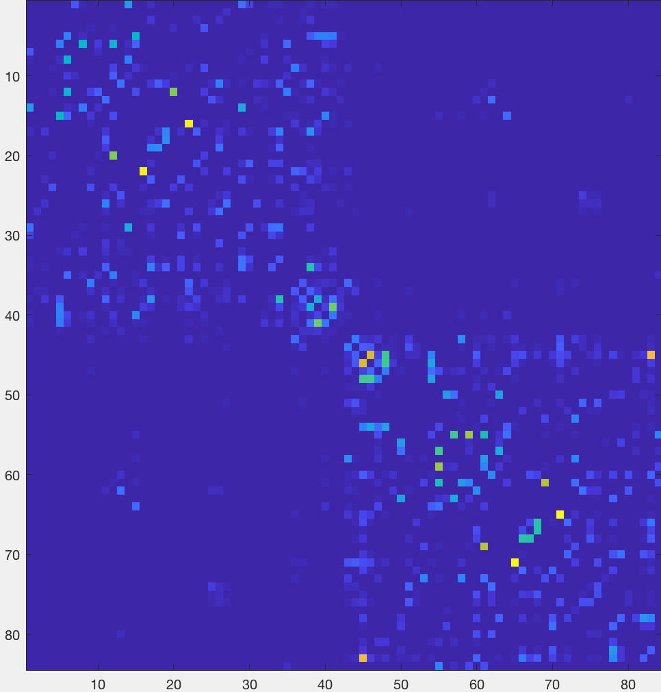
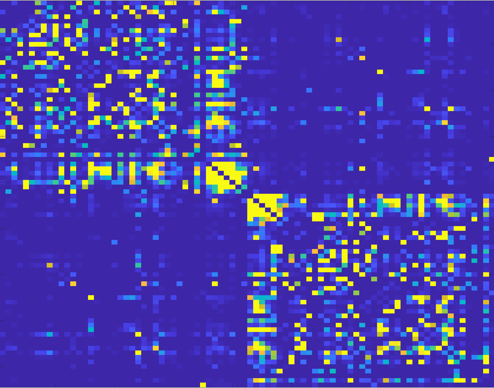

.. _MRtrix_08_Conectoma:

=======================================================
Tutorial n.° 8 de MRtrix: Creación y visualización del conectoma
=======================================================

------------------------

Descripción general
********

Ahora que hemos creado un mapa de líneas de corriente, podemos crear un **conectoma** que representa el número de líneas de corriente que conectan las diferentes partes del cerebro. Para ello, primero debemos parcelar el cerebro en diferentes regiones o nodos. Una forma de hacerlo es mediante un **atlas**, que asigna cada vóxel del cerebro a una ROI específica.

Puedes usar cualquier atlas que quieras, pero para este tutorial usaremos los atlas que vienen con :ref:`FreeSurfer`. En consecuencia, nuestro primer paso será ejecutar la imagen anatómica del sujeto a través de recon-all, sobre lo cual puede leer más aquí 
    `:

::

  recon-all -i ../anat/sub-CON02_ses-preop_T1w.nii.gz -s sub-CON02_recon -all
  
Esto tardará unas horas, dependiendo de la velocidad de su ordenador. Una vez finalizado, asegúrese de comprobar el resultado mediante los procedimientos de control de calidad descritos en este capítulo.
     `.

Creando el Conectoma
***********************

Una vez finalizada la recon-all, necesitaremos convertir las etiquetas de la parcelación de FreeSurfer a un formato que MRtrix entienda. El comando ``labelconvert`` utilizará la salida de parcelación y segmentación de FreeSurfer para crear un nuevo archivo parcelado en formato .mif:

::

  etiqueta convertida sub-CON02_recon/mri/aparc+aseg.mgz $FREESURFER_HOME/FreeSurferColorLUT.txt /usr/local/mrtrix3/share/mrtrix3/labelconvert/fs_default.txt sub-CON02_parcels.mif

.. Si usó ``mrtransform`` anteriormente para corregistrar el límite de materia gris, entonces debería usarlo nuevamente aquí para también corregistrar la parcelación: [ACTUALIZACIÓN 02.12.2021: Esto no parece ser necesario; en realidad, parece empeorar el corregistro
  mrtransform sub-CON02_parcels.mif -interp más cercano -lineal diff2struct_mrtrix.txt -inverso -datatype uint32 sub-CON02_parcels_coreg.mif

Luego, necesitamos crear un conectoma de cerebro completo, que represente las líneas de corriente entre cada par de parcelaciones en el atlas (en este caso, 84x84). La opción "simétrica" hará que la diagonal inferior sea igual a la diagonal superior, y la opción "scale_invnodevol" escalará el conectoma según el inverso del tamaño del nodo:

::

  tck2connectome -simétrico -diagonal cero -escala_invnodevol -pesos_tck_en sift_1M.txt pistas_10M.tck sub-CON02_parcelas.mif sub-CON02_parcelas.csv -asignación_salida asignaciones_sub-CON02_parcelas.csv

Finalmente, crearemos un archivo de tramo entre los nodos especificados que podrá visualizarse en mrview. Reemplace el par "8,10" después de la opción "nodos" con las etiquetas en /usr/local/mrtrix3/share/mrtrix3/labelconvert/fs_default.txt que le interesen: connectome2tck -nodes 8,10 -exclusive sift_1mio.tck assignments_sub-CON02_parcels.csv test
  
  
Visualización del conectoma
**********************

Una vez creado el archivo ``parcels.csv``, puede visualizarlo como una matriz en Matlab. Primero, deberá importarlo:

::

  conectoma = importdata('sub-CON02_parcels.csv');
  
Y luego tendrás que verlo como una imagen a escala, para que los pares de mayor conectividad estructural sean más brillantes:

::

  imágenesc(conectoma)
  

Deberías ver una imagen como ésta:

La característica más notable es la división de la figura en dos "cuadros" distintos, que representan una mayor conectividad estructural dentro de cada hemisferio. También se observará una línea relativamente más brillante trazada a lo largo de la diagonal, que representa una mayor conectividad estructural entre los nodos cercanos. Los cuadros más brillantes en las esquinas opuestas inferior izquierda y superior derecha representan una mayor conectividad estructural entre regiones homólogas.

Para que estas asociaciones sean más obvias, puedes cambiar la escala del mapa de colores:

::

  imágenesc(conectoma, [0 1])
  

.. indica en la figura de qué estás hablando

Video
*****

Para ver una descripción general en video sobre cómo crear el conectoma, haga clic aquí
      `__.

Próximos pasos
*********

Ahora que hemos preprocesado un solo sujeto y creado un conectoma, tendremos que repetir el proceso para todos los sujetos restantes. Para ello, tendremos que **programar** los análisis para todo nuestro conjunto de datos, lo cual haremos en el siguiente capítulo.

      
     
    
   

