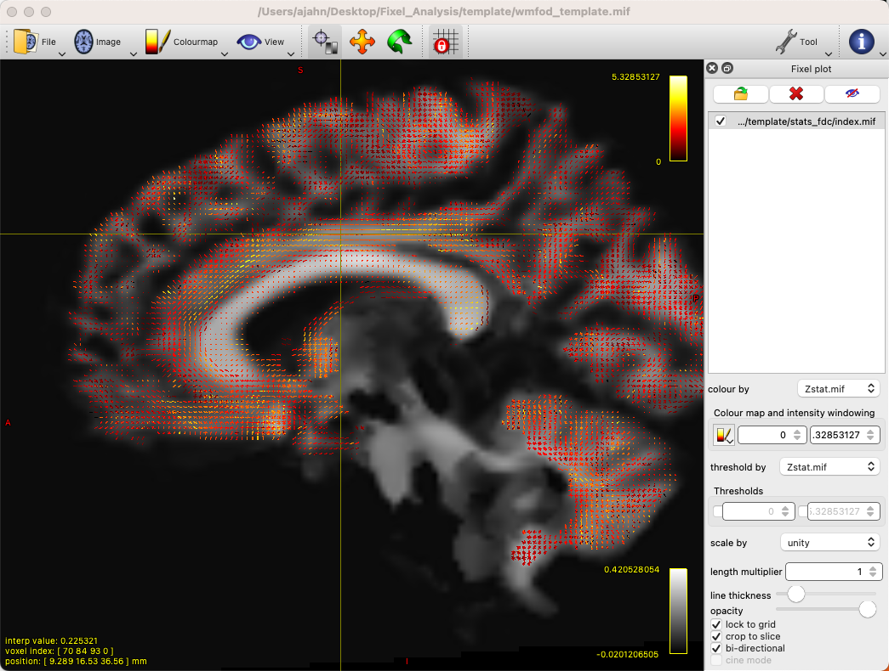
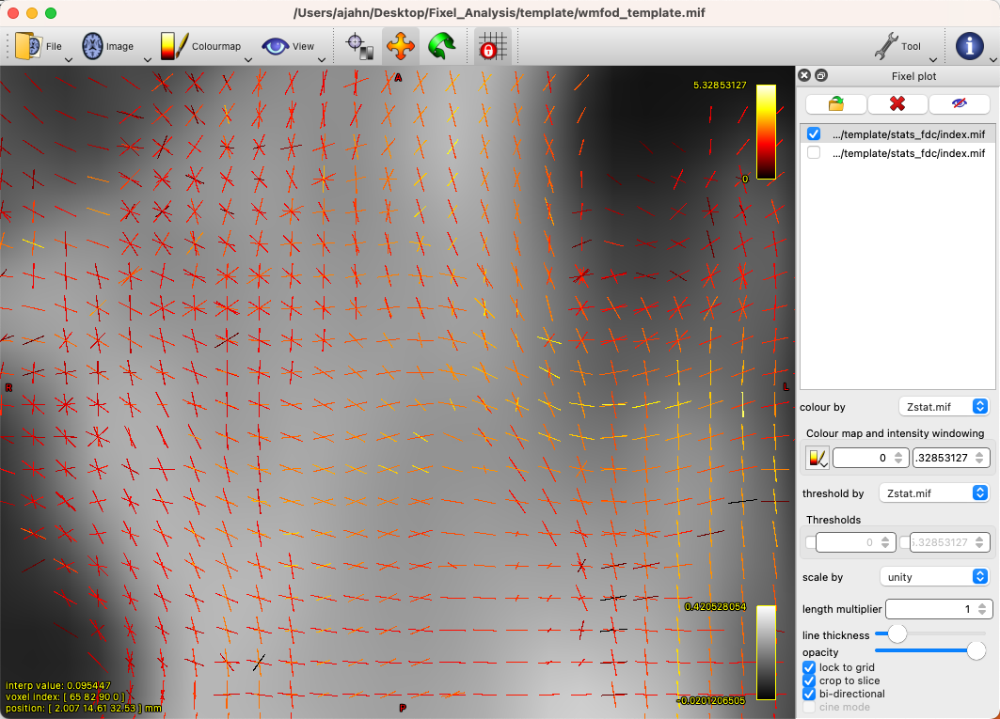

.. _MRtrix_11_Análisis basado en correcciones:

=========================================
Tutorial n.° 11 de MRtrix: Análisis basado en Fixel
=========================================

--------------

Descripción general
********

Hasta ahora, nos hemos centrado en generar **líneas de corriente**, representaciones de los tractos de sustancia blanca subyacentes. Estos son tractos probabilísticos que consideran los tipos de tejido cercanos y la amplitud del ángulo para crear conexiones biológicamente plausibles entre regiones corticales distantes. MRtrix también permite la generación de **fixels**, o poblaciones de fibras específicas dentro de un vóxel.

Recuerde que los métodos tradicionales de tensor de difusión no pueden resolver el problema de las fibras cruzadas, en el cual dos haces de fibras que se cruzan en ángulos rectos darán la apariencia de una difusión uniforme dentro de ese vóxel. Mediante la deconvolución esférica restringida (CSD) con una sola orientación de fibra como función base, podemos descomponer la señal medida dentro de un vóxel en sus fibras constituyentes, o distribuciones de orientación de fibra (FOD). Esto puede utilizarse para cuantificar la densidad de fibra (FD) de la sustancia blanca subyacente, así como los cambios en el tamaño total de la sección transversal dentro de un vóxel dado (sección transversal de fibra o FC). Estas dos métricas pueden además combinarse en una única métrica denominada densidad y sección transversal de fibra (FDC).

`Raffelt y otros, 2015`__, ilustró la diferencia entre estas métricas utilizando una matriz de vóxeles de 7x7 como ejemplo. Dada una cierta cantidad de fibras de materia blanca dentro de los vóxeles, la reducción en el número de fibras puede ocurrir de tres maneras diferentes:

1. La cantidad de fibras de materia blanca ocupa el mismo número de vóxeles, pero la densidad general disminuye (FD reducida); o
2. La densidad permanece igual, pero las fibras de materia blanca ocupan menos vóxeles (FC reducida); o
3. Tanto el número de vóxeles ocupados como la densidad de materia blanca dentro de esos vóxeles disminuyen (FDC reducida).

También podría ocurrir lo opuesto de cada uno de estos escenarios, lo que llevaría a aumentos en cada una de esas métricas, respectivamente.

.. figure:: 11_Raffelt_2017_Fig1.jpg

  Figura 1 de Raffelt et al., 2017

Preparación de los datos para el análisis basado en Fixel
*******************************************

Algunos pasos para realizar un análisis basado en Fixel son similares a los de los capítulos anteriores de este módulo. Sin embargo, existen diferencias significativas una vez estimadas las orientaciones de las fibras y deformadas según una plantilla.

Si analiza una gran cantidad de sujetos (por ejemplo, varias docenas o más), necesitará una computadora con al menos un par de cientos de gigabytes de memoria e idealmente varios procesadores. El análisis basado en Fixel se puede realizar en una máquina local, pero puede tardar bastante tiempo, varios días, dependiendo del número de sujetos. En cualquier caso, puede procesar estas imágenes con el comando ``for_each`` de MRtrix (puede encontrar más información sobre el comando ``aquí``).
    `__). Para ilustrar cómo utilizar este comando por lotes, tomaremos un caso relativamente simple de eliminación de ruido de los datos sin procesar ponderados por difusión.

Para comenzar, organizaremos nuestros datos de modo que cada carpeta de sujeto contenga los datos brutos convertidos llamados ``dwi.mif``. Por ejemplo, si tenemos tres sujetos del conjunto de datos BTC_Preop, podemos crear una subcarpeta llamada ``Fixel_Analysis``. Dentro de esa carpeta, crear otra carpeta llamada ``subjects``, que contenga tres subcarpetas: ``sub-01``, ``sub-02`` y ``sub-03``. Suponiendo que cada una de estas carpetas contiene los datos brutos de difusión correspondientes a cada sujeto y los archivos bvals y bvecs, puede convertirlos escribiendo el siguiente código desde la carpeta ``subjects``:

::

  para i en sub-01 sub-02 sub-03; hacer
    mrconvert *.nii.gz dwi.mif -fslgrad *.bvec *bval
    rm *.nii.gz
  hecho
  
Esto creará una nueva imagen ponderada por difusión sin procesar, que contiene los vectores b y los valores b en su encabezado.

Los siguientes pasos de preprocesamiento se pueden encontrar en esta página web
     `__, en el sitio web de MRtrix. Explican cada paso en detalle, por lo que no repetiremos todas las explicaciones aquí. Centrémonos en el primer paso de preprocesamiento, la eliminación de ruido, para ilustrar cómo funciona el comando ``for_each``. Por ejemplo, si ejecutamos el siguiente código desde el directorio ``subjects``:

::
  
  para_cada * : dwidenoise IN/dwi.mif IN/dwi_denoised.mif
  
El código a la izquierda de los dos puntos (``:``) significa recorrer cada elemento capturado por el comodín ``*``. (Tenga en cuenta que si hay otros archivos además de las carpetas de asunto en este directorio, como archivos de texto, el comando generará un error, ya que intenta aplicar un paso de preprocesamiento a un archivo sin difusión). Cada elemento se carga en la palabra clave ``IN``; para el primer asunto, por ejemplo, esto se expandirá a:

::

  dwidenoise sub-01/dwi.mif sub01/dwi_denoised.mif
  
  
Este método toma el archivo dwi.mif de sub-01, lo elimina de ruido y coloca el archivo de salida, ``dwi_denoised.mif``, en la carpeta sub-01. Este es el mismo procedimiento que se utiliza para todos los demás comandos ``for_each`` del tutorial. Una variación que debe tener en cuenta es la palabra clave ``PRE``, que es el elemento de entrada sin su extensión.

Ejecución de los pasos de preprocesamiento
*******************************

Puede adaptar los comandos del tutorial de MRtrix a su estructura de datos o, suponiendo que tiene los temas organizados con un solo archivo ``dwi.mif`` en cada carpeta, puede copiar y pegar el siguiente código a continuación (tenga en cuenta que esto omite la corrección del campo de sesgo, que, en mi experiencia, a veces puede resultar en una peor estimación de la máscara cerebral más adelante):

::

  para_cada * : dwidenoise IN/dwi.mif IN/dwi_denoised.mif
  para_cada * : mrdegibbs IN/dwi_denoised.mif IN/dwi_denoised_unringed.mif -ejes 0,1
  para_cada * : dwifslpreproc IN/dwi_denoised_unringed.mif IN/dwi_denoised_unringed_preproc.mif -rpe_none -pe_dir AP
  para_cada * : dwi2response dhollander IN/dwi_denoised_unringed_preproc.mif IN/response_wm.txt IN/response_gm.txt IN/response_csf.txt
  respuesta media */respuesta_wm.txt ../respuesta_promedio_del_grupo_wm.txt
  respuesta media */respuesta_gm.txt ../respuesta_promedio_grupo_gm.txt
  respuesta media */respuesta_csf.txt ../respuesta_promedio_grupo_csf.txt
  para_cada * : mrgrid IN/dwi_denoised_unringed_preproc_unbiased.mif regrid -vox 1.25 IN/dwi_denoised_unringed_preproc_unbiased_upsampled.mif
  para_cada * : dwi2mask IN/dwi_denoised_unringed_preproc_unbiased_upsampled.mif IN/dwi_mask_upsampled.mif
  para_cada * : dwi2fod msmt_csd IN/dwi_denoised_unringed_preproc_unbiased_upsampled.mif ../respuesta_promedio_de_grupo_wm.txt IN/wmfod.mif ../respuesta_promedio_de_grupo_gm.txt IN/gm.mif ../respuesta_promedio_de_grupo_csf.txt IN/csf.mif -mask IN/dwi_mask_upsampled.mif
  para_cada * : mtnormalizar IN/wmfod.mif IN/wmfod_norm.mif IN/gm.mif IN/gm_norm.mif IN/csf.mif IN/csf_norm.mif -mask IN/dwi_mask_upsampled.mif
  mkdir -p ../plantilla/fod_input
  mkdir ../plantilla/entrada_de_máscara
  para_cada * : ln -sr IN/wmfod_norm.mif ../plantilla/fod_input/PRE.mif
  para_cada * : ln -sr IN/dwi_mask_upsampled.mif ../plantilla/mask_input/PRE.mif
  plantilla_de_población ../plantilla/fod_input -dir_máscara ../plantilla/mask_input ../plantilla/wmfod_template.mif -tamaño_de_vóxel 1.25
  para_cada * : mrregister IN/wmfod_norm.mif -mask1 IN/dwi_mask_upsampled.mif ../template/wmfod_template.mif -nl_warp IN/subject2template_warp.mif IN/template2subject_warp.mif
  para_cada * : mrtransform IN/dwi_mask_upsampled.mif -warp IN/subject2template_warp.mif -interp bit más cercano -datatype IN/dwi_mask_in_template_space.mif
  mrmath */dwi_mask_in_template_space.mif min ../template/template_mask.mif -tipo de datos bit
  fod2fixel -mask ../template/template_mask.mif -fmls_peak_value 0.06 ../template/wmfod_template.mif ../template/fixel_mask
  para_cada * : mrtransform IN/wmfod_norm.mif -warp IN/subject2template_warp.mif -reorient_fod no IN/fod_in_template_space_NOT_REORIENTED.mif
  para_cada * : fod2fixel -mask ../plantilla/máscara_de_plantilla.mif IN/fod_en_espacio_de_plantilla_NO_REORIENTED.mif IN/fixel_en_espacio_de_plantilla_NO_REORIENTED -afd fd.mif
  para_cada * : arreglar_reorientar EN/arreglar_en_espacio_de_plantilla_NO_REORIENTED EN/subject2template_warp.mif EN/arreglar_en_espacio_de_plantilla
  para_cada * : fixelcorrespondence IN/fixel_en_espacio_plantilla/fd.mif ../plantilla/fixel_mask ../plantilla/fd PRE.mif
  para_cada * : warp2metric IN/subject2template_warp.mif -fc ../template/fixel_mask ../template/fc IN.mif
  mkdir ../plantilla/log_fc
  cp ../plantilla/fc/index.mif ../plantilla/fc/direcciones.mif ../plantilla/log_fc
  para_cada * : mrcalc ../plantilla/fc/IN.mif -log ../plantilla/log_fc/IN.mif
  mkdir ../plantilla/fdc
  cp ../plantilla/fc/index.mif ../plantilla/fdc
  cp ../plantilla/fc/direcciones.mif ../plantilla/fdc
  para_cada * : mrcalc ../plantilla/fd/IN.mif ../plantilla/fc/IN.mif -mult ../plantilla/fdc/IN.mif
  cd ../plantilla
  tckgen -ángulo 22.5 -longitud máxima 250 -longitud mínima 10 -potencia 1.0 wmfod_template.mif -imagen_semilla máscara_plantilla.mif -máscara máscara_plantilla.mif -seleccionar 20000000 -corte 0.06 pistas_20_millones.tck
  tcksift pistas_20_millones.tck wmfod_template.mif pistas_2_millones_sift.tck -número_de_término 2000000
  fixelconnectivity fixel_mask/ pistas_2_millones_sift.tck matriz/
  fixelfilter fd smooth fd_smooth -matriz matriz/
  fixelfilter log_fc smooth log_fc_smooth -matriz matriz/
  fixelfilter fdc smooth fdc_smooth -matrix matriz/

.. nota::

  A veces, el comando ``dwi2mask`` puede no cubrir todo el cerebro, especialmente las bolsas de líquido cefalorraquídeo. En ese caso, puede reemplazar el comando ``dwi2mask`` con el comando ``bet2`` de FSL, lo que requerirá convertir la máscara al formato NIFTI y luego volver al formato .mif:
  
.. nota::

  En sistemas operativos Macintosh, el comando ``ln -sr`` podría no funcionar (debería funcionar en la mayoría de los sistemas Linux). En ese caso, copie los archivos ``wmfod*.mif`` en la carpeta ``template/fod_input`` y los archivos ``dwi_mask_upsampled*.mif`` en la carpeta ``template/mask_input``. Es posible que deba asignar a cada archivo un identificador de sujeto único.
  
  ::
  
    mrconvert -force dwi_denoised_unringed_preproc_upsampled.mif tmp.nii
    bet2 tmp.nii tmp -m -f 0.2
    mrconvert -force máscara temporal.nii.gz máscara dwi_upsampled.mif
    rm temporal*
    
  Asegúrese de revisar la máscara como hicimos en los tutoriales anteriores de esta guía para asegurarse de que no tenga agujeros. Es posible que tenga que cambiar el valor después de la opción -f para generar una buena máscara cerebral que cubra todos los vóxeles. Este método puede resolver cualquier error de "factor de equilibrio" con ``mtnormalise``, especialmente si uno o más tipos de tejido están vacíos.

Creando el GLM
****************

  Los últimos pasos del tutorial requieren una matriz de diseño y una matriz de contraste, similares a las que se crean con FSL (para ver ejemplos, consulte esta página
      `__). Para un efecto simple promediado entre las métricas Fixel de todos los participantes, crearíamos una columna de solo 1, como la siguiente:
  
::

  1
  1
  1

Y guárdalo en un archivo llamado ``design_matrix.txt`` (o el nombre que te resulte más útil). También crearíamos una matriz de contraste complementaria, que contendría simplemente:

::

  1
  
Y guárdelo en un archivo llamado ``contrast_matrix.txt``, en este ejemplo. Los archivos de texto anteriores especifican que ponderamos a todos los sujetos por igual y les asignamos un valor de contraste de 1 para promediar todos sus valores para cada fixel. Luego, podemos ejecutar estos sencillos análisis de efectos en cada una de las métricas basadas en fixels: FD, FC y FDC:

  fixelcfestats fd_smooth/ archivos.txt matriz_de_diseño.txt matriz_de_contraste.txt matriz/ estadísticas_fd/
  fixelcfestats log_fc_smooth/ archivos.txt matriz_de_diseño.txt matriz_de_contraste.txt matriz/ estadísticas_log_fc/
  fixelcfestats fdc_smooth/ archivos.txt matriz_de_diseño.txt matriz_de_contraste.txt matriz/ estadísticas_fdc/
  
This will generate each metric's corresponding stats folder, with each one containing files that represent different statistics. For example, we can load the file ``wmfod_template.mif`` in mrview as an underlay, and then click on ``Tool -> Fixel plot``; to load, for example, the ``Zstat.mif`` file, click on the folder icron at the top of the Fixel plot panel, navigate to ``stats_fdc``, and select the file ``Zstat.mif``. You should see something like this:

By default, there will be a colorscale bar in the viewing panel showing the minimum and maximum Z-statistic in this image; in our case, the maximum Z-statistic is 5.33, indicating the highest Z-statistic for the FDC values. If we zoom into a region such as the left superior longitudinal fasciculus, we can see each fixel composed of three orthogonal directions, changing in orientation as we move along the different fiber bundles, and each vector of the fixel color-coded by its strength:

You can also load the file ``fwe_1mpvalue.mif``, which will show a 1-p map of significant fixels, which can be thresholded at 0.95 to show only those fixels that pass a significance threshold of p=0.05. Given that we only have three subjects, it's unlikely that we have any significant fixels, and they wouldn't mean much for a simple effects analysis in any case. To look at contrasts between groups, on the other hand, we will analyze the entire dataset on a computing cluster, such as the University of Michigan's Great Lakes supercomputer.

Fixel-Based Analysis on the Supercomputing Cluster
**************************************************

For larger numbers of subjects - such as the entire BTC_Preop dataset - we can use a supercomputing cluster to save both time and storage space on our local machines. In this example, I am using my account on Great Lakes, and I will be using my space on the ``turbo`` folder. First, we will download the dataset using the ``aws`` command:

::

  cd /nfs/turbo/lsa-ajahn
  aws s3 sync --no-sign-request s3://openneuro.org/ds001226 ds001226-download/
  mv ds001226-download BTC_Preop
  
We will also create a template batch script, which has the following SBATCH setup lines:

::

  #!/bin/bash
  
  #SBATCH --job-name=FBA_Template_changeme
  #SBATCH --time=24:00:00
  
  #SBATCH --nodes=1
  #SBATCH --ntasks-per-node=1
  #SBATCH --cpus-per-task=1
  #SBATCH --mem=8gb
  
  #SBATCH --account=ajahn0
  #SBATCH --partition=standard
  
  #SBATCH --mail-type=NONE
  
Many of these parameters are covered in more detail in Bennet Fauber's Supercomputing Tutorial, which can be found `here 
       `__. For now, note that we are using the ``standard`` partition, we are allocating 24 hours for this script to run, and that we will use 8gb per job that we submit. (Using too little memory can lead to errors during commands such as ``dwi2mask``.) The ``--account`` field will need to be changed to your account when you run the script.

The next few lines of code will load the modules needed for MRtrix, as well as a line of code that will be change in a for-loop:

::

  module load mrtrix fsl
  my_job_header
  cd /nfs/turbo/lsa-ajahn/BTC_Preop/changeme
  

The last string, ``changeme``, will be replaced by a ``sed`` command. For example, we can create another auxiliary script, ``submitPreprocJobs.sh``, which contains the following code:

::

  #!/bin/bash
  
  for i in `cat subjList.txt`; do sed "s|changeme|${i}|g" runDWIPreproc.sbat > tmp_${i}.sbat; done
  for i in `cat subjList.txt`; do sbatch tmp_${i}.sbat; done
  
Where ``subjList.txt`` is a list of all of the subject folders used in this experiment; you can create it by typing ``ls | grep ^sub- > subjList.txt``.

Returning to our preprocessing script, the complete file should look something like this:

::

  #!/bin/bash
  
  #SBATCH --job-name=FBA_Template_changeme
  #SBATCH --time=24:00:00
  
  #SBATCH --nodes=1
  #SBATCH --ntasks-per-node=1
  #SBATCH --cpus-per-task=1
  #SBATCH --mem=8gb
  
  #SBATCH --account=ajahn0
  #SBATCH --partition=standard
  
  #SBATCH --mail-type=NONE
  
  #----------------------
  # Load modules
  module load mrtrix fsl cuda/10.2.89
  
  #----------------------
  # Print diagnostic informatino to the job output file
  my_job_header
  
  #----------------------
  # Commands to run during job
  
  cd /nfs/turbo/lsa-ajahn/BTC_Preop/changeme
  dwidenoise -force dwi.mif dwi_denoised.mif
  mrdegibbs -force dwi_denoised.mif dwi_denoised_unringed.mif -axes 0,1
  dwifslpreproc -force dwi_denoised_unringed.mif dwi_denoised_unringed_preproc.mif -rpe_none -pe_dir AP
  dwi2response -force dhollander dwi_denoised_unringed_preproc.mif response_wm.txt response_gm.txt response_csf.txt
  mrgrid -force dwi_denoised_unringed_preproc.mif regrid -vox 1.25 dwi_denoised_unringed_preproc_upsampled.mif
  mrconvert -force dwi_denoised_unringed_preproc_upsampled.mif tmp.nii
  bet2 tmp.nii tmp -m -f 0.2
  mrconvert -force tmp_mask.nii.gz dwi_mask_upsampled.mif
  dwi2mask -force dwi_denoised_unringed_preproc_upsampled.mif dwi_mask_upsampled.mif
  dwi2fod -force msmt_csd dwi_denoised_unringed_preproc_upsampled.mif ../group_average_response_wm.txt wmfod.mif ../group_average_response_gm.txt gm.mif ../group_average_response_csf.txt csf.mif -mask dwi_mask_upsampled.mif
  mtnormalise -force wmfod.mif wmfod_norm.mif csf.mif csf_norm.mif -mask dwi_mask_upsampled.mif

Save this file as ``runDWIPreproc.sbat``. Then, create all of the individual ``.sbat`` files and submit them by typing ``bash submitPreprocJobs.sh``.

.. note::

  At this point, you should use ``mrview`` to check the results of these preprocessing steps. ``mrview`` does not work on the University of Michigan's Great Lakes computing cluster, so you will either need to download the data to your local machine that has ``mrview``, or instead you can **mount** Turbo directly onto your local machine. This allows you to look at the data without having to download it. To mount Turbo, follow the instructions located `here 
       `__. In my case, I opened a new Finder window on my Macintosh machine, and in the server address field I typed ``smb://lsa-ajahn-win.turbo.storage.umich.edu/lsa-ajahn``, which created a new directory on my local machine called ``/Volumes/lsa-ajahn``. 

At this point, we will run a separate batch script, ``runPopulationTemplate.sbat``, which will create a study-specific template on which we will visualize our results. This step can take a significant amount of time, so we will increase the time limit to 300 hours:

::

  #!/bin/bash

  #----------------------------
  # Slurm variables

  #SBATCH --job-name=runDWIPreproc_changeme
  #SBATCH --time=300:00:00

  #SBATCH --nodes=1
  #SBATCH --ntasks-per-node=1
  #SBATCH --cpus-per-task=1
  #SBATCH --mem=8gb

  #SBATCH --account=fmrilab_project1
  #SBATCH --partition=standard

  #SBATCH --mail-type=NONE

  #-----------------------------
  # Load modules
  module load mrtrix fsl cuda/10.2.89

  #-----------------------------
  # Print diagnostic information to the job output file
  my_job_header

  #-----------------------------
  # Commands to run during job

  cd /nfs/turbo/lsa-ajahn/BTC_Preop/
  
  mkdir -p template/fod_input
  mkdir template/mask_input
  
  for_each `ls | grep ^sub-CON` : ln -sr IN/wmfod_norm.mif template/fod_input/PRE.mif
  for_each `ls | grep ^sub-PAT | head -11` : ln -sr IN/wmfod_norm.mif template/fod_input/PRE.mif
  for_each `ls | grep ^sub-CON` : ln -sr IN/dwi_mask_upsampled.mif template/mask_input/PRE.mif
  for_each `ls | grep ^sub-PAT | head -11` : ln -sr IN/dwi_mask_upsampled.mif template/mask_input/PRE.mif

  population_template template/fod_input -mask_dir template/mask_input/ template/wmfod_template.mif -voxel_size 1.25
  
Note that in this example we have chosen to include all 11 Control subjects, and 11 subjects from the Patient group. This is done both to balance the number of subjects from each group that are used to create the template, and also to save processing time.

When that step has finished (which may take several days), run the next section of code, ``runDWIPreproc_Phase2.sbat``, by saving the following script into your ``BTC_Preop`` directory that contains all of the subjects:

::

  #!/bin/bash

  #----------------------------
  # Slurm variables

  #SBATCH --job-name=runDWIPreproc_changeme
  #SBATCH --time=2:00:00

  #SBATCH --nodes=1
  #SBATCH --ntasks-per-node=1
  #SBATCH --cpus-per-task=1
  #SBATCH --mem=8gb

  #SBATCH --account=fmrilab_project1
  #SBATCH --partition=standard

  #SBATCH --mail-type=NONE

  #-----------------------------
  # Load modules
  module load mrtrix fsl cuda/10.2.89

  #-----------------------------
  # Print diagnostic information to the job output file
  my_job_header

  #-----------------------------
  # Commands to run during job

  cd /nfs/turbo/lsa-ajahn/BTC_Preop/changeme
  #mtnormalise -force wmfod.mif wmfod_norm.mif csf.mif csf_norm.mif -mask dwi_mask_upsampled.mif
  mrregister wmfod_norm.mif -mask1 dwi_mask_upsampled.mif ../template/wmfod_template.mif -nl_warp subject2template_warp.mif template2subject_warp.mif
  mrtransform dwi_mask_upsampled.mif -warp subject2template_warp.mif -interp nearest -datatype bit dwi_mask_in_template_space.mif
  
And then submit the scripts with the following code:

::

  for i in `cat subjList.txt`; do sed "s|changeme|${i}|g" runDWIPreproc_Phase2.sbat > tmp_${i}.sbat; done
  for i in `cat subjList.txt`; do sbatch tmp_${i}.sbat; done
  
This will register each subject's FOD image to the FOD template created above, and then warp those masks to template space. We will also need to take the intersection of all the warped masks with ``mrmath``:

::

  mrmath sub-*/dwi_mask_in_template_space.mif min template/template_mask.mif -datatype bit
  
You should then look at the overall intersected mask with mrview by typing ``mrview template/template_mask.mif``:  

.. figure:: 11_Check_Masks.png

  Intersection mask for this study. Mask sure there are no holes or gaps in the masks, and visualize the orthogonal slices by clicking on the View dropdown menu and selecting Ortho View. According to the MRtrix documentation: "It is absolutely crucial to check at this stage that the resulting template mask includes all regions of the brain that are intended to be analysed. If this is not the case, the cause will be either an individual subject mask which did not include a certain region, or the template building process or individual subject registrations having gone wrong for one or more subjects. It is advised to go back to these steps, and identify and resolve the cause of the problem before continuing any further."
  
We will then create a fixel-based mask, which should clearly show the white matter tracts of the brain:

::

  fod2fixel -mask template/template_mask.mif -fmls_peak_value 0.06 template/wmfod_template.mif template/fixel_mask
  
Also make sure to visualize the output of this step by typing:

::

  mrview template/index.mif
  
.. figure:: 11_Fixel_Mask.mif

  Fixel mask for all of the subjects. According to the MRtrix documentation: "This step ultimately determines the fixel mask in which statistical analysis will be performed, and hence also which fixels’ statistics can contribute to others via the CFE mechanism; so it may have a substantial impact on the final result. Essentially, it can be detrimental to the result if the threshold value specified via the -fmls_peak_value is too high and hence excludes genuine white matter fixels. This risk is substantially higher in voxels containing crossing fibres (and higher the more fibres are crossing in a single voxel). Even though 0.06 has been observed to be a decent default value for 3-tissue CSD population templates, it is still strongly advised to visualise the output fixel mask using mrview. Do this by opening the index.mif found in ../template/fixel_mask via the fixel plot tool. If, with respect to known or normal anatomy, fixels are missing (especially paying attention to crossing areas), regenerate the mask with a lower value supplied to the -fmls_peak_value option (of course, avoid lowering it too much, as too many false or noisy fixels may be introduced). For an adult human brain template, and using an isotropic template voxel size of 1.25 mm, it is expected to have several hundreds of thousands of fixels in the fixel mask (you can check this by mrinfo -size ../template/fixel_mask/directions.mif, and looking at the size of the image along the first dimension)." In sum, the defaults should work fine for most subjects, but you may want to change the ``-fmls_peak_value`` parameter if there are large gaps in the mask.
  
To make the data more normally distributed and thus make the parametric tests for valid, we will convert the data using a log transform:

::

  mkdir template/log_fc
  cp template/fc/index.mif template/fc/directions.mif template/log_fc
 
::

  #!/bin/bash

  #----------------------------
  # Slurm variables

  #SBATCH --job-name=runDWIPreproc_changeme
  #SBATCH --time=0:01:00

  #SBATCH --nodes=1
  #SBATCH --ntasks-per-node=1
  #SBATCH --cpus-per-task=1
  #SBATCH --mem=8gb

  #SBATCH --account=fmrilab_project1
  #SBATCH --partition=standard

  #SBATCH --mail-type=NONE

  #-----------------------------
  # Load modules
  module load mrtrix fsl cuda/10.2.89

  #-----------------------------
  # Print diagnostic information to the job output file
  my_job_header

  #-----------------------------
  # Commands to run during job

  cd /nfs/turbo/lsa-ajahn/BTC_Preop/changeme

  mrcalc ../template/fc/changeme.mif -log ../template/log_fc/changeme.mif

::

  for i in `cat subjList.txt`; do sed "s|changeme|${i}|g" runDWIPreproc_Phase4.sbat > tmp_${i}.sbat; done
  for i in `cat subjList.txt`; do sbatch tmp_${i}.sbat; done
  

To compute a measure of combined fiber density and cross-section (FDC), we will use ``mrcalc`` to multiple the individual fiber density and cross-section images together:

::

  mkdir template/fdc
  cp template/fc/index.mif template/fdc
  cp template/fc/directions.mif template/fdc
  
::

  #!/bin/bash

  #----------------------------
  # Slurm variables

  #SBATCH --job-name=runDWIPreproc_changeme
  #SBATCH --time=0:05:00

  #SBATCH --nodes=1
  #SBATCH --ntasks-per-node=1
  #SBATCH --cpus-per-task=1
  #SBATCH --mem=8gb

  #SBATCH --account=fmrilab_project1
  #SBATCH --partition=standard

  #SBATCH --mail-type=NONE

  #-----------------------------
  # Load modules
  module load mrtrix fsl cuda/10.2.89

  #-----------------------------
  # Print diagnostic information to the job output file
  my_job_header

  #-----------------------------
  # Commands to run during job

  cd /nfs/turbo/lsa-ajahn/BTC_Preop/changeme

  mrcalc ../template/fd/changeme.mif ../template/fc/changeme.mif -mult ../template/fdc/changeme.mif
  
To complete the last steps of fixel-based analysis, we will first need to create two files, ``design_matrix.txt`` and ``contrast_matrix.txt``, which represent the subjects in each group and the contrast to be performed, respectively. In this case, we have 11 control subjects and 25 patient subjects, for a total of 36 subjects; here is the content of ``design_matrix.txt``:

::

  1 0
  1 0
  1 0
  1 0
  1 0
  1 0
  1 0
  1 0
  1 0
  1 0
  1 0
  0 1
  0 1
  0 1
  0 1
  0 1
  0 1
  0 1
  0 1
  0 1
  0 1
  0 1
  0 1
  0 1
  0 1
  0 1
  0 1
  0 1
  0 1
  0 1
  0 1
  0 1
  0 1
  0 1
  0 1
  0 1
  
And the content of ``contrast_matrix.txt``:

::

  1 -1
  
Which will perform a contrast of the FDC images to generate an image showing where the FDC values are greater for the Control group compared to the Patient group.

Here is the code for the last batch job we will submit, which we will store in a script called ``runDWIPreproc_Phase6.sbat``:

::

  #!/bin/bash

  #----------------------------
  # Slurm variables

  #SBATCH --job-name=runDWIPreproc_changeme
  #SBATCH --time=200:00:00

  #SBATCH --nodes=1
  #SBATCH --ntasks-per-node=1
  #SBATCH --cpus-per-task=1
  #SBATCH --mem=8gb

  #SBATCH --account=fmrilab_project1
  #SBATCH --partition=standard

  #SBATCH --mail-type=NONE

  #-----------------------------
  # Load modules
  module load mrtrix fsl cuda/10.2.89

  #-----------------------------
  # Print diagnostic information to the job output file
  my_job_header

  #-----------------------------
  # Commands to run during job

  cd /nfs/turbo/lsa-ajahn/BTC_Preop/template

  tckgen -angle 22.5 -maxlen 250 -minlen 10 -power 1.0 wmfod_template.mif -seed_image template_mask.mif -mask template_mask.mif -select 20000000 -cutoff 0.06 tracks_20_million.tck
  tcksift tracks_20_million.tck wmfod_template.mif tracks_2_million_sift.tck -term_number 2000000

  fixelconnectivity fixel_mask/ tracks_2_million_sift.tck matrix/

  fixelfilter fd smooth fd_smooth -matrix matrix/
  fixelfilter log_fc smooth log_fc_smooth -matrix matrix/
  fixelfilter fdc smooth fdc_smooth -matrix matrix/

  fixelcfestats fd_smooth/ files.txt design_matrix.txt contrast_matrix.txt matrix/ stats_fd/
  fixelcfestats log_fc_smooth/ files.txt design_matrix.txt contrast_matrix.txt matrix/ stats_log_fc/
  fixelcfestats fdc_smooth/ files.txt design_matrix.txt contrast_matrix.txt matrix/ stats_fdc/
  
Which can be submitted by typing ``sbatch runDWIPreproc_Phase6.sbat``.

.. note::

  This last job may take a long time to finish, depending on how many streamlines you generate during ``tckgen`` and how many permutations are computed during each of the ``fixelcfestats`` commands. You can decrease the amount of time by decreasing the number of streamlines, or by decreasing the number of permutations by using the ``-nshuffles`` option with each ``fixelcfestats`` command, and changing it from the default of 5000 to a lower number, such as 2000 or 3000. Changing these parameters can slightly decrease the accuracy of your final results, but for larger datasets the tradeoff might be worth it.

Viewing the Results
*******************

Al finalizar esta última fase, podemos visualizar los resultados con ``mrview``. Como se mencionó anteriormente, recomiendo usar la imagen ``wmfod_template.mif`` como base, que se encuentra en el directorio ``template``. A continuación, puede hacer clic en ``Tool -> Fixel Plot`` y cargar cualquiera de las imágenes de salida generadas por el comando ``fixelcfestats``. Por ejemplo, podría cargar el archivo ``fwe_1mpvalue.mif`` para mostrar qué fixels son significativos; en este caso, al tratarse de un mapa unidimensional, cualquier fixel con un valor de 0,95 o superior superaría el umbral p=0,05 corregido. Las coordenadas de estos fixels se pueden localizar con la mira e incluir en las tablas de resultados.

      
     
    
   

